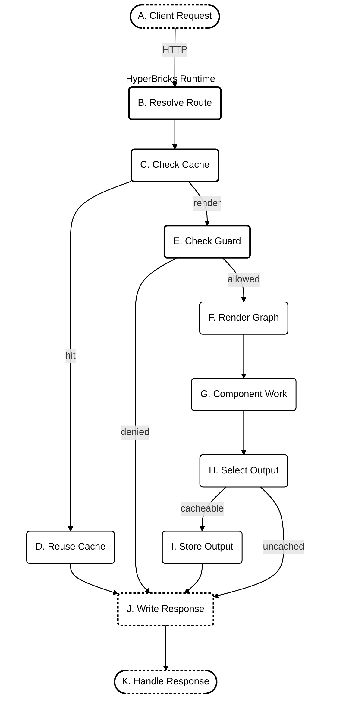
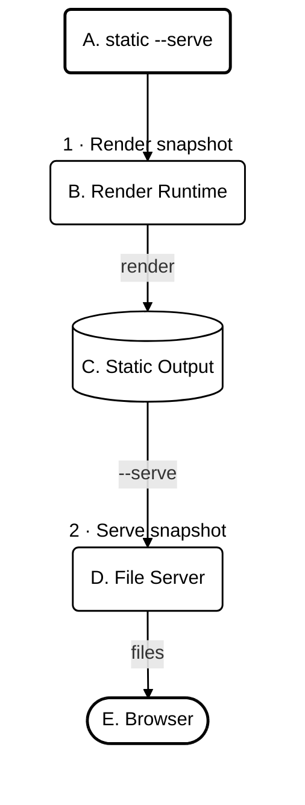

<!-- Generated by scripts/compilation-generation/build_markdown_compilations.py. Do not edit directly. -->

# HyperBricks Documentation Compilation v1.2.5-beta

**Collection of maintained source documents**

A collection of the separate guides and references in the docs directory.

**Topics:** Declarative configuration. Component runtime. Hypermedia.

- **HyperBricks version:** v1.2.5-beta
- **Included documents:** 26
- **Source version:** [`v1.2.5-beta`](https://github.com/hyperbricks/hyperbricks/tree/v1.2.5-beta)
- **Snapshot date:** 25 September 2026

## Contents

### Start

- [Introduction](#hb-documentation-docs-introduction) — `docs/INTRODUCTION.md`
- [Quickstart](#hb-documentation-docs-quickstart) — `docs/QUICKSTART.md`
- [How-to guides](#hb-documentation-docs-howtos) — `docs/HOWTOS.md`
- [Troubleshooting](#hb-documentation-docs-troubleshooting) — `docs/TROUBLESHOOTING.md`

### Application model

- [Routing](#hb-documentation-docs-routing) — `docs/ROUTING.md`
- [Component reference](#hb-documentation-docs-reference) — `docs/REFERENCE.md`
- [Markdown](#hb-documentation-docs-markdown) — `docs/MARKDOWN.md`
- [Spaces CMS](#hb-documentation-docs-spaces) — `docs/SPACES.md`
- [Authoring](#hb-documentation-docs-author) — `docs/AUTHOR.md`

### Logic and assets

- [API Render](#hb-documentation-docs-api_render) — `docs/API_RENDER.md`
- [Server Scripts](#hb-documentation-docs-goja_render) — `docs/GOJA_RENDER.md`
- [Plugins](#hb-documentation-docs-plugins) — `docs/PLUGINS.md`
- [JavaScript and CSS](#hb-documentation-docs-esbuild) — `docs/ESBUILD.md`

### Delivery

- [Deploy Guide](#hb-documentation-docs-deploy) — `docs/DEPLOY.md`
- [Docker Deploy](#hb-documentation-docs-docker) — `docs/DOCKER.md`
- [Migration Guide](#hb-documentation-docs-migration) — `docs/MIGRATION.md`

### Additional documents

- [Author Command Reference](#hb-documentation-docs-author_reference) — `docs/AUTHOR_REFERENCE.md`
- [HTMX Fragments And Canonical URLs](#hb-documentation-docs-htmx_fragments_and_canonical_urls) — `docs/HTMX_FRAGMENTS_AND_CANONICAL_URLS.md`
- [HTTP Responses](#hb-documentation-docs-http_responses) — `docs/HTTP_RESPONSES.md`
- [HyperBricks CLI](#hb-documentation-docs-hyperbricks_cli) — `docs/HYPERBRICKS_CLI.md`
- [HyperBricks Type Examples](#hb-documentation-docs-hyperbricks_type_examples) — `docs/HYPERBRICKS_TYPE_EXAMPLES.md`
- [Images](#hb-documentation-docs-images) — `docs/IMAGES.md`
- [Live Mode HTTP Settings](#hb-documentation-docs-live_mode_http) — `docs/LIVE_MODE_HTTP.md`
- [Route Guard](#hb-documentation-docs-route_guard) — `docs/ROUTE_GUARD.md`
- [Runtime Gateway](#hb-documentation-docs-runtime_gateway) — `docs/RUNTIME_GATEWAY.md`
- [HyperBricks YAML Usage](#hb-documentation-docs-yaml_usage) — `docs/YAML_USAGE.md`

---

<a id="hb-documentation-docs-introduction"></a>

## Introduction

_Source: [`docs/INTRODUCTION.md`](https://github.com/hyperbricks/hyperbricks/blob/v1.2.5-beta/docs/INTRODUCTION.md)_

<a id="hb-documentation-docs-introduction--what-is-hyperbricks"></a>

### What is HyperBricks

HyperBricks is a native full-stack build system with an integrated rendering engine for hypermedia web applications.

Applications are assembled from nested component maps described and connected through declarative, YAML-based configuration files. At startup, HyperBricks preloads these configurations. It compiles the output they define at runtime.

HyperBricks processes configuration in three steps:

1. Routes and reusable components are declared in YAML source files.
2. The parser converts the source into configuration maps that preserve component order.
3. The runtime reads those maps, selects the registered components, and renders them.

These declaratively configured components are the building blocks of HyperBricks.

**Leaf** components render their own output. Common examples are:
- `html`,
- `text`,
- `image`,
- `css`,
- `javascript`,
- `json_render`,
- `menu`
- `plugin`

**Composite** components contain or transform other components. Common examples are:

- `tree`
- `template`
- `head`
- `api_render`
- `fragment`
- `hypermedia`.


HyperBricks replaces recurring application orchestration code with declarative component configuration, while the runtime handles component selection, execution, and composition.

The rendering engine runs these components on the server and combines their output into HTML. Their configuration declaratively defines what they render and how they are composed.

The following example defines `page` as a `hypermedia` component with the route `/first`. Its `main` field contains a `tree` component that recursively renders two child components, `html` and `text`, in their configured order.

```yaml
page:
  - type: hypermedia
  - route: first
  - main:
      - type: tree
      - heading:
          - type: html
          - value: <h1>First</h1>
      - copy:
          - type: text
          - value: Second
```

Application-specific backend logic can use native Go plugins through the `plugin` component or JavaScript through the `goja_render` component. Like the built-in components, they are configured and composed declaratively.

The integrated `esbuild` component bundles JavaScript, TypeScript, and CSS and adds `script` or `style` tags for the generated files to the HTML.

<a id="hb-documentation-docs-introduction--authoring-format"></a>

### Authoring Format

The components and their children are rendered in order of the sequence in the YAML configuration file. Then the runtime uses that order when rendering tree-like structures. Each entry starts with `-`. This preserves the configured order of component children.

Data fields such as `values` and `headers`, and the module's package settings, use ordinary mappings. See [YAML Usage: Ordered objects and ordinary mappings](#hb-documentation-docs-yaml_usage--ordered-objects-and-ordinary-mappings).

<a id="hb-documentation-docs-introduction--when-to-use-hyperbricks"></a>

### When to use HyperBricks

HyperBricks suits websites and web applications that iterate quickly. Think of projects where the interface needs to evolve independently of business logic, and where new pages, languages, and interactions build on existing structures.

When AI agents contribute to development by using HyperBricks plugins or skills, they work with configuration that describes the application’s structure and composition, keeping architectural decisions explicit rather than buried in generated glue code.

With HyperBricks, server-side domain logic can remain in local or remote APIs, Go plugins, or trusted JavaScript components. A browser library such as HTMX can provide partial page updates, while static HTML can be exported for content rendered in advance.

<a id="hb-documentation-docs-introduction--route-owners"></a>

### Route Owners

Route owners are top-level components that handle requests for a defined URL.

- `hypermedia` renders full HTML documents.
- `fragment` renders partial HTML responses.
- `api_fragment_render` proxies an API request and renders the response as a fragment.

Example full page:

```yaml
page:
  - type: hypermedia
  - route: index
  - title: Welcome
  - main:
      - type: tree
      - hero:
          - type: html
          - value: |
              <main>
                <h1>Hello HyperBricks</h1>
                <p>This page is rendered from YAML.</p>
              </main>
```

Example fragment for optional hypermedia library [HTMX 4](https://four.htmx.org/):

```yaml
status:
  - type: fragment
  - route: fragments/status
  - response:
      headers:
        HX-Retarget: "#status"
        HX-Reswap: outerHTML
  - body:
      - type: html
      - value: |
          <div id="status">Ready</div>
```

This example assumes HTMX is loaded on the page and requests this route. `HX-Retarget` tells HTMX which element to update; `HX-Reswap: outerHTML` tells it to replace that element, including its wrapper.

HyperBricks renders the fragment and sends the configured headers. HTMX interprets those headers in the browser. The `fragment` component itself does not depend on HTMX, and HyperBricks does not add HTMX headers automatically. See [HTTP responses](#hb-documentation-docs-http_responses) for the shared status and header contract.

<a id="hb-documentation-docs-introduction--runtime-request-flow"></a>

### Runtime Request Flow

For an application route, HyperBricks resolves a browser or HTMX request to a route owner. Development mode renders the route fresh. Live mode can return an eligible cached response; all other requests continue through the optional route guard and renderer. The letters connect each step in the diagram to its caption below.



| Node | Caption |
| --- | --- |
| A | A browser, HTMX, or another HTTP client requests an application route. |
| B | HyperBricks matches the request to a route-owning `hypermedia`, `fragment`, or `api_fragment_render` component. |
| C | Development mode always renders the route. In live mode, HyperBricks checks whether it can return cached output. |
| D | On a live-cache hit, HyperBricks returns the stored response without rendering the component graph. |
| E | If configured, the route guard checks access before rendering child components. A denied request goes straight to the response. |
| F | HyperBricks builds the render context and traverses the configured component graph. |
| G | Components perform their configured work, such as rendering templates, calling APIs, running trusted Goja logic, or invoking plugins. |
| H | HyperBricks selects the rendered output or a response captured by a native plugin. |
| I | If the output is eligible for live caching, HyperBricks stores it with its ETag and expiry metadata. |
| J | HyperBricks writes the response status, headers, and body, or flushes the headers before a native plugin streams its response. |
| K | The client handles the response as a document, fragment, other body type, or stream. |

HyperBricks renders tree children concurrently and combines their output in the configured YAML sequence order. This keeps the rendered result in the expected order, while allowing independent child work—such as API calls, scripts, and plugins—to run concurrently.

Nested template values and plugin components can re-enter the same graph. An eligible live-cache hit skips that graph. A native plugin may capture a `HandledResponse`, which the runtime selects after the render call; a `Stream` callback starts only after the response headers are written. See [Routing](#hb-documentation-docs-routing), [Live Mode HTTP Settings](#hb-documentation-docs-live_mode_http), [Route Guard](#hb-documentation-docs-route_guard), [API Render](#hb-documentation-docs-api_render), and [Plugins](#hb-documentation-docs-plugins) for the detailed rules.


<a id="hb-documentation-docs-introduction--templates"></a>

### Templates

Hyperbricks SSR component templates use Go `html/template` with [Sprig functions](https://masterminds.github.io/sprig/). See [Using Sprig functions](#hb-documentation-docs-yaml_usage--using-sprig-functions) for examples. Template files can be loaded explicitly through YAML resolvers, or inline content can live directly in the config.

```yaml
card:
  - type: template
  - template:
      file: cards/product.html
  - values:
      title: YAML templates
      body: Template values stay ordinary data.
```

Template syntax is separate from YAML resolver syntax. `{{ .title }}` belongs to Go templates. YAML resolvers are structured YAML nodes such as `file`, `var`, `env`, `format`, and `template.file`.

<a id="hb-documentation-docs-introduction--reuse"></a>

### Reuse

Reusable objects can live in the same file or be brought in through imports. Inheritance copies the referenced component and then applies local overrides.

```yaml
base_card:
  - type: template
  - template:
      file: cards/simple.html
  - values:
      title: Default title
      body: Default body

page:
  - type: hypermedia
  - route: reuse
  - main:
      - type: tree
      - welcome:
          - inherit: base_card
          - values:
              title: Welcome
              body: This card overrides inherited values.
```

<a id="hb-documentation-docs-introduction--runtime-behavior"></a>

### Runtime Behavior

When an edit introduces an invalid component, HyperBricks aims to render the valid parts and report errors for the broken ones. This supports local development and hosted editing.

The render diagnostics pipeline reports configuration problems so that an invalid component does not need to stop the process.

<a id="hb-documentation-docs-introduction--project-layout"></a>

### Project Layout

A typical module contains:

- `hyperbricks/` for `*.hyperbricks.yaml` source files.
- `templates/` for Go HTML templates.
- `resources/` for source content and images.
- `static/` for files served directly.
- `rendered/` for static output.

HyperBricks automatically loads `*.hyperbricks.yaml` files directly inside the configured `hyperbricks/` directory. It does not scan subdirectories for source files. Load those files through file-level `imports` in a loaded source file; paths are relative to the importing file. See [YAML Usage: Imports](#hb-documentation-docs-yaml_usage--imports).

Directory locations are configured in `package.hyperbricks.yaml`. See [YAML Usage](#hb-documentation-docs-yaml_usage) for the YAML source contract and [Reference](#hb-documentation-docs-reference) for generated component fields.

<a id="hb-documentation-docs-introduction--glossary"></a>

### Glossary

| Term | Meaning |
| --- | --- |
| Module | A folder containing an application. It contains all configuration, plugins, settings, component definitions, templates, and other resources. |
| Component | A configured building block with a task, such as `html`, `template`, or `api_render`. |
| Composite component | A component that contains and renders other components, such as `tree`, `hypermedia`, or `fragment`. |
| Component graph | The connected structure of components that the runtime traverses and renders. |
| Declarative component configuration | YAML that describes which components form an application, their values, and how they are composed, without implementing their orchestration in application code. |
| Runtime | The part of HyperBricks that resolves routes and executes configured components to produce responses. |
| Rendering engine | The runtime subsystem that executes the component graph and combines component output. |
| Application orchestration | The selection, execution, and composition of components required to handle a request and produce output. |
| Route owner | A top-level `hypermedia`, `fragment`, or `api_fragment_render` component with a route that answers an HTTP request. |
| Space source | A named `hypermedia` definition, including one resolved through inheritance, that supplies a page structure and declares editable fields. |
| Space | A YAML instance that inherits a page source and has its own route, title, and values. The development editor edits the fields allowed by that source. |

See [Spaces](#hb-documentation-docs-spaces) for source-owned editing and [Routing](#hb-documentation-docs-routing) for route owners.

<a id="hb-documentation-docs-introduction--next-steps"></a>

### Next Steps

- [Quickstart](#hb-documentation-docs-quickstart) creates a working YAML module.
- [Routing](#hb-documentation-docs-routing) explains route owners and URL matching.
- [YAML Usage](#hb-documentation-docs-yaml_usage) documents the YAML syntax and resolvers.
- [Reference](#hb-documentation-docs-reference) lists runtime component fields.
- [Route Guard](#hb-documentation-docs-route_guard) documents request-time authorization.
- [Troubleshooting](#hb-documentation-docs-troubleshooting): find and resolve configuration and render errors.
- [Migration Guide](#hb-documentation-docs-migration): update older response and API authentication settings.

---

<a id="hb-documentation-docs-quickstart"></a>

## Quickstart

_Source: [`docs/QUICKSTART.md`](https://github.com/hyperbricks/hyperbricks/blob/v1.2.5-beta/docs/QUICKSTART.md)_

Create a small module with HTML templates, JavaScript, and CSS. HyperBricks renders a full page and an HTML fragment. The built-in `esbuild` component bundles the browser assets.

The example uses [HTMX 4](https://four.htmx.org/) to update part of the page.

<a id="hb-documentation-docs-quickstart--install-and-create-a-module"></a>

### Install And Create A Module

Requires Go 1.26.1 or newer and internet access to install HyperBricks, download the starter, and fetch HTMX.

**1. Install HyperBricks**

Install `v1.2.5-beta`:

```bash
go install github.com/hyperbricks/hyperbricks/cmd/hyperbricks@v1.2.5-beta
```

Make sure your Go binary directory (`GOBIN`, or `$(go env GOPATH)/bin` by default) is on your `PATH`.

**2. Create the module**

From your project root, the directory that will contain `modules/`:

```bash
hyperbricks init-starter get hello-world -m demo
```

The downloaded `hello-world` starter already runs with `hyperbricks start -m demo` and displays a simple Hello World page. Continue below to replace it with a page that uses templates, bundled assets, and an HTML fragment.

Initialization also reconciles the new module's source metadata. Its
`package.hyperbricks.yaml` identifies the destination module, starts its module
version at `1.0.0`, and records the version of the HyperBricks binary that
installed it:

```yaml
hyperbricks:
  metadata:
    module: demo
    moduleversion: "1.0.0"
    hyperbricks: v1.2.5-beta
```

The exact `hyperbricks` value follows the binary you run. Later, refresh the
identity and runtime version without changing the scaffold, or bump the module
version at the same time:

```bash
hyperbricks init -m demo --update-metadata
hyperbricks init -m demo --bump-version          # patch
hyperbricks init -m demo --bump-version=minor
hyperbricks init -m demo --bump-version=major
```

These metadata-only commands also accept a relative or absolute module path,
just like `start -m` and `build -m`. A regular build leaves this source package
unchanged and writes `format`, `format_version`, `commit`, `built_at`, and the
exact building HyperBricks version only into the resulting deployment archive.
The build's `source_hash` is recorded separately in its build index.

**3. Create the asset directories**

```bash
mkdir -p \
  modules/demo/resources/js \
  modules/demo/resources/css \
  modules/demo/resources/vendor
```

Keep the generated `package.hyperbricks.yaml`. Replace the contents of the starter's `hyperbricks/hello-world.hyperbricks.yaml` with the configuration below. This replaces the starter route instead of creating a second route for `/`.

The files you will work with are:

```text
modules/demo/
  package.hyperbricks.yaml
  hyperbricks/
    hello-world.hyperbricks.yaml
  templates/
    page.html
    card.html
  resources/
    js/app.js
    css/app.css
    vendor/htmx-4.0.0.js
  static/                       Generated browser bundles
  rendered/                     Generated static site
```

HyperBricks automatically loads `*.hyperbricks.yaml` files directly inside the module's configured `hyperbricks/` directory. Files in subdirectories need a file-level `imports` entry in a loaded source file. For example, `hyperbricks/partials/site.hyperbricks.yaml` needs an import such as `partials/site.hyperbricks.yaml` from a file directly inside `hyperbricks/`. Import paths are relative to the importing file. See [YAML Usage: Imports](#hb-documentation-docs-yaml_usage--imports).

<a id="hb-documentation-docs-quickstart--add-the-templates"></a>

### Add The Templates

Create `modules/demo/templates/page.html`:

```html
<main>
  <h1>{{.title}}</h1>
  <p>HyperBricks renders the HTML. HTMX updates the card below.</p>
  <button hx-get="/hello-fragment" hx-target="#target" hx-swap="innerHTML">
    Load fragment
  </button>
  <p id="update-status" role="status">No updates yet.</p>
  <div id="target">{{.card}}</div>
</main>
```

Create `modules/demo/templates/card.html`:

```html
<section class="card">
  <h2>{{.title}}</h2>
  <p>{{.body}}</p>
</section>
```

The same card template supplies the initial page content and the fragment. YAML values provide its text; the template owns the HTML markup.

<a id="hb-documentation-docs-quickstart--add-javascript-and-css"></a>

### Add JavaScript And CSS

Download a pinned copy of HTMX into the module:

```bash
curl -fL \
  https://raw.githubusercontent.com/bigskysoftware/htmx/v4.0.0/dist/htmx.js \
  -o modules/demo/resources/vendor/htmx-4.0.0.js
```

Create `modules/demo/resources/js/app.js`:

```javascript
import "../vendor/htmx-4.0.0.js";

let updates = 0;
document.addEventListener("htmx:after:swap", () => {
  updates += 1;
  document.getElementById("update-status").textContent =
    `Card updated ${updates} time${updates === 1 ? "" : "s"}.`;
});
```

The import includes HTMX in your application bundle. There is no separate CDN script in the page. The small event handler shows where your own JavaScript belongs: it updates the status after HTMX replaces the card.

Create `modules/demo/resources/css/app.css`:

```css
body {
  margin: 2rem;
  font-family: system-ui, sans-serif;
  color: #243b32;
  background: #f6f7f3;
}

main {
  max-width: 42rem;
  margin: auto;
}

button {
  padding: 0.6rem 1rem;
  cursor: pointer;
}

.card {
  padding: 1rem;
  background: white;
  border: 1px solid #ccd5ce;
}

#update-status {
  color: #52655a;
}
```

<a id="hb-documentation-docs-quickstart--connect-the-routes-templates-and-assets"></a>

### Connect The Routes, Templates And Assets

Components use YAML sequences: each `-` adds an entry, preserving the configured order of component children. Data fields such as `values` use ordinary mappings. See [YAML Usage: Ordered objects and ordinary mappings](#hb-documentation-docs-yaml_usage--ordered-objects-and-ordinary-mappings).

Replace `modules/demo/hyperbricks/hello-world.hyperbricks.yaml` with:

```yaml
app_styles:
  - type: esbuild
  - entry:
      path: {base: resources, path: css/app.css}
  - outfile:
      path: {base: static, path: css/app.css}
  - cache: true
  - fingerprint: true
  - enclose: <link rel="stylesheet" href="|">

app_scripts:
  - type: esbuild
  - entry:
      path: {base: resources, path: js/app.js}
  - outfile:
      path: {base: static, path: js/app.js}
  - cache: true
  - fingerprint: true
  - enclose: <script src="|" defer></script>

base_card:
  - type: template
  - template:
      file: card.html
  - values:
      title: Welcome
      body: This card was rendered with the page.

page:
  - type: hypermedia
  - route: index
  - title: HyperBricks Quickstart
  - head:
      - type: head
      - meta:
          viewport: width=device-width, initial-scale=1
          description: A HyperBricks page with templates and bundled assets.
      - charset:
          - type: html
          - value: '<meta charset="utf-8">'
      - styles:
          - inherit: app_styles
      - scripts:
          - inherit: app_scripts
  - body:
      - type: template
      - template:
          file: page.html
      - values:
          title: Hello HyperBricks
          card:
            - inherit: base_card

hello_fragment:
  - type: fragment
  - route: hello-fragment
  - panel:
      - inherit: base_card
      - values:
          title: Hi from a fragment
          body: This card arrived without reloading the page.
```

- `hypermedia` serves a full page at `/` and `/index` with the default routing settings.
- `template.file` loads a file from the module's templates directory.
- `inherit` reuses a component. The fragment overrides the card's text while keeping its template.
- The two `esbuild` components bundle JavaScript and CSS into `static/` and emit their script and stylesheet tags. `fingerprint` adds a content hash to asset URLs; `cache` reuses build results when the source files have not changed.
- The `fragment` route returns only the card HTML. The `hx-*` attributes in `page.html` tell HTMX to request it and replace the contents of `#target`. HyperBricks does not require HTMX to render this route.

Edit files under `resources/` and `templates/`; the files under `static/` are build output. See [JavaScript and CSS](#hb-documentation-docs-esbuild) for more esbuild options.

<a id="hb-documentation-docs-quickstart--developer-interface"></a>

### Developer Interface

Open `modules/demo/package.hyperbricks.yaml` and enable the module's developer
dashboard. Keep credentials in environment variables rather than committing a
password:

```yaml
hyperbricks:
  development:
    dashboard:
      enabled: true
      credentials:
        user:
          env: HB_DEVELOPER_USER
        password:
          env: HB_DEVELOPER_PASSWORD
```

The same module-owned login protects the Dashboard's Overview and Errors views,
render diagnostics, Spaces, contextual editing, and configured frontend-editor
plugins. There is no
default account; unresolved credentials lock those interfaces while public
application routes remain available.


<a id="hb-documentation-docs-quickstart--run-and-try-it"></a>

### Run And Try It

From the project root:

```bash
export HB_DEVELOPER_USER=developer
export HB_DEVELOPER_PASSWORD='choose-a-long-password'
hyperbricks start -m demo
```

Open [localhost:8080](http://localhost:8080/). The first page render builds the assets, including the imported HTMX source. No npm installation or separate asset build command is needed for this example.

Click **Load fragment**. The card changes and your JavaScript increments the status counter. Click again: the counter increases without reloading the page. A full reload restores the initial card and resets the counter.

With the dashboard enabled, open [localhost:8080/__hyperbricks/dashboard](http://localhost:8080/__hyperbricks/dashboard) to inspect the routes and follow their links. If a page reports an error, select **Errors** to read its diagnostics. See [Troubleshooting](#hb-documentation-docs-troubleshooting).


Try changing the card text in YAML, the markup in `templates/card.html`, or the styles in `resources/css/app.css`. With development watching enabled, save and reload the page to see the change. Keep browser behavior in `app.js`, styling in `app.css`, and route composition in YAML.

<a id="hb-documentation-docs-quickstart--render-static-output"></a>

### Render Static Output

If you want to host the static site on Cloudflare, GitHub Pages or other static hosting service, you can export the site to a static version and serve it with the `--serve` option.

```bash
hyperbricks static -m demo --serve
```

When asked `Delete directory "modules/demo/rendered"? (y/n)` type yes, it will just remove the last static export. You can omit that with the `--force` option.

The generated site is written to `modules/demo/rendered/`. Static rendering requests routes through an internal runtime before writing the HTML and assets. On a separate static host, the fragment URL `/hello-fragment` must resolve to its exported HTML file; configure clean-URL handling to match your runtime routes.

<a id="hb-documentation-docs-quickstart--zip-archive"></a>

### Zip Archive

To create a zip archive of your site use the --zip option. It will export a .zip archive to the default `/export/<module_name>` folder.


```bash
hyperbricks static -m demo --zip --force
```

The `--force ` option automatically overrides the exported files in `rendered/`.
Type `hyperbricks static --help` for all static options.

<a id="hb-documentation-docs-quickstart--next-steps"></a>

### Next Steps

- [General HyperBricks skill](https://github.com/hyperbricks/hyperbricks/blob/v1.2.5-beta/SKILLS/hyperbricks/SKILL.md): give an agent the project conventions, CLI workflow, and task-based Source Of Truth.
- [YAML usage](#hb-documentation-docs-yaml_usage): YAML syntax, resolvers, imports, inheritance.
- [Component reference](#hb-documentation-docs-reference): component fields and executable examples.
- [ROUTING.md](#hb-documentation-docs-routing): route resolution and clean URLs.
- [Route guards](#hb-documentation-docs-route_guard): pre-render route authorization.
- [Troubleshooting](#hb-documentation-docs-troubleshooting): find and resolve configuration and render errors.
- [Migration Guide](#hb-documentation-docs-migration): update older response and API authentication settings.

---

<a id="hb-documentation-docs-howtos"></a>

## How-to guides

_Source: [`docs/HOWTOS.md`](https://github.com/hyperbricks/hyperbricks/blob/v1.2.5-beta/docs/HOWTOS.md)_

<a id="hb-documentation-docs-howtos--contents"></a>

### Contents

- [Where to find complete module examples](#hb-documentation-docs-howtos--where-to-find-complete-module-examples)
- [1. Start from a module](#hb-documentation-docs-howtos--1-start-from-a-module)
- [2. Reuse structure with imports and inheritance](#hb-documentation-docs-howtos--2-reuse-structure-with-imports-and-inheritance)
- [3. Define HTML structure in templates](#hb-documentation-docs-howtos--3-define-html-structure-in-templates)
- [4. Assign a URL to a composite component](#hb-documentation-docs-howtos--4-assign-a-url-to-a-composite-component)
- [5. Build assets through the native component](#hb-documentation-docs-howtos--5-build-assets-through-the-native-component)
- [6. Create a native Go plugin](#hb-documentation-docs-howtos--6-create-a-native-go-plugin)
- [7. Run JavaScript on the server with goja_render](#hb-documentation-docs-howtos--7-run-javascript-on-the-server-with-goja_render)
- [8. Display an API response as HTML](#hb-documentation-docs-howtos--8-display-an-api-response-as-html)
- [9. Use one plugin for different actions](#hb-documentation-docs-howtos--9-use-one-plugin-for-different-actions)
- [10. Protect a route with an access check](#hb-documentation-docs-howtos--10-protect-a-route-with-an-access-check)
- [11. Export a static site](#hb-documentation-docs-howtos--11-export-a-static-site)

<a id="hb-documentation-docs-howtos--htmx-how-to"></a>

### HTMX How-to

- [1. Enhance ordinary links with HTMX](#hb-documentation-docs-howtos--1-enhance-ordinary-links-with-htmx)
- [2. Describe navigation in configuration](#hb-documentation-docs-howtos--2-describe-navigation-in-configuration)

This section is for developers who know web development and are new to HyperBricks. See [YAML usage](#hb-documentation-docs-yaml_usage) for source syntax and [Component reference](#hb-documentation-docs-reference) for fields.

If an example fails, start with [Troubleshooting](#hb-documentation-docs-troubleshooting). For older configurations, see the [Migration Guide](#hb-documentation-docs-migration).

<a id="hb-documentation-docs-howtos--where-to-find-complete-module-examples"></a>

### Where to find complete module examples

A **module** is a folder that groups the files for a HyperBricks application or example. It contains a `package.hyperbricks.yaml` file with the module’s settings, YAML component definitions, HTML templates, and resources such as CSS and JavaScript. A module can define several document and fragment routes.

Modules normally live inside the project’s `modules/` folder. For example, `modules/demo/` is the module named `demo`. The `-m demo` option tells HyperBricks which module to start, build, or export. One project can contain several modules, each with its own settings and application files.

A typical HyperBricks project layout looks like this:

```text
my-project/                   Project root
├── modules/                  Applications and examples
│   ├── demo/
│   ├── website/
│   └── another-module/
├── plugins/                  Shared plugin source code
│   └── myplugin/
│       └── 2.0.0/            Plugin version
└── bin/
    └── plugins/              Compiled plugins used by the runtime
```

Run HyperBricks commands from the project root and select the module with `-m`.


See the [module catalog](https://github.com/hyperbricks/hyperbricks/blob/v1.2.5-beta/modules/README.md) for an overview of the available modules, including learning applications, examples, integrations, and test fixtures. The patterns module has Go integration tests and an optional plugin smoke suite; the generated starter has CLI tests. Check this coverage when choosing an example: finding source code alone does not confirm that the complete application still runs.

The [YAML patterns module](https://github.com/hyperbricks/hyperbricks/blob/v1.2.5-beta/modules/hyperbricks-patterns-yaml/README.md) contains runnable examples of composition, navigation, fragments, access checks, API routes, and plugins. For a new application, `hyperbricks init` generates the maintained starting structure. You can extend that structure with your own database, services, and deployment setup.

<a id="hb-documentation-docs-howtos--1-start-from-a-module"></a>

### 1. Start from a module

Run the CLI from the project root, normally the directory containing `modules/`:

```sh
hyperbricks version
```

Choose one starting point:

- For a simple Hello World page, download the starter. This requires internet access:

  ```sh
  hyperbricks init-starter get hello-world -m my-project
  ```

- For the built-in starter with templates, fragments, and navigation, create the module with `init`:

  ```sh
  hyperbricks init -m my-project
  ```

Both commands create `modules/my-project/`. Run only one of them for that module, then start the server:

```sh
hyperbricks start -m my-project
```

Open `http://localhost:8080/` to see the output.

`init` provides a working scaffold. Its `package.hyperbricks.yaml` is ordinary YAML configuration; the files in `hyperbricks/` contain ordered component definitions. Keep templates in `templates/`, source assets in `resources/`, and public assets in `static/`. The `/static/` URL refers to the configured public directory; a `path` resolver returns a filesystem path, not a public URL.

Use `hyperbricks <command> --help` for the installed flags. A development checkout may contain features newer than its embedded version label; build and verify the example against that checkout before assuming another installation has the same components. See [CLI](#hb-documentation-docs-hyperbricks_cli).

**Try it:** change the port, start the module, and open the new address. If a file is missing, check the selected module and configured directory first.

<a id="hb-documentation-docs-howtos--2-reuse-structure-with-imports-and-inheritance"></a>

### 2. Reuse structure with imports and inheritance

Keep a small entry file that explicitly imports shared definitions. `*.hyperbricks.yaml` files directly inside the configured `hyperbricks/` directory load automatically; files in subdirectories need file-level `imports` in a loaded source file. `inherit` copies a named definition and applies local overrides.

```yaml
imports:
  - partials/site.hyperbricks.yaml

projects_page:
  - inherit: page_shell
  - route: projects
  - title: Projects
```

Here `page_shell` owns the shared document structure and `projects_page` supplies the route-specific values. Keep names semantic and references shallow enough to follow. Use ordinary maps for data and ordered sequences for component objects. Order matters for rendered children.

**Try it:** add a second page using the shell, then change the shared footer. Both pages should change. See [imports and inheritance](#hb-documentation-docs-yaml_usage--imports).

<a id="hb-documentation-docs-howtos--3-define-html-structure-in-templates"></a>

### 3. Define HTML structure in templates

Keep the HTML structure in a template file and pass its content through `values` in YAML. Create `templates/card.html` in your module:

```html
<article>
  <h2>{{ .name }}</h2>
  <p>{{ .summary }}</p>
</article>
```

Use the `template` option with `file` to load it. The file path is relative to the module’s `templates/` folder:

```yaml
project_card:
  - type: template
  - template:
      file: card.html
  - values:
      name: Atlas
      summary: Shared project notes
```

`{{ .name }}` inserts the `name` value into the heading. `{{ .summary }}` inserts the `summary` value into the paragraph. Change these values in YAML to update the card’s text while keeping the same HTML structure.

For a small template, you can also put the HTML directly in YAML with `inline` instead of `template.file`:

```yaml
project_card:
  - type: template
  - inline: |
      <article>
        <h2>{{ .name }}</h2>
        <p>{{ .summary }}</p>
      </article>
  - values:
      name: Atlas
      summary: Shared project notes
```

A `template` does not have its own URL. Include `project_card` in a `hypermedia` or `fragment` component to render it at a route; see [Assign a URL to a composite component](#hb-documentation-docs-howtos--4-assign-a-url-to-a-composite-component).

**Try it:** change a card's data without editing its template. See [Template Syntax](#hb-documentation-docs-yaml_usage--template-syntax).

<a id="hb-documentation-docs-howtos--4-assign-a-url-to-a-composite-component"></a>

### 4. Assign a URL to a composite component

A composite component combines content and rendering into an output. `hypermedia`, `fragment`, and `api_fragment_render` can serve that output at a URL. Set their `route` property to define the path: `route: projects` makes the component available at `/projects`.

- `hypermedia` creates a complete HTML document with a doctype, document structure, and configured head.
- `fragment` returns partial HTML without the document wrapper.
- `api_fragment_render` calls an API and renders its response as an HTML fragment.

Choose the component for the output the request needs. A document and a fragment can reuse the same template while serving different URLs. See [Routing](#hb-documentation-docs-routing).

This example defines an HTML document at `/projects`:

```yaml
projects_page:
  - type: hypermedia
  - route: projects
  - title: Projects
  - content:
      - type: html
      - value: <p>Welcome to our projects.</p>
```

The `route` assigns `/projects` to this component. `hypermedia` creates the HTML document, puts `Projects` in its document title, and renders the configured content inside the body.

<a id="hb-documentation-docs-howtos--5-build-assets-through-the-native-component"></a>

### 5. Build assets through the native component

Keep source CSS and JavaScript under `resources/`. A native `esbuild` component builds them into `static/`; its result supplies the public URL. Use that result when fingerprints are enabled, since the generated filename can change.

Use ordinary CSS for the first project. Introduce tools such as Tailwind only when the application needs them. Put browser behavior in small resource files and use delegated events or appropriate HTMX lifecycle hooks when content is replaced. See [native esbuild](#hb-documentation-docs-esbuild).

**Try it:** edit a color or browser label, let development reload rebuild the asset, and inspect the changed page. Refreshing generated output by hand should not be part of the workflow.

<a id="hb-documentation-docs-howtos--6-create-a-native-go-plugin"></a>

### 6. Create a native Go plugin

A native plugin runs compiled Go code inside the component tree. Use it when your application needs Go libraries, database access, or custom server logic. YAML supplies the plugin’s input and defines where its output is rendered.

To create a module-specific plugin, put its Go source and `manifest.json` in `modules/<module>/plugins/<name>/<version>/`. Build it with `hyperbricks plugin build <name>@<version> --module <module>`, enable the compiled artifact’s name under `hyperbricks.plugins.enabled` in `package.hyperbricks.yaml`, and reference that name in a `plugin` component.

The example in `plugins/myplugin/2.0.0/my_plugin.go` reads a message from YAML and returns it inside a `<div>`:

```go
package main

import (
	"context"
	"fmt"

	"github.com/hyperbricks/hyperbricks/pkg/shared"
)

// The plugin field definition
type Fields struct {
	Message string `mapstructure:"message"`
}

// Basic config for ComponentRenderers
type MyPluginConfig struct {
	shared.Component `mapstructure:",squash"`
	PluginName       string `mapstructure:"plugin"`
	Fields           `mapstructure:"data"`
}

// MyPlugin implements the Renderer interface.
type MyPlugin struct{}

// Ensure MyPlugin implements shared.ComponentRenderer
var _ shared.PluginRenderer = (*MyPlugin)(nil)

// Render is the function that will be called by the renderer.
func (p *MyPlugin) Render(instance interface{}, ctx context.Context) (any, []error) {

	var errors []error

	var config MyPluginConfig
	err := shared.DecodeWithBasicHooks(instance, &config)
	if err != nil {
		errors = append(errors, shared.ComponentError{
			Hash:     shared.GenerateHash(),
			Path:     config.HyperBricksPath,
			Key:      config.HyperBricksKey,
			Rejected: true,
			Err:      fmt.Sprintf("Failed to decode plugin instance: %v", err),
		})
		return "<!--Failed to render MyPlugin -->", errors
	}

	return fmt.Sprintf("<div class=\"my_plugin-content\">%s</div>\n", config.Fields.Message), errors
}

// var Plugin shared.PluginRenderer = &MyPlugin{}
// This function is exposed for the main application.
func Plugin() (shared.PluginRenderer, error) {
	return &MyPlugin{}, nil
}
```

`Plugin()` creates the plugin instance. HyperBricks calls `Render()` when it reaches the plugin component. `DecodeWithBasicHooks` reads the configuration, including `data.message`, into `MyPluginConfig`.

This is a global plugin, so its compiled name is `MyPlugin@2.0.0`. Build its source with `hyperbricks plugin build myplugin@2.0.0` and enable it in `package.hyperbricks.yaml`:

```yaml
hyperbricks:
  plugins:
    enabled:
      - MyPlugin@2.0.0
```

Reference the same name and supply a message in a page’s YAML:

```yaml
hello_page:
  - type: hypermedia
  - route: hello
  - title: Hello
  - greeting:
      - type: plugin
      - plugin: MyPlugin@2.0.0
      - data:
          message: Hello World!
```

The plugin renders `<div class="my_plugin-content">Hello World!</div>` as part of the document body.

See [Plugins](#hb-documentation-docs-plugins) for the implementation contract, manifest, configuration examples, and native build requirements.

<a id="hb-documentation-docs-howtos--7-run-javascript-on-the-server-with-goja_render"></a>

### 7. Run JavaScript on the server with goja_render

The `goja_render` component runs JavaScript on the server and passes its result to an HTML template. Use it for small calculations, such as a total price or an availability message, using configured values and explicitly allowed query parameters. The browser receives the rendered HTML; no Node.js server or separate plugin build is needed.

For example, this script in `resources/scripts/availability.js` checks a configured stock value:

```javascript
function main(input) {
  const stock = Number(input.values.stock);
  return {
    message: stock > 0 ? "In stock" : "Out of stock"
  };
}
```

This component loads the script, supplies `stock`, and renders its returned message:

```yaml
availability:
  - type: goja_render
  - script:
      file:
        base: resources
        path: scripts/availability.js
  - values:
      stock: 12
  - inline: '<p>{{.Data.message}}</p>'
```

`input.values.stock` reads the configured value. The object returned by `main(input)` is available to the template as `.Data`. With `stock: 12`, the component produces:

```html
<p>In stock</p>
```

The component is in beta and intended for trusted project scripts. See [Goja Render](#hb-documentation-docs-goja_render) for query parameters, configuration options, and limitations.

<a id="hb-documentation-docs-howtos--8-display-an-api-response-as-html"></a>

### 8. Display an API response as HTML

API components call an API and pass its response to a template. Use `api_render` to include API data inside a document or fragment. Use `api_fragment_render` to give the API-backed HTML its own URL.

For example, this template in `templates/profile.html` displays a name when the API returns HTTP 200, or a message when it returns another status:

```html
{{if eq .Status 200}}
  <p>Hello, {{.Data.name}}.</p>
{{else}}
  <p>Could not load the profile. API status: {{.Status}}.</p>
{{end}}
```

This YAML connects the template to an API endpoint:

```yaml
profile_fragment:
  - type: api_fragment_render
  - route: fragments/profile
  - endpoint: https://api.example.test/profile
  - method: GET
  - template:
      file: profile.html
```

The endpoint is illustrative. If that API returns HTTP 200 with `{"name":"Alex"}`, the component renders `<p>Hello, Alex.</p>`. `.Data` contains the parsed API response; `.Status` contains the API’s HTTP status.

The browser response defaults to HTTP 200 independently of the API’s status. Use `.Status` in the template to decide which feedback to show. See [API Render](#hb-documentation-docs-api_render) for request mapping, response headers, and more examples.

<a id="hb-documentation-docs-howtos--9-use-one-plugin-for-different-actions"></a>

### 9. Use one plugin for different actions

A form might let a user preview a result and then confirm it. Define a separate URL for each action. Both routes can use the same plugin, with a different `data.action` value.

This example uses the review plugin from the project lifecycle module:

```yaml
review_preview:
  - type: fragment
  - route: preview
  - result:
      - type: plugin
      - plugin: LifecycleTestPlugin__project-lifecycle-test@1.0.0
      - data:
          action: preview
          template:
            file: review-result.html

review_confirm:
  - type: fragment
  - route: confirm
  - result:
      - type: plugin
      - plugin: LifecycleTestPlugin__project-lifecycle-test@1.0.0
      - data:
          action: confirm
          template:
            file: review-result.html
```

`/preview` passes `preview` to the plugin; `/confirm` passes `confirm`. The plugin reads `data.action`, processes the submitted form, and returns values for the result template. YAML defines the URLs; the plugin implements the actions.

The plugin must be built and enabled, and its result template must be present. This demo previews and confirms a project name; it does not save it. See the [complete review plugin](https://github.com/hyperbricks/hyperbricks/blob/v1.2.5-beta/modules/project-lifecycle-test/plugins/lifecycle-test/1.0.0/lifecycle_test_plugin.go), [result template](https://github.com/hyperbricks/hyperbricks/blob/v1.2.5-beta/modules/project-lifecycle-test/profiles/plugin/templates/review-result.html), and [module instructions](https://github.com/hyperbricks/hyperbricks/blob/v1.2.5-beta/modules/project-lifecycle-test/README.md).

<a id="hb-documentation-docs-howtos--10-protect-a-route-with-an-access-check"></a>

### 10. Protect a route with an access check

Some URLs should only be available to users with permission. For example, a settings page might require a user to sign in and have access to the selected project.

Add a `guard` to the `hypermedia`, `fragment`, or `api_fragment_render` component that defines the route. A guard checks the request on the server before the component renders. If access is denied, HyperBricks returns the configured denial response without rendering the content or running its plugins and API calls. You can configure a redirect to a login page or an HTTP error response.

A guard can read a token from a cookie or request header and send it to an authorization service to check permission. Finding a token is not the same as validating it. Hiding a link in the menu also does not prevent someone from requesting its URL directly.

This example protects a settings document:

```yaml
settings_page:
  - type: hypermedia
  - route: settings
  - title: Settings
  - nocache: true
  - guard:
      enabled: true
      auth:
        header: Authorization
        scheme: Bearer
      require:
        authenticated: true
      authorize:
        endpoint: https://auth.example.test/settings/access
        method: GET
      on_unauthenticated:
        default:
          status: 401
      on_forbidden:
        default:
          status: 403
  - content:
      - type: html
      - value: <h1>Settings</h1>
```

The authorization endpoint is illustrative. A request to `/settings` must include `Authorization: Bearer <token>`. HyperBricks forwards the token to the authorization service: a 2xx response allows rendering, 401 means unauthenticated, and 403 means forbidden. The configured denial responses return those statuses without the settings content.

`nocache: true` ensures each request runs the access check instead of reusing cached document output.

See [Route Guard](#hb-documentation-docs-route_guard) for the YAML configuration and [the guarded page example](https://github.com/hyperbricks/hyperbricks/blob/v1.2.5-beta/modules/hyperbricks-patterns-yaml/docs/pages/guarded-page-demo.md) for a complete demonstration.

<a id="hb-documentation-docs-howtos--11-export-a-static-site"></a>

### 11. Export a static site

A static host serves generated HTML and assets without running HyperBricks.

Use a static export for content that can be rendered in advance. For a module named `demo`, this command exports the site and starts a local server to preview the generated files:

```bash
hyperbricks static -m demo --serve
```

The output is written to `modules/demo/rendered/`. Upload those files to a static host, such as GitHub Pages or Cloudflare Pages. Omit `--serve` if you only want to export the files.

Browser JavaScript still works, and HTMX can load exported fragments. Server-side calculations, access checks, and API actions need a running HyperBricks server; a static export only contains the results produced during the export. See [Static output](#hb-documentation-docs-hyperbricks_cli--static-rendering) for export options.

For more complete examples, see the [patterns module source guide](https://github.com/hyperbricks/hyperbricks/blob/v1.2.5-beta/modules/hyperbricks-patterns-yaml/docs/SOURCE_GUIDE.md).

<a id="hb-documentation-docs-howtos--1-enhance-ordinary-links-with-htmx"></a>

### 1. Enhance ordinary links with HTMX

Keep `href` pointed at the page a visitor can open directly. The enhancement can request a fragment and put the canonical page URL in browser history:

```html
<a href="/projects"
   hx-get="/fragments/projects"
   hx-target="#main-content"
   hx-swap="innerHTML"
   hx-push-url="/projects">Projects</a>
```

Here `#main-content` is the existing page container. This approach keeps a normal link useful when browser JavaScript is disabled. Verify Back, Forward, reload, active navigation, and page titles as part of the enhanced flow.

Another supported approach uses `menu` to request a canonical page and select the needed part of its HTML. See the existing [MENU example](https://github.com/hyperbricks/hyperbricks/blob/v1.2.5-beta/modules/hyperbricks-patterns-yaml/docs/pages/menu-htmx-demo.md). Choose the approach that fits the application; separate fragment routes are useful, but not a universal requirement for every navigation link.

<a id="hb-documentation-docs-howtos--2-describe-navigation-in-configuration"></a>

### 2. Describe navigation in configuration

Put navigation labels, canonical paths, and fragment paths in a small data map and render that list through one shared template. A new section then needs one navigation entry instead of duplicated HTML in every page.

A shared navigation definition keeps labels and destinations together. A larger application can use route metadata with `menu` or configured sidebar entries with subsection links. The [sidebar navigation example](https://github.com/hyperbricks/hyperbricks/blob/v1.2.5-beta/modules/hyperbricks-patterns-yaml/docs/pages/sidebar-section-navigation.md) shows the latter. Keep role-based visibility separate from actual authorization.

**Try it:** add a navigation label and its route, then check both direct and HTMX navigation. The template should remain shared.

The example uses keyed maps for structured navigation and card collections. The current template value preprocessing treats sequences differently and can filter a direct list of maps. Use the verified map shape here, and keep numeric prefixes on keys when a particular display order is needed. When overriding a component inside a `values` map, repeat its `inherit` reference so the replaced value remains a complete component.

<a id="hb-documentation-docs-howtos--references"></a>

### References

- [Troubleshooting](#hb-documentation-docs-troubleshooting)
- [Migration Guide](#hb-documentation-docs-migration)
- [HyperBricks Component Reference](#hb-documentation-docs-reference)
- [HyperBricks YAML Usage](#hb-documentation-docs-yaml_usage)
- [HyperBricks CLI](#hb-documentation-docs-hyperbricks_cli)
- [Native esbuild](#hb-documentation-docs-esbuild)
- [API Render](#hb-documentation-docs-api_render)
- [Plugins](#hb-documentation-docs-plugins)
- [Goja Render](#hb-documentation-docs-goja_render)
- [Routing](#hb-documentation-docs-routing)
- [Route Guard](#hb-documentation-docs-route_guard)

<a id="hb-documentation-docs-howtos--module-references"></a>

### Module References
- [HyperBricks modules index](https://github.com/hyperbricks/hyperbricks/blob/v1.2.5-beta/modules/README.md)
- [hyperbricks-patterns-yaml](https://github.com/hyperbricks/hyperbricks/blob/v1.2.5-beta/modules/hyperbricks-patterns-yaml/README.md)
- [lifecycle_test_plugin.go](https://github.com/hyperbricks/hyperbricks/blob/v1.2.5-beta/modules/project-lifecycle-test/plugins/lifecycle-test/1.0.0/lifecycle_test_plugin.go)
- [review-result.html](https://github.com/hyperbricks/hyperbricks/blob/v1.2.5-beta/modules/project-lifecycle-test/profiles/plugin/templates/review-result.html)
- [Project lifecycle test fixture](https://github.com/hyperbricks/hyperbricks/blob/v1.2.5-beta/modules/project-lifecycle-test/README.md)
- [Guarded Page Demo](https://github.com/hyperbricks/hyperbricks/blob/v1.2.5-beta/modules/hyperbricks-patterns-yaml/docs/pages/guarded-page-demo.md)
- [Patterns module source guide](https://github.com/hyperbricks/hyperbricks/blob/v1.2.5-beta/modules/hyperbricks-patterns-yaml/docs/SOURCE_GUIDE.md)
- [MENU + HTMX Demo](https://github.com/hyperbricks/hyperbricks/blob/v1.2.5-beta/modules/hyperbricks-patterns-yaml/docs/pages/menu-htmx-demo.md)
- [Build sidebar navigation with section links](https://github.com/hyperbricks/hyperbricks/blob/v1.2.5-beta/modules/hyperbricks-patterns-yaml/docs/pages/sidebar-section-navigation.md)

---

<a id="hb-documentation-docs-troubleshooting"></a>

## Troubleshooting

_Source: [`docs/TROUBLESHOOTING.md`](https://github.com/hyperbricks/hyperbricks/blob/v1.2.5-beta/docs/TROUBLESHOOTING.md)_

Start with the developer interface or server log and check the affected route. An HTTP `200` response can still contain component errors.

<a id="hb-documentation-docs-troubleshooting--find-the-reported-error"></a>

### Find the reported error

In development mode, use the developer interface's **Errors** section:

1. Set `hyperbricks.development.dashboard.enabled: true` and configure
   `hyperbricks.development.dashboard.credentials.user` and `.password` in
   `package.hyperbricks.yaml`, preferably through environment resolvers.
2. Set the referenced environment variables and restart the server. There is no
   default developer account.
3. Open `/__hyperbricks/dashboard` on your running server, complete the browser's Basic Auth
   challenge, and select **Errors**. You can also open
   `/__hyperbricks/errors` directly with the same login.
4. Select the affected route or request and read its diagnostics. Filter by
   severity when you need to separate errors from warnings.

Fix the reported source and request the affected route again. The **Diagnostic JSON** link opens the underlying diagnostic data. The Errors view is unavailable in live mode, production deployment, or static output.

If the developer interface is disabled, use the server log:

In development or debug mode, open the render diagnostics URL shown in the log.
It requires the module's `development.dashboard.credentials` even when the
Dashboard itself is disabled. It identifies the request and, where available,
the source file, component path, key, type, and error message. Fix that source
and request the route again.

The response header `X-Hyperbricks-Render-Error-Count` reports the number of collected diagnostics, including warnings and notices. Use `X-Hyperbricks-Request-ID` to match a response to its diagnostics. Without a request ID, `/__hyperbricks/render-diagnostics` lists current records containing diagnostics. A successful retry clears the earlier error for that request context; configuration reload and restart clear the store.

The Errors view also shows unchecked routes. An empty error list does not prove that every route or input has been tested.

The endpoint is disabled in live mode. A `503` response means the module's
developer credentials are absent or did not resolve; a `401` response means the
browser did not supply the configured login or supplied the wrong one. If the
server cannot start, read the terminal error instead. See
[HyperBricks CLI: Render diagnostics](#hb-documentation-docs-hyperbricks_cli--render-diagnostics).

<a id="hb-documentation-docs-troubleshooting--a-route-returns-404"></a>

### A route returns 404

Check that you selected the right module with `-m` and that the route belongs to `hypermedia`, `fragment`, or `api_fragment_render`. Other component types do not create URLs by themselves.

`*.hyperbricks.yaml` files directly inside the configured `hyperbricks/` directory load automatically. Files in subdirectories need file-level `imports` in a loaded source file. Check startup diagnostics for invalid definitions. See [Routing](#hb-documentation-docs-routing) and [YAML Usage: Imports](#hb-documentation-docs-yaml_usage--imports).

<a id="hb-documentation-docs-troubleshooting--components-render-in-the-wrong-order"></a>

### Components render in the wrong order

Check the sequence of child components in the YAML. Each component entry starts with `-`; the renderer follows the configured child order. A mapping under `values` holds data and does not define the order of rendered children.

Keep the sequence syntax and check where inherited definitions or nested components supply the content. See [YAML Usage: Ordering](#hb-documentation-docs-yaml_usage--ordering).

<a id="hb-documentation-docs-troubleshooting--a-template-value-is-empty"></a>

### A template value is empty

Check the configured value and the name used in the template. Ordinary values use `.name`; allowed query input uses `.Params.name`; API and Goja results use `.Data`.

Query input must be allowed by `querykeys`. Check resolver diagnostics if the value comes from a variable, environment setting, configuration, or file. See [YAML Usage: Template Syntax](#hb-documentation-docs-yaml_usage--template-syntax) and [API Render](#hb-documentation-docs-api_render).

<a id="hb-documentation-docs-troubleshooting--an-edit-does-not-appear"></a>

### An edit does not appear

Check that the file is loaded and development watching is enabled for its directory. Changes to `package.hyperbricks.yaml` require a server restart.

In live mode, the containing route may reuse cached output. Use `nocache: true` on that route when each request needs current data. Static output is a snapshot: rebuild it after source changes. See [Live Mode HTTP Settings](#hb-documentation-docs-live_mode_http) and [HyperBricks CLI: Static Rendering](#hb-documentation-docs-hyperbricks_cli--static-rendering).

<a id="hb-documentation-docs-troubleshooting--an-api-fragment-calls-the-api-every-time"></a>

### An API fragment calls the API every time

This is the `api_fragment_render` contract. It bypasses the internal rendered-output cache and calls its upstream endpoint on every request.

A nested `api_render` also calls its endpoint whenever it executes, but a cache hit on its containing page or fragment skips that execution. Configure caching on the route owner. See [API Render: Cache Ownership](#hb-documentation-docs-api_render--cache-ownership).

<a id="hb-documentation-docs-troubleshooting--css-or-javascript-is-missing"></a>

### CSS or JavaScript is missing

Check the asset build error, source entry, output path, and emitted URL. Native `esbuild` output must stay in the configured static directory. The page must render the component's output, usually in its head, to include the script or stylesheet tag.

If source imports use npm packages, install the project's browser dependencies first. Native `esbuild` itself needs no plugin. See [Native esbuild](#hb-documentation-docs-esbuild).

<a id="hb-documentation-docs-troubleshooting--a-native-plugin-cannot-load"></a>

### A native plugin cannot load

Check that its configured name matches the enabled artifact and compiled filename, including its version and module suffix. Check the configured plugin directory.

The plugin and host must match in platform, Go toolchain, runtime source, and shared dependencies. After rebuilding a plugin, restart the server. Use `HYPERBRICKS_LOCAL_PATH` only when targeting a local HyperBricks checkout. See [Plugins: Local Runtime Development](#hb-documentation-docs-plugins--local-runtime-development).

<a id="hb-documentation-docs-troubleshooting--static-export-fails"></a>

### Static export fails

Read the first render error. Check that APIs and asset dependencies are available during the build. A non-2xx response from a nested `api_render` fails static rendering.

Export route discovery also includes routes found in the loaded source. `static.routes` adds targets; it does not restrict discovery to those targets. Use a source directory containing only static-ready routes when isolating an export. See [HyperBricks CLI: Static Rendering](#hb-documentation-docs-hyperbricks_cli--static-rendering) and [API Render: Static Snapshots](#hb-documentation-docs-api_render--static-snapshots).

<a id="hb-documentation-docs-troubleshooting--an-older-configuration-is-rejected"></a>

### An older configuration is rejected

Check [Migration Guide](#hb-documentation-docs-migration) for removed response fields and changed API authentication settings. Update reusable definitions as well as the routes that inherit them.

---

<a id="hb-documentation-docs-routing"></a>

## Routing

_Source: [`docs/ROUTING.md`](https://github.com/hyperbricks/hyperbricks/blob/v1.2.5-beta/docs/ROUTING.md)_

HyperBricks matches request URLs to configured routes. This guide covers route matching and clean URLs for dynamic rendering and static output.

Use a [route guard](#hb-documentation-docs-route_guard) to check access. Use the route's `response` block to set the browser's HTTP status and headers; see [HTTP responses](#hb-documentation-docs-http_responses).

<a id="hb-documentation-docs-routing--route-owners"></a>

### Route Owners

These root components can own routes:

- `hypermedia`
- `fragment`
- `api_fragment_render`

Example page route:

```yaml
page:
  - type: hypermedia
  - route: help
  - title: Help
  - main:
      - type: tree
      - content:
          - type: html
          - value: <h1>Help</h1>
```

Example fragment route:

```yaml
status:
  - type: fragment
  - route: fragments/status
  - body:
      - type: html
      - value: <div id="status">Ready</div>
```

<a id="hb-documentation-docs-routing--routing-configuration"></a>

### Routing Configuration

Routing config lives in `package.hyperbricks.yaml`:

```yaml
hyperbricks:
  server:
    routing:
      clean_urls: true
      index_files:
        - index.html
        - index.htm
      extensions:
        - html
        - htm
```

If you omit routing settings, HyperBricks uses these defaults:

| Field | Default |
| --- | --- |
| `clean_urls` | `true` |
| `index_files` | `index.html`, `index.htm` |
| `extensions` | `html`, `htm` |

HyperBricks also uses the defaults for empty lists.

<a id="hb-documentation-docs-routing--clean-urls"></a>

### Clean URLs

Clean URLs are internal rewrites, not redirects. The browser URL stays the same.

Examples:

```text
/       can resolve to index or index.html
/help   can resolve to help or help.html
```

If you want canonical redirects such as `/help.html` to `/help`, add them at a reverse proxy such as Caddy, Nginx, or Cloudflare.

<a id="hb-documentation-docs-routing--dynamic-route-resolution"></a>

### Dynamic Route Resolution

When `hyperbricks start` serves a request, it resolves routes in this order:

1. For `/`, try the route `index`.
2. For `/`, try each configured `index_files` value.
3. Try an exact route match.
4. If `clean_urls` is `false`, stop here.
5. If the request has an allowed extension, try the extension-less route.
6. If the request has no extension, try appending each allowed extension.

This allows clean browser URLs while still supporting explicit `.html` routes.

<a id="hb-documentation-docs-routing--static-file-resolution"></a>

### Static File Resolution

Export request selection and output filenames are configured separately from URL matching. See [Static package configuration](#hb-documentation-docs-hyperbricks_cli--package-configuration) for a complete `hyperbricks.static` example, request variants, and the relationship to automatic route discovery.

When serving static files, for example after `hyperbricks static`:

1. If the URL ends with `/`, try configured `index_files`.
2. If `clean_urls` is `true` and the URL has no extension, try configured `extensions`.
3. Otherwise serve the file as requested.

Go's static file server can still redirect `/index.html` to `/`. HyperBricks serves `/` directly to avoid redirect loops.

<a id="hb-documentation-docs-routing--practical-examples"></a>

### Practical Examples

<a id="hb-documentation-docs-routing--index-as"></a>

#### `index` As `/`

```yaml
page:
  - type: hypermedia
  - route: index
```

Requests:

```text
/       -> index
/index  -> index
```

<a id="hb-documentation-docs-routing--indexhtml-as"></a>

#### `index.html` As `/`

```yaml
page:
  - type: hypermedia
  - route: index.html
```

Requests:

```text
/             -> index.html
/index        -> index.html
/index.html   -> index.html
```

<a id="hb-documentation-docs-routing--helphtml-as-help"></a>

#### `help.html` As `/help`

```yaml
page:
  - type: hypermedia
  - route: help.html
```

Requests:

```text
/help        -> help.html
/help.html   -> help.html
```

<a id="hb-documentation-docs-routing--strict-routing"></a>

#### Strict Routing

```yaml
hyperbricks:
  server:
    routing:
      clean_urls: false
```

Routes resolve like this:

```text
/             -> index or configured index file
/help         -> only if route help exists
/help.html    -> only if route help.html exists
```

<a id="hb-documentation-docs-routing--live-mode-cache-headers"></a>

### Live Mode Cache Headers

In live mode, cacheable dynamic route responses include cache metadata headers:

```text
X-Hyperbricks-Rendered-At
X-Hyperbricks-Cache-Expires-At
```

These are response metadata. They do not affect route matching. Development mode does not add these headers.

<a id="hb-documentation-docs-routing--notes"></a>

### Notes

- Route resolution is internal and does not change the browser URL.
- Index routing for `/` is always active, even when `clean_urls` is `false`.
- Guarded routes are resolved first, then guard evaluation runs before render.

---

<a id="hb-documentation-docs-reference"></a>

## HyperBricks Component Reference

_Source: [`docs/REFERENCE.md`](https://github.com/hyperbricks/hyperbricks/blob/v1.2.5-beta/docs/REFERENCE.md)_

**Licence:** MIT
**Version:** v1.2.5-beta

**Build time:** 2026-09-25 10:25 UTC


Use this reference to check component fields, types, and required values. HyperBricks generates the field tables from Go struct tags and the examples from executable YAML fixtures in the runtime documentation tests.

Regenerate this reference and the root README with:

```bash
bash scripts/build_docs.sh
```

Schema version: 1

<a id="hb-documentation-docs-reference--component"></a>

### component

<a id="hb-documentation-docs-reference--html"></a>

#### `<HTML>`


Raw HTML snippet for leaf content or small escaped blocks.

| Field | Kind | Required | Description |
| --- | --- | --- | --- |
| `attributes` | `map` | no | Extra attributes like id, data-role, data-action |
| `enclose` | `string` | no | Wrap rendered output using prefix\|suffix syntax |
| `trimspace` | `bool` | no | TrimSpace filters all leading and trailing white space removed, as defined by Unicode. |
| `value` | `string` | yes | The raw HTML content |

<a id="hb-documentation-docs-reference--example"></a>

##### Example

Fixture: `html-@doc.hyperbricks.yaml.test`

Component for rendering raw HTML snippets.


```yaml
html:
  - type: html
  - enclose: <div>|</div>
  - value: |
      <p>HTML TEST</p>
```

Expected output:

```html
<div><p>HTML TEST</p></div>
```


<a id="hb-documentation-docs-reference--markdown"></a>

#### `<MARKDOWN>`


Sanitized Markdown from declared text or bounded resources-relative files; no plugin or request-driven file selection.

| Field | Kind | Required | Description |
| --- | --- | --- | --- |
| `attributes` | `map` | no | Extra attributes like id, data-role, data-action |
| `class` | `string` | no | Optional escaped CSS class for a wrapping div. Empty emits only Markdown HTML. |
| `content` | `string` | no | Inline Markdown text, including an explicitly empty string. Mutually exclusive with file. The file resolver can also supply content at load time. |
| `editable` | `interface` | no | Source-owned Spaces metadata for this component's content or file field. Not rendered. |
| `enclose` | `string` | no | Wrap rendered output using prefix\|suffix syntax |
| `file` | `string` | no | Clean resources-relative .md or .markdown reference, read at render time. No absolute paths, remote URLs, or query parameter selection. |
| `max_bytes` | `int` | no | Maximum input bytes. Default 1048576 (1 MiB); must be between 1 and 20971520 when specified. |

<a id="hb-documentation-docs-reference--example-2"></a>

##### Example

Fixture: `markdown-@doc.hyperbricks.yaml.test`

Render Markdown text as sanitized HTML. Alternatively, use file with a clean resources-relative .md or .markdown reference to read a document at render time. Content and file are mutually exclusive. Fragments and hypermedia own routes, guards, caching, and page layout. The component never selects files from query parameters. See MARKDOWN.md for file limits and Spaces editing.


```yaml
introduction:
  - type: markdown
  - content: |
      ## Welcome

      This is **Markdown**, rendered without a plugin.
  - class: prose
```

Expected output:

```html
<div class="prose"><h2>Welcome</h2><p>This is <strong>Markdown</strong>, rendered without a plugin.</p></div>
```


<a id="hb-documentation-docs-reference--plugin"></a>

#### `<PLUGIN>`


Plugin renderer that delegates output to a loaded HyperBricks plugin.

| Field | Kind | Required | Description |
| --- | --- | --- | --- |
| `attributes` | `map` | no | Extra attributes like id, data-role, data-action |
| `classes` | `list` | no | Optional CSS classes for the plugin output wrapper |
| `data` | `map` | no | Plugin-specific data passed to the renderer |
| `enclose` | `string` | no | Wrap rendered output using prefix\|suffix syntax |
| `plugin` | `string` | no | Name of the plugin to render |

<a id="hb-documentation-docs-reference--example-3"></a>

##### Example

Fixture: `plugin-plugin.hyperbricks.yaml.test`

Name of the plugin to render


```yaml
plugin:
  - type: plugin
  - plugin: example
```

Expected output:

```html
Plugin example
```


<a id="hb-documentation-docs-reference--template"></a>

#### `<TEMPLATE>`


Template-backed component that binds scalar values and value-mounted bricks into generated HTML.

| Field | Kind | Required | Description |
| --- | --- | --- | --- |
| `editable` | `interface` | no | Source-owned Spaces editing metadata for this template's values. Not rendered as content. |
| `enclose` | `string` | no | Enclosing property for the template rendered output |
| `inline` | `string` | no | Inline Go template source. Use a normal YAML string, or a YAML block scalar when the source spans multiple lines. |
| `querykeys` | `list` | no | Incoming URL query keys exposed as .Params. Omitted: id, name, order; empty list: none. |
| `queryparams` | `map` | no | Reserved; currently does not populate template .Params. |
| `template` | `string` | no | Loads contents of a template file in the modules template directory |
| `values` | `map` | no | Key-value pairs for template rendering |

<a id="hb-documentation-docs-reference--example-4"></a>

##### Example

Fixture: `template-@doc.hyperbricks.yaml.test`

`<TEMPLATE>` can be used nested in `<FRAGMENT>` or `<HYPERMEDIA>` types. It uses Go's standard html/template library.


```yaml
fragment:
  - type: fragment
  - content:
      - type: tree
      - featured_video:
          - type: template
          - inline: |
              <iframe width="{{.width}}" height="{{.height}}" src="{{.src}}"></iframe>
          - values:
              height: "400"
              src: https://www.youtube.com/watch?v=Wlh6yFSJEms
              width: "300"
      - fallback_video:
          - type: template
          - inline: |
              <iframe width="{{.width}}" height="{{.height}}" src="{{.src}}"></iframe>
          - values:
              height: "400"
              src: https://www.youtube.com/embed/tgbNymZ7vqY
              width: "300"
      - enclose: <div class="youtube_video">|</div>
myComponent:
  - type: template
  - inline: |
      <iframe width="{{.width}}" height="{{.height}}" src="{{.src}}"></iframe>
  - values:
      height: "400"
      src: https://www.youtube.com/embed/tgbNymZ7vqY
      width: "300"
```

Expected output:

```html
<div class="youtube_video">
        <iframe width="300" height="400" src="https://www.youtube.com/watch?v=Wlh6yFSJEms"></iframe>

        <iframe width="300" height="400" src="https://www.youtube.com/embed/tgbNymZ7vqY"></iframe>
            </div>
```


<a id="hb-documentation-docs-reference--text"></a>

#### `<TEXT>`


Plain text leaf node.

| Field | Kind | Required | Description |
| --- | --- | --- | --- |
| `attributes` | `map` | no | Extra attributes like id, data-role, data-action |
| `enclose` | `string` | no | Wrap rendered output using prefix\|suffix syntax |
| `value` | `string` | yes | Required text emitted unchanged, without HTML escaping. Use trusted configuration content. |

<a id="hb-documentation-docs-reference--example-5"></a>

##### Example

Fixture: `text-@doc.hyperbricks.yaml.test`


```yaml
text:
  - type: text
  - enclose: <span>|</span>
  - value: SOME VALUE
```

Expected output:

```html
<span>SOME VALUE</span>
```


<a id="hb-documentation-docs-reference--composite"></a>

### composite

<a id="hb-documentation-docs-reference--api_fragment_render"></a>

#### `<API_FRAGMENT_RENDER>`


Route-owning API fragment that always bypasses rendered-output caching and makes a fresh upstream request when invoked.

| Field | Kind | Required | Description |
| --- | --- | --- | --- |
| `body` | `string` | no | Raw request body. Use a scalar string value; nested objects are not parsed for this field. |
| `debug` | `bool` | no | Log request and response metadata only; never header values, URL paths or queries, or payloads |
| `debugpanel` | `bool` | no | Render a frontend debug panel when frontend_errors is enabled in modules package.hyperbricks.yaml |
| `enclose` | `string` | no | Wrapping property for the fragment rendered output |
| `endpoint` | `string` | yes | The API endpoint |
| `forwardtoken` | `string` | no | Exact incoming cookie name to forward as Bearer. Omitted or empty disables forwarding. String only; mutually exclusive with other authentication sources |
| `guard.auth.cookie` | `string` | no | Cookie name used to resolve the request token |
| `guard.auth.header` | `string` | no | Header name used to resolve the request token, defaults to Authorization |
| `guard.auth.scheme` | `string` | no | Optional header scheme, defaults to Bearer for Authorization headers |
| `guard.authorize.body` | `string` | no | Optional request body with $key placeholder interpolation from the incoming request |
| `guard.authorize.endpoint` | `string` | no | Optional authorization endpoint called before rendering |
| `guard.authorize.headers` | `map` | no | Optional headers sent to the authorization endpoint |
| `guard.authorize.method` | `string` | no | HTTP method for the authorization endpoint |
| `guard.enabled` | `bool` | no | Enable route guarding before the route is rendered |
| `guard.on_forbidden.default.headers` | `map` | no | HTTP response headers sent to the browser |
| `guard.on_forbidden.default.status` | `int` | no | Browser HTTP status (200–599); omit to retain the route or guard default |
| `guard.on_forbidden.variants` | `list` | no | Ordered alternatives with when.request_headers, response.status and response.headers. All header values must match exactly; names are case-insensitive. The first match replaces the default response completely |
| `guard.on_unauthenticated.default.headers` | `map` | no | HTTP response headers sent to the browser |
| `guard.on_unauthenticated.default.status` | `int` | no | Browser HTTP status (200–599); omit to retain the route or guard default |
| `guard.on_unauthenticated.variants` | `list` | no | Ordered alternatives with when.request_headers, response.status and response.headers. All header values must match exactly; names are case-insensitive. The first match replaces the default response completely |
| `guard.require.authenticated` | `bool` | no | Require a resolved token before rendering; presence alone does not validate its signature, expiry, or session. |
| `guard.require.query` | `map` | no | Required query keys, set each key to true to enforce presence |
| `headers` | `map` | no | Explicit upstream headers. Authorization, JWT, Basic Auth and forwardtoken are mutually exclusive authentication sources |
| `index` | `int` | no | Index number is a sort order option for the api-fragment-render menu section. See MENU and MENU_TEMPLATE for further explanation |
| `inline` | `string` | no | Inline Go template source. Use a normal YAML string, or a YAML block scalar when the source spans multiple lines. |
| `jwtclaims` | `map` | no | JWT claims to include when signing the bearer token |
| `jwtsecret` | `string` | no | Signs jwtclaims as the sole upstream authentication source; cannot be combined with Basic Auth, Authorization or forwardtoken |
| `method` | `string` | yes | HTTP method to use for API calls, GET POST PUT DELETE etc... |
| `password` | `string` | no | Basic Auth password; both username and password are required |
| `querykeys` | `list` | no | Incoming URL query keys to append to the upstream URL. Omitted: id, name, order; empty list: none. Does not filter body placeholders. |
| `queryparams` | `map` | no | Static upstream URL query values, appended after endpoint and allowed browser query values. Does not supply body placeholders. |
| `response.headers` | `map` | no | HTTP response headers sent to the browser |
| `response.status` | `int` | no | Browser HTTP status (200–599); omit to retain the route or guard default |
| `route` | `string` | no | The route (URL-friendly identifier) for the fragment |
| `section` | `string` | no | The section the fragment belongs to |
| `setcookie` | `string` | no | Legacy Set-Cookie shorthand. Only the value may be templated; validated and emitted atomically after successful upstream and fragment rendering. |
| `setcookies` | `list` | no | List of structured cookie configurations or legacy strings. Cookie values are validated separately; all headers are emitted together only after successful rendering. |
| `template` | `string` | no | Loads contents of a template file in the modules template directory |
| `title` | `string` | no | The title of the fragment |
| `username` | `string` | no | Basic Auth username; both username and password are required |
| `values` | `map` | no | Key-value pairs for template rendering |

<a id="hb-documentation-docs-reference--example-6"></a>

##### Example

Fixture: `api-fragment-render-@doc.hyperbricks.yaml.test`

Expose a route that calls an upstream API and renders a fragment response. API fragment routes always bypass rendered-output caching and call the upstream whenever invoked.


```yaml
api_fragment:
  - type: api_fragment_render
  - endpoint: https://example.com/fragment
  - method: GET
  - route: api-fragment
```


<a id="hb-documentation-docs-reference--fragment"></a>

#### `<FRAGMENT>`


A `<FRAGMENT>` dynamically renders part of an HTML page, allowing updates without a full page reload.

| Field | Kind | Required | Description |
| --- | --- | --- | --- |
| `beautify` | `bool` | no | Override server.beautify for this object when rendered directly |
| `cache` | `string` | no | Legacy field; does not override the process-wide hyperbricks.live.cache duration. |
| `content_type` | `string` | no | content type header definition |
| `enclose` | `string` | no | Wrapping property for the fragment rendered output |
| `guard.auth.cookie` | `string` | no | Cookie name used to resolve the request token |
| `guard.auth.header` | `string` | no | Header name used to resolve the request token, defaults to Authorization |
| `guard.auth.scheme` | `string` | no | Optional header scheme, defaults to Bearer for Authorization headers |
| `guard.authorize.body` | `string` | no | Optional request body with $key placeholder interpolation from the incoming request |
| `guard.authorize.endpoint` | `string` | no | Optional authorization endpoint called before rendering |
| `guard.authorize.headers` | `map` | no | Optional headers sent to the authorization endpoint |
| `guard.authorize.method` | `string` | no | HTTP method for the authorization endpoint |
| `guard.enabled` | `bool` | no | Enable route guarding before the route is rendered |
| `guard.on_forbidden.default.headers` | `map` | no | HTTP response headers sent to the browser |
| `guard.on_forbidden.default.status` | `int` | no | Browser HTTP status (200–599); omit to retain the route or guard default |
| `guard.on_forbidden.variants` | `list` | no | Ordered alternatives with when.request_headers, response.status and response.headers. All header values must match exactly; names are case-insensitive. The first match replaces the default response completely |
| `guard.on_unauthenticated.default.headers` | `map` | no | HTTP response headers sent to the browser |
| `guard.on_unauthenticated.default.status` | `int` | no | Browser HTTP status (200–599); omit to retain the route or guard default |
| `guard.on_unauthenticated.variants` | `list` | no | Ordered alternatives with when.request_headers, response.status and response.headers. All header values must match exactly; names are case-insensitive. The first match replaces the default response completely |
| `guard.require.authenticated` | `bool` | no | Require a resolved token before rendering; presence alone does not validate its signature, expiry, or session. |
| `guard.require.query` | `map` | no | Required query keys, set each key to true to enforce presence |
| `index` | `int` | no | Index number is a sort order option for the fragment menu section. See MENU and MENU_TEMPLATE for further explanation |
| `nocache` | `bool` | no | Explicitly disable cache |
| `response.headers` | `map` | no | HTTP response headers sent to the browser |
| `response.status` | `int` | no | Browser HTTP status (200–599); omit to retain the route or guard default |
| `route` | `string` | no | The route (URL-friendly identifier) for the fragment |
| `section` | `string` | no | The section the fragment belongs to |
| `static` | `string` | no | Static file path associated with the fragment |
| `template.enclose` | `string` | no | Enclosing property for the template rendered output |
| `template.inline` | `string` | no | Inline Go template source. Use a normal YAML string, or a YAML block scalar when the source spans multiple lines. |
| `template.querykeys` | `list` | no | Incoming URL query keys exposed as .Params. Omitted: id, name, order; empty list: none. |
| `template.queryparams` | `map` | no | Reserved; currently does not populate template .Params. |
| `template.template` | `string` | no | Loads contents of a template file in the modules template directory |
| `template.values` | `map` | no | Key-value pairs for template rendering |
| `title` | `string` | no | The title of the fragment |

<a id="hb-documentation-docs-reference--example-7"></a>

##### Example

Fixture: `fragment-@doc.hyperbricks.yaml.test`

A FRAGMENT renders partial HTML without a full document wrapper. A browser library can load that HTML into an existing page.

This example configures a response header for [HTMX 4](https://four.htmx.org/): `HX-Trigger` tells HTMX to dispatch the `myEvent` event. HyperBricks sends the configured header; HTMX handles it in the browser.


```yaml
fragment:
  - type: fragment
  - profile_card:
      - type: template
      - inline: |
          <h2>{{.header}}</h2>
          <p>{{.text}}</p>
          {{.image}}
      - values:
          header: SOME HEADER
          image:
            - type: image
            - src: hyperbricks-yaml-test-files/assets/cute_cat.jpg
            - width: "800"
          text:
            - type: text
            - value: some text
  - response:
      headers:
        HX-Trigger: myEvent
```

Expected output:

```html
<h2>SOME HEADER</h2>
<p>some text</p>

```


<a id="hb-documentation-docs-reference--head"></a>

#### `<HEAD>`


Document head helper that assembles title, meta, CSS, and JavaScript.

| Field | Kind | Required | Description |
| --- | --- | --- | --- |
| `css` | `list` | no | CSS files to include |
| `favicon` | `string` | no | Path to the favicon for the hypermedia document |
| `js` | `list` | no | JavaScript files to include |
| `meta` | `map` | no | Metadata for the head section; null suppresses inherited entries |
| `title` | `string` | no | The title of the hypermedia document |

<a id="hb-documentation-docs-reference--example-8"></a>

##### Example

Fixture: `head-assets.hyperbricks.yaml.test`

HEAD keeps reserved css/js fields as properties while non-colliding named children remain ordered components.


```yaml
page:
  - type: hypermedia
  - route: head-assets

  - head:
      - type: head
      - title: YAML Head Fixture
      - favicon:
          path:
            base: resources
            path: favicon.svg
      - meta:
          description: Head properties stay properties.
      - css:
          - path:
              base: resources
              path: css/base.css
      - js:
          - path:
              base: resources
              path: js/app.js

      - inline_styles:
          - type: css
          - inline: |
              .fixture {
                color: green;
              }

      - inline_script:
          - type: javascript
          - inline: |
              console.log("yaml head fixture");
```

Expected output:

```html
<!DOCTYPE html><html><head><style>
.fixture {
  color: green;
}

</style><script>
console.log("yaml head fixture");

</script><meta name="generator" content="HyperBricks"><link rel="icon" type="image/x-icon" href="resources/favicon.svg">
<title>YAML Head Fixture</title>
<meta name="description" content="Head properties stay properties.">
<link rel="stylesheet" href="resources/css/base.css">
<script src="resources/js/app.js"></script>
</head><body></body></html>
```


<a id="hb-documentation-docs-reference--hypermedia"></a>

#### `<HYPERMEDIA>`


Route-owning page shell that renders the main HyperBricks document.

| Field | Kind | Required | Description |
| --- | --- | --- | --- |
| `beautify` | `bool` | no | Override server.beautify for this object when rendered directly |
| `bodytag` | `string` | no | Special body enclose with use of \|. Please note that this will not work when a `<HYPERMEDIA>`.template is configured. In that case, you have to add the bodytag in the template. |
| `cache` | `string` | no | Legacy field; does not override the process-wide hyperbricks.live.cache duration. |
| `content_type` | `string` | no | content type header definition |
| `cookies` | `list` | no | Set-Cookie values to include when serving this hypermedia |
| `doctype` | `string` | no | Alternative Doctype for the HTML document |
| `enclose` | `string` | no | Enclosure of the property for the hypermedia |
| `favicon` | `string` | no | Path to the favicon for the hypermedia |
| `guard.auth.cookie` | `string` | no | Cookie name used to resolve the request token |
| `guard.auth.header` | `string` | no | Header name used to resolve the request token, defaults to Authorization |
| `guard.auth.scheme` | `string` | no | Optional header scheme, defaults to Bearer for Authorization headers |
| `guard.authorize.body` | `string` | no | Optional request body with $key placeholder interpolation from the incoming request |
| `guard.authorize.endpoint` | `string` | no | Optional authorization endpoint called before rendering |
| `guard.authorize.headers` | `map` | no | Optional headers sent to the authorization endpoint |
| `guard.authorize.method` | `string` | no | HTTP method for the authorization endpoint |
| `guard.enabled` | `bool` | no | Enable route guarding before the route is rendered |
| `guard.on_forbidden.default.headers` | `map` | no | HTTP response headers sent to the browser |
| `guard.on_forbidden.default.status` | `int` | no | Browser HTTP status (200–599); omit to retain the route or guard default |
| `guard.on_forbidden.variants` | `list` | no | Ordered alternatives with when.request_headers, response.status and response.headers. All header values must match exactly; names are case-insensitive. The first match replaces the default response completely |
| `guard.on_unauthenticated.default.headers` | `map` | no | HTTP response headers sent to the browser |
| `guard.on_unauthenticated.default.status` | `int` | no | Browser HTTP status (200–599); omit to retain the route or guard default |
| `guard.on_unauthenticated.variants` | `list` | no | Ordered alternatives with when.request_headers, response.status and response.headers. All header values must match exactly; names are case-insensitive. The first match replaces the default response completely |
| `guard.require.authenticated` | `bool` | no | Require a resolved token before rendering; presence alone does not validate its signature, expiry, or session. |
| `guard.require.query` | `map` | no | Required query keys, set each key to true to enforce presence |
| `head` | `map` | no | Configurations for the head section of the hypermedia |
| `headers` | `map` | no | HTTP response headers to include when serving this hypermedia |
| `htmltag` | `string` | no | The opening HTML tag with attributes |
| `index` | `int` | no | Index number is a sort order option for the hypermedia defined in the section field. See `<MENU>` for further explanation and field options |
| `nocache` | `bool` | no | Explicitly disable cache |
| `response.headers` | `map` | no | HTTP response headers sent to the browser |
| `response.status` | `int` | no | Browser HTTP status (200–599); omit to retain the route or guard default |
| `route` | `string` | no | The route (URL-friendly identifier) for the hypermedia |
| `section` | `string` | no | The section the hypermedia belongs to. This can be used with the component `<MENU>` for example. |
| `static` | `string` | no | Static file path associated with the hypermedia, for rendering out the hypermedia to static files. |
| `template.enclose` | `string` | no | Enclosing property for the template rendered output |
| `template.inline` | `string` | no | Inline Go template source. Use a normal YAML string, or a YAML block scalar when the source spans multiple lines. |
| `template.querykeys` | `list` | no | Incoming URL query keys exposed as .Params. Omitted: id, name, order; empty list: none. |
| `template.queryparams` | `map` | no | Reserved; currently does not populate template .Params. |
| `template.template` | `string` | no | Loads contents of a template file in the modules template directory |
| `template.values` | `map` | no | Key-value pairs for template rendering |
| `title` | `string` | no | The title of the hypermedia site |

<a id="hb-documentation-docs-reference--example-9"></a>

##### Example

Fixture: `hypermedia-@doc.hyperbricks.yaml.test`

HYPERMEDIA renders a complete HTML document. The route property defines its URL. Use `fragment` to return partial HTML without the document wrapper.


```yaml
css:
  - type: html
  - value: |
      <style>
          body {
              padding:20px;
          }
      </style>
hypermedia:
  - type: hypermedia
  - main_content:
      - type: tree
      - intro:
          - type: html
          - value: <p>SOME CONTENT</p>
  - head:
      - type: head
      - inline_head_style:
          - type: html
          - value: |
              <style>
                  body {
                      padding:20px;
                  }
              </style>
      - page_styles:
          - type: css
          - inline: |
              .content {
                  color:green;
              }
```

Expected output:

```html
<!DOCTYPE html><html><head>
<style>
    body {
        padding:20px;
    }
</style>
<style>
.content {
    color:green;
}

</style><meta name="generator" content="HyperBricks"></head><body><p>SOME CONTENT</p></body></html>
```


<a id="hb-documentation-docs-reference--tree"></a>

#### `<TREE>`


Ordered container that places child output in YAML sequence order; runtime maps without order metadata use alphanumeric key order.

| Field | Kind | Required | Description |
| --- | --- | --- | --- |
| `enclose` | `string` | no | Wrapping property for the tree |

<a id="hb-documentation-docs-reference--example-10"></a>

##### Example

Fixture: `tree-@doc.hyperbricks.yaml.test`

TREE description


```yaml
fragment:
  - type: fragment
  - content_groups:
      - type: tree
      - primary_group:
          - type: tree
          - primary_intro:
              - type: html
              - value: <p>SOME NESTED HTML --- 10-1</p>
          - primary_detail:
              - type: html
              - value: <p>SOME NESTED HTML --- 10-2</p>
      - secondary_group:
          - type: tree
          - secondary_intro:
              - type: html
              - value: <p>SOME NESTED HTML --- 20-1</p>
          - secondary_detail:
              - type: html
              - value: <p>SOME NESTED HTML --- 20-2</p>
```

Expected output:

```html
<p>SOME NESTED HTML --- 10-1</p><p>SOME NESTED HTML --- 10-2</p><p>SOME NESTED HTML --- 20-1</p><p>SOME NESTED HTML --- 20-2</p>
```


<a id="hb-documentation-docs-reference--data"></a>

### data

<a id="hb-documentation-docs-reference--api_render"></a>

#### `<API_RENDER>`


Nested API fetcher with no upstream-response cache or nocache field. It makes a fresh upstream request whenever its parent route renders; the parent owns rendered-output caching.

| Field | Kind | Required | Description |
| --- | --- | --- | --- |
| `attributes` | `map` | no | Extra attributes like id, data-role, data-action |
| `body` | `string` | no | Raw request body. Use a scalar string value; nested objects are not parsed for this field. |
| `debug` | `bool` | no | Log request and response metadata only; never header values, URL paths or queries, or payloads |
| `debugpanel` | `bool` | no | Render a frontend debug panel when frontend_errors is enabled in modules package.hyperbricks.yaml |
| `enclose` | `string` | no | Wrap rendered output using prefix\|suffix syntax |
| `endpoint` | `string` | yes | The API endpoint |
| `forwardtoken` | `string` | no | Exact incoming cookie name to forward as Bearer. Omitted or empty disables forwarding. String only; mutually exclusive with other authentication sources |
| `headers` | `map` | no | Explicit upstream headers. Authorization, JWT, Basic Auth and forwardtoken are mutually exclusive authentication sources |
| `inline` | `string` | no | Inline Go template source. Use a normal YAML string, or a YAML block scalar when the source spans multiple lines. |
| `jwtclaims` | `map` | no | JWT claims to include when signing the bearer token |
| `jwtsecret` | `string` | no | Signs jwtclaims as the sole upstream authentication source; cannot be combined with Basic Auth, Authorization or forwardtoken |
| `method` | `string` | yes | HTTP method to use for API calls, GET POST PUT DELETE etc... |
| `password` | `string` | no | Basic Auth password; both username and password are required |
| `querykeys` | `list` | no | Incoming URL query keys to append to the upstream URL. Omitted: id, name, order; empty list: none. Does not filter body placeholders. |
| `queryparams` | `map` | no | Static upstream URL query values, appended after endpoint and allowed browser query values. Does not supply body placeholders. |
| `template` | `string` | no | Loads contents of a template file in the modules template directory |
| `username` | `string` | no | Basic Auth username; both username and password are required |
| `values` | `map` | no | Key-value pairs for template rendering |

<a id="hb-documentation-docs-reference--example-11"></a>

##### Example

Fixture: `api-render-@doc.hyperbricks.yaml.test`

Fetch an upstream API whenever this nested component executes and render the response through a template. The parent route owns rendered-output caching; api_render has no nocache field or upstream-response cache.


```yaml
api_render:
  - type: api_render
  - endpoint: https://example.com/api
  - method: GET
```


<a id="hb-documentation-docs-reference--goja_render"></a>

#### `<GOJA_RENDER>`


Trusted server-side JavaScript with request-local state and template output.

| Field | Kind | Required | Description |
| --- | --- | --- | --- |
| `attributes` | `map` | no | Extra attributes like id, data-role, data-action |
| `enclose` | `string` | no | Wrap rendered output using prefix\|suffix syntax |
| `inline` | `string` | no | Inline Go HTML template. Mutually exclusive with template. |
| `querykeys` | `list` | no | Explicitly allowed query keys. No query parameters are exposed by default. |
| `script` | `string` | yes | JavaScript declaring main(input). Use the file resolver to load source from resources. |
| `template` | `string` | no | Preloaded Go template file. The script result is available as .Data. |
| `timeout` | `string` | no | Script deadline, default 100ms. Must be positive and at most 5s. |
| `values` | `map` | no | Plain input data, copied into each script execution. Nested components are not rendered. |

<a id="hb-documentation-docs-reference--example-12"></a>

##### Example

Fixture: `goja-render-@doc.hyperbricks.yaml.test`

Run trusted server-side JavaScript in a fresh runtime per request. The returned object is available as .Data in the Go HTML template. Use the existing file resolver under script to load source from resources; see GOJA_RENDER.md for the file-based example and execution limits.


```yaml
greeting:
  - type: goja_render
  - script: |
      function main(input) {
        return { message: input.values.message };
      }
  - values:
      message: Hello from the server
  - inline: '<p>{{.Data.message}}</p>'
```

Expected output:

```html
<p>Hello from the server</p>
```


<a id="hb-documentation-docs-reference--json_render"></a>

#### `<JSON_RENDER>`

Aliases: `<JSON>`


Local JSON renderer that loads a file and feeds it into a template.

| Field | Kind | Required | Description |
| --- | --- | --- | --- |
| `attributes` | `map` | no | Extra attributes like id, data-role, data-action |
| `debug` | `bool` | no | Debug the response data |
| `enclose` | `string` | no | Wrap rendered output using prefix\|suffix syntax |
| `file` | `string` | yes | Path to the local JSON file |
| `inline` | `string` | no | Inline Go template source used to render the loaded JSON. Use a normal YAML string, or a YAML block scalar when the source spans multiple lines. |
| `template` | `string` | no | Loads contents of a template file in the modules template directory |
| `values` | `map` | no | Key-value pairs for template rendering |

<a id="hb-documentation-docs-reference--example-13"></a>

##### Example

Fixture: `json-@doc.hyperbricks.yaml.test`

Debug the response data


```yaml
local_json_test:
  - type: json_render
  - debug: "false"
  - file: hyperbricks-yaml-test-files/assets/quotes.json
  - inline: |-
      <h1>{{.someproperty}}</h1>
      <ul>
          {{range .Data.quotes}}
              <li><strong>{{.author}}:</strong> {{.quote}}</li>
          {{end}}
      </ul>
  - values:
      someproperty: Quotes!
```

Expected output:

```html
<h1>Quotes!</h1>
<ul>
    <li><strong>Rumi:</strong> Your heart is the size of an ocean. Go find yourself in its hidden depths.</li>
    <li><strong>Abdul Kalam:</strong> The Bay of Bengal is hit frequently by cyclones. The months of November and May, in particular, are dangerous in this regard.</li>
    <li><strong>Abdul Kalam:</strong> Thinking is the capital, Enterprise is the way, Hard Work is the solution.</li>
    <li><strong>Bill Gates:</strong> If You Can&#39;T Make It Good, At Least Make It Look Good.</li>
    <li><strong>Rumi:</strong> Heart be brave. If you cannot be brave, just go. Love&#39;s glory is not a small thing.</li>
</ul>
```


<a id="hb-documentation-docs-reference--menu"></a>

### menu

<a id="hb-documentation-docs-reference--menu-2"></a>

#### `<MENU>`


Menu renderer that sorts and formats page links by section.

| Field | Kind | Required | Description |
| --- | --- | --- | --- |
| `active` | `string` | yes | Template for the active menu item. |
| `attributes` | `map` | no | Extra attributes like id, data-role, data-action |
| `enclose` | `string` | no | Template to enclose the menu items. |
| `item` | `string` | yes | Template for regular menu items. |
| `order` | `string` | no | The order of items in the menu ('asc' or 'desc'). |
| `section` | `string` | yes | The section of the menu to display. |
| `sort` | `string` | no | The field to sort menu items by ('title', 'route', or 'index'). |

<a id="hb-documentation-docs-reference--example-14"></a>

##### Example

Fixture: `menu-items.hyperbricks.yaml.test`

MENU keeps route metadata separate from the selected menu component; the {!{main_menu}} scope renders the menu.


```yaml
home:
  - type: hypermedia
  - route: index
  - title: Home
  - section: main
  - index: 10

about:
  - type: hypermedia
  - route: about
  - title: About
  - section: main
  - index: 20

main_menu:
  - type: menu
  - section: main
  - sort: index
  - order: asc
  - item: '<a href="/{{.Route}}">{{.Title}}</a>'
  - active: '<strong>{{.Title}}</strong>'
  - enclose: '<nav>|</nav>'
```

Expected output:

```html
<nav><strong>Home</strong>
<a href="/about">About</a></nav>
```


<a id="hb-documentation-docs-reference--resources"></a>

### resources

<a id="hb-documentation-docs-reference--css"></a>

#### `<CSS>`


Stylesheet leaf that can emit inline CSS or link to a stylesheet.

| Field | Kind | Required | Description |
| --- | --- | --- | --- |
| `attributes` | `map` | no | Extra attributes like id, data-role, data-action |
| `enclose` | `string` | no | Wrap rendered output using prefix\|suffix syntax |
| `file` | `string` | no | file overrides link and inline, it loads contents of a file and renders it in a style tag. |
| `inline` | `string` | no | Inline CSS source. Use a normal YAML string, or a YAML block scalar when the source spans multiple lines. |
| `link` | `string` | no | Use link for a link tag |

<a id="hb-documentation-docs-reference--example-15"></a>

##### Example

Fixture: `css-@doc.hyperbricks.yaml.test`

<a id="hb-documentation-docs-reference--inline-css-example"></a>

#### Inline css example
<div id="python" class="tab-content">
<pre><code class="language-html">
<p>oki</p>
</code></pre>
</div>

<div id="javascript" class="tab-content" style="display:none;">
<pre><code class="language-yaml">
css:
  - type: css
  - file: hyperbricks-yaml-test-files/assets/styles.css
  - attributes:
      media: screen
  - enclose: <style media="print">|</style>
</code></pre>
</div>


```yaml
css:
  - type: css
  - attributes:
      media: screen
  - enclose: <style media="print">|</style>
  - file: hyperbricks-yaml-test-files/assets/styles.css
```

Expected output:

```html
<style media="print">
  body {
      background-color: red;
  }
</style>
```


<a id="hb-documentation-docs-reference--esbuild"></a>

#### `<ESBUILD>`


Native JavaScript, TypeScript, and CSS bundling with lazy cached or per-render builds.

| Field | Kind | Required | Description |
| --- | --- | --- | --- |
| `attributes` | `map` | no | Extra attributes like id, data-role, data-action |
| `binary` | `string` | no | Optional external esbuild executable; empty uses the embedded Go API. |
| `cache` | `bool` | no | True reuses valid builds; false rebuilds on every component render. Default false. Independent of page caching. |
| `debug` | `bool` | no | Log effective build options, engine, and cache diagnostics. |
| `enclose` | `string` | no | Wrap rendered output using prefix\|suffix syntax |
| `entry` | `string` | yes | Source filename. Use path with an explicit resources base. |
| `external` | `list` | no | Import or asset URL patterns to leave unbundled, e.g. /static/vendor/*. |
| `fingerprint` | `bool` | no | Emit content-versioned JS/CSS filenames in the configured output directory. Default false. Old assets are retained. |
| `loader` | `map` | no | Extension loader overrides, e.g. .woff2: file or .png: dataurl. |
| `mangle` | `bool` | no | Advanced: mangle JavaScript properties using .*; may break external property contracts. Default false; not allowed for CSS-only entries. |
| `minify` | `bool` | no | Minify whitespace and syntax. Default false. |
| `minify_identifiers` | `bool` | no | Minify identifiers independently of whitespace/syntax. Default false. YAML also accepts the legacy minifyident alias. |
| `outfile` | `string` | yes | Output filename inside the configured static directory. Use an explicit static path base. |
| `sourcemap` | `bool` | no | Emit a linked source map. Default false. |
| `target` | `list` | no | Optional browser/language targets, e.g. chrome110, safari16, es2020. |

<a id="hb-documentation-docs-reference--example-16"></a>

##### Example

Fixture: `esbuild-@doc.hyperbricks.yaml.test`

Build browser JavaScript, TypeScript, or CSS with embedded esbuild. Use path, not file, because the engine needs filenames rather than file contents. With cache true a render restores a validated persistent build or compiles, and later renders reuse valid output. With cache false every component render builds. Fingerprint true emits app.<hash>.js inside the configured directory and retains old assets. This example verifies configuration materialization; the esbuild-demo module and component integration tests exercise compilation and publication. See ESBUILD.md for CSS, migration, watching, and the complete option list.


```yaml
scripts:
  - type: esbuild
  - entry:
      path: {base: resources, path: js/main.js}
  - outfile:
      path: {base: static, path: js/app.js}
  - minify: true
  - cache: true
  - fingerprint: true
  - enclose: '<script src="|" defer></script>'
```


<a id="hb-documentation-docs-reference--image"></a>

#### `<IMAGE>`


Single image renderer with optional optimization and HTML output.

| Field | Kind | Required | Description |
| --- | --- | --- | --- |
| `alt` | `string` | no | Alternative text, automatically HTML-escaped. An empty value renders an empty alt attribute for decorative images; supply meaningful text for informative images. |
| `attributes` | `map` | no | Extra attributes like id, data-role, data-action |
| `class` | `string` | no | CSS class for styling the image |
| `enclose` | `string` | no | Wrap rendered output using prefix\|suffix syntax |
| `height` | `int` | no | Output height in integer pixels; omit or use 0 to preserve aspect ratio from width. Setting both dimensions resizes to that exact size. |
| `id` | `string` | no | Id of image |
| `loading` | `string` | no | Lazy loading strategy (e.g., 'lazy', 'eager') |
| `quality` | `int` | no | JPEG encoding quality from 1 to 100; omit or use 0 for 90. Does not affect PNG or GIF encoding. |
| `src` | `string` | yes | Local filesystem path to a JPEG, PNG, or GIF image, relative to the working directory unless absolute. Use a path resolver for module resources. Remote URLs and SVG processing are not supported. |
| `title` | `string` | no | The title attribute of the image |
| `width` | `int` | no | Output width in integer pixels; omit or use 0 to preserve aspect ratio from height. Omit both dimensions to keep the source size. |

<a id="hb-documentation-docs-reference--example-17"></a>

##### Example

Fixture: `image-@doc.hyperbricks.yaml.test`

Process a local JPEG, PNG, or GIF. The generated /static/images/ URL works at nested routes and uses a fingerprint of the source bytes and resize settings. Width and height are integer pixels. See [Image usage](#hb-documentation-docs-images) for module path resolvers, responsive CSS, gallery behavior, and migration notes.


```yaml
image:
  - type: image
  - alt: cat but cute
  - attributes:
      usemap: '#catmap'
  - class: class-a class-b class-c
  - id: '#cat'
  - quality: "90"
  - src: hyperbricks-yaml-test-files/assets/cute_cat.jpg
  - title: Some Cute Cat!
  - width: "100"
```

Expected output:

```html

```


<a id="hb-documentation-docs-reference--images"></a>

#### `<IMAGES>`


Multiple image renderer for a directory of images.

| Field | Kind | Required | Description |
| --- | --- | --- | --- |
| `alt` | `string` | no | Alternative text, automatically HTML-escaped. An empty value renders an empty alt attribute for decorative images; supply meaningful text for informative images. |
| `attributes` | `map` | no | Extra attributes like id, data-role, data-action |
| `class` | `string` | no | CSS class for styling the image |
| `directory` | `string` | yes | Local filesystem directory containing JPEG, PNG, or GIF images. Reads files in filename order without descending into subdirectories; other extensions are skipped. |
| `enclose` | `string` | no | Wrap rendered output using prefix\|suffix syntax |
| `height` | `int` | no | Output height in integer pixels; omit or use 0 to preserve aspect ratio from width. Setting both dimensions resizes to that exact size. |
| `id` | `string` | no | Id of images with a index added to it |
| `loading` | `string` | no | Lazy loading strategy (e.g., 'lazy', 'eager') |
| `quality` | `int` | no | JPEG encoding quality from 1 to 100; omit or use 0 for 90. Does not affect PNG or GIF encoding. |
| `title` | `string` | no | The title attribute of the image |
| `width` | `int` | no | Output width in integer pixels; omit or use 0 to preserve aspect ratio from height. Omit both dimensions to keep each source size. |

<a id="hb-documentation-docs-reference--example-18"></a>

##### Example

Fixture: `images-@doc.hyperbricks.yaml.test`

Process a directory in filename order. Each generated URL includes the source content and resize settings. A configured id gets an index suffix; no id is added when omitted. Invalid images produce render errors. See [Image usage](#hb-documentation-docs-images) for file formats and gallery accessibility.


```yaml
images:
  - type: images
  - attributes:
      decoding: async
  - directory: hyperbricks-yaml-test-files/assets/
  - id: '#img_'
  - loading: lazy
  - width: "100"
```

Expected output:

```html


```


<a id="hb-documentation-docs-reference--js"></a>

#### `<JS>`

Aliases: `<JAVASCRIPT>`


JavaScript leaf that can emit inline script or link to a script file.

| Field | Kind | Required | Description |
| --- | --- | --- | --- |
| `attributes` | `map` | no | Extra attributes like id, data-role, data-action |
| `enclose` | `string` | no | Wrap rendered output using prefix\|suffix syntax |
| `file` | `string` | no | File overrides link and inline, it loads contents of a file and renders it in a script tag. |
| `inline` | `string` | no | Inline JavaScript source. Use a normal YAML string, or a YAML block scalar when the source spans multiple lines. |
| `link` | `string` | no | Use link for a script tag with a src attribute |

<a id="hb-documentation-docs-reference--example-19"></a>

##### Example

Fixture: `javascript-@doc.hyperbricks.yaml.test`

Extra attributes like id, data-role, data-action, type


```yaml
js:
  - type: javascript
  - attributes:
      type: text/javascript
  - file: hyperbricks-yaml-test-files/assets/script.js
```

Expected output:

```html
<script type="text/javascript">
    console.log("Hello World!")
</script>
```


<a id="hb-documentation-docs-reference--styles"></a>

#### `<STYLES>`


Stylesheet file renderer for project style assets.

| Field | Kind | Required | Description |
| --- | --- | --- | --- |
| `attributes` | `map` | no | Extra attributes like id, data-role, data-action |
| `enclose` | `string` | no | Wrap rendered output using prefix\|suffix syntax |
| `file` | `string` | yes | Path to the CSS file |

<a id="hb-documentation-docs-reference--example-20"></a>

##### Example

Fixture: `styles-file.hyperbricks.yaml.test`

Path to the CSS file


```yaml
style:
  - type: styles
  - file: hyperbricks-yaml-test-files/assets/styles.css
```

Expected output:

```html
<style>
body {
    background-color: red;
}
</style>
```

---

<a id="hb-documentation-docs-markdown"></a>

## Markdown

_Source: [`docs/MARKDOWN.md`](https://github.com/hyperbricks/hyperbricks/blob/v1.2.5-beta/docs/MARKDOWN.md)_

Use the native `markdown` component to render inline Markdown or a resource file as HTML. It does not produce a complete page. Place it inside `hypermedia` or `fragment` to define a route, response settings, guards, and caching. Use templates and CSS for layout.

The component is available in this development checkout and needs no plugin installation, build, or activation. The published `v1.2.4-beta` binary does not include it. Use documentation that matches your runtime version and, for a development build, its source revision.

<a id="hb-documentation-docs-markdown--inline-content"></a>

### Inline Content

```yaml
introduction:
  - type: markdown
  - content: |
      ## Welcome

      This is **Markdown** with a [link](https://example.com).
  - class: prose
```

`content` contains Markdown text. The component does not execute Go template expressions. An explicitly empty string is valid.

`class` adds a wrapping `div` with an escaped class value. Without it, the component returns only the rendered Markdown HTML. Use `enclose` to wrap the final output. Supply class names and enclosure markup through trusted developer configuration.

<a id="hb-documentation-docs-markdown--declared-files"></a>

### Declared Files

```yaml
perspective_markdown:
  - type: markdown
  - file: uploads/documents/perspective.md
  - max_bytes: 1048576

perspective_fragment:
  - type: fragment
  - route: perspective
  - nocache: true
  - content:
      - inherit: perspective_markdown
```

Set `file` to a clean, slash-separated path relative to the module's configured `resources` directory. The component reads the file when it renders.

Only regular files with lowercase `.md` or `.markdown` extensions are accepted. The component rejects absolute paths, URLs, backslashes, dot traversal, and symlinks that escape the resources directory. Configure that directory through trusted module settings.

Exactly one of `content` and `file` must be set. Both inputs must be valid UTF-8
without NUL characters. `max_bytes` defaults to 1 MiB (1,048,576 bytes); explicit
values must be between 1 and 20 MiB (20,971,520 bytes). Missing or invalid files
produce source-aware render diagnostics, not filesystem details in page content.

The component never reads query parameters. `/perspective?file=another.md` renders
the same declared document as `/perspective`. Unknown document routes remain 404;
a component error on an existing route does not independently set its HTTP status.
Use a route guard when a declared document should not be public.

For developer-controlled load-time input, the existing file resolver also works:

```yaml
introduction:
  - type: markdown
  - content: {file: {base: resources, path: copy/introduction.md}}
```

That resolver reads before component execution; the component's byte limit is
checked after resolution and does not bound the resolver's read. Prefer the
component's direct `file` field for uploaded documents and bounded render-time reads.

<a id="hb-documentation-docs-markdown--rendering-and-caching"></a>

### Rendering And Caching

Blackfriday v2 handles Markdown parsing, including tables and fenced code blocks.
Raw HTML is skipped; Bluemonday's user-content policy sanitizes generated HTML,
including link and image attributes. There is no raw-HTML bypass switch. Use an
explicit `html` component or a template for trusted application markup instead.
See [Blackfriday's sanitization guidance](https://github.com/russross/blackfriday#sanitize-untrusted-content)
and [Bluemonday](https://github.com/microcosm-cc/bluemonday).

The renderer does not fetch remote content. Visitors' browsers may load allowed remote images. Use the route's Content Security Policy to restrict those requests. Sanitization does not determine which documents you should publish.

The component has no output/file cache of its own. A cached containing route may
skip rendering; `nocache: true` on the route forces fresh reads. Development
resource watching retains its existing reload/cache invalidation responsibilities.
With watching disabled, refresh or reload as appropriate to the route's cache
policy. Package configuration changes still require a restart.

Markdown works in development, live mode, and static rendering. It needs no
request data and also supports requestless component rendering. Static output is
a snapshot and must be rebuilt after document edits.

<a id="hb-documentation-docs-markdown--spaces-editing"></a>

### Spaces Editing

Declare editing metadata on a Markdown component nested in a hypermedia source:

```yaml
document_page:
  - type: hypermedia
  - route: document
  - title: Document
  - content:
      - type: markdown
      - file: uploads/documents/perspective.md
      - editable:
          file:
            type: asset
            label: Perspective document
            required: true
            edit: {type: markdown, max_bytes: 1048576}
            upload:
              accept: [.md, .markdown]
              max_bytes: 1048576
              directory: {base: resources, path: uploads/documents}
```

Create a Space from `document_page`. Uploads, selection, and **Make a copy** update
the Space's `content.file` reference. Editing a document updates the referenced
file, with the existing shared-document confirmation and revision protection.
The renderer reads that same field; no duplicate reference or document registry.

Only `file` and `content` can be editable on Markdown. File editing requires an
asset field with an explicit resources directory, accepts only Markdown, cannot
clear the required file reference, and must respect the renderer's byte limit.
For editing existing files without uploading, replace `upload` with a `directory`
and retain `edit`. Existing template `editable` fields still target template values.

Inline content can use the existing textarea control:

```yaml
introduction:
  - type: markdown
  - content: '## Welcome'
  - editable:
      content: {type: textarea, label: Introduction, rows: 8}
```

Place this inside a hypermedia source to edit it in Spaces. File-backed fields use
the Markdown document editor; inline fields use the ordinary textarea. CMS preview
and public Markdown share the same rendering/sanitization function; the preview
also retains its sandboxed iframe and restrictive CSP.

For a component inside template `values`, use a named reusable definition with
`inherit`. Repeat that `inherit` reference in instance overrides;
inheritance references cannot traverse through nested template `values` mappings.

Spaces remains development-only with writes explicitly enabled. The Markdown
renderer is independent of the CMS. Uploading an unreferenced file creates no
route. Trashing a Space removes its route but does not delete shared files or
remove other explicitly declared routes that reference them.

<a id="hb-documentation-docs-markdown--further-examples"></a>

### Further Examples

See [Markdown type examples](#hb-documentation-docs-hyperbricks_type_examples--markdown) for inline and
file-backed components, and [Spaces](#hb-documentation-docs-spaces) for document editing and uploads.
The [Localized Spaces pattern](https://github.com/hyperbricks/hyperbricks/blob/v1.2.5-beta/modules/hyperbricks-patterns-yaml/docs/pages/localized-spaces.md)
provides a runnable example of page sources and translated instances.

---

<a id="hb-documentation-docs-spaces"></a>

## Spaces

_Source: [`docs/SPACES.md`](https://github.com/hyperbricks/hyperbricks/blob/v1.2.5-beta/docs/SPACES.md)_

**Spaces** lets you create and edit pages that inherit an existing HyperBricks page. Each page can have its own content, URL, and metadata. Use Spaces for articles, landing pages, or translations that share a layout.

A **source** is a named configuration that resolves to `hypermedia`. It defines the shared layout, templates, default values, and editable fields. A **Space** inherits the source and stores its changes in YAML. HyperBricks renders it through the normal components and routes.

| Owner | Defines |
| --- | --- |
| Source page | Shared layout, defaults, and `editable` declarations |
| Space | Page name, route, title, content overrides, and metadata |
| Module configuration | Development editor access, write settings, and file watching |

Use the browser editor to create Spaces, edit declared fields, manage metadata and assets, or move a Space to recoverable **Trash**. Use `hyperbricks space` to create instances through a wizard or explicit flags. Agents and automation can use `hyperbricks author` to define sources and extend their configuration.

Spaces is built into HyperBricks v1.2.5-beta and requires no plugin. The editor runs only in development. Public pages also work with the editor disabled. You can deploy or export them through the normal HyperBricks workflows. Saving writes source files. It does not publish the site or translate content automatically.

Start with [Development Configuration](#hb-documentation-docs-spaces--development-configuration), declare the [Source Schema](#hb-documentation-docs-spaces--source-schema), then [create and edit a Space](#hb-documentation-docs-spaces--source-files-and-crud). The [Night Owl Café example](#hb-documentation-docs-spaces--run-the-night-owl-cafe-example) at the end is a complete runnable demonstration.

<a id="hb-documentation-docs-spaces--development-configuration"></a>

### Development Configuration

Enable the dashboard, file watching, and editor writes in the module's `package.hyperbricks.yaml`:

```yaml
hyperbricks:
  mode: development
  development:
    dashboard:
      enabled: true
      credentials:
        user:
          env: HB_DEVELOPER_USER
        password:
          env: HB_DEVELOPER_PASSWORD
    watch: true
    watch_dirs: [hyperbricks, templates, resources]
    frontend_editing:
      enabled: true
      spaces:
        enabled: true
        write: true
```

Always run the command from the project root, which contains `modules/`:

```sh
export HB_DEVELOPER_USER=developer
export HB_DEVELOPER_PASSWORD='choose-a-long-password'
hyperbricks start -m demo --port 8080
```

Replace `demo` with your module name. Open the [Spaces
editor](http://localhost:8080/__hyperbricks/spaces) or the [Dashboard
Overview](http://localhost:8080/__hyperbricks/dashboard). Restart the module
after changing package settings.

Without an explicit `write: true`, the editor is read-only. File watching reloads saved YAML; refresh the public page separately to see the result.

<a id="hb-documentation-docs-spaces--optional-settings"></a>

#### Optional settings

```yaml
hyperbricks:
  mode: development
  development:
    dashboard:
      enabled: true
      credentials:
        user:
          env: HB_DEVELOPER_USER
        password:
          env: HB_DEVELOPER_PASSWORD
    watch: true
    watch_dirs: [hyperbricks, templates, resources]
    frontend_editing:
      enabled: true
      spaces:
        enabled: true
        route: /__hyperbricks/spaces
        write: true
        public_origin: https://example.com
        # Explicitly opt in when editing over a trusted LAN:
        # allowed_hosts: [editor.example.test]
        sharing_image:
          accept: [.jpg, .jpeg, .png, .webp]
          max_bytes: 5242880
          directory: {base: static, path: uploads/images}
```

Restart after changing package configuration. Set `hyperbricks.development.frontend_editing.spaces.enabled: false` to hide only Spaces, while leaving other configured frontend editors available. This setting defaults to `true` for existing modules. The parent `hyperbricks.development.frontend_editing.enabled: false` still disables all frontend editors, including Spaces, regardless of the Spaces switch. Omitted settings enable the development mount but never writes. With `write: false`, you can read the catalog and forms, but cannot change files or upload assets.

`development.dashboard.credentials` is the module's one developer-interface
login. It protects the Dashboard's Overview and Errors views, render
diagnostics, Spaces, configured frontend-editor plugins, contextual editing
through `?edit=true`, and frontend error panels. `dashboard.enabled` controls
only the Dashboard's Overview and Errors views; independently enabled tools
such as Spaces still use the same credentials
when the Dashboard is disabled. Public application routes remain accessible
without this login and do not receive developer-only panels or edit controls.

There is no default developer username or password. If either resolved value is
empty, enabled developer routes return `503 Service Unavailable`. Missing or
incorrect browser credentials return `401 Unauthorized` with a Basic Auth
challenge. Environment changes require a process restart.

The editor rejects access outside development, including production, even when explicitly enabled. Spaces checks the configured host and browser origin. It ignores forwarded-host/origin headers. Opening the CMS creates no module files.

The route must be a clean `/__hyperbricks/` path. It cannot overlap diagnostics or another editor. Configure Spaces under `hyperbricks.development.frontend_editing.spaces`.

Configure external frontend-editor plugins under `development.frontend_editing.editors.<name>` with `plugin`, `route`, and `data`. These plugins still require explicit `plugins.enabled` entries. Spaces does not.

HTTP Basic Auth does not encrypt credentials. Loopback HTTP is suitable for
local development; LAN access needs HTTPS, a TLS reverse proxy, or a private
encrypted network. Browser-managed Basic Auth has no reliable application-level
logout, so closing the browser session or clearing its stored credentials may
be necessary. Spaces is not a native-code sandbox: native plugins remain
trusted application code and must not be treated as untrusted multi-tenant
extensions.

<a id="hb-documentation-docs-spaces--source-schema"></a>

### Source Schema

Declare the fields users may edit in the source's `editable` configuration. On a `template`, each field targets `values.<key>`. On `markdown`, it targets the component's own `file` or `content`. An instance cannot add editing rights. See [Markdown and Spaces editing](#hb-documentation-docs-markdown--spaces-editing) for native Markdown composition.

A minimal source declares a template, default values, and editable fields:

```yaml
page_source:
  - type: hypermedia
  - title: Page source
  - content:
      - type: template
      - inline: '<article><h1>{{.heading}}</h1><p>{{.intro}}</p></article>'
      - values:
          heading: Welcome
          intro: Start with a shared page layout.
      - editable:
          heading: {type: text, label: Heading, max: 120, required: true}
          intro: {type: textarea, label: Introduction, rows: 3, max: 800}
```

Place this in a loaded `*.hyperbricks.yaml` file. It has no route, so only its Spaces expose public URLs. An existing routed page can also be a source.

Spaces supports nested templates such as `content.values.body`. Use `editable: [heading, intro]` for single-line text fields, or compact mappings such as `intro: textarea`. Field metadata supports `type`, `label`, `help`, `placeholder`, `required`, `rows` (1-40), and `max` (Unicode code points). Spaces rejects unknown controls and metadata.

<a id="hb-documentation-docs-spaces--asset-fields"></a>

#### Asset fields

An asset control stores a scalar image or document reference. Declare its storage directory and upload policy on the source:

```yaml
- editable:
    hero_image:
      type: asset
      label: Hero image
      upload:
        accept: [.jpg, .jpeg, .png, .webp]
        max_bytes: 5242880
        directory: {base: static, path: uploads/images}
```

The template must have a matching `values.hero_image` and render that value where the image belongs. A Markdown asset reference is a filename; use a native `markdown` component to render its contents. See [Markdown Example](#hb-documentation-docs-spaces--markdown-example).

Each asset field holds one scalar reference. Use `directory` to restrict selection without enabling uploads. Without either directory option, users can select existing supported assets under `static`.

Use `upload` to enable uploads and set extensions, size, and storage. Storage must be inside the module, under `static` or `resources`. If you set both `directory` and `upload.directory`, they must agree.

Spaces supports JPEG, PNG, WebP, GIF, and UTF-8 Markdown. Decoded image content must match the extension. Images cannot exceed 40 million pixels, and each policy is limited to 20 MiB. Spaces rejects SVG/HTML/executable uploads.

The source schema defines which fields you can save. An instance's local `editable` cannot add fields. The editor escapes labels and content. Each save validates all effective content, including required values, and accepts only declared field identities. Paths sent by the browser never choose a write destination.

<a id="hb-documentation-docs-spaces--source-files-and-crud"></a>

### Source Files And CRUD

<a id="hb-documentation-docs-spaces--create-and-edit"></a>

#### Create and edit

Choose **Create Space** in the browser editor. Select a source and enter a unique name, title, and route. The new Space inherits the source's layout and editable defaults. Select it in the list, change its content or metadata, and choose **Save Changes**. After the watcher reloads the configuration, refresh the public page.

To create a Space from the CLI, open the wizard or list the available sources:

```sh
hyperbricks space -m demo
hyperbricks space -m demo --list
```

For the minimal `page_source` above, preview a new instance:

```sh
hyperbricks space -m demo \
  --source page_source \
  --name welcome_page \
  --title Welcome \
  --route welcome \
  --dry-run
```

Remove `--dry-run` to write the Space and required imports. For another project, choose a source name from `--list`. Add `--json` for structured output. The CLI creates the instance. Edit its values afterward through the browser or source YAML. See [Create a Space](#hb-documentation-docs-author--create-a-space) for the authoring contract. Use `hyperbricks author` to add a source or extend its structure.

<a id="hb-documentation-docs-spaces--files-and-inheritance"></a>

#### Files and inheritance

Sources are named roots/orphans that resolve to `hypermedia` through loaded top-level files and imports. Unimported files do not become active sources. Omit the source's `route` if only its instances should have public pages. The source remains available in the CMS. Keep its route if the source should also be public.

To create a Space, choose a source, component name, title, and route. Names must be ASCII identifiers of up to 80 characters. Editor-created routes must be clean relative paths; `index` denotes `/`. This version does not author dynamic/query/fragment routes or runtime-reserved prefixes.

Spaces stores generated instances in `hyperbricks/spaces/<source>/<name>.hyperbricks.yaml`. The file declaring the source imports their sibling `index.hyperbricks.yaml`. Each source keeps its own import scope. There is no global index for unrelated sources. This keeps the source and its instances in a valid runtime resolution graph.

You can create a Space from an existing Space. Its dependencies/imports prevent you from trashing the source Space until you remove those dependencies.

Instances inherit the source and copy editable defaults into the correct nested component containers. They leave the inherited template, noneditable values, head assets, and sibling instances unchanged. You can edit titles and routes. Instance/source names and filenames remain stable. Spaces checks names and routes for conflicts across active definitions.

<a id="hb-documentation-docs-spaces--trash-and-restore"></a>

#### Trash and restore

Choose **Move to Trash** to deactivate a Space, or restore it from the editor's **Trash** list. Dependencies can prevent either action.

Trash comments out the instance's import. It does not move or delete the file:

```yaml
imports:
  - english.hyperbricks.yaml
  # - dutch.hyperbricks.yaml
```

Only commented scalar entries in a loaded, managed `spaces/<source>/index.hyperbricks.yaml` count as **Trash**. A managed index contains only block-style imports to sibling instance files. The index stays imported even when all entries are commented out. Restore validates the retained source, name, and route. Alternate active imports, shared files, and inheritance dependencies prevent unsafe trashing.

Whole-module deployment archives include trashed sources. Spaces has no expiry, permanent deletion, automatic asset cleanup, hidden registry, or database.

<a id="hb-documentation-docs-spaces--edit-from-the-page"></a>

### Edit From The Page

Select a Space and choose **Edit page**, or open its development page with `?edit=true`. HyperBricks matches the served route to an active managed Space. It adds edit controls to content with explicit field mappings. Ordinary requests, live/production responses, and static exports do not include these controls.

The query parameter does not grant access or enable writes. A valid
`development.dashboard.credentials` login is required before contextual editing
is activated. The development, host/origin, and Spaces write settings still
apply after authentication.

Use `data-hb-space-field` in the application template to map an element to a source-owned field. Copy the exact canonical field ID from the Space's editor catalog. Do not use a label or guess a key:

```html
<h1 data-hb-space-field="/content/values/heading">{{.heading}}</h1>
<p data-hb-space-field="/content/values/intro">{{.intro}}</p>
```

These examples use a `content` template with `heading` and `intro` declared under `editable`. A nested template may have an ID such as `/content/values/body/values/heading`. Read the catalog to find the actual nesting.

Markdown fields target the component's own `file` or `content`, such as `/content/file`. Put the marker on the element containing the rendered document. IDs use JSON Pointer escaping: `~0` for `~` and `~1` for `/` inside a key.

Multiple elements may map to the same field, such as a repeated call-to-action.
Each edit control opens the same source field. A loop can generate IDs with Go
template `printf`, provided each result matches a declared catalog field:

```html
{{range $n := list 1 2 3}}
<h2 data-hb-space-field="{{printf "/content/values/card%d_title" $n}}">
  {{index $ (printf "card%d_title" $n)}}
</h2>
{{end}}
```

Outside edit mode, markers are inert HTML attributes. They do not grant editing rights, enable writes, or change rendered values. The source's `editable` declarations still control access. Unmapped code samples and hardcoded template text receive no edit controls.

Contextual links open the editor with the selected Space and field, for example:

```text
/__hyperbricks/spaces?name=landing_en&field=%2Fcontent%2Fvalues%2Fhero_line1
```

The editor selects the Space, scrolls to the field, and gives it focus and a highlight. Unknown or trashed Spaces and unknown fields produce an explicit message. The editor does not select another target.

Generated links use the configured `hyperbricks.development.frontend_editing.spaces.route`. Use that prefix when writing your own link. Opening a contextual link does not save or publish anything. Continue with the editor's save, validation, and conflict workflow.

<a id="hb-documentation-docs-spaces--metadata"></a>

### Metadata

Title and route use the existing page fields. The metadata tool's `+` and `-` controls edit `head.meta`. You can use custom keys or common/Open Graph presets. Removing an inherited tag writes an explicit null. Resetting it to the source removes the local override:

```yaml
welcome_page:
  - inherit: page_source
  - route: welcome
  - head:
      - type: head
      - meta:
          author: null
          description: An introduction to our site.
          og:title: Welcome
```

The standard HEAD renderer skips null entries. It uses `property` for `og:` keys and `name` for ordinary keys, and escapes keys, content, and titles. This works with the CMS disabled and survives reload, restart, and static rendering. Empty strings remain distinct from removal. Edits do not change source or sibling metadata.

Open Graph presets include title, description, image, image description, URL, type, site name, and locale. The editor indicates incomplete basic sharing metadata. Set explicit absolute HTTP(S) URLs for `og:url` and `og:image`.

Sharing-image uploads and selection require the module's `sharing_image` policy and `public_origin`. Spaces never substitutes the development host/IP for the public site origin. This map-shaped contract represents one sharing image.

<a id="hb-documentation-docs-spaces--persistence-and-watching"></a>

### Persistence And Watching

Each mutation includes a catalog revision for loaded YAML, retained **Trash**, and the top-level source set. Changes to schemas, instances, or indexes invalidate stale forms. YAML node edits preserve ordering and comments, though whole-file encoding may normalize whitespace. Trash changes only the relevant import line.

Spaces writes through temporary files, sync, and replacement inside Go `os.Root` directory handles. It rejects existing symlinks, escaping paths, ambiguous definitions, and overwrite collisions. New instance/asset files use no-overwrite links.

Creation writes the instance first, then the index, then the parent import. An interruption therefore does not add an import to a missing file. Failure messages identify retained recovery files. They do not overwrite external changes.

Uploads and their reference saves share validation. Replacing or clearing a reference does not delete the old asset. If Spaces saves an asset but the YAML write fails, the old reference remains. You can recover the new, unreferenced asset manually. Spaces saves multiple selected uploads sequentially, without a cross-file transaction. Optimistic revisions do not provide multi-process locking.

Spaces does not publish, reload the runtime, or start a watcher. **Saved** means it persisted the source file. `development.watch` and `watch_dirs` control asynchronous configuration refresh. With watching disabled, reload or restart manually. Refresh the browser page separately. Package changes always require a restart.

<a id="hb-documentation-docs-spaces--markdown-example"></a>

### Markdown Example

Use a native `markdown` component to edit inline text or a resources-relative document reference:

```yaml
article_copy:
  - type: markdown
  - content: |
      ## Welcome

      Write the article here.
  - editable:
      content: {type: textarea, label: Article, rows: 8}
```

Compose this component inside the source page. For a file-backed document, use `file` instead of `content` and declare `editable.file` with an asset policy. Uploading or copying changes the reference used for rendering. File selection is explicit; query parameters do not choose another document.

Only `content` and `file` are editable on Markdown. The editor preview and public renderer share sanitized HTML generation. See [Markdown](#hb-documentation-docs-markdown) for complete file-backed examples and rendering constraints.

<a id="hb-documentation-docs-spaces--editorial-workflow"></a>

### Editorial Workflow

At 850px and below, the desktop sidebar becomes a modal Spaces drawer opened
by the **Browse Spaces** button. It keeps the list, search, **Trash**, and
**Create** controls. Selecting a Space closes the drawer and returns keyboard
focus to its trigger.

Select an image thumbnail to open a preview modal. It offers fit/original-size controls, dimensions, and file size when available. Remote previews do not make cross-origin requests to probe image size.

Source fields can declare explicit order and a group:

```yaml
- editable:
    name: {type: text, label: Name, order: 10, group: Introduction}
    welcome: {type: textarea, label: Welcome, order: 20, group: Introduction}
    email: {type: email, label: Email, order: 30, group: Contact}
    article_markdown:
      type: asset
      label: Perspective document
      order: 40
      group: Documents
      directory: {base: resources, path: uploads/documents}
      edit: {type: markdown, max_bytes: 1048576}
```

Set `order` to an integer from -100000 to 100000. The default is zero. Fields with equal order use stable field identity, alphabetical within a template. Runtime data maps do not preserve declaration order. Groups follow their first ordered field and keep field order within the group. Ungrouped fields have no heading.

Declare `edit` separately from `upload`. It requires an asset field, an explicit `directory` or `upload.directory`, `type: markdown`, and `max_bytes` between 1 and 1048576. Upload size and extension rules still apply when present.

The example allows users to edit and copy existing Markdown, but not upload files. Add an `upload` block to enable both. Upload permission alone does not allow content editing.

Save or discard pending Space changes before opening a document. The document editor has its own **Write**, **Preview**, and **Save** actions. It edits the persisted field's file. The browser cannot choose an arbitrary filename.

Preview uses the public renderer's Blackfriday policy: raw HTML is disabled and links must be safe. It runs in a sandboxed iframe without scripts, forms, or parent navigation. The stylesheet is local. The preview disables embedded image/resource loading and shows document content without the website's template or layout.

Spaces finds known file references in declared asset fields of active named `hypermedia` sources and managed Spaces, including **Trash**. It stores no registry. It cannot discover references hidden in templates, plugin code, arbitrary strings, Markdown links, or external applications. An unresolvable trashed source cannot supply effective field relations.

The count shows **known references**. It does not prove that a file is globally unused.

- **Save Shared Document** requires confirmation and changes file bytes only.
  All consumers of that file see the edit. Source declarations and YAML references
  stay unchanged. Known referencing fields' upload size limits are also enforced.
- **Make a Copy** creates a unique sibling-policy file and updates only the
  selected Space's asset reference. Other references and the original file remain.
- Both operations validate the current source editing permission, YAML/catalog
  revision, and the Markdown file's own SHA-256 revision. Sharing membership
  changes invalidate old confirmations. Trash/read-only/non-development writes,
  path escapes, symlinks, oversized or invalid text are rejected.
- A document conflict preserves the draft and shows previously loaded/currently
  saved content. Keeping the draft adopts the current revision for a subsequent
  explicit Save; it does not immediately overwrite the file.

`GET <route>/api/document?name=<space>&field=<field-id>` reads a permitted document.
`POST <route>/api/document` accepts `action` (`preview`, `save`, or `copy`), `name`,
`field`, catalog `revision`, `file_revision`, `content`, and explicit `shared`
confirmation for a shared in-place save. Permission and origin checks are the
same as other editorial writes. The server derives all filesystem destinations.

If a Space save conflicts with newer changes, choose **Review Changes**. It compares the original, saved, and draft values. You can reapply nonoverlapping changes. Overlapping values require an explicit choice. A stale draft cannot restore removed fields or upload permissions.

Applying your choices updates the form to the newer snapshot. You must still choose **Save Changes**, which checks revisions again. The editor keeps pending uploads only for fields whose draft you keep and whose upload permission remains. Drafts stay in memory and do not survive tab closure or browser crashes.

Uploads show byte-transfer progress, followed by the persistence state. The editor disables **Clear** for required assets. Metadata uses URL inputs for sharing URLs and a content-type selector that preserves custom values. Browser feedback and server validation count text limits in Unicode code points.

<a id="hb-documentation-docs-spaces--editor-api"></a>

### Editor API

For local development automation, use the configured editor route as the API prefix. The default is `/__hyperbricks/spaces`. The frontend uses this API too. It is not a production publishing API. Match the contract to the running version.

| Request | Contract |
| --- | --- |
| `GET <route>/api` | Catalog with `revision`, `sources`, `spaces`, fields and current values, metadata, and write/watch settings. |
| `POST <route>/api` | JSON mutation: `create`, `save`, `trash`, or `restore`. |
| `GET <route>/api/assets?name=...&field=...` | Selectable assets for that Space and catalog field ID. URL-encode query values. |
| `POST <route>/api/upload` | Multipart fields `mutation` (JSON save mutation), `field` (catalog field ID), and exactly one `file`. Validates the upload and saves its reference together. |
| `GET/POST <route>/api/document` | Document read/preview/save/copy; see the document protocol in [Editorial Workflow](#hb-documentation-docs-spaces--editorial-workflow). |

Every editor API request requires HTTP Basic Auth with the module's
`development.dashboard.credentials`. Write requests additionally require
`X-Spaces-Request: 1` and cannot be cross-origin. For local automation, send
the actual server origin in `Origin`. Use `Content-Type: application/json` for
JSON mutations. For uploads, let the HTTP client set the multipart boundary.
Development mode, allowed host, and explicit write policy still apply after
authentication.

Creation example, using a source name from the catalog:

```json
{
  "action": "create",
  "revision": "REVISION_FROM_LATEST_CATALOG",
  "source": "page_source",
  "name": "welcome_page",
  "title": "Welcome",
  "route": "welcome"
}
```

For `save`, send the current `revision`, instance `name`, `title`, and `route`.
Optional `values` maps the exact field IDs returned by the catalog to strings.
For the simple source in [Source Schema](#hb-documentation-docs-spaces--source-schema), a text save looks like:

```json
{
  "action": "save",
  "revision": "REVISION_FROM_LATEST_CATALOG",
  "name": "welcome_page",
  "title": "Welcome",
  "route": "welcome",
  "values": {"/content/values/heading": "Welcome back"}
}
```

Field IDs depend on component nesting. Check the catalog before using the example ID. `meta` maps keys to string overrides or null for removal. `reset_meta` lists keys to reset to inherited values. For `trash` or `restore`, send `action`, `revision`, and `name`.

Successful instance/upload mutations return `{"saved":true,"name":"..."}`. Fetch a fresh catalog before the next mutation. On HTTP 409, reread the data and resolve the conflict. Do not retry blindly with a new revision. Document writes also require their file revision and shared-save confirmation. Runtime refresh is asynchronous. Check the public response separately from file persistence.

<a id="hb-documentation-docs-spaces--verification"></a>

### Verification

After creating or editing a Space, check the managed YAML, imports, editor catalog entry, and public route. Confirm the expected content and `X-Hyperbricks-Render-Error-Count: 0`. HTTP 200 alone does not prove that all components rendered successfully.

For translations, check each language route, document language, title, metadata, and link destination. An editor save persists YAML. Runtime reload and browser refresh are separate steps.

| Symptom | Check |
| --- | --- |
| A source or Space is absent from the catalog | The loaded import graph: top-level source files load automatically, nested files need explicit imports, and the managed `spaces/<source>/index.hyperbricks.yaml` must import active instances. |
| A translated field is missing from the editor | The `editable` declaration on the owning source component. For a nested template, `editable.heading` targets that template's `values.heading`, not a similarly named outer value. |
| A saved translation is not visible on its route | `development.watch` and `watch_dirs`, server reload or restart, route cache, and a separate browser refresh. Package changes always need a restart. |
| A route returns 200 but has incomplete output | Check `X-Hyperbricks-Render-Error-Count` and the request ID in `/__hyperbricks/render-diagnostics`; nested component errors can coexist with HTTP 200. |
| `no pages found for section 'primary'` after replacing navigation | Inspect inherited template `values` for an unused `menu` component. Component-valued fields execute during rendering even if the template no longer prints them; remove the stale field or configure its section. |
| YAML fails to parse after adding prose | Quote scalars containing `: `, or use a YAML block scalar for paragraphs. |
| `space` or `author` is unavailable | Compare the selected binary with this checkout, and check each command's `--help`; use a runtime that includes Spaces and the authoring commands. |

<a id="hb-documentation-docs-spaces--contributor-checks"></a>

#### Contributor checks

```sh
go test ./...
go test -race ./pkg/spaces ./pkg/shared
node --test pkg/spaces/recovery.test.mjs
go test ./pkg/markdown ./pkg/component ./pkg/spaces
```

Run Spaces and native Markdown tests with `go test ./...` from the repository root. The browser icon bundle uses Lucide 0.468.0 (ISC license). `pkg/spaces/web/lucide.js` retains its copyright notice. HyperBricks serves the bundle locally, without a CDN.

<a id="hb-documentation-docs-spaces--run-the-night-owl-cafe-example"></a>

<a id="hb-documentation-docs-spaces--run-the-night-owl-café-example"></a>

### Run the Night Owl Café example

The [Swup navigation demo](https://github.com/hyperbricks/hyperbricks/blob/v1.2.5-beta/modules/navigation-demo-swup/README.md) includes an English café page and German and Dutch Spaces that inherit it.

Always run the command from the HyperBricks project root:

```sh
hyperbricks start -m navigation-demo-swup --port 8096
```

Open these pages:

| Language | Page | Definition |
| --- | --- | --- |
| English | [Night Owl Café](http://localhost:8096/night-owl-cafe) | `night_owl_cafe_page`, the source page |
| German | [Night Owl Café – Deutsch](http://localhost:8096/night-owl-cafe/de) | `night_owl_cafe_de`, a Space |
| Dutch | [Night Owl Café – Nederlands](http://localhost:8096/night-owl-cafe/nl) | `night_owl_cafe_nl`, a Space |

Use **English**, **Deutsch**, and **Nederlands** on the café page to switch languages. The translations cover the venue description, menu items, opening days, and visit labels. The surrounding neighbourhood guide stays English. Each translated Space sets its document language, title, and description metadata. Both share the source layout and assets.

<a id="hb-documentation-docs-spaces--edit-a-translation"></a>

#### Edit a translation

Open [How it works](http://localhost:8096/how-it-works) and find **Translate the café with Spaces**. It links to [Manage Spaces](http://localhost:8096/__hyperbricks/spaces), each translation's editing form, and its page with contextual edit controls:

| Language | Editing form | Contextual page editor |
| --- | --- | --- |
| German | [Edit German Space](http://localhost:8096/__hyperbricks/spaces?name=night_owl_cafe_de) | [Edit German page](http://localhost:8096/night-owl-cafe/de?edit=true) |
| Dutch | [Edit Dutch Space](http://localhost:8096/__hyperbricks/spaces?name=night_owl_cafe_nl) | [Edit Dutch page](http://localhost:8096/night-owl-cafe/nl?edit=true) |

Change the introduction, description, opening hours, or menu text in the editing form. Choose **Save Changes**, then refresh the public page. The English source declares 15 editable fields for each translation. Saving one Space changes only its own YAML values. It leaves the other translation and English source unchanged.

Open a café page with `?edit=true` to use contextual editing. Hover over mapped content or choose a field. Follow **Edit … in Spaces** to open that field in the editing form. Choose **Exit** to return to the public page. The café template uses `data-hb-space-field` with catalog IDs such as `/body/values/content/values/intro`.

The module enables `dashboard.enabled` and Spaces writes for local development.
Set `HB_DEVELOPER_USER` and `HB_DEVELOPER_PASSWORD` before starting it, then use
that browser login for both Spaces and the
[Dashboard](http://localhost:8096/__hyperbricks/dashboard). The existing file watcher reloads
saved YAML; saving does not publish the site.

Editor links and contextual edit mode use full-page navigation. This lets the editor load and exit cleanly. Ordinary café language links use Swup to update content, title, and document language. Editing controls work only in development. Static exports contain the public pages.

<a id="hb-documentation-docs-spaces--how-the-example-is-stored"></a>

#### How the example is stored

The source `night_owl_cafe_page` in `hyperbricks/app.hyperbricks.yaml` owns the template and editable field declarations. Each Space overrides translated values under `body.values.content.values`. Its managed files are:

```text
modules/navigation-demo-swup/hyperbricks/spaces/night_owl_cafe_page/
  index.hyperbricks.yaml
  night_owl_cafe_de.hyperbricks.yaml
  night_owl_cafe_nl.hyperbricks.yaml
```

The source file imports the managed index, which imports both Spaces. Translations use a separate section so they do not add duplicate café entries to the guide's main menu.

To add a translation, list the sources and preview a new Space. Choose a unique name and route. The German and Dutch examples already exist:

```sh
hyperbricks space -m navigation-demo-swup --list
hyperbricks space -m navigation-demo-swup \
  --source night_owl_cafe_page \
  --name night_owl_cafe_fr \
  --title 'Night Owl Café – Français' \
  --route night-owl-cafe/fr \
  --dry-run
```

Remove `--dry-run` to create the Space with English source defaults. Translate its values and page labels. Set `htmltag: '<html lang="fr">'`, and set both `body.values.page_language` and `body.values.content.values.language` to `fr`.

Set `section: cafe_translations` to keep the page out of the main venue menu. Add its language link to `templates/place.html`. The CLI creates an inheriting page. It does not translate text automatically.

For another example with two page sources and English/German instances, see the
[localized Spaces pattern](https://github.com/hyperbricks/hyperbricks/blob/v1.2.5-beta/modules/hyperbricks-patterns-yaml/docs/pages/localized-spaces.md).

---

<a id="hb-documentation-docs-author"></a>

## Changing Existing Projects with `hyperbricks author`

_Source: [`docs/AUTHOR.md`](https://github.com/hyperbricks/hyperbricks/blob/v1.2.5-beta/docs/AUTHOR.md)_

This guide is for developers, agents, and automation that need to change an
existing HyperBricks project non-interactively.

`hyperbricks author` reads the loaded project before it plans a change. It takes
source ownership, imports, inheritance, routes, templates, and editing contracts
into account. A structured JSON spec describes the requested change; `author`
validates it, previews the resulting native YAML, applies it, and can inspect the
result.

<a id="hb-documentation-docs-author--choose-the-right-command"></a>

### Choose the right command

Do not choose `author` only because the caller is an agent.

| Command | Use it when |
| --- | --- |
| `hyperbricks scaffold` | A built-in starter matches the root you want to create. It supports an interactive wizard and a flag-driven non-interactive mode. |
| `hyperbricks space` | You want to create one inheriting Space from an existing Hypermedia source. |
| `hyperbricks author` | The change must fit existing roots, children, ownership, imports, inheritance, editing contracts, nested files, or a batch. |

See the CLI reference for the [`scaffold`](#hb-documentation-docs-hyperbricks_cli--scaffold) and
[`space`](#hb-documentation-docs-hyperbricks_cli--space) workflows.

<a id="hb-documentation-docs-author--current-scope"></a>

### Current scope

`author` currently supports:

- adding a root;
- adding a child to an existing source-owned component;
- creating one Space;
- batching multiple root and child additions.

It does not currently:

- edit existing scalar values or replace existing children;
- replace existing roots or routes;
- add a child to a path that exists only through inheritance;
- create project assets;
- create multiple Spaces in one batch;
- decide which application structure or component semantics you intend.

<a id="hb-documentation-docs-author--basic-workflow"></a>

### Basic workflow

Run these commands from the project root. The example below adds an `/about`
page to the `demo` module.

<a id="hb-documentation-docs-author--1-discover-the-project"></a>

#### 1. Discover the project

Start with the compact root list:

```sh
hyperbricks author context -m demo --list --json
```

Use returned names when you target or inherit existing components. For new roots
and files, choose names that do not collide with the inventory. Copy the returned
`revision` into your spec.

If the change extends or inherits an existing component, request focused context:

```sh
hyperbricks author context -m demo --target scaffold_page --json
```

Focused context includes the effective target, its owner and relevant templates.
For matching page shells it can also include a structural example to adapt.

<a id="hb-documentation-docs-author--2-prepare-one-spec"></a>

#### 2. Prepare one spec

Save the following as a temporary `spec.json`, replacing the revision placeholder
with the value returned by `context`:

```json
{
  "version": 2,
  "revision": "<context revision>",
  "operation": "add-root",
  "file": "about.hyperbricks.yaml",
  "brick": {
    "name": "about_page",
    "type": "hypermedia",
    "properties": {
      "route": "about",
      "title": "About"
    },
    "children": [
      {
        "name": "content",
        "type": "markdown",
        "properties": {
          "content": "# About\n\nHello.\n"
        }
      }
    ]
  }
}
```

The CLI does not save the input spec. Use a temporary file or pass it through
stdin with `--spec -`. Keep a spec in the project only when it is intentionally
part of that project.

<a id="hb-documentation-docs-author--3-preview-the-exact-yaml"></a>

#### 3. Preview the exact YAML

```sh
hyperbricks author apply -m demo --spec spec.json --dry-run --json
```

Review each planned file's existing source, when present, and its complete
resulting YAML. A dry run writes nothing.

<a id="hb-documentation-docs-author--4-apply-the-same-spec"></a>

#### 4. Apply the same spec

```sh
hyperbricks author apply -m demo --spec spec.json --summary --json
```

Do not rebuild the spec between preview and apply. If the project changed since
the recorded revision, `author` rejects the operation and you must read context
again.

<a id="hb-documentation-docs-author--5-inspect-the-result"></a>

#### 5. Inspect the result

```sh
hyperbricks author inspect -m demo --target about_page --json
```

Inspection reports the current owner, effective component structure, templates,
route metadata, editing fields, and diagnostics without returning source bodies.
Repeat `--target` to inspect several changed owners in one snapshot.

<a id="hb-documentation-docs-author--6-test-runtime-behavior-when-it-matters"></a>

#### 6. Test runtime behavior when it matters

Authoring validation does not render routes or serve the application. For a page
or endpoint change, start the module and request the affected route:

```sh
hyperbricks start -m demo --port 8080
```

In another terminal:

```sh
curl -i http://localhost:8080/about
```

Also test browser interactions, request input, and external services when the
change depends on them.

The workflow above is enough for a new top-level page. Continue only when your
change involves Spaces, existing components, inheritance, nested files, or
batches.

<a id="hb-documentation-docs-author--operations"></a>

### Operations

| Operation | Purpose |
| --- | --- |
| `add-root` | Add a page, fragment, reusable component, or Space source to an existing or new YAML file. |
| `add-child` | Add a named child to a component that exists in its owning source file. |
| `create-space` | Create one Space from a discovered Hypermedia source. |
| Batch (`operations`) | Apply several `add-root` and `add-child` operations under one shared revision. |

Use `hyperbricks author recipes --json` for maintained examples and
`hyperbricks author explain-type TYPE --json` to inspect the current fields for a
component type.

<a id="hb-documentation-docs-author--create-a-space"></a>

#### Create a Space

Use `create-space` to create one Space that inherits from an existing Hypermedia
Space source:

```json
{
  "version": 2,
  "revision": "<context revision>",
  "operation": "create-space",
  "source": "page_source",
  "brick": {
    "name": "about"
  },
  "title": "About",
  "route": "about"
}
```

Choose a root with `space_source: true` from
`hyperbricks author context -m MODULE --list --json`, then preview and apply the
spec as shown in the basic workflow. This creates the instance and required
import; it does not enable browser editing by itself. See [Spaces](#hb-documentation-docs-spaces) for
the content workflow and
[the command reference](#hb-documentation-docs-author_reference--create-space) for all fields.

<a id="hb-documentation-docs-author--working-with-the-existing-structure"></a>

### Working with the existing structure

<a id="hb-documentation-docs-author--source-ownership"></a>

#### Source ownership

`add-child` resolves the target's owning file and writes there. Supply `target`,
but do not supply `file` or `import_into`. The target path must exist in native
source; an inherited-only path cannot be changed implicitly.

<a id="hb-documentation-docs-author--imports-and-nested-files"></a>

#### Imports and nested files

Top-level `*.hyperbricks.yaml` files load automatically. A new file in a nested
directory needs both its `file` path and an `import_into` file that is already
loaded. Both paths are relative to the configured HyperBricks directory.

<a id="hb-documentation-docs-author--inheritance"></a>

#### Inheritance

An `inherit` reference must resolve in the resulting import scope. Use focused
context to find the actual source owner, imports, and page structure before
building an inherited root.

<a id="hb-documentation-docs-author--editing-contracts"></a>

#### Editing contracts

When a changed source has inheriting pages, `author` validates their effective
editing contracts too. It does not silently replace an editable scalar with a
component or disable editing. Such a change requires an explicit contract change.

<a id="hb-documentation-docs-author--revision-guard"></a>

#### Revision guard

The context revision represents the loaded project snapshot. Including it in the
spec prevents a reviewed change from being applied after the project has changed.
After a stale-revision error, read context and preview again.

<a id="hb-documentation-docs-author--advanced-workflows"></a>

### Advanced workflows

<a id="hb-documentation-docs-author--inherited-pages"></a>

#### Inherited pages

Request focused context for the page source or shell. When it returns an inherited
page example, adapt its names, route, content, and navigation metadata rather than
copying assumed starter names. Preserve scalar fields required by its editing
contract unless you intentionally revise that contract.

<a id="hb-documentation-docs-author--nested-files"></a>

#### Nested files

For a root in a nested file, add these fields to the operation:

```json
{
  "file": "pages/guides.hyperbricks.yaml",
  "import_into": "app.hyperbricks.yaml"
}
```

`import_into` names the loaded file that should import the new file. It is not a
field inside `brick`.

<a id="hb-documentation-docs-author--batches"></a>

#### Batches

A batch has one `version` and `revision`, with ordered `operations`. It accepts
`add-root` and `add-child`; create each Space separately. Later operations can add
children to roots created earlier in the same batch, but forward references are
not supported. All operations are planned and validated before writing. A
multi-file apply is not one global filesystem transaction.

<a id="hb-documentation-docs-author--validation-boundaries"></a>

### Validation boundaries

| Check | Where it happens |
| --- | --- |
| Exact before-and-after native YAML | Full `apply --dry-run --json` preview |
| Component fields, source structure, imports, inheritance, name and route collisions, referenced files, and applicable template syntax | Preview |
| Ownership, effective components, route metadata, editing contracts, and referenced template-file presence | `inspect` |
| Rendered HTML, component execution, HTTP behavior, browser or HTMX behavior, request data, and external services | Separate runtime test |

Preview is source validation, not a complete asset analysis or proof of rendered
behavior. Read diagnostics as well as the command's exit status.

<a id="hb-documentation-docs-author--further-reference"></a>

### Further reference

- [Author command reference](#hb-documentation-docs-author_reference) — exact JSON fields, command
  output, flags, diagnostics, write behavior, and current limitations.
- [HyperBricks CLI](#hb-documentation-docs-hyperbricks_cli--author) — command overview and flags.
- [YAML usage](#hb-documentation-docs-yaml_usage) — imports, inheritance, resolvers, and source syntax.
- [Component reference](#hb-documentation-docs-reference) — component fields and supported values.
- [Spaces](#hb-documentation-docs-spaces) — Space sources, editing contracts, and content workflows.
- [HyperBricks type examples](#hb-documentation-docs-hyperbricks_type_examples) — complete native YAML
  examples for built-in types.

---

<a id="hb-documentation-docs-api_render"></a>

## API Render

_Source: [`docs/API_RENDER.md`](https://github.com/hyperbricks/hyperbricks/blob/v1.2.5-beta/docs/API_RENDER.md)_

Use an API component to fetch data and render it as HTML with a Go template:

- `api_render` fetches API data inside another route and renders it as part of a page or fragment.
- `api_fragment_render` owns its own route and returns a dynamic fragment.

Use `api_render` for read-only content inside a page or fragment. The parent route controls caching of the rendered output. Use `api_fragment_render` for interactive fragments or responses that depend on the request or authentication.

<a id="hb-documentation-docs-api_render--at-a-glance"></a>

### At A Glance

| YAML type | Runtime type | Route owner | Cache behavior | Typical use |
| --- | --- | --- | --- | --- |
| `api_render` | `<API_RENDER>` | no | no API-response cache; rendered HTML follows the parent route policy | public feeds, public widgets, read-only API content |
| `api_fragment_render` | `<API_FRAGMENT_RENDER>` | yes | always renders and calls its upstream API | forms, authenticated fragments, API-backed page sections |

HyperBricks always bypasses its rendered-output cache for `api_fragment_render`. You do not need to configure `nocache` on it.

<a id="hb-documentation-docs-api_render--cache-ownership"></a>

#### Cache Ownership

Neither API component caches upstream API responses. Whenever either component executes, it sends a new HTTP request to its configured endpoint. HTTP connection reuse is not response caching.

`api_render` does not own a route and has no `nocache` field. Its parent `hypermedia` or `fragment` route decides whether the complete rendered response may be reused. On a parent-route cache hit, HyperBricks skips the whole render tree, so the nested `api_render` does not execute and makes no API request. Put `nocache: true` on the parent route when every incoming route request must fetch current API data:

```yaml
products:
  - type: hypermedia
  - route: products
  - nocache: true
  - content:
      - type: api_render
      - endpoint: https://api.example.test/products
      - method: GET
      - template:
          file: api/products.html
```

Do not put `nocache` on the nested component; it is not an `api_render` option and does not propagate to its parent:

```yaml
# Unsupported: this does not change route or API caching.
- type: api_render
- nocache: true
```

`api_fragment_render` owns its route. HyperBricks bypasses the rendered-output cache, so every request runs the component and calls the upstream API. This policy does not create an API-response cache.

`nocache` controls HyperBricks' internal rendered-route cache. `Cache-Control` controls browsers and HTTP intermediaries. Configure the route's response headers separately when clients must not store its HTML. Upstream caching performed by a proxy, CDN, or API service is outside both component contracts. See [Live-mode HTTP caching](#hb-documentation-docs-live_mode_http) and [HTTP responses](#hb-documentation-docs-http_responses).

<a id="hb-documentation-docs-api_render--api-render"></a>

### API Render

`api_render` is a nested component. It must live inside a route owner such as `hypermedia` or `fragment`.

```yaml
page:
  - type: hypermedia
  - route: public-feed
  - title: Public feed
  - main:
      - type: tree
      - feed:
          - type: api_render
          - endpoint: https://api.example.test/articles
          - method: GET
          - querykeys:
              - category
          - template:
              file: api/articles.html
          - values:
              heading: Latest articles
```

The template receives the parsed upstream response as `.Data`, the upstream HTTP status as `.Status`, and `values` merged into the template root.

```html
<section>
  <h2>{{.heading}}</h2>
  {{range .Data.items}}
    <article>
      <h3>{{.title}}</h3>
      <p>{{.summary}}</p>
    </article>
  {{end}}
</section>
```

<a id="hb-documentation-docs-api_render--static-snapshots"></a>

#### Static Snapshots

`hyperbricks static` starts an internal localhost runtime and requests routes over HTTP. Nested `api_render` components receive the normal request context. HyperBricks writes their rendered HTML into the static output file.

Use static snapshots for public or cacheable API content, such as a product list, blog feed, documentation index, or catalog. The API must be reachable during the build. A non-2xx upstream response from `api_render` causes a render error and fails the snapshot build.

Explicit targets in `package.hyperbricks.yaml` override discovered targets when their request path/query and output file match. Other configured targets add snapshots; they do not restrict discovery:

```yaml
hyperbricks:
  static:
    routes:
      - path: /products
        output: products.html
```

Configured variants can snapshot the same route with different queries:

```yaml
hyperbricks:
  static:
    variants:
      - path: /products
        query:
          category: shoes
        output: products/shoes.html
```

The [Coffee static example](https://github.com/hyperbricks/hyperbricks/blob/v1.2.5-beta/modules/sampleapis-coffee-static/README.md) fetches the SampleAPIs Coffee endpoint with `api_render` and saves the rendered result in `rendered/index.html`.

See [static package configuration](#hb-documentation-docs-hyperbricks_cli--package-configuration) for target matching and export boundaries.

<a id="hb-documentation-docs-api_render--api-fragment-render"></a>

### API Fragment Render

`api_fragment_render` owns a route. It receives the browser request, optionally maps query/form/body data to an upstream API request, renders the upstream response, and returns fragment HTML.

<a id="hb-documentation-docs-api_render--example-with-htmx"></a>

#### Example With HTMX

This example configures response headers for [HTMX 4](https://four.htmx.org/). It assumes HTMX is loaded on the page and requests this route.

```yaml
profile_fragment:
  - type: api_fragment_render
  - route: fragments/profile
  - endpoint: http://127.0.0.1:9000/api/profile
  - method: GET
  - querykeys:
      - user_id
  - response:
      headers:
        HX-Retarget: "#profile"
        HX-Reswap: outerHTML
  - template:
      file: fragments/profile.html
```

`response.headers` contains literal HTTP headers returned to the browser. HTMX uses the `HX-*` headers in this example; HyperBricks does not add or interpret them. Any valid HTTP header name can be configured here.

`response.status` optionally sets the browser HTTP status, which defaults to `200`. It is independent of the upstream `.Status` available to the template. For example, an upstream `409` may render feedback inside a browser response with status `200`. A fixed `response.headers.HX-Trigger` is sent for every rendered response, so it does not indicate whether the upstream write succeeded.

Top-level `headers` still configures the **upstream request**. It is separate from `response.headers`, which configures the **browser response**. See [HTTP responses](#hb-documentation-docs-http_responses) for header precedence, status behavior, and the migration from `response.hx_*` fields.

A typical HTMX flow is:

1. The browser triggers an `hx-get` or `hx-post` request.
2. HyperBricks resolves the `api_fragment_render` route.
3. If a `guard` is configured, it runs before any upstream API call.
4. HyperBricks forwards the allowed request data to the upstream API.
5. HyperBricks renders the upstream response through `inline` or `template`.
6. HyperBricks returns fragment HTML plus the configured response headers.
7. HTMX processes the response and updates the target in the page.

If the rendered body contains `hx-swap-oob` elements, HTMX applies those out-of-band swaps after the normal target swap.

<a id="hb-documentation-docs-api_render--request-mapping"></a>

### Request Mapping

Both API components support the same core API request fields. `api_render` uses them while rendering inside an owning route; `api_fragment_render` uses them for its own route.

| Field | Purpose |
| --- | --- |
| `endpoint` | Upstream API URL |
| `method` | HTTP method |
| `headers` | Extra upstream request headers; `headers.Authorization` selects explicit service authentication |
| `forwardtoken` | Exact incoming cookie name to use as Bearer; omitted or empty disables forwarding |
| `body` | Raw upstream request body with `$key` placeholders |
| `querykeys` | Incoming URL query keys to forward to the upstream URL; does not filter body placeholders |
| `queryparams` | Static upstream query parameters to append, including when a key already exists |
| `username` / `password` | Basic authentication when both values are non-empty |
| `jwtsecret` / `jwtclaims` | Generate a bearer token as the sole upstream authentication source |
| `template` | Template file resolver or template name |
| `inline` | Inline Go template source |
| `values` | Extra template data |
| `debug` | Log request/response metadata without header values, URL paths/queries, or payloads |
| `debugpanel` | Enable the frontend error panel when configured globally |

<a id="hb-documentation-docs-api_render--upstream-url-query"></a>

#### Upstream URL query

`querykeys` controls automatic forwarding from the browser URL to the upstream
URL. Names are case-sensitive. Omitted `querykeys` uses `id`, `name`, and `order`;
`querykeys: []` forwards none. Repeated values of an allowed key are preserved.

The upstream URL combines these sources in order:

1. Query parameters already present in `endpoint`.
2. Browser query parameters allowed by `querykeys`.
3. Configured `queryparams`.

Values are appended, not overwritten. For example, an endpoint containing
`?id=service`, a browser request containing `?id=browser`, and
`queryparams: {id: configured}` produce three values:
`id=service&id=browser&id=configured`. The receiving API decides how to handle
repeated keys; avoid collisions when it expects one value.

`queryparams` does not supply values for `$key` body placeholders.

<a id="hb-documentation-docs-api_render--configured-body-placeholders"></a>

#### Configured body placeholders

`body` is a configured string, separate from the outgoing URL query. On the
normal HTTP runtime path, placeholder values come from the following input:

| Source | Behavior |
| --- | --- |
| Browser URL query | All query keys are present in the parsed request data, including keys excluded from upstream URL forwarding by `querykeys`. |
| URL-encoded form body | Single-value fields become strings. Repeated values remain lists. If a form field also occurs in the URL query, the list contains form values first, followed by query values. |
| JSON object body | A key absent from the parsed request data is available as `$key`. On collision, the existing value remains `$key` and the JSON value uses `$body_key`. Avoid input names starting with `body_`, which can collide with these aliases. |

The configured `$key` placeholders select which values are inserted into the
body. `querykeys: []` does not block those substitutions. For example, a submitted
`email` field can supply `$email` while no browser query parameters are forwarded
to the upstream URL. Validate the submitted values in the API that performs the
operation.

Both API components apply the available parsed input even when the browser
request has no body. For example, a browser `GET /details?id=7` with this upstream
configuration:

```yaml
- method: POST
- body: '{"id":"$id"}'
```

sends `{"id":"7"}` to the API using the configured `POST` method. The incoming
browser method does not change the configured upstream method.

Migration: `api_render` previously skipped substitution when the browser body
was empty. Review configurations that relied on sending literal `$key` text
despite a matching incoming query value.

Placeholder names use letters, digits, and underscores, such as `$id` or
`$body_name`. They do not support nested-property or array-index expressions.
Incoming request bodies are attempted as JSON objects regardless of Content-Type;
invalid JSON and non-object JSON contribute no placeholder fields. This input
collection step is not JSON request validation.

For a configured JSON body, a missing whole-value placeholder removes its object
property. With `body: '{"id":"$id"}'`:

| Available input | Upstream body |
| --- | --- |
| No `id` | `{}` |
| `id` is the string `7` | `{"id":"7"}` |
| `id` is an empty string | `{"id":""}` |
| `id` is explicitly JSON null | `{"id":null}` |

Omission means the caller supplied no value. An explicit null remains a value;
the upstream API decides whether it means clearing a field. Required-field
validation still belongs to that API. Omission also works inside nested objects,
preserving the containing objects and array positions.

Quoted placeholders retain string formatting for supplied non-null values.
Use a bare placeholder for a JSON value: `body: '{"count":$count,"items":$items}'`
preserves numbers, booleans, arrays, objects and null from the input. URL/form
values remain strings or lists of strings; they are not inferred as numbers.
Values are JSON-escaped and supplied data containing `$key` is not substituted
again. Configured property names remain literal.

A missing placeholder inside a larger string (`"item-$id"`), an array element,
or the entire body cannot omit an object property. Those cases return a
preparation error without calling the upstream API. A null inside a larger
string is rejected for the same reason. Malformed JSON templates containing
placeholders are also rejected. JSON objects, arrays, quoted scalar templates,
and whole bare placeholders use this structural mapping; other raw body formats
retain their existing textual substitution. This does not generate URL-encoded
or multipart forms.

Migration: JSON properties no longer send literal unresolved `$key` values.
Bare placeholders now serialize their supplied values as JSON rather than Go
display text. Use a quoted placeholder for a string and a bare placeholder for
typed JSON. Mapped JSON may have normalized whitespace and string escaping.

The following HTMX example forwards login data to an API and configures an `HX-Trigger` response header. The `login-updated` event signals that a response was rendered, not that authentication succeeded; inspect the upstream result before treating the login as successful.

This loopback HTTP example requires `development` or `debug` mode. Use an HTTPS
endpoint when deploying it in live mode. If preparing the request body fails,
the component returns an error without calling the upstream API.

```yaml
login:
  - type: api_fragment_render
  - route: auth/login
  - endpoint: http://127.0.0.1:9000/rpc/login
  - method: POST
  - headers:
      Content-Type: application/json
  - body: |
      {"email":"$email","password":"$password"}
  - response:
      headers:
        HX-Trigger: login-updated
  - inline: |
      <div id="login-result">{{.Data.message}}</div>
```

Template context contains:

| Key | Meaning |
| --- | --- |
| `.Data` | Parsed upstream response. JSON becomes maps/lists; plain text remains string-like data. |
| `.Status` | Upstream HTTP status code. |
| Values from `values` | Extra values merged into the template root, for example `{{.heading}}`. |

<a id="hb-documentation-docs-api_render--authentication"></a>

### Authentication

Both API components require an explicit credential source. Omitted `forwardtoken`
means no browser cookie is forwarded, including the formerly implicit `token`
cookie. The incoming browser `Authorization` header is never copied automatically.

```yaml
profile:
  - type: api_fragment_render
  - route: fragments/profile
  - endpoint: https://accounts.example.test/me
  - method: GET
  - forwardtoken: account_session
  - inline: '<p>{{.Data.name}}</p>'
```

`forwardtoken: account_session` selects the incoming browser cookie with exactly
that name and sends its non-empty value as `Authorization: Bearer <value>`.
A missing or empty cookie produces no derived Authorization header. Multiple
cookies with that name are ambiguous and cause an error before the upstream call.
Use a [route guard](#hb-documentation-docs-route_guard) when authentication is mandatory.

| Configuration | Behavior |
| --- | --- |
| `forwardtoken` omitted or `""` | Browser credential forwarding disabled |
| `forwardtoken: account_session` | Select exactly that incoming cookie |
| Boolean, number, list, object, or null | Component configuration error |
| Invalid or whitespace-only cookie name | Component configuration error |

The field is a string, with no Boolean compatibility form. The API components
check its original value before weak decoding; YAML coercion for other
components is unchanged. Use omission to disable it.

Choose at most one authentication source per API component:

- `forwardtoken`: a named browser cookie;
- `headers.Authorization`: an explicit service credential;
- `username` **and** `password`: Basic Auth;
- `jwtsecret`, optionally with `jwtclaims`: a signed JWT.

Conflicting sources and incomplete Basic credentials are errors. Header names are
case-insensitive; duplicate differently-cased headers are rejected. JWT claims
require a signing secret. `jwtclaims.exp` retains its seconds-offset meaning.
Tokens issued elsewhere remain opaque to the renderer: the receiving API must
validate their authority, audience, expiry, scope, and revocation.

<a id="hb-documentation-docs-api_render--transport-and-redirects"></a>

#### Transport and redirects

Credential-bearing API requests require HTTPS. Non-empty custom request headers
and configured request bodies are conservatively treated as potentially
sensitive; the header check excludes `Accept` and `Content-Type`. Plain HTTP is permitted for those requests only to literal loopback
addresses (`127.0.0.1`, `::1`, or another loopback IP) in `development` or `debug`
mode. `localhost` and private-network hostnames do not receive that exception.
Use HTTPS for deployed integrations and do not disable certificate verification.

Every API redirect must stay within the initial origin: the same scheme,
hostname, and effective port. Cross-origin redirects are rejected before a
request reaches the destination. This also protects custom headers such as
`X-API-Key`, which are not reliably covered by Go's default Authorization rules.
Endpoint and redirect URLs cannot contain user information. Redirect loops are
bounded, and outgoing requests inherit cancellation from the render context.

The API components use no cookie jar. An upstream `Set-Cookie` is not replayed on
redirects, shared with another component, or copied to the browser. Configure the
actual API endpoint directly when a service expects a different redirect origin.
These rules describe API components; a route guard's authorization call has its
own separate configuration and behavior.

Endpoint paths and query values are not inspected for credentials. Do not put
secrets there; use HTTPS explicitly and appropriate headers or request bodies.

<a id="hb-documentation-docs-api_render--migration-from-implicit-forwarding"></a>

#### Migration from implicit forwarding

Review each API component that previously depended on the browser's `token`
cookie. Add `forwardtoken: token` only when that endpoint is an intended recipient.
Leave the field omitted for public data and service-authenticated components.
Remove competing authentication settings instead of depending on their previous
assignment order. Move deployed credential-bearing HTTP endpoints to HTTPS.

For Go callers constructing `ApiFragmentRenderConfig` directly, `SetCookies` is
now `[]interface{}` so it can contain strings and structured maps. Existing string
entries keep their constrained compatibility path; use `int` for `max_age` and
`bool` for `secure`/`http_only` in a structured map.

<a id="hb-documentation-docs-api_render--cookies"></a>

### Cookies

`api_fragment_render` can deliberately issue browser cookies from successful API
responses. `.Data.token` reads a field in the current upstream JSON response;
the configured cookie name determines what the browser stores.

```yaml
login:
  - type: api_fragment_render
  - route: auth/login
  - endpoint: https://identity.example.test/login
  - method: POST
  - headers:
      Content-Type: application/json
  - body: '{"email":"$email","password":"$password"}'
  - setcookies:
      - name: __Host-account_session
        value: '{{.Data.token}}'
        path: /
        http_only: true
        secure: true
        same_site: lax
  - inline: '<p>Login response received.</p>'
```

For `{"token":"abc123"}`, this issues `__Host-account_session=abc123`. A subsequent
API component selects it with `forwardtoken: __Host-account_session`. The browser
must first receive and store the cookie; sibling components in the same render
cannot read a cookie being issued by that response.

Structured cookie entries separate dynamic values from fixed cookie attributes.
The value uses a strict, header-specific template path. It is never HTML-escaped,
so valid opaque values containing `+` or `&` retain their exact bytes. `Data` and
`Status` are reserved template keys and cannot be replaced through `values`.
Missing, null, non-string, empty dynamic values and invalid cookie-value bytes
are errors. Response data cannot inject cookie attributes.

| Structured field | Type and behavior |
| --- | --- |
| `name` | Required literal string; valid cookie name |
| `value` | Required string; literal text or direct field expressions such as `{{.Data.token}}` or `{{.Data.session.token}}` |
| `path` | Optional nonempty literal string; use `/` for a site-wide cookie |
| `domain` | Optional nonempty literal string; omit for host-only scope |
| `http_only`, `secure` | YAML booleans; omitted means false |
| `same_site` | `lax`, `strict`, or `none`; `none` requires `secure: true` |
| `max_age` | Integer seconds; omitted means session cookie, positive sets lifetime, `0` deletes |
| `expires` | Literal HTTP-date string, such as `Wed, 09 Jun 2027 10:18:14 GMT` |

Quote template values. Cookie templates allow direct field interpolation only;
functions, pipelines, conditionals, loops, and template definitions are rejected.
Use the upstream status and an explicit response contract to decide whether a
credential is issued. Do not use an empty templated token as a logout signal.

Cookies are emitted only after the final upstream status is `2xx`, response
processing and the fragment template succeed, and **every** cookie passes
validation. If any entry fails, no cookies from that component are added.
The HTTP runtime stages those cookies until rendering finishes. A later route
source error or a plugin-owned response discards them before headers are sent.
An invalid upstream JSON body remains an error instead of being retried against
an already-consumed stream. A bodyless `204` remains a valid success.

The upstream status controls cookie eligibility independently of the configured
browser `response.status`. Component errors use the existing render diagnostics;
do not treat browser HTTP 200 alone as proof that a login succeeded.

Logout explicitly deletes the same name and scope:

```yaml
logout:
  - type: api_fragment_render
  - route: auth/logout
  - endpoint: https://identity.example.test/logout
  - method: POST
  - forwardtoken: __Host-account_session
  - setcookies:
      - name: __Host-account_session
        value: ''
        path: /
        http_only: true
        secure: true
        same_site: lax
        max_age: 0
  - inline: '<p>Logout response received.</p>'
```

An omitted `max_age` creates a session cookie; explicit `max_age: 0` deletes it.
An empty value produced by a dynamic expression cannot silently become logout.
The deletion must retain the original name, Path, and Domain scope.

Legacy `setcookie` and string entries in `setcookies` remain supported through a
constrained compatibility path:

```yaml
- setcookie: 'account_session={{.Data.token}}; Path=/; HttpOnly; Secure; SameSite=Lax'
```

Only the value can contain a supported dynamic expression. Cookie names and
attributes must remain literal. Arbitrary templates that generate entire headers
or attributes are rejected. Prefer the structured form for new configuration.

Validation rejects malformed syntax, control characters, unknown attributes,
invalid cookie names/values, invalid SameSite settings, and unsafe prefix
combinations. `SameSite=None` requires `Secure`; `__Host-` requires `Secure`,
`Path=/`, and no Domain; `__Secure-` requires `Secure`. Explicit domains must match
the incoming host and cannot be public suffixes. Accepted cookies are serialized
through Go's cookie representation as separate `Set-Cookie` headers. Attributes
unknown to the runtime require explicit support rather than being silently passed
through.

Prefer host-only `Secure`, `HttpOnly` cookies and an appropriate SameSite policy
for credentials. Ordinary preference cookies do not automatically receive
credential-specific flags. HTTP cookie scope governs browser delivery;
`forwardtoken` governs the later server-to-API transfer.

<a id="hb-documentation-docs-api_render--guards"></a>

### Guards

`api_fragment_render` can declare a `guard` block. The guard runs before the upstream API call. A denied request never reaches the upstream endpoint.

```yaml
secure_profile:
  - type: api_fragment_render
  - route: fragments/secure-profile
  - guard:
      enabled: true
      auth:
        cookie: token
      require:
        authenticated: true
      authorize:
        endpoint: http://127.0.0.1:9000/auth/authorize
        method: POST
  - endpoint: https://accounts.example.test/api/profile
  - method: GET
  - forwardtoken: token
  - template:
      file: fragments/profile.html
```

See [Route Guard](#hb-documentation-docs-route_guard) for the full guard contract.

<a id="hb-documentation-docs-api_render--security-notes"></a>

### Security Notes

- Keep `querykeys` narrow and validate submitted data at the operation owner.
- Review every non-empty `forwardtoken` as permission to disclose that named
  credential to the configured endpoint.
- Protect personalized HTML with route caching settings and suitable HTTP
  `Cache-Control` headers; forwarding selection does not change caching policy.
- API debug output contains metadata only. Templates can still intentionally
  render `.Data`; never display credential fields in page templates.
- Token issuers and receiving services enforce token audience, expiry, scope,
  signature verification, and revocation.

The runnable [API security test module](https://github.com/hyperbricks/hyperbricks/blob/v1.2.5-beta/modules/api-security-test/README.md)
contains a controlled upstream service, configuration examples, the research
article, and automated HTTP assertions for both allowed and rejected behavior.
For all available component fields, see [Reference](#hb-documentation-docs-reference).

---

<a id="hb-documentation-docs-goja_render"></a>

## Goja Render

_Source: [`docs/GOJA_RENDER.md`](https://github.com/hyperbricks/hyperbricks/blob/v1.2.5-beta/docs/GOJA_RENDER.md)_

Use `goja_render` to run JavaScript on the server and pass its result to a Go HTML template. HyperBricks includes the component; you do not need a Node.js server or a separate plugin build. The browser receives the rendered HTML.

The component is ready for beta use with scripts written and reviewed as part of your project. **It is intended for testing with trusted project scripts. It is not a security sandbox for code supplied by visitors, customers, or other untrusted authors.**

Use it for small, synchronous calculations, such as price estimates, availability messages, configuration summaries, and printable results. It can replace a custom plugin when the calculation only needs configured values and selected query parameters.

Use a Go plugin for persistent state, external services, filesystem or database access, or heavier processing. Use a Go template for simple formatting. Use browser JavaScript for interactions after the page loads.

<a id="hb-documentation-docs-goja_render--quick-start"></a>

### Quick start

Create a JavaScript file at `resources/scripts/availability.js`:

```javascript
function main(input) {
  const quantity = Number(input.query.quantity || 1);
  const stock = Number(input.values.stock);

  if (!Number.isInteger(quantity) || quantity < 1) {
    return { message: "Choose a valid quantity." };
  }

  return {
    message: quantity <= stock ? "In stock" : "Not enough stock"
  };
}
```

Create `hyperbricks/availability.hyperbricks.yaml` in your module with the component and a page that renders it:

```yaml
availability:
  - type: goja_render
  - script:
      file:
        base: resources
        path: scripts/availability.js
  - querykeys: [quantity]
  - values:
      stock: 12
  - timeout: 100ms
  - inline: '<p>{{.Data.message}}</p>'

availability_page:
  - type: hypermedia
  - route: availability
  - title: Availability
  - content:
      - inherit: availability
```

Start the module and open `/availability?quantity=2` on your running server. HyperBricks passes the configured `stock` value and the allowed `quantity` query parameter to `main(input)`. The returned `message` is available to the template as `.Data.message`.

The main fields are:

| Field | Purpose |
| --- | --- |
| `script` | JavaScript source containing `function main(input)`. Use the file resolver for a project script. |
| `values` | Configuration data available as `input.values`. |
| `querykeys` | Query parameters allowed into `input.query`. None are exposed when this field is omitted. |
| `timeout` | Maximum script runtime. The default is `100ms`; the maximum is `5s`. |
| `inline` | Inline Go HTML template that renders the returned object through `.Data`. |
| `template` | A template file to use instead of `inline`. Choose exactly one of the two. |

For a larger template, load it from the module's template directory:

```yaml
  - template:
      file: availability.html
```

Template output uses Go's contextual HTML escaping, so values returned by the script are safely escaped for their position in the HTML. The usual `enclose` field can wrap the completed output.

<a id="hb-documentation-docs-goja_render--example-calculate-a-line-total"></a>

### Example: calculate a line total

This example combines a quantity from the URL with a unit price from the HyperBricks configuration. The JavaScript calculates the total on the server, and the template places the result in the HTML response.

Create `resources/scripts/line-total.js`:

```javascript
function main(input) {
  const quantity = Number(input.query.quantity || 1);
  const unitPrice = Number(input.values.unit_price);

  if (!Number.isInteger(quantity) || quantity < 1) {
    return {
      message: "Choose a whole quantity of 1 or more."
    };
  }

  const total = quantity * unitPrice;

  return {
    message: `${quantity} items cost €${total.toFixed(2)}`
  };
}
```

Add the component to a page:

```yaml
line_total:
  - type: goja_render
  - script:
      file:
        base: resources
        path: scripts/line-total.js
  - querykeys:
      - quantity
  - values:
      unit_price: 19.95
  - inline: '<p>{{.Data.message}}</p>'
```

If the component is on the `/price` route, opening `/price?quantity=3` renders:

```html
<p>3 items cost €59.85</p>
```

Only `quantity` is read from the URL because it is listed under `querykeys`. The configured `unit_price` is available through `input.values` and cannot be overridden with another query parameter. The object returned by `main(input)` is exposed to the template as `.Data`.

<a id="hb-documentation-docs-goja_render--what-the-script-receives-and-returns"></a>

### What the script receives and returns

HyperBricks calls the script as `main(input)`. The input contains two objects:

| Input | Contents |
| --- | --- |
| `input.values` | The data configured under `values` in YAML. |
| `input.query` | Only the URL parameters named under `querykeys`. |

A query parameter normally arrives as a string. If the same parameter appears more than once, it arrives as an array of strings. Convert numbers explicitly with `Number(...)` and validate all query input before using it.

`main(input)` must return a plain, JSON-compatible object:

```javascript
function main(input) {
  return {
    title: "Estimate",
    total: 42.50,
    available: true
  };
}
```

The template reads these values as `.Data.title`, `.Data.total`, and `.Data.available`. Arrays and nested plain objects are supported inside the returned object. Functions, `undefined`, `BigInt`, circular data, promises, and non-finite numbers such as `NaN` are not supported.

<a id="hb-documentation-docs-goja_render--how-requests-stay-separate"></a>

#### How requests stay separate

HyperBricks prepares the script and template when the module loads. Each render creates a fresh [Goja JavaScript runtime](https://github.com/dop251/goja).

Globals, modified prototypes, and other JavaScript state disappear after the render. Concurrent requests do not share JavaScript variables or objects. See the [runtime implementation](https://github.com/hyperbricks/hyperbricks/blob/v1.2.5-beta/pkg/gojaruntime/program.go).

Before calling `main(input)`, the [component](https://github.com/hyperbricks/hyperbricks/blob/v1.2.5-beta/pkg/component/goja_render.go) converts configured `values` and allowed request query parameters to JSON. The script receives its own data, with no references to shared Go objects. It returns plain JSON-compatible data. HyperBricks then discards the temporary runtime.

HyperBricks loads and checks scripts when the module loads. Changes take effect after the normal development reload or a restart. Keep request-specific work inside `main(input)`. For information that must survive a request, such as a session, cart, or counter, use persistent storage through a Go component or plugin.

<a id="hb-documentation-docs-goja_render--rendered-output-caching-and-http-caching"></a>

#### Rendered-output caching and HTTP caching

Routes containing `goja_render` automatically bypass HyperBricks' internal
rendered-output cache. During module loading, [Goja preparation](https://github.com/hyperbricks/hyperbricks/blob/v1.2.5-beta/cmd/hyperbricks/initialize_goja.go)
sets the owning route's `nocache` to `true`, even if the configuration specified
`false`. Each request reaching that route renders again. The compiled script
and parsed template are still reused; execution state and results are not.

Browser and proxy caching is controlled separately by HTTP response headers.
To prevent them from storing the response, add this to the owning `hypermedia`
or `fragment` route:

```yaml
- response:
    headers:
      Cache-Control: no-store
```

The existing automatic header behavior differs by route type:

| Route owner | HTTP `Cache-Control` without an explicit `response.headers` policy |
| --- | --- |
| `hypermedia` | Goja preparation adds top-level `headers.Cache-Control: no-store`, which the HTTP server emits. |
| `fragment` | The HTTP server does not emit top-level `headers` for fragments, so Goja does not automatically supply this response header. Use `response.headers`. |

Explicit `response.headers.Cache-Control` takes precedence for both route types.
For example, an explicit HTTP caching policy can allow browser caching while
HyperBricks still renders every request it receives. Set `no-store` explicitly
when the response should not be stored by browsers or proxies.

<a id="hb-documentation-docs-goja_render--errors-and-beta-limits"></a>

### Errors and beta limits

HyperBricks reports syntax errors, a missing `main` function, invalid return data, timeouts, and template errors through its normal component diagnostics. A failed render does not produce partial component HTML, and the next request starts with a fresh runtime.

The current beta has these boundaries:

- Scripts are synchronous. Promises and asynchronous JavaScript are not supported.
- The default timeout is `100ms`, configurable up to `5s`.
- Script source, input data, and serialized result data are each limited to 1 MiB.
- Routes containing `goja_render` bypass HyperBricks' internal rendered-output cache. Configure browser and proxy caching separately through the route's `response.headers`.
- Filesystem, network, process, environment, and Node.js APIs are not provided.
- The timeout and fresh runtime improve request isolation, but they do not make Goja a security or memory sandbox. Only run project scripts you trust.

HyperBricks passes request values as data and never evaluates them as JavaScript source. Project data enters the script through the configuration and allowed query values in `input`; the script does not receive direct access to HyperBricks internals.

<a id="hb-documentation-docs-goja_render--performance"></a>

### Performance

HyperBricks compiles the JavaScript and parses the template when the module loads. Each render reuses those prepared resources and creates a fresh Goja runtime with new request data. The JavaScript source is therefore not compiled again for every request.

In the repository's focused benchmark on an Apple M3, a small calculation and template produced these approximate results:

| Rendering path | Time per render | Memory per render |
| --- | ---: | ---: |
| Native Go and template | 0.73 µs | 1 KB |
| Isolated Goja and template | 14.5 µs | 27 KB |

The Goja version is around 20 times slower than the very small native Go baseline, but its total measured time is about `0.015 ms` per render. This [benchmark](https://github.com/hyperbricks/hyperbricks/blob/v1.2.5-beta/pkg/component/goja_render_benchmark_test.go) measures one component in isolation; it does not represent complete HTTP latency or maximum server capacity.

This cost is reasonable for small calculations and formatting logic. Complex scripts, several `goja_render` components on one page, or very high request volume increase the cost. For those workloads, use a Go plugin and measure the complete route under realistic traffic.

`goja_render` is powered by the [Goja JavaScript runtime](https://github.com/dop251/goja).

---

<a id="hb-documentation-docs-plugins"></a>

## Plugins

_Source: [`docs/PLUGINS.md`](https://github.com/hyperbricks/hyperbricks/blob/v1.2.5-beta/docs/PLUGINS.md)_

Use plugins to run compiled code inside a module's component tree. YAML defines the routes and component structure; the plugin handles its rendering task.

HyperBricks supports two formats:

- **Native Go plugins:** `.so` files.
- **WebAssembly plugins:** `.wasm` files.

Global plugin sources live in `./plugins`. Module-specific sources live in `modules/<module>/plugins`. Both formats install into `./bin/plugins`. Enable them in `package.hyperbricks.yaml`.

Spaces and Markdown are built in on supporting runtimes. Configure development editing under `hyperbricks.development.frontend_editing.spaces`; see [Spaces](#hb-documentation-docs-spaces). Use `type: markdown` to render content or resource files; see [Markdown](#hb-documentation-docs-markdown).

<a id="hb-documentation-docs-plugins--platform-support"></a>

### Platform Support

**Native Go plugins (`.so`) are not supported on Windows.** They cannot be built or loaded when HyperBricks runs directly on Windows. Go's plugin system supports Linux, FreeBSD, and macOS only; see the [official Go plugin documentation](https://pkg.go.dev/plugin#hdr-Warnings).

To use native plugins from a Windows machine, run both HyperBricks and the plugin build in a Linux environment, such as WSL2 or a Linux container. See [building plugins in Docker](#hb-documentation-docs-docker--build-plugins). Build native plugins for the runtime's operating system and architecture, using the same Go toolchain and matching shared dependencies; a plugin built for macOS cannot be loaded by a Linux runtime.

This Go plugin restriction does not apply to [WebAssembly plugins](#hb-documentation-docs-plugins--wasm-plugins), which use HyperBricks' separate WASM runtime. WASM plugins have their own execution limits and do not provide all native Go plugin capabilities, including streaming callbacks, network access, or process spawning.

<a id="hb-documentation-docs-plugins--enable-plugins"></a>

### Enable Plugins

Enable compiled plugin artifacts without the `.so` or `.wasm` suffix:

```yaml
hyperbricks:
  plugins:
    enabled:
      - ExamplePlugin@1.0.0
      - CustomWidget__demo@1.0.0
```

The runtime loads each enabled plugin from the configured plugin directory. By default that directory is `./bin/plugins`. A plugin name may resolve to either a `.so` or `.wasm` artifact. If both artifacts exist for the same enabled plugin name, startup rejects the plugin instead of guessing.

```yaml
hyperbricks:
  directories:
    plugins: ./bin/plugins
```

<a id="hb-documentation-docs-plugins--use-a-plugin-component"></a>

### Use A Plugin Component

Use the `plugin` component inside a page, fragment, template value, or tree.

```yaml
page:
  - type: hypermedia
  - route: plugin-demo
  - title: Plugin demo
  - main:
      - type: tree
      - widget:
          - type: plugin
          - plugin: ExamplePlugin@1.0.0
          - data:
              title: Rendered by a plugin
              variant: compact
```

The `plugin` field must match the enabled artifact name exactly, without `.so` or `.wasm`. The `data` map is plugin-specific input.

<a id="hb-documentation-docs-plugins--returning-component-configuration"></a>

### Returning Component Configuration

A native plugin can return runtime component configuration for HyperBricks to
render. This is useful when the plugin validates, normalizes, or calculates
values while a regular HyperBricks template remains responsible for the HTML.
The returned map uses runtime metadata such as `"@type": "<TEMPLATE>"`; YAML
source continues to use declarations such as `type: template`. A `<TREE>` wrapper
is optional when the plugin needs to compose several returned components.

The [template configuration plugin pattern](https://github.com/hyperbricks/hyperbricks/blob/v1.2.5-beta/modules/hyperbricks-patterns-yaml/docs/pages/template-config-plugin.md)
contains a complete input, output, template, and safety example.

<a id="hb-documentation-docs-plugins--native-streaming-responses"></a>

### Native Streaming Responses

A native Go plugin can return `shared.HandledResponse` with a `Stream` callback to produce its HTTP body incrementally. Use this for a plugin-owned response, such as a finite stream of SSE HTML updates. A regular rendered string remains a buffered response; this contract does not automatically stream nested page components or proxy an upstream API stream. The current WASM ABI returns HTML and does not support a Go stream callback.

The callback type is:

```go
func(context.Context, io.Writer, func() error) error
```

Prepare status, content type, headers and cookies in `Render`, then return the callback. Do not start writing during `Render` or retain its context for later use. HyperBricks evaluates the route guard before rendering and calls the stream only after rendering finishes. The callback receives the live HTTP request context, a body writer and a flush function.

The server sends and flushes the response headers before invoking the callback. Perform validation that may require a different HTTP status during `Render`. For `HEAD` requests and statuses without a response body (`204`, `205`, `304`), the callback is not invoked, although `Render` can still run. Keep work needed only to produce the stream inside the callback.

Read any request data you need during `Render` and capture client-specific values in that request's callback. The registered plugin instance is shared between requests; a shared field representing the current user or current response would not be request-scoped. Shared configuration and connection pools can stay on the plugin instance. Keep mutable customer data local to the request. Capturing a map or pointer in a callback does not copy its contents; ensure that mutable client data belongs to that request rather than shared plugin state.

Before streaming begins, HyperBricks consumes up to 256 KiB of any unread request body, with a maximum wait of five seconds. An existing shorter server read timeout still applies. Excess unread data receives `413`, incomplete or malformed data receives `400`, and a read timeout receives `408`; the producer does not run. This limit applies to leftover data, not the size of a body the plugin has already fully read. Consume larger uploads during `Render`, with the application's own size and validation rules, before returning a streaming response. Leave request body closure to the HTTP server so it can verify that reading reached EOF. This ensures that a disconnected HTTP/1 client can be detected while the producer is idle.

For example, a plugin can return a single SSE message like this:

```go
return shared.HandledResponse{
    Status:      http.StatusOK,
    ContentType: "text/event-stream",
    Headers:     map[string]string{"Cache-Control": "no-store"},
    NoCache:     true,
    Stream: func(requestContext context.Context, output io.Writer, flush func() error) error {
        ctx, cancel := context.WithTimeout(requestContext, 4*time.Second)
        defer cancel()
        if err := ctx.Err(); err != nil {
            return err
        }
        if _, err := fmt.Fprint(output, "data: <p>Ready</p>\n\n"); err != nil {
            return err
        }
        return flush()
    },
}, nil
```

This Go example uses `context`, `fmt`, `io`, `net/http`, `time` and the HyperBricks `shared` package. For several updates, write and flush each complete message, and make waits select on `ctx.Done()` as well as their timer. Stop on cancellation or a write/flush error and return the error to the server. Do not retain the writer or flush function after the callback returns, and do not write from background goroutines. Cancellation is cooperative: the server cannot stop arbitrary plugin code that ignores its context or blocks outside these calls.

The writer sends the bytes supplied by the plugin; it does not HTML-escape them. When producing HTML containing user input, render it with Go `html/template` or escape the values appropriately. The example above sends only constant HTML.

`Body` and `Stream` are mutually exclusive. One response has one owner: if multiple rendered plugins return handled responses, HyperBricks rejects the conflict before running a stream. Only the server writes status and headers; the callback writes body bytes. It must not fetch a response writer from the render context or try to change metadata after streaming starts.

Stream responses bypass the rendered-output cache. The server enforces `Cache-Control: no-store` and removes `Content-Length`, `ETag` and HyperBricks cache metadata, including values supplied by the plugin. Set `nocache: true` on dynamic plugin routes, especially ones that sometimes return ordinary HTML: route cache lookup happens before plugin rendering, so an earlier cached HTML response could otherwise hide a later stream. Flushing publishes each completed chunk without waiting for the rest of the stream. The configured `hyperbricks.server.write_timeout` continues to apply; streaming does not silently extend it. Set an appropriate server timeout and an application deadline for the stream. Once the response has started, a callback error ends it and is recorded by the server; it cannot be replaced with a new error status or an HTML error page. Intermediary proxies may need their own buffering settings for early delivery.

The [native streaming demo](https://github.com/hyperbricks/hyperbricks/blob/v1.2.5-beta/modules/streaming-demo/README.md) uses HTMX in the browser to display the streamed HTML updates. It provides a complete module, build instructions and cancellation tests. Its `fragment` route contains one `plugin` component. The streaming response contract is independent of HTMX; no additional streaming YAML component is required.

<a id="hb-documentation-docs-plugins--wasm-plugins"></a>

### WASM Plugins

WASM plugins use the same `<PLUGIN>` component contract as native plugins. The render pipeline does not change: HyperBricks still handles routing, nesting, wrapping, response handling, and errors.

Artifact layout:

```text
bin/plugins/MarkdownWasmPlugin@1.0.0.wasm
```

Config name:

```text
MarkdownWasmPlugin@1.0.0
```

The v1 WASM ABI is:

```text
exports:
  memory
  alloc(size: i32) -> ptr: i32
  render(input_ptr: i32, input_len: i32) -> packed_ptr_len: i64
```

The packed return value stores the output pointer in the high 32 bits and the output length in the low 32 bits.

The host writes normalized plugin JSON into guest memory before calling `render`. The WASM plugin returns JSON:

```json
{
  "kind": "html",
  "html": "<div>Hello</div>",
  "errors": []
}
```

Only `kind: "html"` is supported in the first WASM runtime pass. The adapter returns the HTML string through the existing plugin renderer contract.

WASM plugins may be plain no-import modules or Go/WASI modules. If a module imports `wasi_snapshot_preview1`, HyperBricks provides wazero's WASI imports without mounting a filesystem or configuring environment variables. WASM does not provide network or process-spawning APIs. Each render call creates a fresh module instance from the compiled module and runs with a host-side timeout and memory-page limit.

<a id="hb-documentation-docs-plugins--shared-global-plugins"></a>

### Shared (Global) Plugins

Global plugins come from the public plugin index and are shared across modules.
The local and remote deployment interfaces label this host-wide list **Shared
Plugins**; module-specific plugins appear under **Modules → Custom plugins**.

Source layout:

```text
plugins/<name>/<version>/manifest.json
```

Build output:

```text
bin/plugins/<Binary>@<version>.so
bin/plugins/<Binary>@<version>.wasm
```

Config name:

```text
<Binary>@<version>
```

Example:

```text
Source: plugins/example/1.0.0/manifest.json
Output: bin/plugins/ExamplePlugin@1.0.0.so
Config: ExamplePlugin@1.0.0
```

<a id="hb-documentation-docs-plugins--custom-module-plugins"></a>

### Custom Module Plugins

Custom plugins belong to one module and include the module name in the compiled binary.

Source layout:

```text
modules/<module>/plugins/<name>/<version>/manifest.json
```

Build output:

```text
bin/plugins/<Binary>__<module>@<version>.so
bin/plugins/<Binary>__<module>@<version>.wasm
```

Config name:

```text
<Binary>__<module>@<version>
```

Example for module `demo`:

```text
Source: modules/demo/plugins/widget/1.0.0/manifest.json
Output: bin/plugins/CustomWidget__demo@1.0.0.so
Config: CustomWidget__demo@1.0.0
```

<a id="hb-documentation-docs-plugins--manifest"></a>

### Manifest

Each plugin version has a `manifest.json`.

```json
{
  "plugin": "github.com/hyperbricks/plugins/example",
  "source": "example_plugin.go",
  "runtime": "native",
  "version": "1.0.0",
  "binary": "ExamplePlugin",
  "compatible_hyperbricks": [">=1.1.0-beta"],
  "description": "Example plugin"
}
```

| Field | Required | Purpose |
| --- | ---: | --- |
| `plugin` | yes | Repository or plugin identifier |
| `source` | yes | Source file to compile |
| `runtime` | no | `native`/`go` for Go `.so` plugins, or `wasm` for WebAssembly plugins. Defaults to `native`. |
| `version` | yes | Plugin version |
| `binary` | no | Explicit binary base name |
| `compatible_hyperbricks` | yes | Compatible runtime versions |
| `description` | yes | Human-readable description |

When `binary` is omitted, HyperBricks derives the binary base name from the source file by removing its extension and converting the name to CamelCase.

```text
example_plugin.go -> ExamplePlugin
```

<a id="hb-documentation-docs-plugins--cli"></a>

### CLI

For a compatible installed published HyperBricks release, use the commands below with `HYPERBRICKS_LOCAL_PATH` **unset**. If it was exported during development, run `unset HYPERBRICKS_LOCAL_PATH` before returning to release builds.

Both `plugin install` and `plugin build` compile plugin source. That alone does not require a local HyperBricks checkout. `HYPERBRICKS_LOCAL_PATH` is a **development-only override** that selects local HyperBricks source instead of the release dependency. See [Local runtime development](#hb-documentation-docs-plugins--local-runtime-development).

List compatible global plugins:

```bash
hyperbricks plugin list
```

Install and build a global plugin:

```bash
hyperbricks plugin install example@1.0.0
```

Build a plugin from its existing source files:

```bash
hyperbricks plugin build example@1.0.0
```

Build the bundled WASM markdown testcase:

```bash
hyperbricks plugin build markdown-wasm@1.0.0
```

Build a custom module plugin:

```bash
hyperbricks plugin build widget@1.0.0 --module demo
```

Remove a compiled plugin:

```bash
hyperbricks plugin remove example@1.0.0
```

Install the highest published version of a global plugin by omitting the version:

```bash
hyperbricks plugin install example
```

Check its compatibility before adopting it: this selects the highest published semantic version, not necessarily the latest compatible version. To change versions, use `install <name>@<version>` and update the module's configured plugin names.

<a id="hb-documentation-docs-plugins--local-runtime-development"></a>

### Local Runtime Development

Use `HYPERBRICKS_LOCAL_PATH` only when building plugins for a HyperBricks runtime built from a local source checkout. From that checkout's root:

```bash
HYPERBRICKS_LOCAL_PATH="$PWD" go run ./cmd/hyperbricks plugin build widget@1.0.0 --module demo
go run ./cmd/hyperbricks start -m demo
```

You can also install the local CLI before building:

```bash
go install ./cmd/hyperbricks
HYPERBRICKS_LOCAL_PATH="$PWD" hyperbricks plugin build widget@1.0.0 --module demo
hyperbricks start -m demo
```

Installing with `go install ./cmd/hyperbricks` still produces a local-source runtime. Ensure the `hyperbricks` command on `PATH` is that installation. Native plugins and their host must match in source, toolchain, platform, and shared dependencies.

The override works with both `plugin build` and `plugin install`. It points at the **HyperBricks checkout**, not the plugin directory. `plugin install` also accepts `--hyperbricks-path /absolute/path/to/hyperbricks` as a command-specific alternative. `plugin build` does not accept that flag; use the environment variable. No local path is needed for normal builds targeting an installed published release.

<a id="hb-documentation-docs-plugins--how-the-cli-selects-the-dependency"></a>

#### How The CLI Selects The Dependency

The native plugin builder uses two paths. With a local override, it adds a Go module `replace` directive pointing to the HyperBricks checkout. Without one, it selects the CLI's embedded HyperBricks version and removes the unversioned local replacement. The embedded version is not an exact Git revision, so a development runtime can contain newer code than its version label suggests. Installing that checkout with `go install ./cmd/hyperbricks` does not turn it into a published-release build.

See the [native plugin builder](https://github.com/hyperbricks/hyperbricks/blob/v1.2.5-beta/cmd/hyperbricks/commands/plugin-commands.go), Go's [module replacement contract](https://go.dev/ref/mod#go-mod-file-replace), and the official [native plugin compatibility requirements](https://pkg.go.dev/plugin#hdr-Warnings). The local override selects source; it does not by itself guarantee matching toolchains, build settings, or shared dependencies.

<a id="hb-documentation-docs-plugins--repository-maintainer-workflow"></a>

### Repository Maintainer Workflow

The CLI commands above are the application-developer workflow for individual plugins. HyperBricks contributors can use the aggregate [plugin build and smoke scripts](https://github.com/hyperbricks/hyperbricks/blob/v1.2.5-beta/scripts/plugins/README.md) to rebuild the repository's plugin-backed demos and fixtures against this checkout. `./tests.sh --with-plugins` invokes that workflow as part of the full test suite.

<a id="hb-documentation-docs-plugins--rules"></a>

### Rules

- Use the compiled binary name in `plugins.enabled`.
- Use the same compiled binary name in the YAML `plugin` component.
- Do not include `.so` or `.wasm` in configuration.
- Keep global and custom plugin names distinct.
- Rebuild plugins after runtime API changes.
- Add module plugins to `package.hyperbricks.yaml`; HyperBricks does not edit that file automatically.

---

<a id="hb-documentation-docs-esbuild"></a>

## Native esbuild

_Source: [`docs/ESBUILD.md`](https://github.com/hyperbricks/hyperbricks/blob/v1.2.5-beta/docs/ESBUILD.md)_

Use the built-in `esbuild` component to bundle, transform, and minify JavaScript, TypeScript, and CSS. HyperBricks includes the esbuild Go library, so you do not need a separate esbuild installation.

You can also generate source maps, add fingerprints to output filenames, and cache builds.

<a id="hb-documentation-docs-esbuild--javascript-example"></a>

### JavaScript example

```yaml
scripts:
  - type: esbuild
  - entry:
      path: {base: resources, path: js/main.js}
  - outfile:
      path: {base: static, path: js/bundle.min.main.js}
  - minify: true
  - minify_identifiers: true
  - sourcemap: true
  - cache: true
  - enclose: '<script src="|" defer></script>'

page:
  - type: hypermedia
  - route: index
  - head:
      - type: head
      - application_script:
          - inherit: scripts
```

The child name `application_script` is arbitrary. Ordinary YAML ordering and inheritance determine where its result appears. This produces:

```html
<script src="/static/js/bundle.min.main.js" defer></script>
```

Use `path` to supply a filename. The `file` resolver reads the file's contents. The `resources` and `static` bases use the module's configured directories, so do not repeat `resources/` or `static/` inside the inner `path`.

Output must stay inside the configured static directory, including through symlinks. HyperBricks derives the public URL from the `/static/` mount, regardless of the directory name.

Local imports resolve relative to their importing file. Bare package imports require installed dependencies resolvable by esbuild; this component does not install npm packages. TypeScript is transpiled, not type-checked.

<a id="hb-documentation-docs-esbuild--css-example"></a>

### CSS example

```yaml
styles:
  - type: esbuild
  - entry:
      path: {base: resources, path: css/site.css}
  - outfile:
      path: {base: static, path: css/site.css}
  - minify: true
  - sourcemap: true
  - cache: true
  - target: [chrome110, firefox115, safari16]
  - loader:
      .png: file
      .woff2: file
  - external:
      - /static/vendor/*
  - enclose: '<link rel="stylesheet" href="|">'
```

Inherit `styles` into the head in the same way as `scripts`. A CSS entry does not need a JavaScript entry. HyperBricks bundles CSS `@import` files.

Configure a loader for local `url()` images and fonts. Unknown types cause a build error. The `file` loader writes assets with hashed filenames beside the bundle. The `dataurl` loader embeds their bytes in the stylesheet.

The application must provide external references. This API does not compile CSS Modules, Sass, or Tailwind.

| CSS need | Option |
| --- | --- |
| Bundle local stylesheet imports | `.css` entry, automatic |
| Compact whitespace and syntax | `minify: true` |
| Source-level debugging | `sourcemap: true` |
| Supported browser syntax transforms | `target: [chrome110, safari16]` (example policy) |
| Copy images/fonts | `loader: {'.png': file, '.woff2': file}` |
| Inline small images | `loader: {'.png': dataurl}` |
| Keep separately served references | `external: ['/static/vendor/*']` |
| Reuse unchanged builds | `cache: true` |

<a id="hb-documentation-docs-esbuild--options"></a>

### Options

All ten esbuild 2.0.0 plugin options are retained. `target`, `loader`, `external`, and `fingerprint` are additional native-component options. Fields belong directly on the component.

| Field | Default | Meaning |
| --- | --- | --- |
| `entry` | Required | One source filename, normally an explicit resources path. |
| `outfile` | Required | A `.js` or `.css` filename within static. CSS inputs require a `.css` outfile. |
| `binary` | `""` | Embedded engine by default; optional external executable name/path. |
| `enclose` | `""` | Replace `\|` with the public URL. Empty returns the URL without markup. |
| `minify` | `false` | Minify whitespace and syntax. |
| `minify_identifiers` | `false` | Minify identifiers independently. YAML also accepts legacy `minifyident`. |
| `mangle` | `false` | Advanced JS property mangling using `.*`. Can break DOM/library property contracts; rejected for CSS entries. |
| `sourcemap` | `false` | Emit a linked `.map` file, including source text. Consider source exposure before publishing. |
| `debug` | `false` | Log effective options, build/cache events, and external engine version when applicable. |
| `cache` | `false` | False builds on every component render; true reuses a valid build. Not page caching. |
| `fingerprint` | `false` | Add an esbuild content hash to entry output filenames. Keep the configured directory and retain older assets. Independent of `cache`. |
| `target` | `[]` | esbuild browser/language targets. Empty keeps engine defaults; not a universal compatibility guarantee. |
| `loader` | `{}` | File-extension to loader overrides. |
| `external` | `[]` | Unbundled import/URL patterns, with at most one `*` per pattern. |

Supported targets: `esnext`, `es5`, `es6`, `es2015` through `es2024`, and versioned `chrome`, `edge`, `firefox`, `safari`, `ios`, `node`, `opera`, or `ie` names. Only one language target and one target per engine are allowed. Validation accepts the target spelling; esbuild may still reject syntax it cannot transform to it.

Supported loader values: `file`, `dataurl`, `text`, `binary`, `base64`, `json`, `css`, `js`, `jsx`, `ts`, `tsx`. Keys include the leading dot. Omitted extensions keep esbuild's defaults. These options do not constitute an arbitrary esbuild CLI passthrough: multiple entries, code splitting, output formats, and CSS Modules class mappings are not exposed in this first integration. A JS import of CSS can emit a sibling CSS file; declare its link yourself or use a separate CSS component.

<a id="hb-documentation-docs-esbuild--build-and-cache-lifecycle"></a>

### Build and cache lifecycle

1. Module loading resolves inheritance and paths, validates options, and prepares the component. It does not compile assets. Conflicting builds for the same outfile are reported before serving that configuration.
2. Rendering restores a validated persistent build when possible, or invokes the compiler, publishes the files, and returns the URL/markup. A cold first request without a valid build waits for compilation. Unused declarations do not build.
3. With `cache: true`, subsequent renders reuse output while its dependencies and files remain valid. With `cache: false`, each component render compiles again.

Cached components with the same effective build options and paths share a build, even across inherited pages. `enclose`, `debug`, and `cache` do not change the build identity. Concurrent successful cached misses compile once. Asset builds within a module are serialized, including uncached builds, to protect output publication. Shared compilation has a 30-second deadline independent of the initiating request.

Cache validation currently reads and hashes inputs and outputs on each cached component render. It detects same-size edits, modified/missing auxiliary assets, and nearby `package.json`, `tsconfig.json`, and `jsconfig.json` changes. This avoids recompilation but is **not a zero-I/O request path**. esbuild's resolved input graph does not describe every possible future module-resolution change; reload the module after changes outside that graph, such as an extended config elsewhere or a newly introduced alternative import target. Explicit module reload clears reuse and forces compilation on next use. Restart can restore a validated disk manifest; existing asset files alone are never enough.

Page caching is independent. A whole-page cache hit does not render components, so it cannot trigger either rebuild policy. Use `nocache: true` on a development page when every request must reach its components. Changing a source alone does not invalidate an already cached HTML response outside the development reload. Browser/CDN caching is also separate; use `fingerprint: true` for versioned asset URLs. Fingerprinting does not change HTTP cache headers or invalidate cached HTML.

<a id="hb-documentation-docs-esbuild--versioned-output"></a>

### Versioned output

```yaml
scripts:
  - type: esbuild
  - entry:
      path: {base: resources, path: js/main.ts}
  - outfile:
      path: {base: static, path: js/app.js}
  - fingerprint: true
  - cache: true
  - enclose: '<script src="|" defer></script>'
```

The configured `js/app.js` supplies the output directory and base name. The actual file is `static/js/app.<hash>.js`, and the component returns its `/static/` URL. Generated entry hashes are lowercase, for example `app.ixxrt565.js`. Authored directory names and filename stems retain their original casing. Linked source maps and a JS entry's CSS sibling use the same lowercase entry-hash policy. Do not put `[hash]` in `outfile`; esbuild owns the hash insertion. CSS entries work the same way: `css/site.css` becomes `css/site.<hash>.css`.

The compiler generates names and links for the entry, linked source maps, and file-loader images/fonts. A JavaScript entry importing CSS also produces a hashed CSS sibling; its URL is not automatically inserted into HTML. Prefer a separate CSS component when its link must be rendered into the head.

Identical builds with the same engine and paths keep the same names. Changed emitted content or referenced assets produces new names. A source edit that does not affect the generated result need not change its URL. External and embedded engines can choose different hashes with source maps: the external engine hashes its staged map before HyperBricks rebases the source labels. Both modes retain valid map links and embedded source text; hashes are not portable build IDs.

`cache: false` still compiles every render, even with fingerprinting. Conversely, `cache: true` can reuse builds with either fixed or versioned filenames.

All files are published before the component returns the URL. New versions leave previous versions available for older HTML. There is no automatic pruning or `cache_keep` option. Deploy cleanup must account for old pages, browser caches, and rollbacks; retaining old files locally does not guarantee your deployment tool retains them remotely.

<a id="hb-documentation-docs-esbuild--persistent-build-cache"></a>

### Persistent build cache

With `cache: true`, successful stable builds write a private JSON manifest under the operating system's user cache directory, in `hyperbricks/esbuild/`. This is typically `~/Library/Caches/hyperbricks/esbuild/` on macOS, or `$XDG_CACHE_HOME/hyperbricks/esbuild/` / `~/.cache/hyperbricks/esbuild/` on Linux.

The manifest records the effective configuration, compiler identity, resolved dependency fingerprints, actual entry filename, and fingerprints of every output. It is not stored under static and is not part of static exports. A cache directory configured inside static is rejected for persistence. Manifests contain local source paths, have private file permissions, and should not be published.

At first use after restart or a new `static` command, HyperBricks validates the manifest and reads/hashes its recorded inputs and outputs. Missing or modified sources, changed options or engine, missing/corrupt assets, and invalid manifests trigger compilation. The external executable is included in input validation. Output ownership and watcher exclusions are restored along with the build.

No sources means no validated runtime build reuse: this is not a source-free server mode. A deployed static export, however, needs only its exported assets. Moving a checkout or changing effective paths starts a separate cache identity.

Deleting manifests is safe; later renders rebuild. If the cache directory cannot be used, HyperBricks logs a warning and keeps working with in-memory caching. Build failures still return component errors, never a stale success tag. Builds are coordinated within a module renderer, not across separate OS processes; do not run independent writers against the same fixed output directory.

<a id="hb-documentation-docs-esbuild--development-watch"></a>

### Development watch

Include resources in the existing module watcher:

```yaml
hyperbricks:
  mode: development
  development:
    watch: true
    watch_dirs: [hyperbricks, templates, resources]
    reload: false
```

The debounced reload invalidates asset builds. The next page render builds from current sources. Generated outputs and temporary publication files are ignored by this watcher, even if static is underneath a watched directory. `reload: true` can additionally use HyperBricks' existing browser-reload behavior. This is lazy rebuilding, not an esbuild HMR server or an eager background compiler.

For the original development workflow, use `cache: false`: every component render builds, without waiting for cache invalidation. No HyperBricks binary rebuild is needed in either case.

<a id="hb-documentation-docs-esbuild--build-errors-and-output"></a>

### Build errors and output

If a build fails, HyperBricks reports the error and tries again on the next render. Files from the last successful build stay available and are not replaced by a broken build.

HyperBricks finishes writing generated files before returning their URL. Give each build its own `outfile`, keep generated output separate from source files, and make sure the static output directory is writable. Fingerprinted files are kept so older pages can still load them; remove obsolete files during deployment when needed.

Keep entry paths and build options in trusted application configuration rather than creating them from request data.

<a id="hb-documentation-docs-esbuild--deployment-and-performance"></a>

### Deployment and performance

Static rendering builds assets while rendering routes, before the existing static directory copy/export. Deploy the contents of `rendered/`; the destination does not need HyperBricks, esbuild, or the module's `resources/` directory to serve that static site. Bundled images/fonts are emitted into static output; intentionally external references still need to be available at their configured URLs.

<a id="hb-documentation-docs-esbuild--source-maps-in-a-static-export"></a>

#### Source maps in a static export

A generated map may contain paths such as:

```json
"sources": ["../../resources/css/tokens.css", "../../resources/css/site.css"]
```

These identify the original files for debugging. The generated map also embeds their original text in the corresponding `sourcesContent` entries. That text is available to source-map consumers without fetching the original resource files; see [esbuild's sources content documentation](https://esbuild.github.io/api/#sources-content). The relative paths do not need to exist in the deployed site when their content is embedded. They are not CSS `@import` or `url()` dependencies.

For a focused public export, publish the generated bundles, required images/fonts, and maps when desired. The full resources directory can stay on the server because it may also contain scripts or data that are not browser assets. `sourcemap: false` omits maps from a fresh build; when switching it off, remove previously generated maps before deployment because old generated files are not automatically cleaned. Dependencies supplying their own source maps without embedded originals may require fixing those upstream maps for complete source-level debugging.

<a id="hb-documentation-docs-esbuild--runtime-archives"></a>

#### Runtime archives

Runtime archive `build` packages the module files so assets can be built when a route is first rendered. Include the source files and dependencies, and allow writes to the static directory. To ship generated output as well, render the relevant pages before packaging. HyperBricks currently uses this on-demand flow rather than a separate prebuilt-only mode.

<a id="hb-documentation-docs-esbuild--build-resources"></a>

#### Build resources

Because esbuild is embedded, deployments do not need a separate esbuild installation. Asset builds use CPU and memory when sources change, while cached renders reuse completed builds. For consistent first-request performance in production, warm the relevant routes before accepting traffic. Actual resource use depends on the size and structure of the project.

<a id="hb-documentation-docs-esbuild--migration-from-esbuildplugin200-deprecated"></a>

### Migration from EsbuildPlugin@2.0.0 (deprecated)

- Replace `type: plugin` with `type: esbuild`; remove `plugin` and the `data` wrapper.
- Replace relative `entry`/`outfile` strings with the explicit path resolvers above.
- Prefer `minify_identifiers`. The documented `minifyident` alias is normalized before inheritance; specifying both in one declaration is an error.
- Native YAML booleans are recommended; legacy quoted `"true"`/`"false"` are accepted.
- Change `src="/|"` to `src="|"`: the returned URL already starts with `/static/`.
- `cache: true` builds on first use without a valid manifest; unlike the old entry-only cache, native reuse validates build options, dependencies and output.
- External mode now respects independent minification switches, matching the Go API. The old external plugin's `--minify` also enabled identifier minification.

The original esbuild and Tailwind plugins are unchanged.

---

<a id="hb-documentation-docs-esbuild--credits-and-license"></a>

### Credits and license

HyperBricks' native `esbuild` component uses the esbuild Go API. Credit goes to Evan Wallace and the esbuild contributors for creating and maintaining the compiler that powers this integration.

- **Website:** [esbuild.github.io](https://esbuild.github.io/)
- **Source repository:** [github.com/evanw/esbuild](https://github.com/evanw/esbuild)
- **License:** [MIT License — Copyright (c) 2020 Evan Wallace](https://github.com/evanw/esbuild/blob/main/LICENSE.md)

---

<a id="hb-documentation-docs-deploy"></a>

## Deploy

_Source: [`docs/DEPLOY.md`](https://github.com/hyperbricks/hyperbricks/blob/v1.2.5-beta/docs/DEPLOY.md)_

HyperBricks builds modules into `.hra` archives, runs those archives locally,
and can push them to a remote deployment host. All deployment workflows live
under one command:

```text
hyperbricks deploy init
hyperbricks deploy run
hyperbricks deploy local
hyperbricks deploy remote
```

The old `deploy-daemon` command and the deployment flags on `hyperbricks start`
have been removed. `start` serves source modules; `deploy run` serves an
extracted deployment build.

<a id="hb-documentation-docs-deploy--configuration-model"></a>

### Configuration Model

One `deploy.hyperbricks.yaml` can describe three independent roles:

| Role | Owner | Purpose |
| --- | --- | --- |
| `deploy.local` | Local deployment service | Browser interface, local modules/builds, local runtime ports and Basic Auth |
| `deploy.client` | Outbound deploy client | Named remote targets, target Basic Auth and request-signing secret |
| `deploy.remote` | Remote deployment service | Remote interface/API, archive root, runtime processes, Basic Auth and HMAC verification |

Each command reads only its own role. `deploy local` does not borrow runtime
settings from `deploy.remote`, and the remote service does not borrow secrets
from `deploy.client`. A local interface may start without client targets; its
remote push and sync actions remain unavailable until a target is configured.

Create one neutral starter configuration:

```bash
hyperbricks deploy init
```

Select another path with:

```bash
hyperbricks deploy init --config configs/deploy.hyperbricks.yaml
```

Initialization creates the file only when it does not exist. It does not create
a missing parent directory and never overwrites an existing file. The generated
configuration contains environment references, not default secrets.

`deploy init`, `deploy local`, and `deploy remote` resolve their configuration
in this order:

1. `--config <path>`
2. `HB_DEPLOY_CONFIG`
3. `deploy.hyperbricks.yaml` in the invocation directory

An explicitly selected file is authoritative. A missing, unreadable, or invalid
file causes the command to fail; HyperBricks does not create a configuration or
fall back to another path during service startup.

<a id="hb-documentation-docs-deploy--complete-configuration-example"></a>

### Complete Configuration Example

```yaml
deploy:
  local:
    bind: 127.0.0.1
    port: 9091
    modules_dir: modules
    build_root: deploy
    port_start: 8080
    logs_enabled: true
    credentials:
      user:
        env: HB_DEPLOY_LOCAL_USER
      password:
        env: HB_DEPLOY_LOCAL_PASSWORD

  client:
    target: production
    targets:
      production:
        api: https://deploy.example.com
        credentials:
          user:
            env: HB_DEPLOY_CLIENT_PRODUCTION_USER
          password:
            env: HB_DEPLOY_CLIENT_PRODUCTION_PASSWORD
        hmac_secret:
          env: HB_DEPLOY_CLIENT_PRODUCTION_HMAC_SECRET
        # key_id: production

  remote:
    bind: 127.0.0.1
    port: 9090
    root: deploy
    port_start: 8080
    logs_enabled: true
    credentials:
      user:
        env: HB_DEPLOY_REMOTE_USER
      password:
        env: HB_DEPLOY_REMOTE_PASSWORD
    hmac_secret:
      env: HB_DEPLOY_REMOTE_HMAC_SECRET
    auth:
      env_prefix: HB_DEPLOY_SECRET_
    # binary: /usr/local/bin/hyperbricks
```

The generic YAML resolver materializes each `env` value when the file is read.
An unset variable therefore produces an empty value; there is no built-in user,
password, or HMAC secret. Unknown fields are rejected. In particular, the old
top-level `deploy.hmac_secret` and remote `api_enabled`, `api_bind`, and
`api_port` fields are invalid.

A developer machine may keep only `local` and `client`; a deployment host may
keep only `remote`; a single machine may keep all three. The filename does not
select a role—the `local` or `remote` subcommand does. Unused valid sections do
not activate services and may remain in the file.

<a id="hb-documentation-docs-deploy--authentication"></a>

### Authentication

The local and remote deployment services protect their complete HTTP surfaces
with Basic Auth, including HTML, assets, status routes, and APIs.

- If both configured server credential values resolve, a missing or invalid
  `Authorization` header receives `401 Unauthorized` and a Basic challenge.
- If either server credential is missing, incomplete, or resolves empty, the
  service starts locked and every request receives `503 Service Unavailable`.
- A client target requires both `user` and `password`. Push and sync fail before
  making a network request when either value is missing.

Remote deployment operations are protected by a second layer: HMAC-SHA256
request signing. Basic Auth is evaluated first, before the remote service reads
the request body or performs HMAC verification.

The supported browser topology is same-origin: each deployment dashboard calls
the API served by the same scheme, host, and port. Browser-managed Basic Auth is
then reused for the dashboard's `fetch()` requests. The remote dashboard's
editable **API Base** must not point at another origin; credentialed cross-origin
requests and a CORS trust model are not part of this interface contract.

HTTP Basic Auth does not encrypt credentials. Loopback HTTP is suitable for the
local service; remote or LAN access requires HTTPS, a TLS reverse proxy, or a
private encrypted network. Browser-managed Basic Auth has no reliable
application-level logout.

Every signed request sends:

- `X-HB-Timestamp`
- `X-HB-Nonce`
- `X-HB-Signature`

Archive uploads also send:

- `X-HB-Build-ID`
- `X-HB-SHA256`

The canonical signing value starts with:

```text
METHOD
PATH
SHA256(body)
timestamp
nonce
```

When a key ID or build ID is present, it appends both slots:

```text
key_id
build_id
```

Without `key_id`, the client signs with its target `hmac_secret` and the remote
service verifies with `deploy.remote.hmac_secret`. Configure both environment
references with the same value.

For keyed mode, add `key_id` to the client target. The client still reads its
secret from that target's `hmac_secret`; the remote service reads the matching
secret from:

```text
<deploy.remote.auth.env_prefix><NORMALIZED_MODULE>_<NORMALIZED_KEY_ID>
```

For module `demo`, key `production`, and the default prefix, the remote variable
is `HB_DEPLOY_SECRET_DEMO_PRODUCTION`. Point the client target's `hmac_secret`
environment reference at the same value on the client machine. The shared remote
secret never authenticates a request that carries `X-HB-Key-ID`.

The server rejects stale timestamps, nonce reuse, invalid body hashes, and bad
signatures. HMAC provides integrity and request authentication, not
confidentiality; use HTTPS or a private network between machines.

<a id="hb-documentation-docs-deploy--package-metadata-lifecycle"></a>

### Package Metadata Lifecycle

Package metadata has two owners. The source
`package.hyperbricks.yaml` carries the module identity that a developer can
maintain:

```yaml
hyperbricks:
  metadata:
    module: demo
    moduleversion: "1.0.0"
    hyperbricks: v1.2.5-beta
```

`hyperbricks init` and `hyperbricks init-starter get` fill those fields for a
new module. The module is the destination directory's base name, a new module
starts at version `1.0.0`, and the HyperBricks version comes from the running
binary. Existing packages can be reconciled without changing scaffold files:

```bash
hyperbricks init -m demo --update-metadata
hyperbricks init -m ./modules/demo --update-metadata
hyperbricks init -m demo --bump-version
hyperbricks init -m demo --bump-version=minor
```

The metadata modes accept the same module names and relative or absolute paths
as `start -m` and `build -m`. A bare `--bump-version` means `patch`; the
accepted explicit values are `patch`, `minor`, and `major`.

An archive owns the immutable provenance of one build. At build time,
HyperBricks overlays these values into the package copy written to the HRA or
ZIP:

| Field | Archive value |
| --- | --- |
| `module` | Selected module directory's base name |
| `moduleversion` | Validated source module version |
| `format` | Actual selected format, `hra` or `zip` |
| `format_version` | Archive metadata schema version |
| `commit` | Source Git commit, or `unknown` when unavailable; a duplicate retains the parent build's recorded commit |
| `origin_build_id` | Immediate parent build ID for a build duplicated from an extracted runtime; omitted for ordinary source builds |
| `built_at` | Build timestamp in UTC RFC 3339 form |
| `hyperbricks` | Exact version of the building binary |

`hyperbricks build` leaves the source package unchanged. Values such as
`format`, `format_version`, `commit`, `origin_build_id`, and `built_at` do not
belong in source
metadata because they describe a particular artifact. `source_hash` belongs to
the build index rather than either package document. A metadata refresh removes
legacy source copies of all five fields.

<a id="hb-documentation-docs-deploy--build-an-archive"></a>

### Build An Archive

```bash
hyperbricks build --hra -m demo
hyperbricks build --hra -m ./modules/demo
```

`build -m` accepts the same module names and paths as `start -m`. A path uses
the selected directory's base name as the deployment module name. Archives and
their index are stored as:

```text
deploy/<module>/
  <module>-<moduleversion>-<build_id>.hra
  hyperbricks.versions.json
```

Common build options:

| Flag | Purpose |
| --- | --- |
| `-m, --module <name-or-path>` | Module below `./modules`, or a relative/absolute module directory |
| `--out <dir>` | Output directory; default `deploy` |
| `--force` | Build even when the source hash is unchanged |
| `--replace` | Replace the current build |
| `--replace <build_id>` | Replace a specific build |
| `--push` | Build and push to a deploy target |
| `--target <name>` | Select a named target for `--push` |

ZIP builds remain available through `hyperbricks build --zip -m demo`, but HRA
is the deployment format.

<a id="hb-documentation-docs-deploy--run-a-deployment-build"></a>

### Run A Deployment Build

Run the current archived build:

```bash
hyperbricks deploy run -m demo
```

Run a specific build or use another archive root:

```bash
hyperbricks deploy run -m demo --build build-id
hyperbricks deploy run -m demo --deploy-dir ./artifacts
```

Select the effective runtime mode explicitly:

```bash
hyperbricks deploy run -m demo --mode development
hyperbricks deploy run -m demo --mode live
```

`--mode` accepts only `development` or `live` and overrides
`hyperbricks.mode` in the extracted package configuration. The legacy
`--production` flag remains a compatibility alias for live mode; it cannot be
combined with `--mode development`.

`deploy run -m` accepts the same module selection syntax as `start -m`. It
extracts the archive into:

```text
deploy/<module>/runtime/<build_id>/
```

and starts the runtime with the extracted `package.hyperbricks.yaml`. The
remote and local deployment services use this command when they launch an
archived build.

<a id="hb-documentation-docs-deploy--local-deployment-interface"></a>

### Local Deployment Interface

```bash
hyperbricks deploy local
hyperbricks deploy local --config /path/to/deploy.hyperbricks.yaml
```

The local service uses only `deploy.local` for its listener, module/build roots,
runtime port allocation, logging, and interface credentials. It:

- scans source modules
- builds and manages local archives
- runs source or archived modules locally
- pushes builds through the selected `deploy.client` target
- synchronizes remote build state on demand

The service is intended for a developer workstation and defaults to loopback.

<a id="hb-documentation-docs-deploy--interface-navigation-and-responsive-layout"></a>

### Interface Navigation And Responsive Layout

Both deployment interfaces use the same navigation. The top-level **Modules**
and **Shared Plugins** tabs separate module builds from host-wide plugins; a
module's own plugins are under **Modules → Custom plugins** after selecting that
module. The module detail has **Overview** (builds) and **Custom plugins** tabs.
The module toolbar's **Actions** menu contains **Build** and **Sync Remote** on
the local host, or **Upload .hra** and **Rollback** on the remote host. Each build
has its own action menu for start/stop, package configuration, developer access,
download, duplicate, and details where applicable. The header's **DEPLOY API**
badge identifies the local or remote host; it is not a host switch.

The module and shared-plugin lists have independent search and scrolling. Below
1050px they become overlay drawers opened with **Browse modules** or **Browse
plugins**. At 710px and below, build and plugin rows become cards instead of a
horizontally scrolling table. The collapsible **Activity** panel stays at the
bottom of the active workspace. Connection settings and contextual help are
available from the header; help popovers open only when their icon is activated.

<a id="hb-documentation-docs-deploy--remote-deployment-interface-and-api"></a>

### Remote Deployment Interface And API

```bash
hyperbricks deploy remote
hyperbricks deploy remote --config /etc/hyperbricks/deploy.hyperbricks.yaml
```

The remote service uses only `deploy.remote`. It receives and activates
archives, starts and stops module processes, exposes logs/status, and serves the
remote deployment interface.

Remote storage layout:

```text
deploy/
  <module>/
    incoming/
    archives/
    runtime/
      <build_id>/
    logs/
    hyperbricks.versions.json
```

Remote uploads are stored under `archives/`. When `deploy.local.build_root` and
`deploy.remote.root` intentionally share one deployment directory, the remote
interface also accepts an indexed HRA stored directly under the module
directory by the local build workflow. In both layouts the resolved archive
must remain inside that module directory.

The upload endpoint is:

```text
POST /deploy/v1/modules/{module}/releases
```

The remote interface also provides **Upload .hra** in the selected module's
**Actions** menu. It derives the module and build ID from the canonical filename
`<module>-<moduleversion>-<build_id>.hra`, signs the binary request, uploads it,
and activates it. Noncanonical names are rejected.

Before activation, the host reads `hyperbricks.metadata` from the archive's
`package.hyperbricks.yaml`. Its `module` must match the upload route and its
`hyperbricks` value must exactly match the host runtime version. Mismatches are
rejected before the archive can run.

<a id="hb-documentation-docs-deploy--build-controls-in-the-local-and-remote-interfaces"></a>

### Build Controls In The Local And Remote Interfaces

The local and remote deployment interfaces store runtime mode per archived
build. A build can be switched directly between **Development** and **Live**;
the selected mode is passed to `deploy run` and takes precedence over the
archive's `hyperbricks.mode` and legacy production environment flags. New
builds start in Development mode.

Changing the mode of a running archived build restarts that build immediately
so the displayed selection and effective process mode stay aligned. Changing an
inactive build stores the choice for its next start. Saving the choice and
restarting are separate outcomes: if the restart fails, the chosen mode remains
saved and the interface shows the restart error. The local `dev` row is the
source-module workflow rather than an archive, remains in Development mode, and
shows a disabled Development selector. Editing `hyperbricks.mode` in the source
package does not override this deployment-interface development workflow.

Live mode is not itself a promise that rendering is uncached. The effective
package configuration still owns `hyperbricks.live.cache`. Set it to `0s` when
the Live build must bypass the internal HyperBricks rendered-output cache on
every request. This does not disable browser, reverse-proxy, or CDN caches;
configure the appropriate HTTP response headers separately. Negative cache
durations are invalid. See [Live Mode HTTP Settings](#hb-documentation-docs-live_mode_http) for the
cache and verification contract.

The mode APIs are:

```text
PUT /local/modules/{module}/builds/{build_id}/mode
PUT /deploy/modules/{module}/builds/{build_id}/mode
```

Both accept either `{"mode":"development"}` or `{"mode":"live"}`. The old
per-build `production` endpoints remain available for compatibility and map
`false` to Development and `true` to Live.

A successful mode response includes `runtime_mode` and `restarted`. A nonempty
`restart_error` means the mode was saved but restarting failed; it is not a
rejected mode update. The next successful start uses the saved mode.

<a id="hb-documentation-docs-deploy--startup-failures"></a>

#### Startup failures

Starting a module validates its package configuration before stopping a running
instance. The service then waits for the new child process to open its runtime
listener before reporting success. An early exit or startup timeout is returned
as an error instead of briefly marking the build Running.

An older archive can contain obsolete configuration even when its source module
has since been corrected. For example, a boolean `development.dashboard` must
be migrated to a mapping in the extracted `package.hyperbricks.yaml`:

```yaml
hyperbricks:
  development:
    dashboard:
      enabled: false
```

Use `enabled: true` only when the developer dashboard is intended to be enabled;
it still requires the configured developer credentials for access. Rebuild the
archive from corrected source for a durable fix, because changing the extracted
runtime configuration does not change the original archive.

<a id="hb-documentation-docs-deploy--open-the-developer-dashboard"></a>

#### Open the developer dashboard

**Open dashboard** is shown only for a running Development process. It is
disabled with an explanation when the package configuration does not enable
`hyperbricks.development.dashboard.enabled` or availability cannot be established.
It is hidden for Live and stopped builds. Build details include a dashboard link
only when it is available. Availability follows the running process, not an
unapplied saved mode change. Local and remote status responses provide
`running_mode` and `dashboard_path`; the browser rechecks build status before
opening that path.

The developer endpoint is `/__hyperbricks/dashboard`. It uses the module's
developer Basic Auth credentials, not the deployment HMAC secret. An HTTP 401
challenge is expected before login; missing module credentials return 503.
After editing dashboard settings, restart the module to apply them.

<a id="hb-documentation-docs-deploy--legacy-build-index-migration"></a>

#### Legacy Build-Index Migration

Build indexes now persist `runtime_mode`. Local and remote services normalize
older rows deliberately as follows:

| Stored fields | Effective mode |
| --- | --- |
| Valid `runtime_mode: "development"` or `runtime_mode: "live"` | The explicit runtime mode |
| Missing or unrecognized `runtime_mode` with `production: true` | Live |
| Missing or unrecognized `runtime_mode` with `production: false` or no `production` field | Development |

The last row is an intentional migration from the earlier implicit
package/default behavior: legacy `production: false` and omitted production
state now mean Development. On a later index write, HyperBricks records the
normalized `runtime_mode` and keeps `production` as a compatibility mirror.

<a id="hb-documentation-docs-deploy--developer-access-settings"></a>

#### Developer access settings

Each build's action menu includes **Developer access** in both the local and
remote deployment interfaces. It edits the module's shared developer login at
`hyperbricks.development.dashboard.credentials`, used by Dashboard, Errors and
Spaces. It does **not** change the deployment server login or HMAC secret.

The dialog shows the current username and a masked password. **Show credentials**
reveals the configured password; closing the dialog clears its values from the
form. Enter a new username, a new password, or both, then choose **Save
changes**. Empty new fields leave existing values unchanged. When no
credentials are configured, supply both fields to change the login; the missing
YAML hierarchy is inserted automatically. New values are stored as quoted,
plain-text YAML values.

The same dialog has independent Development-mode switches for **Dashboard**
(`hyperbricks.development.dashboard.enabled`), which shows the Overview and
Errors views, and **Spaces**
(`hyperbricks.development.frontend_editing.spaces.enabled`). They can be saved
without changing credentials. Dashboard defaults to disabled; Spaces defaults
to enabled for compatibility. The parent
`hyperbricks.development.frontend_editing.enabled` still controls all frontend
editors. If that parent is disabled, switching Spaces on alone does not make it
visible. Neither tool is available in Live mode. Enabling a tool without a
configured developer login causes its protected routes to return 503 until
credentials are configured and the module is restarted.

Environment-backed values are displayed as their configured YAML reference,
never as resolved server environment secrets. Unchanged references are
preserved. Replacing a reference with a stored literal requires confirmation.
For production secrets, managing the referenced environment values outside this
dialog remains preferable. As with the deployment interface itself, use HTTPS
when accessing a non-loopback host.

The edited file follows the scope table below: the local source row updates the
source package; archived builds update only their extracted runtime. The
original `.hra` is unchanged. Saving preserves unrelated YAML, comments, free
variables, unchanged visibility switches, and the selected runtime mode. Unusual YAML
layouts that cannot be updated without rewriting unrelated text are rejected
with instructions to use **Edit package config** instead.

Saves require the opened file's content hash, use the Go configuration validator,
and write atomically. If another writer changed the file, close and reopen the
dialog before retrying. Developer access responses are not cached, and
credential values are not stored in browser local storage or written to the
activity log.

Saving never restarts a running module. Restart it explicitly to apply login or
visibility changes. The existing **Open dashboard** availability rules remain
unchanged until the running process reports the new setting.

<a id="hb-documentation-docs-deploy--editing-packagehyperbricksyaml"></a>

#### Editing `package.hyperbricks.yaml`

Both interfaces provide **Edit package config**, but the file being edited
depends on the selected build:

| Selection | Edited file | Scope |
| --- | --- | --- |
| Local `dev` source row | `<modules_dir>/<module>/package.hyperbricks.yaml` | Source configuration; a restart applies it to the source workflow and future archives copy it at build time. |
| Local archived build | `<build_root>/<module>/runtime/<build_id>/package.hyperbricks.yaml` | Extracted runtime configuration for only that build. |
| Remote archived build | `<remote.root>/<module>/runtime/<build_id>/package.hyperbricks.yaml` | Extracted runtime configuration for only that build. |

For an archived build, opening the editor extracts the HRA or ZIP runtime when
needed. The YAML editor is loaded only when this dialog is opened. It provides
line numbers, YAML highlighting, undo/redo, indentation, `Cmd/Ctrl+S`, and fast
syntax feedback from `js-yaml`. That browser-side check is informational: the
HyperBricks Go configuration validator remains authoritative when saving. The
built-in local and remote servers negotiate gzip for this separately loaded
editor asset while retaining an uncompressed response for older clients.

The editor always submits the literal source text rather than parsing and
serializing it. Comments, quoted scalars, blank lines, trailing newlines, and a
consistent CRLF/LF line-ending style are therefore preserved. Arbitrary
top-level configuration variables remain editable like any other YAML key.

The editor separately shows the **Saved runtime mode**. This is the per-build
override from the deployment index; it can differ from `hyperbricks.mode` in the
raw package text. Use the build's Development/Live selector to change the mode
that the deployment service will run. The source-only `dev` workflow always
runs in Development. Package-config responses expose this as `runtime_mode`
without rewriting the returned source text. If a restart fails validation while
the previous process stays running, the saved mode applies to the next
successful start, not to that unchanged process.

Saving validates the proposed configuration and writes only that extracted
runtime copy. It never rewrites the immutable source `.hra`, so deleting and
re-extracting the runtime restores the package configuration from the archive.
The build's per-build Development/Live selection still overrides any
`hyperbricks.mode` value edited in this runtime copy.

If the selected build is running, a successful package-config save reports that
a restart is required; the editor does not restart it automatically. Reload the
editor before retrying when another writer changed the file, because saves use
the opened content hash to prevent overwriting a newer revision.

The package-config APIs are:

```text
GET|PUT /local/modules/{module}/builds/{build_id}/package-config
GET|PUT /deploy/modules/{module}/builds/{build_id}/package-config
```

A `PUT` body contains `content` and may include the `expected_sha256` returned by
`GET` for stale-write protection.

<a id="hb-documentation-docs-deploy--downloading-a-build-archive"></a>

#### Downloading A Build Archive

Each archived HRA build in either interface provides **Download .hra**. The
download is the original immutable archive for that build, not a new archive of
the extracted runtime. Edits made through **Edit package config** are therefore
not included in the download.

The source-only local `dev` row and ZIP builds do not have an HRA download. The
download endpoints are:

```text
GET /local/modules/{module}/builds/{build_id}/archive
GET /deploy/modules/{module}/builds/{build_id}/archive
```

<a id="hb-documentation-docs-deploy--duplicate-as-a-new-build"></a>

#### Duplicate As A New Build

For an archived HRA build, **Duplicate as new build** packages the selected
build's extracted runtime into a separate HRA and adds it to the same module's
build list. It includes edits made to that runtime, including its saved package
configuration and files added under the runtime root. Known in-progress editor
and asset-generation staging files are excluded. The service checks for changes
while taking the snapshot and asks for a retry rather than publishing a mixed
archive if the runtime changes during that operation. A duplicate is limited
to 50,000 included entries and 2 GiB of runtime content. It does not rebuild
the source module. The selected runtime's HyperBricks version must match the
deploy host version; upgrading an older archive still requires rebuilding from
source.
The original archive is unchanged; an already extracted runtime is not edited
by duplication.

The duplicate gets a new content-derived build ID and build timestamp. Its
archive metadata records `origin_build_id` and retains the source commit as
provenance. The module version comes from the current runtime package
configuration and is not automatically bumped. The new build inherits the
selected build's saved Development/Live mode in the deployment index. As with
other builds, that saved mode can differ from `hyperbricks.mode` inside the
archive. Downloading the duplicate and uploading it to another host does not
transfer this index setting; choose Live on the destination if needed.

Duplicating does not start the new build, stop a running build, or change the
module's current-build pointer. The new row can be started or downloaded using
the existing actions. The local source-only `dev` row and ZIP builds cannot be
duplicated this way. Do not run a separate CLI build against the same module
concurrently with duplication: index writes from independent processes are not
yet serialized. The endpoints are:

```text
POST /local/modules/{module}/builds/{build_id}/duplicate
POST /deploy/modules/{module}/builds/{build_id}/duplicate
```

<a id="hb-documentation-docs-deploy--push-flow"></a>

### Push Flow

Build and push using the configured default target:

```bash
hyperbricks build --hra -m demo --push
```

Select a target explicitly:

```bash
hyperbricks build --hra -m demo --push --target production
```

The client validates its selected target, attaches Basic Auth, signs the HRA,
uploads it, and reports the remote activation result. If upload succeeds but
activation fails, the local build remains available.

<a id="hb-documentation-docs-deploy--environment-overrides"></a>

### Environment Overrides

The config file is the source of role-owned settings. These operational remote
overrides remain available:

| Variable | Purpose |
| --- | --- |
| `HB_DEPLOY_CONFIG` | Alternate deployment config path |
| `HB_DEPLOY_BIND` | Remote bind address |
| `HB_DEPLOY_PORT` | Remote listener port |
| `HB_DEPLOY_ROOT` | Remote archive/runtime root |
| `HB_DEPLOY_PORT_START` | First remote module runtime port |
| `HB_DEPLOY_LOGS` | Enable or disable remote runtime logs |
| `HB_DEPLOY_BIN` | Binary used to launch module processes |
| `HB_DEPLOY_SECRET_<MODULE>_<KEY_ID>` | Keyed remote HMAC secret, with the configured prefix |

Credential and shared HMAC variables are named by the YAML `env` references;
the names shown in the generated file are conventions, not fallback lookups.

<a id="hb-documentation-docs-deploy--service-examples"></a>

### Service Examples

Systemd:

```ini
[Unit]
Description=HyperBricks Remote Deployment Service
After=network.target

[Service]
User=deploy
WorkingDirectory=/opt/hyperbricks
Environment=HB_DEPLOY_CONFIG=/opt/hyperbricks/deploy.hyperbricks.yaml
EnvironmentFile=/etc/hyperbricks/deploy.env
ExecStart=/usr/local/bin/hyperbricks deploy remote
Restart=always

[Install]
WantedBy=multi-user.target
```

OpenRC:

```sh
#!/sbin/openrc-run

name="hyperbricks-deploy"
description="HyperBricks Remote Deployment Service"
command="/usr/local/bin/hyperbricks"
command_args="deploy remote"
command_user="deploy:deploy"
directory="/opt/hyperbricks"
pidfile="/run/${name}.pid"
command_background="yes"

depend() {
  need net
}
```

Keep the actual credential and HMAC values in the service environment, with
permissions limited to the service account. See [Docker](#hb-documentation-docs-docker) for the
container deployment host.

<a id="hb-documentation-docs-deploy--rollbacks"></a>

### Rollbacks

The remote interface and API can activate an earlier archived build. Manual
rollback is also possible by changing `current` in
`deploy/<module>/hyperbricks.versions.json` and restarting the module.

<a id="hb-documentation-docs-deploy--static-export"></a>

### Static Export

Static export is independent of deployment archives:

```bash
hyperbricks static -m demo
hyperbricks static -m demo --zip --out ./exports/demo
```

Static rendering snapshots routes through the normal runtime HTTP path. Public
`api_render` content is fetched during export, so its upstream services must be
reachable from the build environment.

---

<a id="hb-documentation-docs-docker"></a>

## Docker Deploy Host

_Source: [`docs/DOCKER.md`](https://github.com/hyperbricks/hyperbricks/blob/v1.2.5-beta/docs/DOCKER.md)_

Use the Docker deploy host to test deployments locally or run them on a remote server. It runs the HyperBricks Deploy API and starts modules from uploaded `.hra` archives.

The image includes Go and build tools. This lets you build native plugins for the same Linux runtime that runs your modules.

<a id="hb-documentation-docs-docker--build-and-start"></a>

### Build And Start

From the repository root, set the remote interface credentials and the HMAC
secret shared with your deploy client:

```bash
export HB_DEPLOY_REMOTE_USER="deploy"
export HB_DEPLOY_REMOTE_PASSWORD="$(openssl rand -hex 24)"
export HB_DEPLOY_REMOTE_HMAC_SECRET="$(openssl rand -hex 32)"
docker compose -f docker/docker-compose.yml up --build -d
```

Keep these values for subsequent commands and container recreation. Compose
refuses to start when any is missing or empty. Configure the same credentials
and HMAC value in the client's selected target as described in
[Deploy](#hb-documentation-docs-deploy--authentication).

By default, the image builds HyperBricks from **the current checkout**, including local source changes. It does not download `@latest`. For reproducible builds, use a known commit and record any local changes.

To build a published release instead:

```bash
export HB_BUILD_SOURCE=release
export HB_VERSION=v1.2.5-beta
docker compose -f docker/docker-compose.yml up --build -d
```

The selected tag must already be published and accessible to Go. Use `HB_BUILD_SOURCE=checkout` for unpublished work. The two build modes use the same Go toolchain specified in the Dockerfile.

<a id="hb-documentation-docs-docker--addresses-and-ports"></a>

### Addresses And Ports

Ports bind to `127.0.0.1` on the host by default:

| Host port | Container port | Purpose |
| --- | --- | --- |
| `9090` | `9090` | Deploy API and dashboard |
| `8080–8100` | `8080–8100` | Deployed module processes |

Open [the deploy dashboard](http://localhost:9090/). Its availability alone does not prove that archive upload or module startup succeeds.

If local ports are occupied, choose a different API port and an equally sized runtime port range before starting:

```bash
export HB_API_PORT=19090
export HB_RUNTIME_PORTS=18080-18100
docker compose -f docker/docker-compose.yml up -d
```

The Deploy API reports container ports. In this example, runtime port `8080` is reached through host port `18080`. The deploy configuration sets the first runtime port; the published range does not limit the daemon's allocation.

For access from other machines, explicitly choose `HB_BIND_ADDRESS`, such as a host LAN address. Use HTTPS through a reverse proxy or a private network for remote deployment traffic. Basic Auth and HMAC authenticate requests; neither encrypts them.

<a id="hb-documentation-docs-docker--upload-and-activate-a-module"></a>

### Upload And Activate A Module

Build an HRA on the client and configure a deploy target pointing to this host. The [deploy workflow](#hb-documentation-docs-deploy--push-flow) uploads to `POST /deploy/v1/modules/{module}/releases`, activates the archive, and starts its module process. Use the dashboard or authenticated API status to find its port.

Check the deployed page and its `/static/` assets. Native esbuild is part of HyperBricks; it requires no esbuild plugin installation. Include the source resources and required dependencies in runtime archives that build assets.

<a id="hb-documentation-docs-docker--persistent-files"></a>

### Persistent Files

| Storage | Container path | Contents |
| --- | --- | --- |
| `docker/data/deploy` bind mount | `/opt/hyperbricks/deploy` | Archives, build index, extracted runtimes and module logs |
| Compose `plugin-builds` volume | `/opt/hyperbricks/bin/plugins` | Compiled global plugin artifacts |
| Read-only config bind mount | `/opt/hyperbricks/deploy.hyperbricks.yaml` | Deploy host configuration |

These survive container recreation. `docker compose down` keeps the named volume; `down -v` deletes it. Back up the deploy directory separately. Persisted builds are not a promise that every module process resumes automatically: check status after host startup and restart the selected module when needed.

Plugin source is copied from the checkout's `plugins/` into the image. Source changes require an image rebuild. Go caches are not mounted persistently.

<a id="hb-documentation-docs-docker--build-plugins"></a>

### Build Plugins

Build native plugins inside the container, using the same runtime and toolchain. For the default checkout build:

```bash
docker compose -f docker/docker-compose.yml exec \
  -u deploy -w /opt/hyperbricks \
  -e HYPERBRICKS_LOCAL_PATH=/opt/hyperbricks-source \
  hyperbricks-deploy hyperbricks plugin build example@1.0.0
```

Replace `example@1.0.0` with an existing plugin source name and version. For a release build, omit the `HYPERBRICKS_LOCAL_PATH` override so the plugin resolves the released dependency. Enable the resulting artifact in the module package; building it does not enable it automatically.

Rebuild native plugins after changing the runtime or toolchain. Persistence does not make an old binary compatible. Do not copy macOS native plugin binaries into the Linux host. Windows cannot build or load native Go plugins directly; on a Windows machine, build and run them inside the Linux container. See [plugin platform support](#hb-documentation-docs-plugins--platform-support) for the platform limitation and [Plugins](#hb-documentation-docs-plugins) for module-local plugin names, build locations and compatibility requirements.

<a id="hb-documentation-docs-docker--optional-tailwind-cli"></a>

### Optional Tailwind CLI

Compose skips Tailwind installation by default. Projects using ordinary CSS through native esbuild do not need it. For projects requiring the standalone Tailwind CLI, select an explicit version:

```bash
export TAILWIND_VERSION=4.1.10
docker compose -f docker/docker-compose.yml up --build -d
```

Set `TAILWIND_VERSION` to an empty value to skip it again. The Dockerfile selects a Linux download for the container architecture and verifies it against the SHA-256 manifest published with that release. This does not install or enable a HyperBricks Tailwind plugin.

<a id="hb-documentation-docs-docker--inspect-and-stop"></a>

### Inspect And Stop

```bash
docker compose -f docker/docker-compose.yml logs --tail=100 hyperbricks-deploy
docker compose -f docker/docker-compose.yml exec hyperbricks-deploy hyperbricks version
docker compose -f docker/docker-compose.yml down
```

The entrypoint prepares writable directories and runs `hyperbricks deploy remote` in the foreground as `deploy`. Docker manages the container lifecycle; OpenRC is not used by this image. The old OpenRC service files are retained only as historical files, not as a supported Docker startup option.

When a module is unreachable, check its activation result and logs, assigned container port, host port mapping, and whether its process is still running. Rebuild the image after runtime source changes and rebuild affected plugins.

---

<a id="hb-documentation-docs-migration"></a>

## Migration Guide

_Source: [`docs/MIGRATION.md`](https://github.com/hyperbricks/hyperbricks/blob/v1.2.5-beta/docs/MIGRATION.md)_

Use this guide when updating an older configuration to the current component contracts. Apply only the changes that affect your project. The examples describe configuration changes; they do not assign every change to a particular release interval.

<a id="hb-documentation-docs-migration--use-yaml-component-definitions"></a>

### Use YAML component definitions

Since `v1.2.0-beta`, HyperBricks uses YAML source files. Earlier internal configuration formats are no longer supported.

Write component definitions as ordered sequences and keep package settings as ordinary mappings. See [YAML Usage: Component Source Shape](#hb-documentation-docs-yaml_usage--component-source-shape).

<a id="hb-documentation-docs-migration--replace-htmx-specific-response-fields"></a>

### Replace HTMX-specific response fields

Move removed `response.hx_*` fields to literal HTTP headers under `response.headers`.

Before:

```yaml
response:
  hx_retarget: "#status"
  hx_reswap: outerHTML
  hx_trigger: statusUpdated
```

After:

```yaml
response:
  headers:
    HX-Retarget: "#status"
    HX-Reswap: outerHTML
    HX-Trigger: statusUpdated
```

Removed fields are rejected. Update inherited base definitions too. Browser attributes such as `hx-get`, `hx-target`, and `hx-swap` remain in your templates.

For API components, top-level `headers` configures the upstream request; `response.headers` configures the browser response. Keep API credentials in upstream request settings.

See [HTTP Responses: Migrate Existing Configuration](#hb-documentation-docs-http_responses--migrate-existing-configuration) for the complete field mapping and examples.

<a id="hb-documentation-docs-migration--configure-guard-denial-responses-explicitly"></a>

### Configure guard denial responses explicitly

Replace the old `redirect`, `hx_redirect`, and flat denial `status` settings with `default` and optional `variants`. For an ordinary browser redirect:

```yaml
on_unauthenticated:
  default:
    status: 303
    headers:
      Location: /login
```

Add a request-header variant when another client needs a different denial response. The first matching variant replaces the whole default response, including its status and headers. HyperBricks does not automatically convert a browser redirect to `HX-Redirect`.

Keep the authentication and authorization rules intact. See [HTTP Responses: Guard Denials](#hb-documentation-docs-http_responses--htmx-example-guard-denials) for a complete before-and-after example.

<a id="hb-documentation-docs-migration--review-htmx-4-event-timing"></a>

### Review HTMX 4 event timing

HTMX 4 removed `HX-Trigger-After-Swap` and `HX-Trigger-After-Settle`. Use `HX-Trigger` for application events. If your handler needs the updated DOM, listen for `htmx:after:swap`; if it needs settling to finish, use `htmx:after:settle`.

These are browser-library changes. `HX-Trigger` does not preserve the old headers' timing, and HyperBricks's generic HTTP headers do not enforce it. See [HTTP Responses: Fragment And API Fragment Headers](#hb-documentation-docs-http_responses--htmx-example-fragment-and-api-fragment-headers).

<a id="hb-documentation-docs-migration--select-api-credentials-explicitly"></a>

### Select API credentials explicitly

API components no longer forward the browser's `token` cookie implicitly. Add a named cookie only when the configured endpoint should receive it:

```yaml
forwardtoken: token
```

Leave `forwardtoken` omitted for public data or service-authenticated calls. It accepts a cookie-name string, not a Boolean. Choose one authentication source per component; remove competing credentials.

Credential-bearing requests require HTTPS. The local plain-HTTP exception applies only to literal loopback addresses in development or debug mode. Cross-origin API redirects are rejected. See [API Render: Authentication](#hb-documentation-docs-api_render--authentication) and [Migration from implicit forwarding](#hb-documentation-docs-api_render--migration-from-implicit-forwarding).

<a id="hb-documentation-docs-migration--update-developer-dashboard-links"></a>

### Update developer dashboard links

The developer Dashboard now lives at `/__hyperbricks/dashboard`, alongside
`/__hyperbricks/errors` and `/__hyperbricks/spaces`. Update bookmarks and custom
developer-navigation links that used `/dashboard`. There is no redirect alias:
`/dashboard` is available for an application-owned route.

Dashboard enablement and developer Basic Auth are unchanged. The deployment
interfaces show **Open dashboard** only for a running Development process. The
action is disabled when the module dashboard is not enabled or unavailable.
Live builds do not expose this action.

<a id="hb-documentation-docs-migration--check-the-updated-routes"></a>

### Check the updated routes

Request the affected pages, fragments, and actions. Check successful and rejected requests, guard denials, response headers, and rendered feedback. If you changed HTMX behavior, also check direct access, reload, Back, and Forward.

For a static project, rebuild the export. For native plugins, rebuild against the runtime you will run and restart the server. Use [Troubleshooting](#hb-documentation-docs-troubleshooting) to locate any configuration or render errors.

---

<a id="hb-documentation-docs-author_reference"></a>

## Author Command Reference

_Source: [`docs/AUTHOR_REFERENCE.md`](https://github.com/hyperbricks/hyperbricks/blob/v1.2.5-beta/docs/AUTHOR_REFERENCE.md)_

This document defines the input, output, validation, and write contracts of
`hyperbricks author`. It is intended for developers, agents, and automation that
need exact command behavior. Start with [Changing Existing Projects](#hb-documentation-docs-author)
for the task-oriented workflow.

All examples use structured output:

```sh
hyperbricks author <command> -m demo --json
```

`-m, --module` selects a module name or directory. `--config` selects a package
profile relative to that module and defaults to `package.hyperbricks.yaml`.

<a id="hb-documentation-docs-author_reference--commands"></a>

### Commands

| Command | Purpose |
| --- | --- |
| `context` | Load project configuration, source ownership, assets, and Space sources. |
| `context --list` | List effective roots without source or effective bodies. |
| `context --target NAME` | Return focused effective context, relevant template source, and an optional structural example. |
| `inspect --target NAME` | Inspect ownership, resolved components, template references, and editing contracts without source bodies. Repeat `--target` to inspect one snapshot in batch. |
| `recipes` | Return curated version 2 spec examples. |
| `explain-type TYPE` | Return the current schema fields and authoring hints for a registered component type. |
| `apply --spec FILE` | Validate and preview or apply one version 2 spec. Use `--spec -` to read JSON from stdin. |

`context --list` and `context --target` are mutually exclusive. `inspect`
requires at least one `--target`.

<a id="hb-documentation-docs-author_reference--context-contracts"></a>

### Context contracts

Every context mode loads the complete configured project before shaping its
response. The returned `revision` therefore covers the same snapshot in full,
list, and focused modes.

<a id="hb-documentation-docs-author_reference--full-context"></a>

#### Full context

```sh
hyperbricks author context -m demo --json
```

| Field | Contents |
| --- | --- |
| `version` | Context format version; currently `2`. |
| `revision` | Snapshot hash used for stale-spec rejection. |
| `module` | Resolved module root. |
| `config` | Resolved package configuration path. |
| `package_yaml` | Complete package configuration source. |
| `directories` | Resolved `hyperbricks`, `templates`, `resources`, and `static` directories. |
| `files` | Loaded source files as `{path, yaml}`. Paths are relative to the module. The package file is reported separately. |
| `roots` | Effective loaded roots as `{name, file, effective}`. `file` is relative to the configured HyperBricks directory. |
| `assets` | Paths found below each configured template, resource, and static directory, relative to that directory. Asset contents are not returned. |
| `space_sources` | Active Hypermedia sources and their validated editable-field contracts. |

Effective objects contain runtime metadata such as `@type`. Do not copy runtime
metadata into author specs; author native fields through `brick.type`,
`brick.inherit`, `brick.properties`, and `brick.children`.

<a id="hb-documentation-docs-author_reference--list-context"></a>

#### List context

```sh
hyperbricks author context -m demo --list --json
```

The response contains `version`, `revision`, and `roots`. Each root contains:

| Field | Contents |
| --- | --- |
| `name` | Effective root name. |
| `type` | Canonical lowercase component type. |
| `file` | Owning file relative to the HyperBricks directory. |
| `route` | Effective route when present. |
| `page_source` | `true` for a route-less Hypermedia root. |
| `space_source` | `true` when Spaces recognizes the root as a source. |

List context omits YAML and effective bodies. An unknown focused or inspection
target reports a short candidate list and the `context --list --json` discovery
command.

<a id="hb-documentation-docs-author_reference--focused-context"></a>

#### Focused context

```sh
hyperbricks author context -m demo --target scaffold_page --json
```

The response contains `version`, the full-project `revision`, `directories`, a
compact `roots` inventory, the requested `target`, its `effective` object, and
referenced `templates` as `{path, source}`. Dot-separated nested effective paths
are accepted.

For a Hypermedia root with `content.values.body`, focused context may also return
an `example` version 2 spec. The example selects a loaded scope in which the
inheritance reference resolves. When `body` is an editable scalar, the example
keeps it as scalar data instead of replacing the editing binding with a component.

<a id="hb-documentation-docs-author_reference--version-2-specs"></a>

### Version 2 specs

The spec input must contain exactly one JSON object. Unknown envelope and brick
fields are rejected, as are versions other than `2`.

<a id="hb-documentation-docs-author_reference--envelope-fields"></a>

#### Envelope fields

| Field | Use |
| --- | --- |
| `version` | Required; must be `2`. |
| `revision` | Optional snapshot revision from context. When present, it must still match before planning. |
| `operation` | `add-root`, `add-child`, or `create-space` for a single operation. Omit for a batch. |
| `file` | Destination for `add-root`, relative to the HyperBricks directory. |
| `import_into` | Loaded file that should import a new nested `add-root` destination. |
| `target` | Effective root or dot-separated component path for `add-child`. |
| `brick` | Component definition. `create-space` uses only `brick.name`. |
| `source` | Existing Hypermedia source for `create-space`. |
| `title` | Space title for `create-space`. |
| `route` | Space route for `create-space`. Brick operations put routes in `brick.properties.route`. |
| `operations` | Non-empty ordered array for a batch. |

<a id="hb-documentation-docs-author_reference--brick-fields"></a>

#### Brick fields

| Field | Use |
| --- | --- |
| `name` | Required component name. For brick operations it starts with a letter, is at most 80 characters, otherwise uses letters, digits, `_`, or `-`, and cannot be `imports`, `vars`, `type`, or `inherit`. `create-space` applies the Spaces identity rules. |
| `type` | Required registered component type for `add-root` and `add-child`, including for an inheriting brick. Aliases are emitted as their canonical type. It must be omitted for `create-space`. |
| `inherit` | Optional named root or child-path reference in the resulting import scope. |
| `properties` | Native component fields as JSON values. `type`, `inherit`, unknown fields, and runtime metadata are not accepted here. |
| `property_order` | Optional priority order for supplied property keys. Every entry must exist exactly once. |
| `children` | Ordered nested brick definitions. |
| `slot` | Mount location when this brick is a child. A top-level `add-root` brick cannot set it. |

Version 2 bricks do not receive placeholder defaults. Nested schema paths are
expressed as nested JSON objects rather than dotted property keys.

<a id="hb-documentation-docs-author_reference--operation-contracts"></a>

### Operation contracts

<a id="hb-documentation-docs-author_reference--add-root"></a>

#### `add-root`

`add-root` appends a new named root to an existing or new
`*.hyperbricks.yaml` file.

- `file` is required. It must be a clean relative component-file path inside the
  configured HyperBricks directory.
- `target` and top-level `brick.slot` are not accepted.
- `source`, top-level `title`, and top-level `route` are not accepted. Put
  component fields in `brick.properties`.
- A nested file must already be loaded or supply `import_into`. The import parent
  must already be loaded, cannot be the destination itself, and cannot be a
  managed Spaces index.
- The new root must be reachable from a loaded top-level scope after planning.
- Root names and normalized routes cannot collide with loaded configuration.
  `route: index` represents the root route.
- Inheritance is resolved and the resulting component configuration is validated
  before a write is attempted.

An `inherit` reference is scoped by the resulting import graph. Separate
top-level files have separate runtime scopes.

<a id="hb-documentation-docs-author_reference--add-child"></a>

#### `add-child`

`add-child` appends a named component to an existing source-owned target.

- `target` is required; examples are `about_page` and
  `page_source.content`.
- `file` and `import_into` are rejected. The owning file is derived from the
  target root.
- Every target segment must exist in the owning native source. A path that exists
  only through inheritance requires an explicit source override, which this
  operation does not create.
- Managed Spaces import indexes cannot own child additions.
- An effective child or property with the same name is not overwritten.
- The changed graph, including effective inheritors, is validated before writing.

<a id="hb-documentation-docs-author_reference--create-space"></a>

#### `create-space`

`create-space` delegates to the Spaces creator. Its accepted payload is limited
to `source`, `brick.name`, `title`, and `route`, plus the envelope `version` and
optional `revision`.

The source must be an active Hypermedia Space source. Name, title, and route are
validated; component names and normalized routes must remain unique. Planning
creates the Space instance, creates or updates its managed import index, and adds
that index to the source owner when necessary. Declared editable source defaults
are copied into the instance.

`create-space` is a single operation and is not accepted inside a batch. Creating
a Space does not enable frontend editing in package configuration.

<a id="hb-documentation-docs-author_reference--child-slots"></a>

### Child slots

| `slot` | Contract |
| --- | --- |
| omitted | Mount as a regular child. For a values-child component such as `template`, it mounts below `values`. |
| `body` | Explicit regular body attachment; valid only for `hypermedia`. |
| `head` | Valid only for `hypermedia`. A `head` component is created when absent, then the child is attached there. |
| `values` | Explicit values attachment; valid only for component types with a values child model. |

Components whose schema has no child model reject children. A child name cannot
collide with an existing child, value, or native property.

<a id="hb-documentation-docs-author_reference--batches"></a>

### Batches

A batch envelope contains only `version`, optional `revision`, and a non-empty
`operations` array. Batch entries omit `version`, `revision`, and `operations`.
Nested batches are rejected.

Only `add-root` and `add-child` are supported in a batch. Operations run in array
order against one in-memory overlay, so a later operation can attach a child to a
root added earlier. Forward references to roots added later do not resolve.

Repeated changes to one file become one final planned write with the original
file as its precondition. All batch operations and the final effective project
are validated before the first file is written. Batching does not make a
multi-file apply globally transactional.

<a id="hb-documentation-docs-author_reference--editing-contracts"></a>

### Editing contracts

After brick operations are planned, HyperBricks validates the editing contracts
of every effective Hypermedia root. This includes inherited roots affected by a
source change.

An `editable` declaration belongs to a `template` or `markdown` component. Each
declared field must still resolve to a supported scalar value or reference.
Replacing an editable scalar with a component therefore fails unless the new
local configuration explicitly changes the editing contract. An empty
`editable` list is an explicit non-editable contract; `null` is not a deletion
marker.

<a id="hb-documentation-docs-author_reference--inspection-contract"></a>

### Inspection contract

```sh
hyperbricks author inspect -m demo --target about_page --json
```

A single target returns one inspection:

| Field | Contents |
| --- | --- |
| `version`, `revision` | Format version and current project snapshot. |
| `target`, `root`, `file`, `inherit` | Requested path, owning root/file, and source-level root inheritance when present. |
| `metadata` | Effective `route`, `title`, `section`, and `index` when present. |
| `components` | Resolved component paths and canonical types, plus source mode and reference where applicable. |
| `templates` | Sorted referenced template paths, without template bodies. |
| `editable_fields` | Editing paths and constraints, without current values or defaults. |
| `checks` | `loaded_configuration`, `resolved_inheritance`, `editing_contracts`, and `template_file_presence`. |
| `diagnostics` | Inspection findings, including missing template references. |

Repeating `--target` returns `{version, revision, results}`. Results preserve
request order and duplicates. Each result contains `target` and either
`inspection` or `error`; the shared revision stays on the envelope. Healthy
siblings remain in the response when another target fails, but any failed target
sets a nonzero exit status.

Inspection is read-only. It checks that referenced template files exist, not
template syntax, rendered bindings, HTTP behavior, or browser interactions. A
missing template is an inspection diagnostic with severity `error`; it is not a
target-resolution failure and does not become the response's top-level `error`.

<a id="hb-documentation-docs-author_reference--apply-output-modes"></a>

### Apply output modes

`--dry-run` controls whether files are written. `--compact` and `--summary`
control the report shape.

| Invocation | Writes | Status | Main fields |
| --- | ---: | --- | --- |
| `--dry-run --json` | No | `preview` or `error` | `plan.files` with optional `before` and complete `after` YAML. |
| `--dry-run --compact --json` | No | `preview` or `error` | `changes`, `emissions`, optional `diagnostics`; no `plan`. |
| `--compact --json` | Yes | `created` or `error` | `changes`, `emissions`, optional `diagnostics`; no `plan`. |
| `--summary --json` | Yes | `created` or `error` | `input_revision`, `operations`, `changes`, optional `diagnostics`; no source bodies. |
| `--json` | Yes | `created` or `error` | Full `plan`, including source bodies. |

`--summary` cannot be combined with `--dry-run` or `--compact`.
The main fields above describe successful responses and errors that occur after
a plan exists. Earlier failures can contain only `status` and `error`.

<a id="hb-documentation-docs-author_reference--full-plan"></a>

#### Full plan

`plan` contains `name`, `type`, `command`, and ordered `files`. Each file contains
`path`, `action` (`create` or `modify`), optional `before`, and complete `after`
source. New files omit `before`.

<a id="hb-documentation-docs-author_reference--compact-report"></a>

#### Compact report

`changes` contains each planned file and action. For HyperBricks YAML files it
also reports exact `imports_added` and `imports_removed` references.

`emissions` contains the newly authored native YAML blocks and their
`operation`, `name`, optional `target`, `slot`, `route`, and `section`. An
`add-child` emission is the new named child, not the complete parent. For
`create-space`, emissions contain created-file YAML; modified import files remain
represented by `changes`.

<a id="hb-documentation-docs-author_reference--summary-report"></a>

#### Summary report

`operations` contains operation/name/target/slot/route/section metadata without
YAML. `input_revision` is the revision supplied by the spec, not the resulting
project revision. Run `inspect` or `context` after applying to obtain the new
revision.

When present in a compact or summary response, `changes` describes the plan. It
is not a write-completion log.

<a id="hb-documentation-docs-author_reference--diagnostics-and-errors"></a>

### Diagnostics and errors

Apply `diagnostics`, when present, are advisory warnings. They do not replace the
error channel and do not by themselves reject or rewrite a spec. The current
`brick_emitted_as_data` warning identifies an object inside ordinary properties
that resembles a version 2 brick but will remain plain data.

An apply failure is always identified by these fields; mode-specific report
fields may also remain present:

```json
{
  "status": "error",
  "error": "failure message"
}
```

The CLI also sets a nonzero exit status. Failures are reported in the top-level
`error` string, not as an error diagnostic. A response can contain advisory
`diagnostics` alongside that failure.

Inspection diagnostics have a separate purpose: they report inspection findings
and may use severity `error`, such as for a missing template reference.

<a id="hb-documentation-docs-author_reference--yaml-emission"></a>

### YAML emission

New component YAML is emitted in this order:

1. `type`;
2. optional `inherit`;
3. keys named by `property_order`;
4. remaining common fields in this order: `route`, `title`, `section`, `index`,
   `template`, `inline`, `file`, `content`, `value`, `editable`, `values`;
5. remaining properties alphabetically;
6. children in spec order.

Multiline strings use literal scalar style. A string in `properties.template` is
emitted as the native `template: {file: ...}` structure. Other nested property
values retain their JSON/YAML structure.

Authoring edits the YAML node tree. Existing comments and scalar styles are
retained where supported by the YAML library, but re-encoding can normalize
whitespace and formatting. Use the full preview to review surrounding changes.

<a id="hb-documentation-docs-author_reference--revisions-and-stale-changes"></a>

### Revisions and stale changes

The context revision hashes the package configuration, the paths and contents of
loaded HyperBricks sources, and the paths and contents of files below the
configured templates, resources, and static directories.

When a spec supplies `revision`, `apply` loads the project again and rejects a
mismatch before planning with `project changed since context; discover and
prepare again`. Omitting `revision` omits this snapshot-level check.

Every plan still records the sources and destinations it depends on. Immediately
before writing, it rejects a changed source, a planned destination that appeared
unexpectedly, or a changed top-level source set. Files are checked again at their
individual replacement boundary.

<a id="hb-documentation-docs-author_reference--writes-and-partial-recovery"></a>

### Writes and partial recovery

Writes use clean contained paths, reject editable symlinks, and write files one
at a time through a temporary sibling after checking the planned prior state.

A multi-file apply is not one filesystem transaction. If a later file fails,
files completed earlier remain written. The top-level `error` includes
`completed files retained: [...]` for recovery. Consult that error and inspect
the filesystem; do not infer completed writes from `changes`.

After a partial failure, reload context before preparing another spec.

<a id="hb-documentation-docs-author_reference--current-limitations"></a>

### Current limitations

- The command adds roots and children and creates one Space; it does not generally
  edit existing scalar fields, replace existing children, delete roots, or remove
  routes.
- Batches support `add-root` and `add-child`, not `create-space`.
- `add-child` cannot materialize an override for an inherited-only target path.
- Author specs do not create templates, resources, static assets, or package
  configuration. Referenced files must already exist unless another dedicated
  workflow creates them.
- Planning validates configuration, inheritance, editing contracts, supported
  referenced files, and applicable template syntax. It does not render routes,
  start the application server, call HTTP endpoints, or test browser behavior.
- Recipes and focused examples provide structure, not application intent. The
  caller must choose names, routes, composition, bindings, and content.

The implementation sources for this contract are
[`author.go`](https://github.com/hyperbricks/hyperbricks/blob/v1.2.5-beta/cmd/hyperbricks/commands/author.go),
[`author_workflow.go`](https://github.com/hyperbricks/hyperbricks/blob/v1.2.5-beta/cmd/hyperbricks/commands/author_workflow.go),
[`author_inspect.go`](https://github.com/hyperbricks/hyperbricks/blob/v1.2.5-beta/cmd/hyperbricks/commands/author_inspect.go), and the
shared planning/writing code in
[`scaffold_source.go`](https://github.com/hyperbricks/hyperbricks/blob/v1.2.5-beta/cmd/hyperbricks/commands/scaffold_source.go).

---

<a id="hb-documentation-docs-htmx_fragments_and_canonical_urls"></a>

## HTMX Fragments And Canonical URLs

_Source: [`docs/HTMX_FRAGMENTS_AND_CANONICAL_URLS.md`](https://github.com/hyperbricks/hyperbricks/blob/v1.2.5-beta/docs/HTMX_FRAGMENTS_AND_CANONICAL_URLS.md)_

Use `hypermedia` for full HTML pages and `fragment` for partial updates. This guide connects those routes with [HTMX 4](https://four.htmx.org/). Each view keeps a full-page URL for direct visits, reloads, and links without JavaScript.

Pages, fragments, and shared content are general HyperBricks features. The `hx-*` attributes and `HX-*` response headers below configure the HTMX integration.

The routing rule is:

- give each URL one route-owning component
- keep the browser URL on a canonical full-page route
- use either an explicit fragment route or `hx-select` on the canonical response
- reuse content through composition or inheritance instead of duplicating views

<a id="hb-documentation-docs-htmx_fragments_and_canonical_urls--why-route-collisions-are-a-problem"></a>

### Why Route Collisions Are A Problem

A full page and a fragment should not both claim the same route.

```yaml
assets_page:
  - type: hypermedia
  - route: assets
  - title: Assets

assets_fragment:
  - type: fragment
  - route: assets
```

Both objects declare `/assets`, but HyperBricks does not use request headers to
choose between them. Route preprocessing keeps the registry unique by assigning
a suffix such as `_1` to a later duplicate. The result is then closer to
`/assets` and `/assets_1` than two representations of one route.

That automatic conflict recovery is not an application routing pattern:

- the generated suffix is not an intentional canonical URL
- which declaration keeps the requested route depends on processing order
- `HX-Request` does not select the page or fragment representation
- links, static output, and diagnostics no longer express the intended routes

Declare the two URLs explicitly when the application needs both responses.

<a id="hb-documentation-docs-htmx_fragments_and_canonical_urls--pattern-1-canonical-page-and-explicit-fragment-route"></a>

### Pattern 1: Canonical Page And Explicit Fragment Route

Give the page and fragment separate routes.

```yaml
assets_page:
  - type: hypermedia
  - route: assets
  - title: Assets
  - main:
      - type: template
      - inline: '<main id="content">{{.content}}</main>'
      - values:
          content:
            - inherit: assets_content

assets_fragment:
  - type: fragment
  - route: fragments/assets
  - response:
      headers:
        HX-Retarget: "#content"
        HX-Reswap: innerHTML
  - content:
      - inherit: assets_content

assets_content:
  - type: tree
  - heading:
      - type: html
      - value: <h1>Assets</h1>
  - copy:
      - type: text
      - value: Shared page and fragment content.
```

The page owns `/assets`. The fragment owns `/fragments/assets`. The reusable content lives in `assets_content`. The page wraps it in `#content`, which is the target for fragment updates.

<a id="hb-documentation-docs-htmx_fragments_and_canonical_urls--htmx-link"></a>

### HTMX Link

Use normal `href` for the canonical fallback and `hx-get` for the fragment. Load HTMX in the page and place this link in a layout containing `#content`:

```html
<a
  href="/assets"
  hx-get="/fragments/assets"
  hx-target="#content"
  hx-push-url="/assets"
>
  Assets
</a>
```

This gives the browser and crawler a stable URL while HTMX can update part of the page.

Use an explicit fragment route when the fragment is independently useful,
significantly cheaper to render than the full page, reused from several pages,
or represents a distinct request-time operation. The fragment URL is an
implementation endpoint; `href` and `hx-push-url` continue to identify the
canonical page.

<a id="hb-documentation-docs-htmx_fragments_and_canonical_urls--fragment-response-headers"></a>

### Fragment Response Headers

Set these HTMX response headers under the fragment route's general `response.headers` mapping. HyperBricks sends the configured headers; HTMX interprets them in the browser.

```yaml
assets_fragment:
  - type: fragment
  - route: fragments/assets
  - response:
      headers:
        HX-Retarget: "#content"
        HX-Reswap: innerHTML
        HX-Push-Url: /assets
  - content:
      - inherit: assets_content
```

Use response headers when the fragment itself should tell HTMX how to apply the response. Use attributes in HTML links or buttons when the trigger should own the behavior.

<a id="hb-documentation-docs-htmx_fragments_and_canonical_urls--pattern-2-request-the-canonical-page-and-select-its-content"></a>

### Pattern 2: Request The Canonical Page And Select Its Content

HTMX can request the canonical full-page route and select only the part needed
for the swap. This is useful for ordinary page navigation when rendering a
separate fragment would add another route without avoiding meaningful work.

The page still owns `/assets`; there is no second component claiming that URL:

```html
<a
  href="/assets"
  hx-get="/assets"
  hx-select="#content > *"
  hx-target="#content"
  hx-swap="innerHTML"
  hx-push-url="true"
>
  Assets
</a>
```

HyperBricks returns the complete `/assets` document. HTMX extracts the children
of `#content` from that response and inserts them into the existing `#content`.
Without JavaScript, the same `href` performs ordinary full-page navigation.
Direct access, reload, and browser-history restoration therefore keep a complete
page route available.

When the response also contains navigation whose active state has changed, use
`hx-select-oob` to replace it from the same canonical response:

```html
<a
  href="/assets"
  hx-get="/assets"
  hx-select="#content > *"
  hx-select-oob="#site-navigation:outerHTML"
  hx-target="#content"
  hx-swap="innerHTML"
  hx-push-url="true"
>
  Assets
</a>
```

This pattern transfers and renders the full page even though the browser swaps
only selected regions. Prefer an explicit fragment route when response size or
rendering cost makes that wasteful, or when the partial response has its own
request contract.

<a id="hb-documentation-docs-htmx_fragments_and_canonical_urls--do-not-confuse-selection-with-route-collisions"></a>

### Do Not Confuse Selection With Route Collisions

Some frameworks intentionally render a full page for a normal request and a fragment for the same URL when `HX-Request` is present.

HyperBricks does not automatically select a page or fragment based on `HX-Request`.
Configuring `Vary: HX-Request` only separates cache entries; it does not select
different content. Defining both a `hypermedia` and a `fragment` with the same
source route invokes duplicate-route recovery; it does not create same-URL
content negotiation.

Canonical-page selection is different: one `hypermedia` component owns the URL,
returns one complete document, and HTMX performs `hx-select` in the browser.

<a id="hb-documentation-docs-htmx_fragments_and_canonical_urls--rule"></a>

### Rule

Give every URL one route owner and every browser destination a canonical page.

For enhanced navigation, either request an explicit fragment and push its
canonical page URL, or request the canonical page and select the required region
from its response. Use shared components and templates so full-page and partial
updates render the same application state.

---

<a id="hb-documentation-docs-http_responses"></a>

## HTTP Responses

_Source: [`docs/HTTP_RESPONSES.md`](https://github.com/hyperbricks/hyperbricks/blob/v1.2.5-beta/docs/HTTP_RESPONSES.md)_

Set `response` on a `hypermedia`, `fragment`, or `api_fragment_render` route to choose the browser response status and headers. These settings work with any browser JavaScript library:

```yaml
status_fragment:
  - type: fragment
  - route: fragments/status
  - response:
      status: 200
      headers:
        Cache-Control: no-store
        X-App-View: status
  - content:
      - type: html
      - value: '<section id="status">Ready</section>'
```

`response.status` defaults to `200` for a rendered route. If you set it, use a value between `200` and `599`.

`response.headers` maps valid header names to literal strings. Quote values such as `"true"` and `"60"` so YAML does not read them as booleans or numbers. Header names are case-insensitive. HyperBricks rejects duplicate names with different capitalization and invalid names or values.

HyperBricks renders the HTML and applies the configured HTTP response. The application chooses any library-specific headers; the browser library interprets them. For example, a project using HTMX can configure `HX-Redirect`, while a normal browser redirect uses a `3xx` status and `Location`. HyperBricks does not automatically convert one into the other.

<a id="hb-documentation-docs-http_responses--browser-and-upstream-responses"></a>

### Browser And Upstream Responses

| Setting | Destination |
| --- | --- |
| Any route owner's `response.status` | HTTP status returned to the browser. |
| Any route owner's `response.headers` | Headers returned to the browser. |
| `hypermedia.headers` | Existing browser headers; remains supported. |
| `api_render.headers` or `api_fragment_render.headers` | Headers sent to the upstream API. |
| `guard.authorize.headers` | Headers sent to the authorization endpoint. |

In an API template, `.Status` remains the upstream API status. It is independent of `response.status`. A configured response header does not establish that an upstream write succeeded. For example, in an HTMX integration, a static `HX-Trigger` header is sent whenever the route produces its response. Let the template or application logic inspect the upstream result before triggering a success-only refresh. See [API Render](#hb-documentation-docs-api_render).

<a id="hb-documentation-docs-http_responses--ownership-and-precedence"></a>

### Ownership And Precedence

Only the root route owner supplies configured browser response metadata. Embedding a fragment in a full page reuses its rendered content; that fragment's `response` block does not change the page's status or headers. This applies to both rendering paths.

For ordinary rendered responses:

- `response.headers` overrides the same header in `hypermedia.headers`.
- An explicit route `content_type` takes precedence over a configured `Content-Type` header. Without either, the runtime supplies its normal type.
- Existing cookie fields remain supported. Use `setcookies` on an API fragment to send multiple cookies, and keep its upstream-success condition in mind.
- A plugin that explicitly handles the HTTP response retains ownership of its status and headers; route response defaults do not overwrite it.

HyperBricks caches the configured headers and status with the rendered content. Cache hits return the same metadata. A configured `Vary` adds those request headers to the internal cache key. `Vary: "*"` bypasses the cache.

Use `nocache: true` to disable the internal route cache. Setting `Cache-Control` alone does not replace it. Routes with an enabled guard and API fragment routes bypass the internal cache.

Guard responses use `Cache-Control: no-store`. Their `Vary` includes configured authentication inputs and request-header selectors. HyperBricks adds `HX-Request` variation only when configuration uses that header.

<a id="hb-documentation-docs-http_responses--migrate-existing-configuration"></a>

### Migrate Existing Configuration

This is a breaking configuration migration. Removed fields are rejected rather than silently translated or ignored. Migrate reusable base definitions as well as the routes that inherit them. Browser markup such as `hx-get`, `hx-target`, and `hx-swap` continues to belong to the application; it is unchanged.

<a id="hb-documentation-docs-http_responses--htmx-example-fragment-and-api-fragment-headers"></a>

#### HTMX Example: Fragment And API Fragment Headers

This example keeps the HTMX integration while replacing the removed HTMX-specific fields with general HTTP headers. The resulting example uses [HTMX 4](https://four.htmx.org/).

Before:

```yaml
status:
  - type: fragment
  - route: fragments/status
  - response:
      hx_retarget: "#status"
      hx_reswap: outerHTML
      hx_trigger: statusUpdated
  - content:
      - type: html
      - value: '<section id="status">Ready</section>'
```

After:

```yaml
status:
  - type: fragment
  - route: fragments/status
  - response:
      headers:
        HX-Retarget: "#status"
        HX-Reswap: outerHTML
        HX-Trigger: statusUpdated
  - content:
      - type: html
      - value: '<section id="status">Ready</section>'
```

The old fields map to the following literal response headers. HyperBricks accepts arbitrary valid header names; check which headers your browser library supports:

| Removed field under `response` | Key under `response.headers` |
| --- | --- |
| `hx_location` | `HX-Location` |
| `hx_push_url` | `HX-Push-Url` |
| `hx_redirect` | `HX-Redirect` |
| `hx_refresh` | `HX-Refresh` |
| `hx_replace_url` | `HX-Replace-Url` |
| `hx_reswap` | `HX-Reswap` |
| `hx_retarget` | `HX-Retarget` |
| `hx_reselect` | `HX-Reselect` |
| `hx_trigger` | `HX-Trigger` |
| `hx_trigger_after_settle` | `HX-Trigger-After-Settle` (removed in HTMX 4) |
| `hx_trigger_after_swap` | `HX-Trigger-After-Swap` (removed in HTMX 4) |

HTMX 4 removed `HX-Trigger-After-Swap` and `HX-Trigger-After-Settle`. Use `response.headers.HX-Trigger` for application events. If an action needs the updated DOM, register an explicit `htmx:after:swap` browser listener; use `htmx:after:settle` when it must wait for settling. `HX-Trigger` does not preserve the old headers' timing. The generic HTTP core can still emit those header names for clients that support them. See the [HTMX 4 upgrade guide](https://raw.githubusercontent.com/bigskysoftware/htmx/v4.0.0/dist/skills/htmx-upgrade-from-htmx2.md).

Some older examples used `hx_target`, which was not the renderer's actual retarget field. Correct those examples to `response.headers.HX-Retarget` too.

Keep API request headers at the top-level `headers` field. Moving them under `response.headers` would send credentials or request metadata to the browser instead of the API.

<a id="hb-documentation-docs-http_responses--htmx-example-guard-denials"></a>

#### HTMX Example: Guard Denials

The guard checks access on the server, independently of the browser library. This example configures a normal browser redirect by default and an HTMX response when the request contains `HX-Request: "true"`.

Before:

```yaml
guard:
  enabled: true
  auth:
    cookie: token
  require:
    authenticated: true
  on_unauthenticated:
    redirect: /login
    hx_redirect: /login
    status: 401
```

After:

```yaml
guard:
  enabled: true
  auth:
    cookie: token
  require:
    authenticated: true
  on_unauthenticated:
    default:
      status: 303
      headers:
        Location: /login
    variants:
      - when:
          request_headers:
            HX-Request: "true"
        response:
          status: 401
          headers:
            HX-Redirect: /login
```

Apply the same shape to `on_forbidden`, typically with `403` in its HTMX variant and `/forbidden` as the destination. Keep `auth`, `require`, and `authorize` settings intact. A plain denial can use only `default: {status: 401}` or `default: {status: 403}` without a redirect.

A variant matches only when every header in `when.request_headers` matches. Names are case-insensitive; values require an exact, case-sensitive match. Missing headers do not match.

The first matching variant replaces the whole default response. Without a match, HyperBricks uses the default. For example, the HTMX variant above has no `Location` header. Selection happens after access is denied and cannot grant access. See [Route guards](#hb-documentation-docs-route_guard) for the full rules.

<a id="hb-documentation-docs-http_responses--another-browser-client"></a>

### Another Browser Client

The [Unpoly fragment example](https://github.com/hyperbricks/hyperbricks/blob/v1.2.5-beta/modules/hyperbricks-patterns-yaml/docs/pages/unpoly-fragment-demo.md) reuses one template in a full page and a fragment. Its page loads Unpoly explicitly and uses `up-follow` and `up-target` to replace that fragment. The route uses the same HTTP response contract, without an HTMX browser dependency or a core-specific adapter.

---

<a id="hb-documentation-docs-hyperbricks_cli"></a>

## HyperBricks CLI

_Source: [`docs/HYPERBRICKS_CLI.md`](https://github.com/hyperbricks/hyperbricks/blob/v1.2.5-beta/docs/HYPERBRICKS_CLI.md)_

Use the `hyperbricks` command to create modules, start the runtime, export static output, build deploy archives, and manage plugins.

Run commands from the project or repository root, which normally contains `modules/`.

<a id="hb-documentation-docs-hyperbricks_cli--install"></a>

### Install

```bash
go install github.com/hyperbricks/hyperbricks/cmd/hyperbricks@latest
```

Check the installed version:

```bash
hyperbricks version
```

<a id="hb-documentation-docs-hyperbricks_cli--commands"></a>

### Commands

| Command        | Purpose                                                                    | Link                                           |
| -------------- | -------------------------------------------------------------------------- | ---------------------------------------------- |
| `init`         | Create the embedded module or maintain existing package metadata           | [↗](#hb-documentation-docs-hyperbricks_cli--init-and-init-starter)                     |
| `init-starter` | Install an official starter module                                         | [↗](#hb-documentation-docs-hyperbricks_cli--init-starter-install-an-official-starter) |
| `scaffold`     | Bubble Tea wizard for root composites and components                       | [↗](#hb-documentation-docs-hyperbricks_cli--scaffold)                                 |
| `author`       | Create and extend configuration through JSON specs for agents and automation | [↗](#hb-documentation-docs-hyperbricks_cli--author)                                   |
| `space`        | Create an inheriting hypermedia Space from an existing source              | [↗](#hb-documentation-docs-hyperbricks_cli--space)                                    |
| `doctor`       | Diagnose a source module's static readiness before running or building      | [↗](#hb-documentation-docs-hyperbricks_cli--doctor)                                   |
| `start`        | Start the runtime server                                                   | [↗](#hb-documentation-docs-hyperbricks_cli--start)                                    |
| `static`       | Render static output                                                       | [↗](#hb-documentation-docs-hyperbricks_cli--static-rendering)                         |
| `build`        | Build a deploy archive                                                     | [↗](#hb-documentation-docs-hyperbricks_cli--build-archives)                           |
| `plugin`       | List, install, build, and remove plugins                                   | [↗](#hb-documentation-docs-hyperbricks_cli--plugins)                                  |
| `select`       | Interactively choose and start a module                                    | [↗](#hb-documentation-docs-hyperbricks_cli--select)                                   |
| `version`      | Show version information                                                   | [↗](#hb-documentation-docs-hyperbricks_cli--install)                                  |

Use command help for the current flag list:

```bash
hyperbricks <command> --help
```

<a id="hb-documentation-docs-hyperbricks_cli--init-and-init-starter"></a>

### `init` and `init-starter`

Both commands create a runnable module under `./modules/<module>`. `hyperbricks init -m demo` creates the more verbose, embedded three-page example. `hyperbricks init-starter get hello-world -m demo` downloads the minimal Hello World example. Choose one command for the module you want to create.

Both creation paths write current source-owned package metadata automatically:

```yaml
hyperbricks:
  metadata:
    module: demo
    moduleversion: "1.0.0"
    hyperbricks: v1.2.5-beta
```

`module` is the new module directory's base name. New modules start at
`moduleversion: "1.0.0"`, independently of an official starter's own release
version. `hyperbricks` is read from the running binary, so it may differ from
the example above. Build-specific provenance is added only to an archive; a
source package does not own `format`, `format_version`, `commit`, or `built_at`.
It also does not own `source_hash`, which belongs to the build index.

<a id="hb-documentation-docs-hyperbricks_cli--init-create-the-three-page-example"></a>

#### Init: create the three-page example

Create a named module, or omit `--module` to use `default`:

```bash
hyperbricks init -m demo
hyperbricks init
```

Running `hyperbricks init -m demo` creates the following files and directories (verified with `v1.2.5-beta`):

```text
modules/demo/
├── hyperbricks/
│   ├── partials/
│   │   ├── assets.hyperbricks.yaml
│   │   ├── init-components.hyperbricks.yaml
│   │   └── site.hyperbricks.yaml
│   └── hello-world.hyperbricks.yaml
├── logs/
├── rendered/
├── resources/
│   ├── css/
│   │   └── app.css
│   ├── js/
│   │   └── app.js
│   ├── vendor/
│   │   └── htmx-4.0.0.js
│   └── init-copy.txt
├── static/
├── templates/
│   ├── hello-card.html
│   ├── hello-status.html
│   ├── overview.html
│   └── shell.html
├── .gitignore
├── README.md
├── VENDOR.md
└── package.hyperbricks.yaml
```

After logging each created file, the command prints:

```text
Module ready: modules/demo
Start: hyperbricks start -m demo
```

The embedded **HyperBricks Starter** generates three complete pages: Overview (`/`), Templates (`/templates`), and Fragments (`/fragments`). A section-based `menu` provides HTMX 4 navigation, and `/hello-status` demonstrates a targeted fragment response. The starter includes responsive CSS, templates, file/environment values, and locally bundled HTMX 4.0.0 with attribution. Native esbuild generates the browser bundles at runtime; no npm install or starter download is required.

The generated configuration and README use the selected module name. The README includes run commands and static ZIP export/serving instructions. Generated bundles and rendered exports are excluded by the module's `.gitignore`.

`init` creates missing scaffold directories and files and preserves existing files, including `package.hyperbricks.yaml`. `--module` accepts a bare name below `./modules` for normal scaffold creation. The metadata-only modes described below additionally accept the same module names and directory paths as `start -m` and `build -m`.

<a id="hb-documentation-docs-hyperbricks_cli--init-starter-install-an-official-starter"></a>

#### Init-starter: install an official starter

`init-starter` downloads a starter from the official [starters repository](https://github.com/hyperbricks/hyperbricks-starters). Browse the [module starter index](https://github.com/hyperbricks/hyperbricks/blob/v1.2.5-beta/modules/README.md#starter-modules) for examples and their setup requirements. Use `init-starter` for the minimal Hello World example.

List compatible starters:

```bash
hyperbricks init-starter list
```

Install the Hello World starter and start it:

```bash
hyperbricks init-starter get hello-world -m demo
hyperbricks start -m demo
```

Running `hyperbricks init-starter get hello-world -m demo` installs `hello-world@1.0.0` with the following files and directories (verified with `v1.2.5-beta`):

```text
modules/demo/
├── hyperbricks/
│   └── hello-world.hyperbricks.yaml
├── logs/
│   └── .gitkeep
├── rendered/
│   └── .gitkeep
├── resources/
│   └── .gitkeep
├── static/
│   └── .gitkeep
├── templates/
│   └── .gitkeep
└── package.hyperbricks.yaml
```

The command prints:

```text
Starter "hello-world@1.0.0" installed to modules/demo
Next: hyperbricks start -m demo
```

The generated `hyperbricks/hello-world.hyperbricks.yaml` defines a single page titled **Hello World** at the `index` route, with a text component that renders `<p>HELLO WORLD!</p>`.

Starters are installed into `./modules/<module>`. If `--module` (`-m`) is omitted, the module name defaults to the starter name. Installation requires an empty or absent destination directory.

Install a specific starter version:

```bash
hyperbricks init-starter get hello-world@1.0.0 -m demo
```

Without `@version`, HyperBricks selects the highest starter version compatible with the running HyperBricks version. Compatibility is declared in the starter index through `compatible_hyperbricks`. An explicitly requested starter version must also pass this check; installation fails if it is incompatible. An omitted or empty compatibility list allows any HyperBricks version.

The index and archive are downloaded from the starters repository's `main` branch. `@version` selects a versioned starter directory within that archive, not a Git tag or commit. Published starter version directories therefore need to remain unchanged for repeatable installations.

Before an official starter is copied into its destination, HyperBricks
normalizes the staged `package.hyperbricks.yaml`. It sets `module` to the
destination directory's base name, starts `moduleversion` at `1.0.0`, records
the running HyperBricks version, and removes stale artifact-only metadata. A
normalization failure leaves the destination uninstalled.

<a id="hb-documentation-docs-hyperbricks_cli--refresh-or-bump-package-metadata"></a>

#### Refresh or bump package metadata

Refresh an existing module's source-owned metadata without creating or
repairing scaffold files:

```bash
hyperbricks init -m demo --update-metadata
hyperbricks init -m ./modules/demo --update-metadata
```

Metadata-only `init` uses the same module selection contract as `start -m` and
`build -m`: a bare name selects `./modules/<name>`, while a value containing a
path separator selects that relative or absolute directory. It:

- sets `module` from the selected directory's base name
- refreshes `hyperbricks` from the running binary
- validates and canonicalizes `moduleversion`, including `1.0` to `1.0.0`
- removes legacy source values for `format`, `format_version`, `commit`,
  `built_at`, and `source_hash`
- preserves unrelated package configuration
- leaves an already-current file unchanged

The selected module and `package.hyperbricks.yaml` must already exist. This
mode never falls back to creating the embedded starter.

Bump the module's semantic version while performing the same metadata refresh:

```bash
# Patch is the default bump.
hyperbricks init -m demo --bump-version

# Explicit bump levels.
hyperbricks init -m demo --bump-version=patch
hyperbricks init -m demo --bump-version=minor
hyperbricks init -m demo --bump-version=major
```

`--bump-version` implies `--update-metadata`. Patch, minor, and major bumps
change `1.2.3` to `1.2.4`, `1.3.0`, and `2.0.0`, respectively. Legacy `1.0`
is interpreted as `1.0.0` before bumping. An invalid or empty module version
fails without modifying the package file.

<a id="hb-documentation-docs-hyperbricks_cli--scaffold"></a>

### Scaffold

`hyperbricks scaffold` is the fast interactive starter path. Its flow is deliberately
short:

1. Select a module.
2. Select `Composite` or `Component`.
3. Select a type starter.
4. Select a top-level `*.hyperbricks.yaml` destination.
5. Accept or edit the generated root name.
6. Enter a route and title when the selected starter supports them.
7. Review the planned YAML and any bundled source files.

The wizard does not ask for every schema field. It creates a useful native example
from the core template library, then leaves project-specific fields and composition
to [Authoring](#hb-documentation-docs-author). Press `Enter` on the review screen to write the plan,
`Esc` to return to editing, or `Ctrl+C` to cancel without writing.

Each starter is native ordered HyperBricks YAML and is aligned with the commented
[HyperBricks type examples](#hb-documentation-docs-hyperbricks_type_examples). `template` and `markdown`
each offer explicit **inline** and **file** starters. File starters add a uniquely
named generic source file to the same review. Other file-backed starters similarly
stage their generic resource, such as an image, JSON document, stylesheet, or
esbuild entry file. Existing files at those paths are preserved; replace the generic
assets with project content after creation.

The wizard writes only top-level configuration files. Use `hyperbricks author` for
custom fields, external assets, inheritance, nested files, imports, route-aware
changes, or additions that must adapt to existing project ownership. `author`
discovers the loaded configuration and plans changes against its current revision;
`scaffold` is optimized for quickly starting a standard root from a known template.

<a id="hb-documentation-docs-hyperbricks_cli--non-interactive-scaffold"></a>

#### Non-interactive scaffold

Supply the required choices as flags when a prompt is not appropriate. This mode
still uses the same library, validation, asset staging, and source-write safeguards
as the wizard:

```bash
hyperbricks scaffold \
  --module demo \
  --type hypermedia \
  --file about.hyperbricks.yaml \
  --name about_page \
  --route about \
  --title About \
  --non-interactive
```

`--module`, `--type`, and `--file` are required. `--name` is optional and defaults
to a unique starter name. `--route` is used by route-owning starters, and `--title`
is used by `hypermedia`; a hypermedia title defaults to the generated root name.
Use `--category composite` or `--category component` to constrain the selected type.

Template and Markdown source variants use `--source`:

```bash
hyperbricks scaffold \
  --module demo \
  --type markdown \
  --source file \
  --file content.hyperbricks.yaml \
  --name guide \
  --non-interactive
```

Valid values are `inline` and `file`; the option applies only to `template` and
`markdown`. A file source stages the corresponding generic asset if it does not
already exist. Add `--dry-run` to inspect the planned YAML and files without
writing. Add `--json` when another program needs structured output; this is a
serialization of the same human-oriented scaffold plan, not the full `author`
specification format.

The scaffold library is source-oriented: preview validates the emitted YAML,
inheritance, routes, and referenced staged files, but does not execute components.
Runtime rendering, API calls, browser behavior, and HTMX behavior require a separate
runtime check with `hyperbricks start` or an equivalent test.

Read [Changing Existing Projects](#hb-documentation-docs-author) to decide when a change needs
`author`. Its [command reference](#hb-documentation-docs-author_reference) documents the exact paths,
output, and source-write safeguards. These commands require this development
build; the published v1.2.4-beta binary does not include them.

<a id="hb-documentation-docs-hyperbricks_cli--author"></a>

### Author

`hyperbricks author` is for developers, agents, and automation that need to
change an existing HyperBricks project non-interactively. It reads the loaded
project, accepts structured JSON specs, and generates native ordered YAML.

Read the project context, preview a spec, then apply it:

```bash
hyperbricks author context -m demo --json
hyperbricks author apply -m demo --spec spec.json --dry-run --json
hyperbricks author apply -m demo --spec spec.json --json
```

See [Changing Existing Projects](#hb-documentation-docs-author) for the task-oriented workflow and
examples. See the [author command reference](#hb-documentation-docs-author_reference) for exact spec,
output, validation, and write contracts.

<a id="hb-documentation-docs-hyperbricks_cli--space"></a>

### Space

`hyperbricks space` creates a page that inherits an existing Hypermedia source. Run it from the project root. The command writes the new Space configuration and adds the imports needed to load it; it does not start the server.

Open the interactive wizard to choose a source, enter the Space name, route, and title, and review the changes before writing:

```bash
hyperbricks space -m demo
```

List available Hypermedia sources:

```bash
hyperbricks space -m demo --list
```

Preview a new Space using `scaffold_page`, a source included in the embedded three-page starter:

```bash
hyperbricks space -m demo \
  --source scaffold_page \
  --name about_space \
  --title About \
  --route about \
  --dry-run
```

The preview shows the new Space YAML and the import changes. Remove `--dry-run` to create it:

```bash
hyperbricks space -m demo \
  --source scaffold_page \
  --name about_space \
  --title About \
  --route about
```

Use an actual source name from `--list` when working with another module. Add `--json` for structured output, or `--config <file>` to select a package configuration inside the module.

See [Spaces](#hb-documentation-docs-spaces) for inheritance, editable content, and the development editor.

<a id="hb-documentation-docs-hyperbricks_cli--doctor"></a>

### Doctor

`hyperbricks doctor` performs a deterministic, read-only, offline health check
of one source module. Use it before `start` or `build` to find package, source,
resource, route, Space, plugin, and metadata problems without starting a server
or creating an archive.

Diagnose the default module, a named module, or a module directory:

```bash
hyperbricks doctor
hyperbricks doctor -m demo
hyperbricks doctor -m ./modules/demo
```

`doctor -m` uses the same module selection contract as `start -m` and
`build -m`: an omitted value selects `./modules/default`, a bare name selects
`./modules/<name>`, and a value containing a path separator selects that
relative or absolute directory. Select an alternate package configuration
inside the module with `--config`:

```bash
hyperbricks doctor -m demo --config profiles/live.hyperbricks.yaml
```

The configuration path is relative to the selected module and must stay inside
it. Absolute paths and paths that escape through `..` are rejected.

<a id="hb-documentation-docs-hyperbricks_cli--default-checks"></a>

#### Default checks

The doctor uses the runtime's normal defaults and CLI override semantics, but
returns YAML, materialization, typed-configuration, and unsupported-mode errors
instead of converting them into runtime recovery behavior. Its checks cover:

- module selection and package configuration parsing, materialization, and
  typed validation
- source metadata, including module identity, semantic version, recorded
  HyperBricks version, and artifact-only fields left in a source package
- configured module-owned source and asset directories and their containment
- HyperBricks source loading, imports, inheritance, components, and duplicate
  roots
- route validity and uniqueness
- referenced templates, Markdown, JSON, scripts, styles, images, and esbuild
  entry points
- Space-source and editable-field contracts for every effective Hypermedia
  root, including routed sources
- enabled plugin declarations and matching native or WASM artifacts
- dashboard and frontend-editing configuration, including Space/plugin
  conflicts, without exposing credential values
- an in-memory deployment-metadata overlay as a final build-readiness check

Each check has one of four statuses: `pass`, `warn`, `fail`, or `skip`. Invalid
configuration, unresolved imports, missing required files, invalid semantic
versions, duplicate routes, and missing enabled plugins fail the diagnosis.
Advisory conditions, such as metadata that records a different HyperBricks
version than the running CLI, produce a warning and a concrete prescription.
Unknown component types are failures when no plugin is enabled. With an enabled
plugin they are warnings: they may be plugin-owned, but the offline checker
cannot prove ownership without loading plugin code. `--strict` rejects that
unverified state in CI.
A configured mode other than `live`, `development`, or `debug` is a failure,
even though normal startup can warn and fall back to `live`.
A dashboard without configured credentials remains valid but locked. The
doctor warns when a locked developer interface is enabled and never invents
default credentials.

Passing checks collapse to one line per group. Warnings, failures, and skipped
checks expand with their source location and a suggested repair when one is
available:

```text
$ hyperbricks doctor -m demo

HyperBricks Doctor · demo
modules/demo/package.hyperbricks.yaml

✓ Module       selected modules/demo
✓ Package      configuration loaded
! Metadata     records v1.2.4-beta; running v1.2.5-beta
✓ Directories  4 configured source directories resolved safely
✓ Sources      8 files · 21 roots · imports resolved
✓ Components   47 native components validated · no unverified unknown types
✓ Routes       6 unique routes
✓ Resources    18 local references resolved
✓ Spaces       3 eligible editable Space sources validated
✓ Plugins      no external plugins enabled
✓ Security     developer-interface credentials are configured
✓ Build        archive provenance can be applied in memory

DIAGNOSIS · HEALTHY WITH WARNINGS
15 passed · 1 warning(s) · 0 failed · 0 skipped · 34 ms

PRESCRIPTION
hyperbricks init -m demo --update-metadata
```

<a id="hb-documentation-docs-hyperbricks_cli--structured-output-and-exit-status"></a>

#### Structured output and exit status

Use `--json` for CI or other automation:

```bash
hyperbricks doctor -m demo --json
```

The command writes one versioned JSON object to standard output. Diagnostics
and other logs remain on standard error so stdout can be decoded directly. The
abridged example below shows one check; actual output always contains all 16
stable checks:

```json
{
  "schema_version": 1,
  "status": "warning",
  "strict": false,
  "module": {
    "input": "demo",
    "name": "demo",
    "root": "modules/demo",
    "config": "package.hyperbricks.yaml"
  },
  "summary": {
    "passed": 15,
    "warnings": 1,
    "failed": 0,
    "skipped": 0,
    "duration_ms": 34
  },
  "checks": [
    {
      "id": "metadata.runtime_version",
      "group": "metadata",
      "status": "warn",
      "message": "Package records HyperBricks v1.2.4-beta; the running CLI is v1.2.5-beta",
      "file": "package.hyperbricks.yaml",
      "path": "hyperbricks.metadata.hyperbricks",
      "hint": "Run hyperbricks init -m demo --update-metadata"
    }
  ]
}
```

The overall `status` is `healthy`, `warning`, or `unhealthy`. Individual check
statuses are `pass`, `warn`, `fail`, or `skip`. The stable check IDs are:

| Check ID | Scope |
| --- | --- |
| `module.selection` | Selected module and package path |
| `package.configuration` | Package parsing, materialization, and typed configuration |
| `metadata.identity` | Module metadata matches the selected directory |
| `metadata.module_version` | Module version is valid SemVer |
| `metadata.runtime_version` | Recorded and running HyperBricks versions |
| `metadata.source_fields` | Artifact-only fields are absent from source metadata |
| `directories.paths` | Configured directory resolution and containment |
| `sources.graph` | HyperBricks sources, imports, inheritance, and roots |
| `components.native_schema` | Native component types and required fields |
| `components.plugin_owned` | Unknown types that may be owned by enabled plugins |
| `routes.unique` | Route validity and uniqueness |
| `resources.local` | Referenced local files |
| `spaces.contract` | Eligible Space sources and editable fields |
| `plugins.artifacts` | Enabled plugin artifacts |
| `security.developer_credentials` | Developer-interface access configuration |
| `build.provenance` | In-memory archive provenance overlay |

Check IDs and `schema_version` are the machine-facing contract; wording may
become more specific without changing those identifiers.

By default, warnings do not fail the command. Exit status is `0` when no check
failed and `1` when one or more checks failed. Add `--strict` to make warnings
produce exit status `1` as well:

```bash
hyperbricks doctor -m demo --strict --json
```

`--strict` changes the acceptance policy only. It does not enable extra checks
or change the evidence reported by those checks.

<a id="hb-documentation-docs-hyperbricks_cli--safety-and-scope"></a>

#### Safety and scope

The default diagnosis never modifies package or source files, performs a build,
starts a listener, renders or requests routes, loads plugin code, executes
server-side JavaScript, or contacts configured APIs. It checks external API
configuration syntactically and verifies plugin artifacts without running
them. Output never includes dashboard usernames or passwords, values reached
through source `env` or `config` resolvers, complete source bodies, or
unnecessary absolute filesystem paths. Human output also escapes terminal
control characters from user-authored names and diagnostics.

`author` inspects or changes source ownership, `doctor` diagnoses source-module
readiness, `start` runs the application, and `build` creates a deployment
archive. A running local or remote deployment has different health concerns;
use the deployment interface and API for those checks rather than `doctor`.

<a id="hb-documentation-docs-hyperbricks_cli--start"></a>

### Start

Always run `hyperbricks start` from the project root, which contains the `modules/` directory.

Start a module in `./modules` by its name:

```bash
hyperbricks start -m demo
```

See [Runtime request flow](#hb-documentation-docs-introduction--runtime-request-flow) for the request path through a running server.

<a id="hb-documentation-docs-hyperbricks_cli--start-module-argument"></a>

#### Start module argument

`{pwd}` means the current working directory, which must be the project root.

| `--module` value | Selection | Resolved directory |
| --- | --- | --- |
| `demo` | Bare module name | `{pwd}/modules/demo` |
| `modules/demo` | Relative directory path | `{pwd}/modules/demo` |
| Flag omitted | Default module name | `{pwd}/modules/default` |

The selected module must contain `package.hyperbricks.yaml`, unless `--config` selects another package configuration inside it.

Because the working directory does not change, bare package directory settings such as `plugins: ./bin/plugins` remain relative to the invocation directory. For module-owned directories, prefer an explicit module base:

```yaml
hyperbricks:
  directories:
    resources:
      path: {base: module, path: resources}
    templates:
      path: {base: module, path: templates}
    static:
      path: {base: module, path: static}
    hyperbricks:
      path: {base: module, path: hyperbricks}
    render:
      path: {base: module, path: rendered}
```

> Note: `/static/somefile.ext` serves `somefile.ext` from the configured
> `hyperbricks.directories.static` directory, regardless of its name or `base`.
> A custom path does not require an additional directory named `static`.

Choose a port:

```bash
hyperbricks start -m demo --port 8080
```

Start in production mode:

```bash
hyperbricks start -m demo --production
```

Start the same module with an alternate package configuration stored inside that module:

```bash
hyperbricks start -m demo --config package.raw.hyperbricks.yaml
hyperbricks start -m ./modules/demo --config profiles/development.hyperbricks.yaml
```

`--config` is relative to the selected module directory and must stay inside that directory. Absolute paths and paths that escape through `..` are rejected.

Enable debug logging:

```bash
hyperbricks start -m demo --debug
```

Runtime gateway flags are available on `start`, but the full contract lives in [Runtime Gateway](#hb-documentation-docs-runtime_gateway).

```bash
hyperbricks start -m demo \
  --runtime-gateway \
  --runtime-domain runtime.local \
  --runtime-resolver http://127.0.0.1:8080/resolve-runtime
```

<a id="hb-documentation-docs-hyperbricks_cli--render-diagnostics"></a>

#### Render diagnostics

In development and debug mode, a `Render failed`, `Render warning`, or `Render notice` log entry can include a `diagnostics_url`. Open that path on your running server to see the JSON details. For example:

```text
http://localhost:8080/__hyperbricks/render-diagnostics?request_id=hb-12
```

The details include the source file, component path, key, type, and error message
where available. The endpoint requires the module's
`hyperbricks.development.dashboard.credentials`; complete the browser's Basic
Auth challenge with that account. Use your server's host and port, and open
configuration-load links after startup. Fix the reported source and request the
route again. With `hyperbricks.development.dashboard.enabled: true`, the
developer interface's **Errors** section shows these diagnostics; on
`http://localhost:<port>/__hyperbricks/errors` see
[Troubleshooting](#hb-documentation-docs-troubleshooting--find-the-reported-error).

Without a request ID, `/__hyperbricks/render-diagnostics` lists up to ten current records containing diagnostics. The store retains the latest outcome for each request context, including healthy outcomes, up to 200 contexts. A successful retry clears that context's earlier error. Repeated requests replace earlier request IDs, and eviction, configuration reload, or restart can also expire links.

Use `/__hyperbricks/render-diagnostics?view=current` to see all retained diagnostics and checked/unchecked route information. An empty error list does not prove that every route or input has been tested.

The endpoint is disabled in live mode. Static exports omit the link because their temporary server stops after rendering.

Server setup failures, such as unusable directories, listener, watcher, or gateway configuration, can still prevent startup. If the server cannot start, read the error in the terminal; the diagnostics endpoint is not available yet.

<a id="hb-documentation-docs-hyperbricks_cli--select"></a>

### Select

Run `hyperbricks select` from the project root to open the Bubble Tea module picker:

```bash
hyperbricks select
```

Choose a module from `./modules`. Confirming the choice starts that module with `start`. To choose the module directly, use `hyperbricks start -m demo`.

<a id="hb-documentation-docs-hyperbricks_cli--static-rendering"></a>

### Static Rendering

Render static output:

```bash
hyperbricks static -m demo
```

`hyperbricks static` renders a new snapshot through a temporary localhost
runtime and writes it to the module's render directory. If a rendered target
contains `api_render`, the API is called during rendering.

Render and then serve the static output:

```bash
hyperbricks static -m demo --serve
```

With `--serve`, HyperBricks performs that render first and then serves the new
snapshot. It does not skip the rendering phase. To serve existing files without
rebuilding them, use a standalone static file server as described under
[Serving the export](#hb-documentation-docs-hyperbricks_cli--serving-the-export).

<a id="hb-documentation-docs-hyperbricks_cli--rendering-runtime-and-static-file-server"></a>

#### Rendering runtime and static file server

`static --serve` uses two consecutive HTTP servers for different jobs. The
first is a temporary HyperBricks runtime used only to create the snapshot. The
second uses a separate file-only handler to expose the completed render directory.



| Letter | Caption |
| --- | --- |
| A | Run `hyperbricks static -m demo --serve`. The command renders a new snapshot before starting the file server. |
| B | A temporary HyperBricks runtime discovers and renders the snapshot targets. Configured components, templates, guards, plugins, and API calls run during this phase. |
| C | The rendered HTML and copied module assets are written to the completed render directory. |
| D | After rendering finishes, `--serve` starts a separate file-only server for that directory. It does not run HyperBricks routes or components. |
| E | The browser receives HTML and assets from the completed render directory. |

Entries under `hyperbricks.static.routes` and `variants` add or customize
snapshot targets; they are not an allowlist. Automatic discovery includes every
loaded route-owning `hypermedia`, `fragment`, and `api_fragment_render`
component. A route can therefore be rendered even when it is not listed under
`hyperbricks.static`.

The snapshot client requests targets with HTTP GET. Components can still call
upstream APIs, and runtime-gateway routing can handle matching snapshot
requests. Use a separate export package or source directory when actions,
guards, or other request-time routes should not run during export.

After rendering, the static server serves stored files only. HTMX can load an
exported file, but forms, authorization, per-user output, plugins, and fresh
server-side API reads require a running HyperBricks application.

Overwrite existing output:

```bash
hyperbricks static -m demo --force
```

`--force` deletes the existing render directory before rebuilding it.

Export rendered output as a zip:

```bash
hyperbricks static -m demo --zip --out exports/demo
```

Exclude paths relative to the render root:

```bash
hyperbricks static -m demo --zip --exclude cache,tmp
```

<a id="hb-documentation-docs-hyperbricks_cli--package-configuration"></a>

#### Package configuration

Configure export requests under `hyperbricks.static` in `package.hyperbricks.yaml`. This is separate from `hyperbricks.directories.static`, which identifies the assets served at `/static/`. The render directory receives the generated HTML and a copy of those assets.

The following complete package example assumes the module contains `index` and
`products` routes. Keep any other application settings, plugins, and directory
overrides that your module needs:

```yaml
hyperbricks:
  mode: development
  development:
    watch: false
    reload: false
  directories:
    hyperbricks:
      path: {base: module, path: hyperbricks}
    templates:
      path: {base: module, path: templates}
    resources:
      path: {base: module, path: resources}
    static:
      path: {base: module, path: static}
    render:
      path: {base: module, path: rendered}
  static:
    routes:
      - path: /index
        output: index.html
      - path: /products
        output: products.html
        host: catalog.example.test
        headers:
          Accept-Language: en
    variants:
      - path: /products
        query:
          category: shoes
          tag: [sale, summer]
        output: products/shoes.html
        host: catalog.example.test
        headers:
          Accept-Language: en
      - path: /products
        query:
          category: hats
        output: products/hats.html
        host: catalog.example.test
        headers:
          Accept-Language: nl
```

| Field | Meaning |
| --- | --- |
| `routes`, `variants` | Lists of requests to export. Both lists accept the same fields; `variants` groups alternate versions of a route. |
| `path` | Request path, optionally including a query string. The request always goes to the temporary local HyperBricks runtime. An absolute URL supplies its path, query, and Host; it does not fetch that remote website. |
| `query` | Query parameters added to the request. A list creates repeated values, such as `tag=sale&tag=summer`. The route must use those parameters for the exported content to differ. |
| `headers` | Request headers, such as `Accept-Language`. They affect rendering only when the route reads or forwards them. |
| `host` | The request Host value. Use this field for host-dependent rendering, rather than a `Host` entry in `headers`. It overrides the host from an absolute `path` URL. |
| `output` | File path relative to the render directory. A trailing slash appends `index.html`. Traversal outside that directory is rejected. An explicit output is required when query parameters are present. |

**These lists supplement automatic route discovery; they are not an allowlist.** Every loaded route is still considered for export. Without an explicit output, `/` becomes the first configured index file (normally `index.html`), an extensionless route appends the first configured `server.routing.extensions` value (normally `.html`, making `/products` become `products.html`), and a route with an extension keeps it. A route owner's `static` field can override its output path. With the default routing configuration, the `index` route also exports to `index.html`.

A package entry overrides a discovered target only when both have the same request path/query and output file. In the example, `/products` keeps the configured Host and language, while `index` is still discovered automatically. A different explicit output adds a second snapshot; it does not remove the discovered output. Different requests cannot write to the same file: the export reports the conflicting entries instead of overwriting one. For an `index` route override, use `path: /index` so it matches that discovered request.

For a selected set of pages, use a separate export module with its own `package.hyperbricks.yaml` and a source directory that loads only those routes. Reuse shared components/templates through the normal imports and directory settings. Run `hyperbricks static -m demo-export --force --zip`; the static command does not accept the startup-only `--config` flag. `--exclude` removes files from the ZIP after rendering, so it does not prevent a route from executing during export.

`hyperbricks.static` must be a YAML mapping, and `routes`/`variants` must be lists of mappings. Existing `static.crawl.routes` and `static.crawl.variants` aliases remain supported; `crawl` must also be a mapping. Use the direct lists for new configurations. Each request must return a successful 2xx response without render errors; redirects and failures stop the export. Cookies and `Cache-Control: no-store` produce warnings, but the response body is still written. Only export content intended to be published as static files.

<a id="hb-documentation-docs-hyperbricks_cli--serving-the-export"></a>

#### Serving the export

Extract the ZIP into an empty directory and serve that directory as the site root. For example:

```bash
npx serve ./site -l 8080
```

`serve` supports [clean URLs](https://github.com/vercel/serve-handler#cleanurls-booleanarray) such as `/products` for `products.html`. Use its regular file-serving mode; a single-page-app fallback would hide missing exported pages.

Python also serves the files:

```bash
python3 -m http.server 8080 --directory ./site
```

With Python, use explicit file links such as `/products.html`, or export directory indexes and link to `/products/`. Python's [basic file server](https://docs.python.org/3/library/http.server.html#http.server.SimpleHTTPRequestHandler) does not rewrite `/products` to `products.html`. Query variants are separate files: visiting `/products.html?category=shoes` does not select `products/shoes.html`. Link to each variant's output URL in the generated site.

The `modules/sampleapis-coffee-static` module demonstrates a static snapshot that renders `api_render` data from `https://api.sampleapis.com/coffee/hot`. If a nested `api_render` receives a non-2xx upstream response, static rendering fails through the route render-error diagnostics.

<a id="hb-documentation-docs-hyperbricks_cli--build-archives"></a>

### Build Archives

`hyperbricks build` packages the module's configuration, templates, resources, and other included files into a runtime deployment archive. It does not render pages into a static website. The deployed application requires the HyperBricks runtime.

Build a runtime deployment archive in HRA format:

```bash
hyperbricks build --hra -m demo
hyperbricks build --hra -m ./modules/demo
```

`build -m` uses the same module selection contract as `start -m`: a bare name
selects `./modules/<name>`, while a value containing a path separator selects
that relative or absolute directory. The directory's base name remains the
deployment module name, so both examples above write
`deploy/demo/demo-<moduleversion>-<build_id>.hra` and store `demo` in the
archive metadata.

Build a runtime deployment archive in ZIP format:

```bash
hyperbricks build --zip -m demo
```

Both formats package the module for the HyperBricks runtime. HRA uses the `.hra` extension; ZIP uses `.zip`.

The source `package.hyperbricks.yaml` contains stable module identity:

| Source field | Meaning |
| --- | --- |
| `module` | Module identity, reconciled from the selected module directory |
| `moduleversion` | Developer-controlled semantic release version |
| `hyperbricks` | HyperBricks version last recorded by initialization or a metadata update |

`build` requires a valid source `moduleversion`, derives the artifact module
from the selected directory, and does not rewrite the source package. It
creates an in-memory archive copy and overlays the truthful build provenance:

| Archive field | Build-time value |
| --- | --- |
| `format` | The selected archive format, `hra` or `zip` |
| `format_version` | The archive metadata schema version |
| `commit` | The selected module worktree's Git commit, or `unknown` when unavailable |
| `built_at` | The build time in UTC RFC 3339 form |
| `hyperbricks` | The exact version of the binary performing the build |

The resulting archive therefore records a particular build without making a
normal build dirty the source tree. The build's `source_hash` is kept in the
build index rather than the source or archived package metadata. Use
`init --update-metadata` or
`init --bump-version` when you intentionally want to change source metadata.

To export rendered HTML and assets for a regular web server, use [Static Rendering](#hb-documentation-docs-hyperbricks_cli--static-rendering):


Common build flags:

| Flag | Purpose |
| --- | --- |
| `-m, --module <name-or-path>` | Module name below `./modules`, or a relative/absolute module directory |
| `--out <dir>` | Output directory, default `deploy` |
| `--force` | Build even when no source changes are detected |
| `--replace` | Replace the current build |
| `--replace <build_id>` | Replace a specific build |
| `--push` | Build and push to a deploy target |
| `--target <name>` | Select a deploy target for `--push` |

<a id="hb-documentation-docs-hyperbricks_cli--deploy-runtime-commands"></a>

### Deploy Runtime Commands

All deployment commands live below `hyperbricks deploy`. Running `deploy`
without a subcommand prints its help and does not select a mode.

Run the current archived build:

```bash
hyperbricks deploy run -m demo
```

Start a specific build:

```bash
hyperbricks deploy run -m demo --build build-id
```

Use a custom deploy directory:

```bash
hyperbricks deploy run -m demo --deploy-dir deploy
```

Create one neutral configuration containing `local`, `client`, and `remote`
roles:

```bash
hyperbricks deploy init
hyperbricks deploy init --config configs/deploy.hyperbricks.yaml
```

Initialization refuses to overwrite an existing file and does not invent
credential or HMAC values. Start the local or remote deployment service with:

```bash
hyperbricks deploy local
hyperbricks deploy remote
```

Select a service configuration explicitly:

```bash
hyperbricks deploy local --config deploy.hyperbricks.yaml
hyperbricks deploy remote --config /etc/hyperbricks/deploy.hyperbricks.yaml
```

`--config` takes precedence over `HB_DEPLOY_CONFIG`; when neither is set,
HyperBricks reads `deploy.hyperbricks.yaml` from the invocation directory. A
missing or invalid selected file fails without fallback or implicit creation.

The former `deploy-daemon` command and all `start --deploy*` flags are removed.
See [Deploy](#hb-documentation-docs-deploy) for role ownership, Basic Auth, HMAC signing, uploads,
and service configuration.

<a id="hb-documentation-docs-hyperbricks_cli--plugins"></a>

### Plugins

Plugin management is available under `hyperbricks plugin`.

```bash
hyperbricks plugin list
hyperbricks plugin install example@1.0.0
hyperbricks plugin build example@1.0.0
hyperbricks plugin build markdown-wasm@1.0.0
hyperbricks plugin remove example@1.0.0
```

Use `--module <module>` with `plugin build` or `plugin remove` for custom module plugins.

See [Plugins](#hb-documentation-docs-plugins) for naming, manifests, and YAML usage.

<a id="hb-documentation-docs-hyperbricks_cli--non-interactive-mode"></a>

### Non-Interactive Mode

Use `--non-interactive` when commands run in scripts or CI:

```bash
hyperbricks --non-interactive static -m demo --force
```

This disables keyboard-driven prompts where supported.

---

<a id="hb-documentation-docs-hyperbricks_type_examples"></a>

## HyperBricks Type Examples

_Source: [`docs/HYPERBRICKS_TYPE_EXAMPLES.md`](https://github.com/hyperbricks/hyperbricks/blob/v1.2.5-beta/docs/HYPERBRICKS_TYPE_EXAMPLES.md)_

Use these examples to configure all 20 native component types. They draw on the [patterns module](https://github.com/hyperbricks/hyperbricks/blob/v1.2.5-beta/modules/hyperbricks-patterns-yaml) and [Component reference](#hb-documentation-docs-reference).

Each example shows selected fields and links to the full reference for defaults, constraints, and other options. A field missing from an example may still be supported or required.

<a id="hb-documentation-docs-hyperbricks_type_examples--conventions"></a>

### Conventions

- **Required:** a field marked required in the reference/schema.
- **Conditional:** needed for the selected source, output, or routing behavior.
- **Optional:** enriches the example; omit it when it is not needed.
- Every non-inheriting brick requires `type`; inheriting bricks may omit it.
- Children use named ordered sequences; ordinary property maps are not children.
- `enclose` uses `prefix|suffix`, where `|` is replaced by rendered output.
- Prefer unquoted scalars where YAML permits. Use literal blocks (`|`) for inline source and HTML values.

See [YAML usage](#hb-documentation-docs-yaml_usage) for the native syntax and scalar rules.
The comments inside each snippet explain requirements and the selected behavior.

<a id="hb-documentation-docs-hyperbricks_type_examples--shared-prerequisites"></a>

### Shared Prerequisites

These are examples to adapt, not an installed module. No server startup or
static export is needed to use this document. Paths use the project's configured
directories; referenced assets must already exist or be supplied separately.

The generic Hypermedia page uses `templates/page.html`:

```html
<main>
  <h1>{{.title}}</h1>
  {{.body}}
</main>
```

Supply browser source assets at `resources/js/main.js` and
`resources/css/main.css`. Other examples reference
`resources/content/page.md`, `resources/data/items.json`, and
`resources/images/example.jpg`; this document does not create those files.

The JSON file and item-list API examples expect this data shape:

```json
{
  "items": [
    {"title": "Coastal walking guide"},
    {"title": "Weekend market dates"}
  ]
}
```

Replace API endpoints and the plugin name with your own services and enabled
plugin contract.

<a id="hb-documentation-docs-hyperbricks_type_examples--fast-scaffold-starters"></a>

### Fast Scaffold Starters

The interactive `hyperbricks scaffold` wizard uses a small core YAML library based
on the patterns and examples in this document. The library keeps the native source
shape visible and supplies only the values needed for a useful first result. It is
not a replacement for the complete field reference.

The available source choices are:

| Starter | Native type | Additional source | Route/title prompt |
| --- | --- | --- | --- |
| `hypermedia` | `hypermedia` | Inline Template with Markdown body | Both |
| `fragment` | `fragment` | Inline HTML child | Route |
| `tree` | `tree` | Inline HTML and text children | None |
| `head` | `head` | Metadata mapping | None |
| `api_fragment_render` | `api_fragment_render` | Inline response template | Route |
| `template (inline)` | `template` | Inline HTML template | None |
| `template (file)` | `template` | Generic HTML file in `templates/` | None |
| `text` | `text` | Inline scalar text | None |
| `html` | `html` | Multiline inline HTML | None |
| `markdown (inline)` | `markdown` | Inline Markdown block | None |
| `markdown (file)` | `markdown` | Generic Markdown file in `resources/` | None |
| `menu` | `menu` | Inline item and active links | None |
| `esbuild` | `esbuild` | Generic JavaScript entry in `resources/` | None |
| `css` | `css` | Inline CSS | None |
| `js` | `js` | Inline browser JavaScript | None |
| `styles` | `styles` | Generic CSS file in `resources/` | None |
| `image` | `image` | Generic PNG in `resources/` | None |
| `images` | `images` | Generic PNG directory in `resources/` | None |
| `json_render` | `json_render` | Generic JSON object in `resources/` | None |
| `goja_render` | `goja_render` | Inline script and response template | None |
| `api_render` | `api_render` | Inline response template | None |

File-backed starters use unique names so repeated wizard runs do not silently
overwrite one another. The wizard preserves an existing file when its generated
asset path is already present. API starters contain an explicit placeholder endpoint
and must be pointed at a real service before use. Plugin configuration is intentionally
project-specific and is authored with [Authoring](#hb-documentation-docs-author) after the plugin is
known and enabled.

The library is checked in as [the scaffold template library](https://github.com/hyperbricks/hyperbricks/blob/v1.2.5-beta/cmd/hyperbricks/commands/assets/scaffold/library.yaml).
Its generated assets live beside it under the same scaffold asset directory. This
keeps starter maintenance separate from the runtime component registry while still
making the examples native YAML. A preview confirms the exact YAML and files that
will be written; it does not run esbuild, Goja, an upstream API, or a browser.

The snippets form one related example set. The generic page inherits
`example_esbuild_css` and `example_esbuild_js` from the Resources section;
the inherited page depends on `example_page`. Keep these bricks in the same
loaded import scope, or replace the references with existing project bricks.
The menu discovers pages in the `example_pages` section.

<a id="hb-documentation-docs-hyperbricks_type_examples--composite"></a>

### Composite

<a id="hb-documentation-docs-hyperbricks_type_examples--hypermedia"></a>

#### Hypermedia

[Full field reference: `hypermedia`](#hb-documentation-docs-reference--hypermedia)

<a id="hb-documentation-docs-hyperbricks_type_examples--generic-page"></a>

##### Generic page

```yaml
# Hypermedia: no additional schema-required fields beyond type.
# route is conditional: required to expose this example as a browser page.
# This generic page pattern intentionally includes metadata, esbuild, and Template.
example_page:
  - type: hypermedia
  - route: example # /example; index is the route value for /.
  - title: Page # Optional page title; also used by section menus.
  - htmltag: <html lang="en"> # Optional document language.
  - section: example_pages # Optional grouping discovered by example_menu.
  - index: 10 # Optional menu sort position; this is not a route.
  - bodytag: <body class="site-page">|</body>
  - head:
      - type: head
      - title: Page
      - meta: # Optional metadata map; og: keys emit property instead of name.
          description: A short page description.
          keywords: example, page
          viewport: width=device-width, initial-scale=1
          og:title: Page
          og:description: A short page description.
          og:type: website
      # Charset needs literal HTML; meta.charset would emit a name/content tag.
      - charset:
          - type: html
          - value: |
              <meta charset="utf-8">
      # inherit references named bricks in this document's import scope.
      - styles:
          - inherit: example_esbuild_css
      - scripts:
          - inherit: example_esbuild_js
  - content:
      - type: template
      - template: # Conditional: page.html must exist in the templates directory.
          file: page.html
      # These keys match {{.title}} and {{.body}} in page.html.
      - values:
          title: Page
          body:
            - type: markdown
            - content: |
                ## Welcome

                Explore our latest stories, practical guides, and upcoming events.
```

<a id="hb-documentation-docs-hyperbricks_type_examples--inherited-page"></a>

##### Inherited page

```yaml
# Hypermedia variant: reuse the complete page shape instead of repeating assets.
# inherit must resolve within the same loaded import scope; type is inherited.
# Override only page-specific fields and existing Template value bindings.
example_page_inherited:
  - inherit: example_page
  - route: journal # A distinct route for the new page.
  - title: Coastal journal
  - index: 20
  - head:
      - title: Coastal journal
      - meta:
          description: Walking guides and weekend ideas along the coast.
          og:title: Coastal journal
          og:description: Walking guides and weekend ideas along the coast.
  - content:
      - values:
          title: Coastal journal
          body:
            - type: markdown
            - content: |
                ## Discover the coast

                Find your next favourite walking route or plan a relaxed weekend away.
```

<a id="hb-documentation-docs-hyperbricks_type_examples--fragment"></a>

#### Fragment

[Full field reference: `fragment`](#hb-documentation-docs-reference--fragment)

```yaml
# Fragment: no additional schema-required fields; children provide its output.
# A routed fragment returns replaceable HTML without a document wrapper.
example_fragment:
  - type: fragment
  - route: fragments/example # Conditional for an independently requested URL.
  - nocache: true # Optional; bypass rendered-output caching for fresh status.
  - response: # Optional browser response settings.
      headers:
        Cache-Control: no-store
  - content:
      - type: html
      - value: |
          <p id="status">
            Your booking request has been received.
          </p>
```

<a id="hb-documentation-docs-hyperbricks_type_examples--tree"></a>

#### Tree

[Full field reference: `tree`](#hb-documentation-docs-reference--tree)

```yaml
# Tree: no additional schema-required fields; children render in source order.
# Use a tree to group content, not to own a browser route.
example_tree:
  - type: tree
  - enclose: <section class="updates">|</section> # Optional wrapper.
  - heading:
      - type: html
      - value: |
          <h2>
            Latest updates
          </h2>
  - copy:
      - type: text
      - value: New stories are published every week.
```

<a id="hb-documentation-docs-hyperbricks_type_examples--head"></a>

#### Head

[Full field reference: `head`](#hb-documentation-docs-reference--head)

```yaml
# Head: no additional schema-required fields; choose metadata/assets as needed.
# Mount this helper inside a Hypermedia head. A null meta value suppresses
# that entry when overriding inherited metadata.
example_head:
  - type: head
  - title: Coastal journal
  - meta:
      description: Walking guides and weekend ideas along the coast.
      viewport: width=device-width, initial-scale=1
  - css: # Optional already-served assets; this does not compile source CSS.
      - /static/css/main.css
  - js: # Optional already-served scripts; use esbuild children for bundling.
      - /static/js/main.js
```

<a id="hb-documentation-docs-hyperbricks_type_examples--api-fragment-render"></a>

#### API Fragment Render

[Full field reference: `api_fragment_render`](#hb-documentation-docs-reference--api_fragment_render)

<a id="hb-documentation-docs-hyperbricks_type_examples--get-response"></a>

##### GET response

```yaml
# API fragment render: required endpoint and method.
# route is conditional for exposing an independently requested browser URL.
# Always calls the upstream API; unlike nested api_render it owns a route.
example_api_fragment_render:
  - type: api_fragment_render
  - route: fragments/items
  - endpoint: https://api.example.com/items # Required; replace the placeholder.
  - method: GET # Required upstream HTTP method.
  - headers: # Optional upstream headers, not browser response headers.
      Accept: application/json
  - querykeys: [] # Optional; forward no browser query values to this API.
  - inline: | # Conditional: choose inline or a referenced template source.
      <ul>
        {{range .Data.items}}
          <li>
            {{.title}}
          </li>
        {{end}}
      </ul>
  - response: # Optional headers sent to the browser after rendering.
      headers:
        HX-Trigger: items-loaded
```

<a id="hb-documentation-docs-hyperbricks_type_examples--post-response"></a>

##### POST response

```yaml
# API fragment POST variant: raw JSON body, not a nested YAML object.
# This fixed payload demonstrates the shape; real forms supply their own inputs.
# Placeholder endpoint response: {"message": "Your newsletter subscription is confirmed."}
example_api_fragment_post:
  - type: api_fragment_render
  - route: actions/subscribe # Conditional browser action route.
  - endpoint: https://api.example.com/subscriptions # Required upstream endpoint.
  - method: POST # Required; upstream request method, not a route restriction.
  - headers:
      Content-Type: application/json # Conditional for this JSON payload.
      Accept: application/json
  - querykeys: []
  - body: | # Optional generally; supplies the request payload in this example.
      {"email": "reader@example.com", "newsletter": "coastal-journal"}
  - inline: |
      <p role="status">
        {{.Data.message}}
      </p>
```

<a id="hb-documentation-docs-hyperbricks_type_examples--component"></a>

### Component

<a id="hb-documentation-docs-hyperbricks_type_examples--template"></a>

#### Template

[Full field reference: `template`](#hb-documentation-docs-reference--template)

<a id="hb-documentation-docs-hyperbricks_type_examples--inline-template"></a>

##### Inline template

```yaml
# Template: choose inline or template.file for meaningful output.
# No individual source field is schema-required; the selected file must exist.
# Scalar data and renderable children both mount under values.
example_template:
  - type: template
  - inline: |
      <article>
        <h2>
          {{.title}}
        </h2>
        {{.body}}
      </article>
  - querykeys: [] # Optional; this template exposes no request query parameters.
  - values: # Optional; supply only keys that the template actually uses.
      title: Latest updates
      body:
        - type: markdown
        - content: |
            Our spring collection is here. Discover new ideas for your next project.
```

<a id="hb-documentation-docs-hyperbricks_type_examples--file-template"></a>

##### File template

```yaml
# Template file variant: same bindings, HTML stored in an existing template asset.
# Use the page.html shape documented at the top; omit inline in this form.
example_template_file:
  - type: template
  - template:
      file: page.html # Conditional existing templates-relative asset.
  - values:
      title: Your coastal weekend
      body:
        - type: markdown
        - content: |
            Browse our walking guides and discover somewhere new this weekend.
```

<a id="hb-documentation-docs-hyperbricks_type_examples--request-query-values"></a>

##### Request query values

```yaml
# Template query variant: request values are .Params, not .Data or .values.
# Visiting a page that mounts this brick with ?q=coastal exposes .Params.q.
example_template_query:
  - type: template
  - querykeys: [q] # Conditional allowlist for this request-driven binding.
  - inline: |
      <p>
        {{if .Params.q}}
          You searched for {{.Params.q}}.
        {{else}}
          Search for a destination or walking route.
        {{end}}
      </p>
```

<a id="hb-documentation-docs-hyperbricks_type_examples--text"></a>

#### Text

[Full field reference: `text`](#hb-documentation-docs-reference--text)

```yaml
# Text: value is required and emitted unchanged; it is not HTML-escaped.
# Use trusted configuration text. Put visitor input in a Go HTML template
# binding when it needs contextual escaping.
example_text:
  - type: text
  - value: Your next adventure starts here. # Required text.
  - enclose: <p>|</p> # Optional wrapper.
```

<a id="hb-documentation-docs-hyperbricks_type_examples--html"></a>

#### HTML

[Full field reference: `html`](#hb-documentation-docs-reference--html)

```yaml
# HTML: value is required and renders literal markup.
example_html:
  - type: html
  - value: | # Required HTML source.
      <p>
        Discover walking routes, local favourites, and places worth visiting.
      </p>
  - trimspace: true # Optional; strip outer whitespace from the HTML value.
```

<a id="hb-documentation-docs-hyperbricks_type_examples--markdown"></a>

#### Markdown

[Full field reference: `markdown`](#hb-documentation-docs-reference--markdown)

<a id="hb-documentation-docs-hyperbricks_type_examples--inline-content"></a>

##### Inline content

```yaml
# Markdown: conditional requirement -- declare exactly one of content or file.
# content may explicitly be empty. Markdown renders sanitized HTML.
example_markdown:
  - type: markdown
  - content: | # Conditional inline source; do not also declare file.
      # A weekend by the coast

      Take a break from the everyday and explore quiet beaches, local markets,
      and walking trails along the shoreline.

      ## Plan your visit

      - Walk the coastal trail before breakfast.
      - Pick up fresh produce at the Saturday market.
      - Finish the day with dinner overlooking the harbour.
  - class: prose # Optional; wraps the Markdown HTML in a div with this class.
```

<a id="hb-documentation-docs-hyperbricks_type_examples--file-content"></a>

##### File content

```yaml
# Markdown file form: clean resources-relative .md or .markdown reference.
# The file must exist; absolute paths, remote URLs, and query-selected files
# are not supported. Unlike image/JSON paths, do not use a path resolver here.
example_markdown_file:
  - type: markdown
  - file: content/page.md # Conditional file source; omit content.
  - max_bytes: 1048576 # Optional; default 1 MiB, supported range 1..20971520.
```

<a id="hb-documentation-docs-hyperbricks_type_examples--plugin"></a>

#### Plugin

[Full field reference: `plugin`](#hb-documentation-docs-reference--plugin)

```yaml
# Plugin: no schema-required property beyond type, but meaningful execution
# needs the exact name of an enabled, loaded plugin. data follows its contract;
# the example name and message field are placeholders, not a built-in plugin.
example_plugin:
  - type: plugin
  - plugin: ExamplePlugin__demo@1.0.0 # Conditional; replace with your plugin name.
  - data:
      message: Thank you for subscribing. Your first newsletter arrives on Friday.
  - classes: [newsletter-confirmation] # Optional plugin output wrapper classes.
```

<a id="hb-documentation-docs-hyperbricks_type_examples--menu"></a>

### Menu

<a id="hb-documentation-docs-hyperbricks_type_examples--menu-2"></a>

#### Menu

[Full field reference: `menu`](#hb-documentation-docs-reference--menu)

```yaml
# Menu: section, item, and active are required.
# Matching route owners must exist; example_page supplies one in example_pages.
# The templates use .Route and .Title from each discovered page configuration.
example_menu:
  - type: menu
  - section: example_pages # Required matching group.
  - sort: index # Optional; supported sorts: title, route, index.
  - order: asc # Optional; asc or desc.
  - item: | # Required regular-item template.
      <a href="{{if eq .Route "index"}}/{{else}}/{{.Route}}{{end}}">
        {{.Title}}
      </a>
  - active: | # Required current-route template.
      <a href="{{if eq .Route "index"}}/{{else}}/{{.Route}}{{end}}" aria-current="page">
        {{.Title}}
      </a>
  - enclose: <nav aria-label="Main navigation">|</nav> # Optional wrapper.
```

<a id="hb-documentation-docs-hyperbricks_type_examples--resources"></a>

### Resources

<a id="hb-documentation-docs-hyperbricks_type_examples--esbuild"></a>

#### Esbuild

[Full field reference: `esbuild`](#hb-documentation-docs-reference--esbuild)

<a id="hb-documentation-docs-hyperbricks_type_examples--javascript-bundle"></a>

##### JavaScript bundle

```yaml
# Esbuild: entry and outfile are required. The entry must exist; outfile must
# resolve inside static. Mount in a page head to render its asset tag.
# The embedded Go API is the default; no external esbuild executable is required.
example_esbuild_js:
  - type: esbuild
  - entry: # Required source reference.
      path: {base: resources, path: js/main.js}
  - outfile: # Required generated output reference.
      path: {base: static, path: js/main.js}
  - cache: true # Optional; reuse valid builds, independently of page caching.
  - minify: true # Optional; compact generated output.
  - fingerprint: true # Optional; use content-versioned output filenames.
  - enclose: <script src="|" defer></script>
```

<a id="hb-documentation-docs-hyperbricks_type_examples--css-bundle"></a>

##### CSS bundle

```yaml
example_esbuild_css:
  - type: esbuild
  - entry: # Required CSS source reference.
      path: {base: resources, path: css/main.css}
  - outfile: # Required generated CSS output reference.
      path: {base: static, path: css/main.css}
  - cache: true
  - minify: true
  - fingerprint: true
  - enclose: <link rel="stylesheet" href="|">
```

<a id="hb-documentation-docs-hyperbricks_type_examples--css"></a>

#### CSS

[Full field reference: `css`](#hb-documentation-docs-reference--css)

<a id="hb-documentation-docs-hyperbricks_type_examples--inline-css"></a>

##### Inline CSS

```yaml
# CSS: choose inline, link, or file for useful output; none is schema-required.
# file takes precedence over link/inline and must exist. Inline/file output
# renders a style tag; link renders a stylesheet link. esbuild bundles source.
example_css:
  - type: css
  - inline: |
      body {
        margin: 0;
        font-family: system-ui, sans-serif;
      }
  - attributes: # Optional style-tag attributes.
      media: screen
```

<a id="hb-documentation-docs-hyperbricks_type_examples--linked-css"></a>

##### Linked CSS

```yaml
# CSS link variant: URL of an already-served stylesheet, not a filesystem path.
example_css_link:
  - type: css
  - link: /static/css/main.css # Conditional source for the link form.
  - attributes:
      media: screen
```

<a id="hb-documentation-docs-hyperbricks_type_examples--file-css"></a>

##### File CSS

```yaml
# CSS file variant: existing local source is read and emitted inside a style tag.
example_css_file:
  - type: css
  - file: # Conditional source for this form; omit inline/link.
      path: {base: resources, path: css/main.css}
```

<a id="hb-documentation-docs-hyperbricks_type_examples--javascript"></a>

#### JavaScript

[Full field reference: `js`](#hb-documentation-docs-reference--js)

<a id="hb-documentation-docs-hyperbricks_type_examples--inline-javascript"></a>

##### Inline JavaScript

```yaml
# JavaScript: js is canonical; javascript is an alias.
# Choose inline, link, or file; file takes precedence and must exist.
# Output is a script tag. Use esbuild for browser dependency bundling.
example_js:
  - type: js
  - inline: |
      document.documentElement.dataset.assetsReady = "true";
```

<a id="hb-documentation-docs-hyperbricks_type_examples--linked-javascript"></a>

##### Linked JavaScript

```yaml
# JavaScript link variant: URL of an already-served script.
example_js_link:
  - type: js
  - link: /static/js/main.js # Conditional source for the external script form.
  - attributes:
      defer: true # Optional; defer execution of the external script.
```

<a id="hb-documentation-docs-hyperbricks_type_examples--file-javascript"></a>

##### File JavaScript

```yaml
# JavaScript file variant: existing local source is read into an inline script tag.
example_js_file:
  - type: js
  - file: # Conditional source for this form; omit inline/link.
      path: {base: resources, path: js/main.js}
```

<a id="hb-documentation-docs-hyperbricks_type_examples--styles"></a>

#### Styles

[Full field reference: `styles`](#hb-documentation-docs-reference--styles)

```yaml
# Styles: file is required and must exist; reads local CSS into a style tag.
# This performs no bundling and is separate from CSS's inline/link choices.
example_styles:
  - type: styles
  - file: # Required; use a path resolver for the configured resources root.
      path: {base: resources, path: css/main.css}
```

<a id="hb-documentation-docs-hyperbricks_type_examples--image"></a>

#### Image

[Full field reference: `image`](#hb-documentation-docs-reference--image)

```yaml
# Image: src is required and must reference an existing local JPEG/PNG/GIF.
# Remote URLs and SVG processing are unsupported. Generated images are served
# under /static/images/. Omit height to preserve aspect ratio from width.
example_image:
  - type: image
  - src: # Required local source path.
      path: {base: resources, path: images/example.jpg}
  - alt: A coastal walking trail overlooking the sea. # Describe informative images.
  - width: 640 # Optional integer pixels; omit both dimensions to keep source size.
  - quality: 90 # Optional JPEG quality 1..100; does not affect PNG/GIF.
  - loading: lazy # Optional; use eager for an important first-viewport image.
  - class: article-image # Optional image class.
```

<a id="hb-documentation-docs-hyperbricks_type_examples--images"></a>

#### Images

[Full field reference: `images`](#hb-documentation-docs-reference--images)

```yaml
# Images: directory is required and must exist. Renders JPEG/PNG/GIF files in
# filename order, without descending into subdirectories; other types are skipped.
# alt is shared by every image; use individual image bricks for distinct captions/alt.
example_images:
  - type: images
  - directory: # Required local input directory.
      path: {base: resources, path: images}
  - alt: Views along the coastal walking trail.
  - width: 640 # Optional; omitted height preserves each image's aspect ratio.
  - loading: lazy
  - attributes:
      decoding: async # Optional browser decoding hint.
```

<a id="hb-documentation-docs-hyperbricks_type_examples--data"></a>

### Data

<a id="hb-documentation-docs-hyperbricks_type_examples--json-render"></a>

#### JSON Render

[Full field reference: `json_render`](#hb-documentation-docs-reference--json_render)

```yaml
# JSON render: file is required and must contain valid local JSON.
# Choose inline or template.file for output. JSON becomes .Data, while optional
# values remain ordinary template bindings such as .title. json is an alias.
example_json_render:
  - type: json_render
  - file: # Required existing local JSON source; shape documented above.
      path: {base: resources, path: data/items.json}
  - values: # Optional presentation values alongside the loaded data.
      title: Latest guides
  - inline: |
      <h2>
        {{.title}}
      </h2>
      <ul>
        {{range .Data.items}}
          <li>
            {{.title}}
          </li>
        {{end}}
      </ul>
```

<a id="hb-documentation-docs-hyperbricks_type_examples--goja-render"></a>

#### Goja Render

[Full field reference: `goja_render`](#hb-documentation-docs-reference--goja_render)

```yaml
# Goja render: script is required and must declare main(input).
# Choose inline OR template.file; those sources are mutually exclusive.
# Each execution uses a fresh runtime. values are plain input data, not rendered
# children; return data from main to expose it as .Data in the output template.
example_goja_render:
  - type: goja_render
  - values:
      message: Your reservation is confirmed. We look forward to welcoming you.
  - timeout: 100ms # Optional default; positive deadline no greater than 5s.
  - querykeys: [] # Optional; scripts receive no query parameters by default.
  - script: | # Required trusted server-side JavaScript.
      function main(input) {
        return {message: input.values.message};
      }
  - inline: |
      <p>
        {{.Data.message}}
      </p>
```

<a id="hb-documentation-docs-hyperbricks_type_examples--api-render"></a>

#### API Render

[Full field reference: `api_render`](#hb-documentation-docs-reference--api_render)

```yaml
# API render: endpoint and method are required; choose an output template source.
# This is nested content, not a route owner. Mount it in a page/tree/template.
# .Data contains the parsed response and .Status contains the upstream status.
# It calls the API when executed; parent rendered-output caching can skip it.
# Set nocache on the parent page/fragment when every request needs fresh data.
example_api_render:
  - type: api_render
  - endpoint: https://api.example.com/items # Required; replace the placeholder.
  - method: GET # Required upstream HTTP method.
  - headers: # Optional upstream request headers.
      Accept: application/json
  - querykeys: [] # Optional; expose no browser query values to the upstream API.
  - queryparams: # Optional static upstream query values.
      limit: 3
  - inline: |
      <ul>
        {{range .Data.items}}
          <li>
            {{.title}}
          </li>
        {{end}}
      </ul>
```

---

<a id="hb-documentation-docs-images"></a>

## Images

_Source: [`docs/IMAGES.md`](https://github.com/hyperbricks/hyperbricks/blob/v1.2.5-beta/docs/IMAGES.md)_

Use `image` to resize a local JPEG, PNG, or GIF and render an HTML image element. Use `images` to process files in a local directory.

These components do not download remote images or process SVG files. To display a public image URL or an SVG without processing, add an image element to your template.

<a id="hb-documentation-docs-images--single-image"></a>

### Single image

For an image stored in `modules/demo/resources/images/team.jpg`:

```yaml
team_photo:
  - type: image
  - src:
      path: {base: resources, path: images/team.jpg}
  - width: 800
  - alt: The project team outside the office
  - class: content-image
  - quality: 85
  - loading: lazy
  - attributes:
      decoding: async
```

Place this component inside a page or reference it through `inherit`. The `path` resolver uses the module's configured resources directory. A plain relative `src` instead resolves from the HyperBricks working directory, which normally is the project root.

The processed file is written to the configured static directory under `images/`. Its HTML URL starts with `/static/images/`, so it works from nested routes as well as `/`. Serve the application or static export at the site root.

<a id="hb-documentation-docs-images--size-encoding-and-layout"></a>

### Size, encoding, and layout

| Setting | Behavior |
| --- | --- |
| Only `width` | Calculates height from the source aspect ratio. |
| Only `height` | Calculates width from the source aspect ratio. |
| Both dimensions | Resizes to that exact width and height, which can stretch the image. |
| Both omitted or `0` | Keeps the source dimensions. |
| `quality` | JPEG quality from 1 to 100; `0` or omission means 90. PNG and GIF ignore this setting. |
| `loading` | `lazy` or `eager`; omitted means no loading attribute. |

Dimensions are non-negative integer pixel counts. Percentage values belong in CSS. The generated HTML includes the processed width and height; use CSS to adapt its display size:

```css
.content-image {
  display: block;
  max-width: 100%;
  height: auto;
}
```

Processing re-encodes the source in its decoded format. GIF processing uses the first frame and does not preserve animation. To retain an animated GIF, serve the original static asset through a template instead.

<a id="hb-documentation-docs-images--attributes-and-alternative-text"></a>

### Attributes and alternative text

Attribute values are HTML-escaped automatically, including quotes and ampersands. Supply plain text; do not pre-escape `alt`, `title`, `id`, or `class`.

Supply meaningful `alt` text for informative images. An empty or omitted `alt` produces `alt=""`, which is appropriate for decorative images. An empty attribute alone does not make an informative image accessible.

The extra `attributes` map accepts `loading`, `decoding`, `srcset`, `sizes`, `crossorigin`, `usemap`, `longdesc`, `referrerpolicy`, `ismap`, `class`, and `tabindex`. Other keys, including event handlers, are ignored. Explicit `class` and `loading` fields take precedence over the same keys in `attributes`. `srcset` and `sizes` are passed through as escaped text; HyperBricks does not generate those additional variants automatically.

<a id="hb-documentation-docs-images--directory-of-images"></a>

### Directory of images

```yaml
gallery:
  - type: images
  - directory:
      path: {base: resources, path: images/gallery}
  - width: 400
  - id: gallery-image-
  - class: content-image
  - loading: lazy
  - alt: ""
```

Files are processed in filename order. JPEG, PNG, and GIF extensions are matched without case sensitivity; unsupported extensions and subdirectories are skipped. The example produces ids such as `gallery-image-0`. Omit `id` to produce no ids. `enclose` wraps the complete gallery.

The same `alt`, `title`, and other settings apply to every image. Use separate `image` components when images need individual descriptions. The empty `alt` in this example assumes decorative images.

An unreadable or invalid supported image reports its filename in the render diagnostics. The gallery component rejects its output if any file fails; it does not silently publish a partial gallery. Static export fails on these render diagnostics.

<a id="hb-documentation-docs-images--generated-files-and-updates"></a>

### Generated files and updates

Filenames include a fingerprint of the source bytes and processing settings, followed by the output dimensions. Different source content or JPEG quality produces different files even when the original basenames and dimensions match. Repeating the same content and settings yields the same filename. Files are published only after encoding completes, so concurrent renders cannot expose partially written images.

Do not construct generated filenames in templates. Use the HTML returned by the component. Old generated files remain available for already-rendered pages; image processing does not delete previous versions. After an upgrade from the older basename-only naming scheme, regenerate and deploy HTML together with its static assets. Remove unused generations as part of a controlled rebuild or deployment cleanup.

In live mode, a cached page can continue referencing its earlier image until the page is rendered again. See [live caching](#hb-documentation-docs-live_mode_http--expiry-updates-and-memory) when planning content updates, and [static export configuration](#hb-documentation-docs-hyperbricks_cli--package-configuration) when generating a static site.

The complete field list is generated in the [component reference](#hb-documentation-docs-reference--image).

---

<a id="hb-documentation-docs-live_mode_http"></a>

## Live Mode HTTP Settings

_Source: [`docs/LIVE_MODE_HTTP.md`](https://github.com/hyperbricks/hyperbricks/blob/v1.2.5-beta/docs/LIVE_MODE_HTTP.md)_

Configure live mode in `package.hyperbricks.yaml`:

- `live.cache` controls reuse of rendered output.
- `server.*` controls HTTP connections and CPU parallelism.
- `rate_limit.*` controls the process-level request limiter.

Caching determines whether a route can reuse its output. Server settings limit how long clients can hold network resources. Rate limiting controls how many requests the process accepts. These settings work independently of the application's browser library.

<a id="hb-documentation-docs-live_mode_http--connection-settings"></a>

### Connection Settings

The live server honors these values from `package.hyperbricks.yaml`:

```yaml
hyperbricks:
  mode: live
  live:
    cache: 30s
  server:
    read_timeout: 5s
    write_timeout: 10s
    idle_timeout: 20s
    keep_alives_enabled: true
```

`read_timeout` is how long the server allows itself to read a request.

`write_timeout` is how long the server allows itself to write a response.

`idle_timeout` is how long an open keep-alive connection may sit unused before the server closes it.

`keep_alives_enabled` controls whether one TCP connection can be reused for multiple requests. Keep-alives should normally stay enabled for browser traffic, reverse proxies, and load balancers.

<a id="hb-documentation-docs-live_mode_http--defaults"></a>

### Defaults

When omitted, HyperBricks uses these defaults:

- `read_timeout: 5s`
- `write_timeout: 10s`
- `idle_timeout: 20s`
- `keep_alives_enabled: true`

These defaults apply even when the `server` block does not explicitly list the settings.

<a id="hb-documentation-docs-live_mode_http--request-limiter"></a>

### Request Limiter

The request limiter is enabled by default and uses a token bucket. It is independent from output caching and runs before route rendering.

```yaml
hyperbricks:
  rate_limit:
    enabled: true
    requests_per_second: 100
    burst: 500
```

Set `enabled: false` when a trusted reverse proxy owns rate limiting, or for a controlled renderer benchmark. Setting `requests_per_second` to zero is not a disable switch; an enabled zero-rate limiter rejects requests.

<a id="hb-documentation-docs-live_mode_http--output-cache"></a>

### Output Cache

`live.cache` controls how long rendered output may be reused in live mode. It is one process-wide duration, shared by cacheable routes; there is no per-route duration override. The default is `10m`.

```yaml
hyperbricks:
  mode: live
  live:
    cache: 15s
```

When a route is cacheable, HyperBricks can add live cache metadata headers and serve repeated requests from the cache until the entry expires.

Set the duration to exactly `0s` to disable the internal HyperBricks rendered-output cache for the complete live process:

```yaml
hyperbricks:
  mode: live
  live:
    cache: 0s
```

With `0s`, every route passes through rendering instead of looking up or storing an internal cache entry. The response consequently has no HyperBricks cache metadata. This is a process-wide switch; use route-level `nocache: true` when only selected routes must bypass the internal cache.

Use zero or a positive duration such as `15s`, `10m`, or `1h`. A negative duration such as `-1s` is invalid and runtime validation stops startup; the deployment package editor rejects it before saving. An invalid duration string currently logs a parse error and falls back to `24h` during ordinary startup, while the deployment package editor's strict validation rejects it. Check startup logs after changing this value.

The cached response retains its configured status and headers. Configure request-header variation with a literal `Vary` response header:

```yaml
status:
  - type: fragment
  - route: fragments/status
  - response:
      headers:
        Vary: Accept-Language
  - content:
      - type: html
      - value: '<section id="status">Ready</section>'
```

The named request headers become part of the internal cache key as well as the HTTP `Vary` contract. `Vary: "*"` bypasses internal caching. On `hypermedia`, the existing top-level `headers.Vary` is also supported; `response.headers` takes precedence for the same header. This declares cache separation only; it does not choose different rendered content by itself. There is no implicit `HX-Request` cache variant. See [HTTP responses](#hb-documentation-docs-http_responses).

<a id="hb-documentation-docs-live_mode_http--no-cache-routes"></a>

### No-Cache Routes

Set `nocache: true` on the route owner when a route must stay dynamic.

Full page:

```yaml
page:
  - type: hypermedia
  - route: account
  - title: Account
  - nocache: true
  - main:
      - type: html
      - value: <main>Account content</main>
```

Fragment with [HTMX 4](https://four.htmx.org/) response headers:

```yaml
account_status:
  - type: fragment
  - route: fragments/account-status
  - nocache: true
  - response:
      headers:
        HX-Retarget: "#account-status"
        HX-Reswap: outerHTML
  - body:
      - type: html
      - value: <div id="account-status">Updated</div>
```

In this HTMX example, `HX-Retarget` and `HX-Reswap` tell HTMX where and how to insert the HTML. They do not control caching. The same `nocache: true` setting applies to fragments used by any browser client.

The `nocache` field belongs on the route owner because the live cache decision is made before child components render. Setting it only inside a nested template or tree item is not enough.

Routes with an enabled `guard` are also treated as non-cacheable, because authorization is request-specific. See [Route Guard](#hb-documentation-docs-route_guard).

`api_fragment_render` routes are always dynamic.

<a id="hb-documentation-docs-live_mode_http--mixing-cached-and-dynamic-routes"></a>

### Mixing Cached and Dynamic Routes

A single live application can serve cached public pages, fresh account fragments, API actions, and streams. Choose the policy on each route owner:

| Use case | Route configuration | Internal rendered-output cache |
| --- | --- | --- |
| Public page whose content may stay unchanged for the configured duration | Leave `nocache` omitted or `false` | Reuses output until expiry. |
| Public page varying by language, host, or another request header | Declare the relevant `response.headers.Vary` | Stores separate variants for those header values. |
| Account page, frequently updated data, or state-changing action | `nocache: true` | Renders on every request. |
| Route with an enabled `guard` | Configure the guard normally | Rechecks the guard and renders permitted requests each time. |
| `api_fragment_render` route | Configure the API fragment normally | Calls the upstream for every request, including retries after failures. |
| Plugin returning a buffered or streaming `HandledResponse` | Use the handled-response plugin contract | Never stores the handled response or stream producer. Streams also send `Cache-Control: no-store`. |
| Response whose representation cannot be described by a finite set of headers | `response.headers.Vary: "*"` | Bypasses the internal cache. |

Embedding an `api_render` or ordinary plugin inside a page does **not** make the owning page dynamic. Set `nocache: true` on that page or fragment if its child data must be fetched again on every request. A cached parent skips rendering its children entirely.

<a id="hb-documentation-docs-live_mode_http--internal-caching-and-http-caching"></a>

#### Internal Caching and HTTP Caching

`live.cache: 0s`, `nocache`, and `Cache-Control` control different scopes or layers. `live.cache: 0s` bypasses HyperBricks' internal rendered-output cache process-wide. `nocache: true` bypasses that same internal cache for one route owner. The HTTP `Cache-Control` header tells browsers and shared HTTP caches how to handle the response.

Setting `response.headers.Cache-Control: no-store` by itself **does not disable HyperBricks' internal cache**. Conversely, neither `live.cache: 0s` nor `nocache: true` adds an HTTP `Cache-Control` policy. Browser caches, reverse proxies, and CDNs therefore remain separate and must be configured through response headers and their own policies. For private content that must stay fresh at both layers, configure both:

```yaml
account_status:
  - type: fragment
  - route: fragments/account-status
  - nocache: true
  - response:
      headers:
        Cache-Control: private, no-store
  - body:
      - type: html
      - value: <div id="account-status">Current account status</div>
```

Conversely, a public page may deliberately use the internal cache while sending `Cache-Control: no-store` to clients. Repeated requests still reuse the server's rendered output for `live.cache`.

<a id="hb-documentation-docs-live_mode_http--request-variants"></a>

#### Request Variants

The internal cache separates requests by their query parameters, `Authorization`, `Cookie`, request body, and HTTP method. GET and HEAD share the same method variant. Additional request headers affect the key only when declared in `Vary`; this includes `Host`, `Accept-Language`, and `HX-Request` when the rendered content depends on them.

This separation prevents one variant from reusing another variant's stored output. It does not make a response fresh when the underlying database, session, permissions, or API data changes. Use `nocache: true` for those requirements. State-changing POST/PUT/DELETE routes also need `nocache: true`; an ordinary cacheable route can reuse identical non-GET requests.

Internal query/authentication/cookie separation does not automatically declare the corresponding HTTP caching policy. Configure the appropriate `Vary` and `Cache-Control` headers for clients and proxies. See [HTTP responses](#hb-documentation-docs-http_responses).

<a id="hb-documentation-docs-live_mode_http--expiry-updates-and-memory"></a>

#### Expiry, Updates, and Memory

With a positive `live.cache` duration, entries live in memory in each HyperBricks process. On a request for an expired entry, HyperBricks renders fresh content and replaces that entry. It does not refresh entries in the background. The cache currently has no size limit or periodic removal of expired entries; an unused expired variant can remain in memory until the cache is cleared or the process stops. With `live.cache: 0s`, no internal entries are looked up or stored.

Choose `live.cache` according to how long public content may remain stale. After a data change, an already cached page can continue serving its previous output until expiry. A full configuration reinitialization clears the internal cache; restarting or deploying a new process also starts with an empty cache. There is no public per-route invalidation API. With multiple processes, each has its own cache and expiry timing.

Use `nocache: true` for routes with many distinct search queries, session cookies, large request bodies, or rapidly changing data when storing all those variants offers little reuse. Monitor process memory for applications with many cacheable variants. Expiry limits reuse time, not memory usage.

Invalid HTTP/guard configuration and handled responses bypass caching. Render failures, rejected diagnostics, and HTTP statuses of `500` or higher also bypass caching and receive `Cache-Control: no-store`, so the next request can retry. Warnings and notices alone do not disable caching. Other non-200 statuses can still be cached; set the route policy explicitly and check `X-Hyperbricks-Render-Error-Count` during verification.

<a id="hb-documentation-docs-live_mode_http--verifying-a-mixed-configuration"></a>

#### Verifying a Mixed Configuration

Request each route twice with the same inputs. With a positive cache duration, a cacheable response includes `X-Hyperbricks-Rendered-At`, `X-Hyperbricks-Cache-Expires-At`, and an `ETag`; a cache hit retains the rendering timestamps. An uncached response has no HyperBricks cache metadata. With `live.cache: 0s`, both requests must render independently and neither response should contain HyperBricks cache metadata. Repeat with changed query/header values to confirm the intended variants, and retry after expiry to confirm a fresh render.

For a guarded route, verify that revoking access is enforced on the next request with the same token. For an API action or stream, verify fresh upstream work or a new producer on every request. Browser refresh alone is not proof of a server-side render when the route remains cacheable.

The runtime regression matrix is in [`server_live_cache_matrix_test.go`](https://github.com/hyperbricks/hyperbricks/blob/v1.2.5-beta/cmd/hyperbricks/server_live_cache_matrix_test.go). Run it from the repository root:

```sh
go test ./cmd/hyperbricks -run 'TestServeContent_LiveCache' -count=1
```

<a id="hb-documentation-docs-live_mode_http--starter-profiles"></a>

### Starter Profiles

Small public site:

```yaml
hyperbricks:
  mode: live
  live:
    cache: 30s
  server:
    read_timeout: 5s
    write_timeout: 10s
    idle_timeout: 20s
    keep_alives_enabled: true
```

Balanced production app:

```yaml
hyperbricks:
  mode: live
  live:
    cache: 15s
  server:
    read_timeout: 10s
    write_timeout: 15s
    idle_timeout: 30s
    keep_alives_enabled: true
```

Heavy pages or slower clients:

```yaml
hyperbricks:
  mode: live
  live:
    cache: 10s
  server:
    read_timeout: 15s
    write_timeout: 30s
    idle_timeout: 60s
    keep_alives_enabled: true
```

<a id="hb-documentation-docs-live_mode_http--disabling-keep-alives"></a>

### Disabling Keep-Alives

Disable keep-alives only when you explicitly want one-request-per-connection behavior and understand the cost.

```yaml
hyperbricks:
  mode: live
  server:
    read_timeout: 5s
    write_timeout: 10s
    idle_timeout: 20s
    keep_alives_enabled: false
```

This usually increases connection churn and is not the normal production default.

<a id="hb-documentation-docs-live_mode_http--cpu-parallelism"></a>

### CPU parallelism

Configure process-wide Go execution parallelism in the selected module's `package.hyperbricks.yaml`:

```yaml
hyperbricks:
  server:
    gomaxprocs: auto
```

Omitted or `auto` uses Go's CPU-aware default via `runtime.SetDefaultGOMAXPROCS()`. Go can periodically adjust this default to available CPU resources and supported container CPU limits. This replaces the former hard-coded value of four. Automatic mode does not create a HyperBricks polling loop or try to adjust concurrency based on request traffic.

For reproducible CPU allocation or intentionally reduced parallelism, use a fixed integer:

```yaml
hyperbricks:
  server:
    gomaxprocs: 2
```

Fixed values must be between **1 and `runtime.NumCPU()`**, inclusive. Zero, negative values, fractions, booleans, unknown strings and values above the detected logical CPU count cause startup to fail before the application starts serving requests. Numeric strings are accepted so environment resolvers can supply the value. An explicitly fixed setting disables Go's automatic updates and can exceed a container's CPU quota; use `auto` for container-aware adjustment.

Package configuration owns this setting: both automatic and fixed modes override a `GOMAXPROCS` environment variable. To configure it through the environment, use the YAML resolver explicitly:

```yaml
hyperbricks:
  server:
    gomaxprocs: {env: {name: HB_GOMAXPROCS, default: auto}}
```

The limit controls how many OS threads can execute Go code simultaneously. It does not reserve CPU cores, cap the number of goroutines, enforce a memory limit or replace request rate limiting. The setting applies to the entire application process, including static rendering; it is not a per-route or per-request option.

Changing the package value requires restarting the process. In `auto` mode Go's resource-aware updates remain dynamic after startup. Existing fixed-four deployments should set `gomaxprocs: 4` explicitly if the host has at least four logical CPUs and they need to preserve that behavior.

---

<a id="hb-documentation-docs-route_guard"></a>

## Route Guard

_Source: [`docs/ROUTE_GUARD.md`](https://github.com/hyperbricks/hyperbricks/blob/v1.2.5-beta/docs/ROUTE_GUARD.md)_

Use a route guard to check access before a route renders. Add it to the component that owns the route.

If `guard` is absent, or `guard.enabled` is `false`, the route renders normally.

<a id="hb-documentation-docs-route_guard--supported-route-owners"></a>

### Supported Route Owners

Route guard applies only to root route owners:

- `hypermedia`
- `fragment`
- `api_fragment_render`

It does not apply to embedded components such as `tree`, `template`, `api_render`, or `plugin`.

<a id="hb-documentation-docs-route_guard--what-it-does"></a>

### What It Does

Some routes should not execute unless the request is allowed first.

Examples:

- a page should not render for anonymous users
- a fragment should not execute its children unless the user is allowed
- an API fragment should not call an upstream API unless the request is allowed

HyperBricks evaluates the guard before rendering starts.

The access check runs on the server and does not depend on HTMX. After a denial, the configured response determines how the browser is notified.

If the guard denies the request:

- no child items render
- no plugins execute
- no templates render
- no upstream request is made for `api_fragment_render`

<a id="hb-documentation-docs-route_guard--guard-shape"></a>

### Guard Shape

This example supports ordinary browser navigation and [HTMX 4](https://four.htmx.org/) requests. The `HX-*` headers configure the HTMX response variants; they do not affect the authorization decision.

```yaml
guard:
  enabled: true
  auth:
    cookie: token
    header: Authorization
    scheme: Bearer
  require:
    authenticated: true
    query:
      project: true
  authorize:
    endpoint: http://127.0.0.1:13000/projects?slug=eq.$project&select=id&limit=1
    method: GET
    headers:
      Accept: application/vnd.pgrst.object+json
  on_unauthenticated:
    default:
      status: 303
      headers:
        Location: /login
    variants:
      - when:
          request_headers:
            HX-Request: "true"
        response:
          status: 401
          headers:
            HX-Redirect: /login
  on_forbidden:
    default:
      status: 303
      headers:
        Location: /forbidden
    variants:
      - when:
          request_headers:
            HX-Request: "true"
        response:
          status: 403
          headers:
            HX-Redirect: /forbidden
```

<a id="hb-documentation-docs-route_guard--fields"></a>

### Fields

<a id="hb-documentation-docs-route_guard--enabled"></a>

#### `enabled`

Turns guard behavior on or off.

```yaml
guard:
  enabled: true
```

Rules:

- omitted: no guard behavior
- `false`: no guard behavior
- `true`: evaluate guard before route render

<a id="hb-documentation-docs-route_guard--auth"></a>

#### `auth`

Controls how HyperBricks resolves the request token.

```yaml
guard:
  enabled: true
  auth:
    cookie: token
    header: Authorization
    scheme: Bearer
```

Fields:

| Field | Meaning |
| --- | --- |
| `cookie` | Cookie name used to resolve the token. |
| `header` | Header name used to resolve the token. |
| `scheme` | Optional header scheme. `Bearer` is the default for `Authorization`. |

If `auth.cookie` is set, HyperBricks tries that cookie first. Header auth can also be used.

<a id="hb-documentation-docs-route_guard--require"></a>

#### `require`

Declares conditions that must be true before the route may continue.

```yaml
guard:
  enabled: true
  require:
    authenticated: true
    query:
      project: true
```

Rules:

- `authenticated: true` requires a resolved token.
- `query.<key>: true` requires a non-empty query string value.

Requiring a token checks its presence, not its signature, expiry, or session validity. Configure `authorize.endpoint` to call the service that validates access.

<a id="hb-documentation-docs-route_guard--authorize"></a>

#### `authorize`

Performs an optional upstream authorization check before the route renders.

```yaml
guard:
  enabled: true
  authorize:
    endpoint: http://127.0.0.1:13000/project_memberships?project=eq.$project&role=eq.owner&limit=1
    method: GET
    headers:
      Accept: application/vnd.pgrst.object+json
    body: '{"project":"$project"}'
```

Rules:

- If `authorize.endpoint` is omitted, no upstream authorization request is made.
- Placeholders such as `$project` are interpolated from request query/form values.
- If the outgoing authorization request has no `Authorization` header, HyperBricks forwards the resolved token as `Bearer <token>`.

<a id="hb-documentation-docs-route_guard--on_unauthenticated"></a>

#### `on_unauthenticated`

Defines what happens when authentication is missing or invalid.

Example with a normal redirect and an HTMX response variant:

```yaml
guard:
  on_unauthenticated:
    default:
      status: 303
      headers:
        Location: /login
    variants:
      - when:
          request_headers:
            HX-Request: "true"
        response:
          status: 401
          headers:
            HX-Redirect: /login
```

<a id="hb-documentation-docs-route_guard--on_forbidden"></a>

#### `on_forbidden`

Defines what happens when the request is authenticated but not allowed.

Example with a normal redirect and an HTMX response variant:

```yaml
guard:
  on_forbidden:
    default:
      status: 303
      headers:
        Location: /forbidden
    variants:
      - when:
          request_headers:
            HX-Request: "true"
        response:
          status: 403
          headers:
            HX-Redirect: /forbidden
```

<a id="hb-documentation-docs-route_guard--evaluation-order"></a>

### Evaluation Order

HyperBricks evaluates route guard in this order:

1. Resolve the token from cookie/header settings.
2. If `require.authenticated` is `true` and no token is resolved, deny as unauthenticated.
3. Check required query keys.
4. If `authorize.endpoint` exists, perform the upstream authorization request.
5. Interpret the upstream response status.

<a id="hb-documentation-docs-route_guard--authorization-status-semantics"></a>

### Authorization Status Semantics

| Upstream status | Meaning |
| --- | --- |
| `2xx` | allow render |
| `401` | unauthenticated |
| `403` | forbidden |
| `406` | forbidden |
| anything else | authorization failure |

The `406` rule is useful for systems such as PostgREST, where a singular-object authorization check can return `406 Not Acceptable` when no visible row exists.

<a id="hb-documentation-docs-route_guard--response-behavior"></a>

### Response Behavior

Both denial actions use the same HTTP response shape: `default` plus optional ordered `variants`. HyperBricks evaluates variants only after denying access. Client headers select the denial response; they never grant access.

- Every entry in `when.request_headers` must match for that variant to apply.
- Header names are case-insensitive; values match exactly and case-sensitively. `HX-Request: "True"` does not match `HX-Request: "true"`.
- A missing request header does not match. Use non-empty selector maps.
- The first matching variant replaces the entire default response, including its status and headers. Headers are not merged with the default.
- If no variant matches, HyperBricks uses `default`.
- Without a configured status, unauthenticated denials use `401` and forbidden denials use `403`. Redirects need an explicit redirect status, such as `303`, and `headers.Location`.

The examples use `303` with `Location` for normal browser requests. For HTMX, they use `401`/`403` with `HX-Redirect`. HyperBricks does not detect HTMX requests or convert redirect headers automatically.

Use the same structure to configure another client's HTTP conventions. The old `redirect` and `hx_redirect` fields are invalid. See [HTTP response migration](#hb-documentation-docs-http_responses--migrate-existing-configuration).

Guarded routes bypass the internal response cache and use `Cache-Control: no-store`. `Vary` includes the configured authentication inputs and request header selectors, so response selection is reflected in HTTP cache metadata. For the complete guard example above that includes:

```text
Cache-Control: no-store
Vary: Cookie, Authorization, HX-Request
```

`HX-Request` is included because the example configures it, not because the runtime treats it specially. Authentication and authorization settings retain their existing meanings.

<a id="hb-documentation-docs-route_guard--protected-page"></a>

### Protected Page

Example with HTMX-aware denial responses:

```yaml
dashboard:
  - type: hypermedia
  - route: dashboard
  - title: Dashboard
  - guard:
      enabled: true
      auth:
        cookie: token
      require:
        authenticated: true
      on_unauthenticated:
        default:
          status: 303
          headers:
            Location: /login
        variants:
          - when:
              request_headers:
                HX-Request: "true"
            response:
              status: 401
              headers:
                HX-Redirect: /login
      on_forbidden:
        default:
          status: 303
          headers:
            Location: /forbidden
        variants:
          - when:
              request_headers:
                HX-Request: "true"
            response:
              status: 403
              headers:
                HX-Redirect: /forbidden
  - main:
      - type: tree
      - content:
          - type: html
          - value: <h1>Private dashboard</h1>
```

Anonymous requests are redirected before the page renders.

This example checks only that the `token` cookie is present. Add an authorization endpoint before using it to protect real user data, as shown in the next example.

<a id="hb-documentation-docs-route_guard--owner-only-page"></a>

### Owner-Only Page

Example with an upstream authorization check and HTMX-aware denial responses:

```yaml
builder:
  - type: hypermedia
  - route: builder
  - title: Builder
  - guard:
      enabled: true
      auth:
        cookie: token
      require:
        authenticated: true
        query:
          project: true
      authorize:
        endpoint: http://127.0.0.1:13000/project_memberships?select=project_id,project:projects!inner(slug)&project.slug=eq.$project&role=eq.owner&limit=1
        method: GET
        headers:
          Accept: application/vnd.pgrst.object+json
      on_unauthenticated:
        default:
          status: 303
          headers:
            Location: /login
        variants:
          - when:
              request_headers:
                HX-Request: "true"
            response:
              status: 401
              headers:
                HX-Redirect: /login
      on_forbidden:
        default:
          status: 303
          headers:
            Location: /forbidden
        variants:
          - when:
              request_headers:
                HX-Request: "true"
            response:
              status: 403
              headers:
                HX-Redirect: /forbidden
  - main:
      - type: tree
      - content:
          - type: html
          - value: <h1>Project builder</h1>
```

The request must be authenticated, include `?project=<slug>`, and pass the upstream authorization check before rendering starts.

<a id="hb-documentation-docs-route_guard--protected-fragment"></a>

### Protected Fragment

Example with HTMX-aware denial responses:

```yaml
project_members:
  - type: fragment
  - route: project/members
  - guard:
      enabled: true
      auth:
        cookie: token
      require:
        authenticated: true
        query:
          project: true
      authorize:
        endpoint: http://127.0.0.1:13000/project_memberships?select=project_id,project:projects!inner(slug)&project.slug=eq.$project&role=eq.owner&limit=1
        method: GET
        headers:
          Accept: application/vnd.pgrst.object+json
      on_unauthenticated:
        default:
          status: 303
          headers:
            Location: /login
        variants:
          - when:
              request_headers:
                HX-Request: "true"
            response:
              status: 401
              headers:
                HX-Redirect: /login
      on_forbidden:
        default:
          status: 303
          headers:
            Location: /forbidden
        variants:
          - when:
              request_headers:
                HX-Request: "true"
            response:
              status: 403
              headers:
                HX-Redirect: /forbidden
  - panel:
      - type: html
      - value: <div>Members panel</div>
```

If the route is denied, `panel` does not render.

<a id="hb-documentation-docs-route_guard--protected-api-fragment"></a>

### Protected API Fragment

Example with HTMX-aware denial responses:

```yaml
project_status:
  - type: api_fragment_render
  - route: project/status
  - method: GET
  - endpoint: https://api.example.test/rpc/project_status
  - querykeys: [project]
  - forwardtoken: token
  - guard:
      enabled: true
      auth:
        cookie: token
      require:
        authenticated: true
        query:
          project: true
      authorize:
        endpoint: http://127.0.0.1:13000/projects?slug=eq.$project&select=id&limit=1
        method: GET
        headers:
          Accept: application/vnd.pgrst.object+json
      on_unauthenticated:
        default:
          status: 303
          headers:
            Location: /login
        variants:
          - when:
              request_headers:
                HX-Request: "true"
            response:
              status: 401
              headers:
                HX-Redirect: /login
      on_forbidden:
        default:
          status: 303
          headers:
            Location: /forbidden
        variants:
          - when:
              request_headers:
                HX-Request: "true"
            response:
              status: 403
              headers:
                HX-Redirect: /forbidden
  - inline: |
      <div class="status">
        {{ .Data }}
      </div>
```

If guard denies the request, HyperBricks does not call the upstream `endpoint`.

<a id="hb-documentation-docs-route_guard--good-uses"></a>

### Good Uses

Use route guard when:

- the route should not render for anonymous users
- the route requires a project or tenant query context
- the route should check role or membership before execution
- the route should not perform upstream work unless the request is allowed

<a id="hb-documentation-docs-route_guard--non-goals"></a>

### Non-Goals

Route guard is not:

- a replacement for backend authorization
- a replacement for database row-level security
- a substitute for validating business operations inside plugins or services
- a child item sequencing mechanism

Guard blocks the route early. It does not remove the need for authorization in the service or action that owns the protected operation.

---

<a id="hb-documentation-docs-runtime_gateway"></a>

## Runtime Gateway

_Source: [`docs/RUNTIME_GATEWAY.md`](https://github.com/hyperbricks/hyperbricks/blob/v1.2.5-beta/docs/RUNTIME_GATEWAY.md)_

Use the runtime gateway to send requests for configured hosts to separate runtime views. Before normal route rendering, HyperBricks asks a trusted resolver where to forward the request.

HyperBricks checks whether the host matches a gateway domain or host suffix. The resolver interprets the host, checks access, and selects the target.

<a id="hb-documentation-docs-runtime_gateway--use-cases"></a>

### Use Cases

The gateway is useful when an integration wants normal browser URLs for isolated runtime views:

```text
project-a.runtime.example.test
project-a.live.example.test
project-a--build-123.runtime.example.test
feature-x.staging.example.test
project-a-runtime.example.test
```

<a id="hb-documentation-docs-runtime_gateway--cli-configuration"></a>

### CLI Configuration

Single dotted domain:

```bash
hyperbricks start -m my-module --port 8080 \
  --runtime-gateway \
  --runtime-domain runtime.local \
  --runtime-resolver http://127.0.0.1:8080/resolve-runtime
```

Multiple dotted domains:

```bash
hyperbricks start -m my-module --port 8080 \
  --runtime-gateway \
  --runtime-domain live.local,runtime.local \
  --runtime-resolver http://127.0.0.1:8080/resolve-runtime
```

Flat host suffixes:

```bash
hyperbricks start -m my-module --port 8080 \
  --runtime-gateway \
  --runtime-host-suffix -runtime.example.test,-live.example.test \
  --runtime-resolver http://127.0.0.1:8080/resolve-runtime
```

<a id="hb-documentation-docs-runtime_gateway--package-configuration"></a>

### Package Configuration

You can also configure the gateway in `package.hyperbricks.yaml`:

```yaml
hyperbricks:
  server:
    runtime_gateway:
      enabled: true
      domain: runtime.local
      domains:
        - live.local
        - runtime.local
      host_suffix: -runtime.example.test
      host_suffixes:
        - -live.example.test
        - -staging.example.test
      resolver: http://127.0.0.1:8080/resolve-runtime
```

`domain` is the single-domain setting.

`domains` adds multiple dotted gateway domains.

`host_suffix` is the single flat-host suffix setting.

`host_suffixes` adds multiple flat-host suffixes.

Comma-separated values are accepted by the CLI and package configuration.

<a id="hb-documentation-docs-runtime_gateway--matching-rules"></a>

### Matching Rules

Given `runtime.local`, HyperBricks matches subhosts below that domain:

```text
site.runtime.local              matches
site--current.runtime.local     matches
runtime.local                   does not match
control.local                   does not match
site.other.local                does not match
```

HyperBricks does not interpret the left-hand host label. Your resolver can use it for project names, build IDs, variants, or another convention.

Given `-runtime.example.test`, HyperBricks matches flat hosts ending in that suffix:

```text
site-runtime.example.test       matches
b-123-runtime.example.test      matches
runtime.example.test            does not match
site.runtime.example.test       does not match
site-other.example.test         does not match
```

Use `domain` or `domains` for dotted subhosts such as `site.runtime.local`. Use `host_suffix` or `host_suffixes` for flat hosts such as `site-runtime.example.test`.

<a id="hb-documentation-docs-runtime_gateway--resolver-request"></a>

### Resolver Request

For a matching request, HyperBricks sends JSON to the configured resolver:

```json
{
  "host": "site.runtime.local",
  "method": "GET",
  "path": "/about",
  "raw_query": "tab=runtime"
}
```

<a id="hb-documentation-docs-runtime_gateway--resolver-allow-response"></a>

### Resolver Allow Response

The resolver returns a private target:

```json
{
  "allowed": true,
  "target": "http://127.0.0.1:18200",
  "project": "site",
  "variant": "current",
  "cache_ttl_seconds": 5
}
```

The target must be a loopback or private network address. HyperBricks rejects public targets before proxying.

<a id="hb-documentation-docs-runtime_gateway--resolver-deny-response"></a>

### Resolver Deny Response

When a request is not allowed, the resolver can deny it:

```json
{
  "allowed": false,
  "status": 403,
  "message": "forbidden"
}
```

<a id="hb-documentation-docs-runtime_gateway--cookies-and-handoff-tokens"></a>

### Cookies And Handoff Tokens

Resolvers may return `set_cookies` values. HyperBricks forwards those cookies to the browser.

If the resolver returns a non-empty `set_cookies` list and the original URL contains `runtime_token`, HyperBricks forwards those cookies and redirects once to the same URL without the token.

That supports this flow:

1. An authenticated application creates a short-lived handoff token.
2. The application redirects the browser to the runtime host with that token.
3. The resolver validates the token and returns scoped cookies.
4. HyperBricks removes the token from the URL.

<a id="hb-documentation-docs-runtime_gateway--security-notes"></a>

### Security Notes

- Treat the resolver as the policy boundary.
- Configure only domains that are dedicated to gateway traffic.
- Do not put normal app hosts under a gateway domain unless the resolver should own those hosts.
- Authorize every request in the resolver using cookies, headers, or short-lived handoff tokens.
- Return only loopback or private network targets.

---

<a id="hb-documentation-docs-yaml_usage"></a>

## HyperBricks YAML Usage

_Source: [`docs/YAML_USAGE.md`](https://github.com/hyperbricks/hyperbricks/blob/v1.2.5-beta/docs/YAML_USAGE.md)_

Use YAML to define HyperBricks components and module settings. This guide covers source syntax, render order, inheritance, imports, value resolvers, and error recovery.

See [Component reference](#hb-documentation-docs-reference) for fields such as `route`, `response`, `guard`, `values`, `inline`, and `endpoint`.

<a id="hb-documentation-docs-yaml_usage--files"></a>

### Files

Name component source files with this suffix:

```text
*.hyperbricks.yaml
```

Store module runtime settings in:

```text
package.hyperbricks.yaml
```

Component files and package configuration use different YAML structures:

- `*.hyperbricks.yaml` files define ordered HyperBricks component trees.
- `package.hyperbricks.yaml` is normal configuration data under keys such as `hyperbricks` and `myconf`.

HyperBricks loads `*.hyperbricks.yaml` files directly inside the configured `hyperbricks/` directory. To load files in subdirectories, add file-level [imports](#hb-documentation-docs-yaml_usage--imports) to a loaded source file. Import paths are relative to that file.

<a id="hb-documentation-docs-yaml_usage--component-source-shape"></a>

### Component Source Shape

Start a component source file with a top-level YAML mapping. Most top-level keys name HyperBricks objects.

```yaml
page:
  - type: hypermedia
  - route: index
  - title: Home
  - main:
      - type: tree
      - hero:
          - type: html
          - value: |
              <h1>Hello</h1>
```

Write each object as an ordered sequence of single-key entries. Their order matters.

<a id="hb-documentation-docs-yaml_usage--ordered-objects-and-ordinary-mappings"></a>

#### Ordered objects and ordinary mappings

A component object starts with a name, followed by an ordered sequence. Each leading `-` adds one entry to the object.

```yaml
scripts:
  - type: esbuild
  - entry:
      path: {base: resources, path: js/main.js}
  - outfile:
      path: {base: static, path: js/bundle.min.main.js}
  - cache: true

page:
  - type: hypermedia
  - route: index
  - head:
      - type: head
      - application_script:
          - inherit: scripts
```

In this example `scripts` and `page` name HyperBricks objects. `type` selects the component. Entries such as `entry`, `outfile`, `cache`, and `route` set its fields. `head` contains a child component.

The child `application_script` inherits the complete `scripts` object at that position in `head`. Choose a child name that describes its purpose.

Keep the dashes when writing a component object. The sequence preserves the order of fields, inherited overrides, and rendered children. An ordinary YAML mapping does not preserve this order contract.

The mapping under `path` holds ordinary field data. You can write it in compact **flow style**:

```yaml
path: {base: resources, path: js/main.js}
```

Or use the equivalent **block style**:

```yaml
path:
  base: resources
  path: js/main.js
```

Both forms produce the same path-resolver data. Use flow style for short mappings on one line. Use block style for more fields or nested values. The surrounding component sequence controls render order. Data mappings do not.

Component nodes reserve two entries:

| Entry | Meaning |
| --- | --- |
| `type` | Component type, such as `hypermedia`, `tree`, `html`, or `template`. |
| `inherit` | Deep-copy another named object before applying local entries. |

All other entries are fields or child nodes.

<a id="hb-documentation-docs-yaml_usage--fields-and-children"></a>

### Fields And Children

A scalar or mapping entry is a field:

```yaml
hero:
  - type: html
  - value: <h1>Hello</h1>
  - enclose: <section>|</section>
```

An entry whose value is another ordered component sequence is a child:

```yaml
page:
  - type: hypermedia
  - main:
      - type: tree
      - hero:
          - type: html
          - value: <h1>Hello</h1>
      - intro:
          - type: text
          - value: Welcome
```

At runtime, HyperBricks converts ordered children into maps for component decoding through mapstructure. It records the component type in `@type` and child order in `@order`:

```json
{
  "@type": "<HYPERMEDIA>",
  "route": "index",
  "@order": ["main"],
  "main": {
    "@type": "<TREE>",
    "@order": ["hero", "intro"],
    "hero": {
      "@type": "<HTML>",
      "value": "<h1>Hello</h1>"
    },
    "intro": {
      "@type": "<TEXT>",
      "value": "Welcome"
    }
  }
}
```

Do not write `@type` or `@order` in source YAML. They are runtime keys.

<a id="hb-documentation-docs-yaml_usage--types"></a>

### Types

Use lowercase type names in YAML:

| YAML type | Component reference |
| --- | --- |
| `hypermedia` | [HYPERMEDIA](#hb-documentation-docs-reference--hypermedia) |
| `fragment` | [FRAGMENT](#hb-documentation-docs-reference--fragment) |
| `api_render` | [API_RENDER](#hb-documentation-docs-reference--api_render) |
| `api_fragment_render` | [API_FRAGMENT_RENDER](#hb-documentation-docs-reference--api_fragment_render) |
| `tree` | [TREE](#hb-documentation-docs-reference--tree) |
| `head` | [HEAD](#hb-documentation-docs-reference--head) |
| `template` | [TEMPLATE](#hb-documentation-docs-reference--template) |
| `html` | [HTML](#hb-documentation-docs-reference--html) |
| `text` | [TEXT](#hb-documentation-docs-reference--text) |
| `css` | [CSS](#hb-documentation-docs-reference--css) |
| `javascript` | [JS](#hb-documentation-docs-reference--js) |
| `js` | [JS](#hb-documentation-docs-reference--js) |
| `image` | [IMAGE](#hb-documentation-docs-reference--image) |
| `images` | [IMAGES](#hb-documentation-docs-reference--images) |
| `json` | [JSON_RENDER](#hb-documentation-docs-reference--json_render) |
| `json_render` | [JSON_RENDER](#hb-documentation-docs-reference--json_render) |
| `menu` | [MENU](#hb-documentation-docs-reference--menu) |
| `plugin` | [PLUGIN](#hb-documentation-docs-reference--plugin) |
| `styles` | [STYLES](#hb-documentation-docs-reference--styles) |
| `markdown` | [MARKDOWN](#hb-documentation-docs-reference--markdown) |
| `goja_render` | [GOJA_RENDER](#hb-documentation-docs-reference--goja_render) |
| `esbuild` | [ESBUILD](#hb-documentation-docs-reference--esbuild) |

HyperBricks converts known types to runtime tokens such as `<HYPERMEDIA>` and `<TEMPLATE>`.

During normal runtime loading, HyperBricks keeps unknown types in the runtime map. The renderer/typefactory layer reports that no renderer is registered for the type. Valid sibling components continue to render.

<a id="hb-documentation-docs-yaml_usage--ordering"></a>

### Ordering

HyperBricks combines ordered child output in YAML sequence order. Tree children can render concurrently; the sequence defines output order, not a guaranteed order for side effects.

```yaml
main:
  - type: tree
  - first:
      - type: html
      - value: <p>first</p>
  - second:
      - type: html
      - value: <p>second</p>
```

The `values` mapping supplies data to a template. Listing `title` before `body` does not make the title render first:

```yaml
card:
  - type: template
  - values:
      title: Hello
      body: Welcome
```

The template decides where `title` and `body` appear in its output. For child components, such as `first` and `second` above, the YAML sequence determines their output order.

<a id="hb-documentation-docs-yaml_usage--duplicate-child-names"></a>

### Duplicate Child Names

Prefer unique child names. If names repeat, runtime loading assigns paths with `_2`, `_3`, and so on, and records diagnostics.

```yaml
main:
  - type: tree
  - text_summary:
      - type: text
      - value: Intro
  - text_summary:
      - type: text
      - value: Summary
```

The runtime creates these paths:

```text
main.text_summary
main.text_summary_2
```

You can reference the recovered paths through inheritance after HyperBricks creates them. Still use unique, descriptive names in source files.

<a id="hb-documentation-docs-yaml_usage--inheritance"></a>

### Inheritance

Use `inherit` to deep-copy another object and override selected fields.

```yaml
base_card:
  - type: template
  - template:
      file: cards/card.html
  - values:
      title: Base title
      body: Base body

page:
  - type: hypermedia
  - route: index
  - featured_card:
      - inherit: base_card
      - values:
          title: Featured
```

Rules:

- Inherited nodes are deep-copied.
- Local fields override inherited fields.
- Nested maps merge recursively.
- Local children with the same name override or extend inherited children.
- New local children are appended in source order.
- References use dotted paths, such as `base_card`, `layout.header`, or `page.main.hero`.

<a id="hb-documentation-docs-yaml_usage--imports"></a>

### Imports

Use file-level `imports` to load shared objects before the current file.

```yaml
imports:
  - partials/site.hyperbricks.yaml
  - partials/cards.hyperbricks.yaml

page:
  - type: hypermedia
  - route: index
  - hero:
      - inherit: shared_hero
```

HyperBricks resolves relative import paths from the importing file's directory. It loads imported objects before the current file. Duplicate top-level object names across imported files are source errors for that file.

<a id="hb-documentation-docs-yaml_usage--two-level-imports"></a>

#### Two-level imports

Imports can load files that have their own imports. This example uses two import levels:

```text
modules/demo/hyperbricks/
├── main.hyperbricks.yaml                  # imports partials/site.hyperbricks.yaml
└── partials/
    ├── site.hyperbricks.yaml              # imports cards/card.hyperbricks.yaml
    └── cards/
        └── card.hyperbricks.yaml
```

**`main.hyperbricks.yaml`** imports the shared layout:

```yaml
imports:
  - partials/site.hyperbricks.yaml

page:
  - type: hypermedia
  - route: index
  - main:
      - inherit: site_layout
```

**`partials/site.hyperbricks.yaml`** imports a card from its own directory:

```yaml
imports:
  - cards/card.hyperbricks.yaml

site_layout:
  - type: tree
  - featured_card:
      - inherit: shared_card
```

**`partials/cards/card.hyperbricks.yaml`** defines the card:

```yaml
shared_card:
  - type: html
  - value: <article>Welcome</article>
```

HyperBricks loads `main.hyperbricks.yaml` automatically because it is directly inside `hyperbricks/`. Its imports load the nested files. Each import path starts from the directory of the file containing it: `cards/card.hyperbricks.yaml` resolves under `partials/`, not under `hyperbricks/`.

HyperBricks loads the card, then the layout, then the page. The layout can inherit `shared_card`, and the page can inherit `site_layout`.

<a id="hb-documentation-docs-yaml_usage--vars"></a>

### Vars

Use file-level `vars` for reusable source values.

```yaml
vars:
  page:
    title: Home
    heading: Hello

page:
  - type: hypermedia
  - route: index
  - title:
      var: page.title
  - hero:
      - type: html
      - value:
          format: <h1>%s</h1>
          args:
            - var: page.heading
```

You can also use runtime variables:

| Variable | Meaning |
| --- | --- |
| `module_root` | Parent directory containing modules. |
| `root` | Runtime root marker. |
| `module` | Current module directory. |
| `resources` | Current module resources directory. |
| `templates` | Current module templates directory. |
| `static` | Current module static directory. |
| `hyperbricks` | Current module hyperbricks source directory. |
| `render` | Current module render output directory. |

<a id="hb-documentation-docs-yaml_usage--value-resolvers"></a>

### Value Resolvers

A value resolver is a YAML mapping that HyperBricks converts to a scalar or structured value before rendering. Block and compact (flow) mappings are equivalent. Keep the ordered sequence (`-`) around component entries.

<a id="hb-documentation-docs-yaml_usage--var"></a>

#### `var`

Resolve a value from file-level or runtime variables.

```yaml
title:
  var: page.title
```

To provide a default:

```yaml
title:
  var:
    name: page.title
    default: Untitled
```

Equivalent compact form:

```yaml
title:
  var: {name: page.title, default: Untitled}
```

Missing variables resolve to an empty string unless you provide `default`.

<a id="hb-documentation-docs-yaml_usage--env"></a>

#### `env`

Read an environment variable into a component field:

```yaml
cta_label:
  - type: text
  - value:
      env: CTA_LABEL
```

To provide a default:

```yaml
cta_label:
  - type: text
  - value:
      env:
        name: CTA_LABEL
        default: Start now
```

Equivalent compact form:

```yaml
cta_label:
  - type: text
  - value:
      env: {name: CTA_LABEL, default: Start now}
```

To report a missing required value:

```yaml
cta_label:
  - type: text
  - value:
      env:
        name: CTA_LABEL
        required: true
```

Equivalent compact form:

```yaml
cta_label:
  - type: text
  - value:
      env: {name: CTA_LABEL, required: true}
```

If a required environment value is missing, HyperBricks reports an error-level diagnostic and resolves it to an empty string. The runtime continues rendering what it can.

<a id="hb-documentation-docs-yaml_usage--config"></a>

#### `config`

Read a dotted path from runtime configuration into a component field:

```yaml
page:
  - type: hypermedia
  - route: index
  - title:
      config: myconf.site.title
```

To provide a default:

```yaml
page:
  - type: hypermedia
  - route: index
  - title:
      config:
        path: myconf.site.title
        default: Untitled
```

Equivalent compact form:

```yaml
page:
  - type: hypermedia
  - route: index
  - title:
      config: {path: myconf.site.title, default: Untitled}
```

<a id="hb-documentation-docs-yaml_usage--path"></a>

#### `path`

Resolve a path from a base and a relative path. In a component object, place the resolver under the field that needs the path:

```yaml
stylesheet:
  - type: css
  - file:
      path:
        base: static
        path: css/app.css
```

The resolver supplies the stylesheet path to `file`. You can also write the same path object in compact form:

```yaml
stylesheet:
  - type: css
  - file:
      path: {base: static, path: css/app.css}
```

You can also provide path parts:

```yaml
asset:
  path:
    base: resources
    parts:
      - images
      - logo.svg
```

Equivalent compact form:

```yaml
asset:
  path: {base: resources, parts: [images, logo.svg]}
```

Supported bases are:

```text
module_root
root
module
resources
templates
static
hyperbricks
render
```

HyperBricks returns a plain string path unchanged:

```yaml
href:
  path: /docs/index.html
```

<a id="hb-documentation-docs-yaml_usage--file"></a>

#### `file`

Read a file into a component field. This HTML component uses the file contents as its `value`:

```yaml
intro:
  - type: html
  - value:
      file:
        base: resources
        path: copy/intro.html
```

Equivalent compact form:

```yaml
intro:
  - type: html
  - value:
      file: {base: resources, path: copy/intro.html}
```

If a file is missing, HyperBricks reports a warning diagnostic and resolves the value to an empty string.

<a id="hb-documentation-docs-yaml_usage--format"></a>

#### `format`

Format a string with resolved arguments using Go `fmt.Sprintf` semantics.

```yaml
value:
  format: <a href="%s">%s</a>
  args:
    - var: links.home
    - config: myconf.navigation.home_label
```

Equivalent compact form:

```yaml
value: {format: '<a href="%s">%s</a>', args: [{var: links.home}, {config: myconf.navigation.home_label}]}
```

Arguments can use other resolvers.

<a id="hb-documentation-docs-yaml_usage--templatefile"></a>

#### `template.file`

The `template` field has a special file resolver. HyperBricks preloads the file from the module templates directory and keeps its name in the runtime config.

```yaml
card:
  - type: template
  - template:
      file: cards/card.html
  - values:
      title: Hello
```

Equivalent compact form:

```yaml
card:
  - type: template
  - template: {file: cards/card.html}
  - values:
      title: Hello
```

Use this resolver instead of the old template marker style. The YAML resolver leaves Go template syntax unchanged inside template files and inline strings.

Use `template.file` anywhere a YAML value named `template` appears, including outside `<TEMPLATE>` components. For example, a plugin can receive a template key while HyperBricks preloads the content:

```yaml
onboarding_starter_list:
  - type: plugin
  - plugin: projectonboarding
  - data:
      template:
        file: app/partials/onboarding/starter-list.html
```

The plugin receives:

```yaml
data:
  template: app/partials/onboarding/starter-list.html
```

The runtime template provider makes the content available under the same key.

<a id="hb-documentation-docs-yaml_usage--string-values-and-quoting"></a>

### String Values And Quoting

Choose a string style based on its characters and whether you need to keep line breaks. HyperBricks receives the string that YAML produces.

| Style | Example | Use it for |
| --- | --- | --- |
| Plain | `title: Welcome` | Simple words, paths, and values without YAML punctuation. |
| Single-quoted | `selector: '#status'` | Literal strings, HTML, and JavaScript that may contain double quotes or backslashes. |
| Double-quoted | `message: "Line one\nLine two"` | Strings that need escapes such as `\n`, `\t`, `\"`, or `\\`. |
| Literal block | `value: \|-` | Multiline content whose line breaks must remain intact. |
| Folded block | `value: >-` | Multiline prose that should become a single wrapped line. |

Use plain strings for simple values:

```yaml
title: Estimate calculator
route: estimate
source: js/main.js
```

Add quotes when punctuation could change how YAML reads a value. In a plain string, `#` can start a comment. A colon followed by a space can start a mapping entry. Quotes also make the intended spelling clear when values such as `true`, `null`, or `001` should be text.

```yaml
selector: '#estimate-form'
label: 'Status: ready'
enabled_text: 'true'
release_code: '001'
```

Single quotes keep backslashes and double quotes as ordinary characters. Use them for HTML attributes and small template fragments. Write two single quotes for one literal apostrophe:

```yaml
enclose: '<script src="|" defer></script>'
message: 'It''s ready'
windows_path: 'C:\assets\main.js'
```

Double quotes interpret YAML escape sequences. Use them when the string needs an escaped newline, tab, quote, or backslash:

```yaml
message: "First line\nSecond line"
quoted_word: "Say \"ready\""
empty_value: ""
```

If a value needs no quotes or escapes, plain, single-quoted, and double-quoted forms produce the same text. Quotes control YAML parsing. HyperBricks does not receive the surrounding quote characters.

<a id="hb-documentation-docs-yaml_usage--multiline-strings"></a>

#### Multiline strings

Use YAML block scalars for multiline HTML, CSS, JavaScript, JSON, or text.

```yaml
inline:
  - type: template
  - inline: |
      <section>
        <h2>{{.title}}</h2>
        <p>{{.body}}</p>
      </section>
```

Use `|` to preserve line breaks. Use `>` to replace most line breaks with spaces, for example in long prose:

```yaml
summary: >-
  HyperBricks keeps this readable in YAML
  and receives it as one line of text.
```

A block scalar keeps one final newline by default. Add `-` to remove it (`|-` or `>-`). Add `+` to keep all trailing blank lines (`|+` or `>+`).

Use `|` or `|-` for HTML, CSS, JavaScript, templates, and other code. Folding can change code content. Indentation below the marker determines which lines belong to the string.

Comments inside block scalars are part of the string:

```yaml
value: |
  <!-- this remains HTML content -->
  <p>Hello</p>
```

Outside block scalars, YAML ignores comments:

```yaml
# this is ignored by YAML
text:
  - type: text
  - value: Hello
```

<a id="hb-documentation-docs-yaml_usage--scalars-and-type-conversion"></a>

### Scalars And Type Conversion

HyperBricks normally keeps YAML scalar source values as strings during parsing. Component decoding then converts them to the expected field type, such as `bool`, `int`, string slices, or maps.

These are valid:

```yaml
image:
  - type: image
  - width: 800
  - quality: "85"

fragment:
  - type: fragment
  - nocache: true
```

Quoting does not prevent component decoding. A numeric or boolean component field can accept a plain or quoted scalar, provided the value is valid for that field.

Some fields preserve and validate their original YAML types before decoding. For example, HTTP response headers require strings, `forwardtoken` requires a cookie-name string, and structured cookie flags require booleans. Follow the component's field contract.

<a id="hb-documentation-docs-yaml_usage--template-syntax"></a>

### Template Syntax

HyperBricks templates use Go `html/template`. The [template helper](https://github.com/hyperbricks/hyperbricks/blob/v1.2.5-beta/pkg/shared/helpers_templating.go) registers Sprig v3's `GenericFuncMap()` and adds `safe`, `random`, and `valueOrEmpty`. See the [Sprig function reference](https://masterminds.github.io/sprig/) for the complete list.

Go template expressions stay literal in YAML values. The YAML pipeline does not resolve them.

```yaml
card:
  - type: template
  - inline: |
      <h2>{{.title}}</h2>
      <p>{{ .body | upper }}</p>
```

<a id="hb-documentation-docs-yaml_usage--using-sprig-functions"></a>

#### Using Sprig functions

Call functions directly or combine them in a pipeline with `|`. A pipeline reads from left to right. It passes each result as the final argument to the next function. For example, `{{ .tags | join ", " }}` is equivalent to `{{ join ", " .tags }}`.

This example shows four uses: cleaning text, supplying a default, sorting and joining a list, and calculating a price:

```yaml
product_summary:
  - type: template
  - inline: |
      <article>
        <h2>{{ .title | trim | title }}</h2>
        <p>{{ .description | default "Description coming soon." }}</p>
        <p>Tags: {{ .tags | sortAlpha | join ", " }}</p>
        <p>Total: €{{ mulf .unit_price .quantity | printf "%.2f" }}</p>
      </article>
  - values:
      title: "  starter kit  "
      description: ""
      tags:
        - yaml
        - htmx
        - go
      unit_price: 19.95
      quantity: 3
```

The rendered values are `Starter Kit`, the default description, `go, htmx, yaml`, and `€59.85`. Sprig's `default` treats `0`, `false`, empty strings, empty lists and maps, and `null` as empty. If zero or false is meaningful, check it explicitly instead of using `default`.

Use Sprig helpers to format and transform values already in the template context. They do not add data. Keep application logic in components, `goja_render`, or plugins. Template functions handle presentation.

Go's `html/template` escapes function output. The HyperBricks `safe` helper bypasses escaping. Use it only for HTML you already trust.

Use a keyed mapping for a template collection of objects. The current template renderer preserves lists of strings but drops object entries in a list passed directly through `values`. Go templates visit string map keys in sorted order, so prefixes can set the intended order:

```yaml
card_list:
  - type: template
  - inline: |
      <ul>
      {{range .cards}}
        <li>{{.title}}: {{.body}}</li>
      {{end}}
      </ul>
  - values:
      cards:
        "01_first":
          title: First
          body: Rendered from YAML data
        "02_second":
          title: Second
          body: Still ordinary template data
```

Use YAML block scalars when the template itself spans multiple lines.

Templates expose allowed request query parameters through `.Params`, independently of `values`. Omit `querykeys` to use the default allowlist. Use an empty list to expose none, or list accepted keys explicitly. A single value becomes a string. Repeated values become a list.

```yaml
search_result:
  - type: template
  - querykeys: [q]
  - inline: '<p>Search: {{.Params.q}}</p>'
```

For `?q=hypermedia`, this renders the query value without a `values: {}` field. The separate `queryparams` field is reserved. It does not currently add values to `.Params`.

<a id="hb-documentation-docs-yaml_usage--unsupported-source-features"></a>

### Unsupported Source Features

The HyperBricks YAML source profile does not support anchors or aliases. Use `inherit` to reuse components.

```yaml
# unsupported
base: &base
  - type: html

copy: *base
```

The YAML source profile also does not support the old macro system.

Uppercase marker forms such as `{{VAR:...}}`, `{{ENV:...}}`, `{{FILE:...}}`, and `{{TEMPLATE:...}}` are not YAML resolvers. Use the resolver mappings above.

<a id="hb-documentation-docs-yaml_usage--yaml-errors-and-recovery"></a>

### YAML Errors And Recovery

HyperBricks reports YAML source errors and continues loading files it can parse. Recovery depends on the error:

| Situation | Runtime behavior |
| --- | --- |
| Invalid YAML syntax in one file | That source file is skipped; other valid sources can still load. |
| Unknown component type | Node stays in the runtime map; renderer reports no registered type. |
| Duplicate child names | Runtime recovers with `_2`, `_3`, etc. and reports diagnostics. |
| Missing var/env/config/file resolver | Value resolves to empty string or default and reports diagnostics. |

<a id="hb-documentation-docs-yaml_usage--test-corpus"></a>

### Test Corpus

Executable YAML fixtures live in:

```text
test/docs/hyperbricks-yaml-test-files/
```

The fixtures show source input, materialized JSON, expected diagnostics where relevant, and rendered output.

<a id="hb-documentation-docs-yaml_usage--package-configuration"></a>

### Package Configuration

Use ordinary YAML configuration in `package.hyperbricks.yaml`. It does not use ordered component trees.

```yaml
vars:
  module: modules/demo

myconf:
  demo:
    title: YAML Runtime Fixture

hyperbricks:
  mode: development
  development:
    watch: true
    reload: true
    frontend_errors: false
    dashboard:
      enabled: false
      credentials:
        user:
          env: HB_DEVELOPER_USER
        password:
          env: HB_DEVELOPER_PASSWORD
  live:
    cache: 10m
  server:
    port: 8080
    gomaxprocs: auto
    read_timeout: 5s
    write_timeout: 10s
    idle_timeout: 20s
    keep_alives_enabled: true
  rate_limit:
    enabled: true
    requests_per_second: 100
    burst: 500
  directories:
    render:
      path:
        base: module
        path: rendered
    templates:
      path:
        base: module
        path: templates
    hyperbricks:
      path:
        base: module
        path: hyperbricks
```

Configuration values support the same resolvers. HyperBricks uses `vars` as resolver input but does not copy it into the materialized configuration.

Common `hyperbricks` package fields:

| Field | Purpose |
| --- | --- |
| `mode` | Runtime mode. Supported values are `development`, `live`, and `debug`. Invalid values fall back to live mode. |
| `development.watch` | Watch source directories in development mode. |
| `development.reload` | Enable development reload behavior. |
| `development.dashboard.enabled` | Enable the Dashboard's Overview and Errors views. The old Boolean `development.dashboard` form is invalid. |
| `development.dashboard.credentials` | Required `user` and `password` for every enabled developer interface: Dashboard Overview, Errors, diagnostics, Spaces, contextual editing, editor plugins, and frontend error panels. Values may use environment resolvers. There is no default account. |
| `development.frontend_editing.enabled` | Master switch for Spaces and configured frontend editors; defaults to `true`. |
| `development.frontend_editing.spaces.enabled` | Independently show or hide Spaces without disabling other frontend editors; defaults to `true`. Both this and the master switch must be enabled to serve Spaces. |
| `development.frontend_errors` | Permit frontend error panels when component `debugpanel` is enabled. The panel is emitted only for a request authenticated with `development.dashboard.credentials`. |
| `live.cache` | Default live-mode cache duration. Uses Go duration strings such as `10s`, `5m`, or `2h`. |
| `server.port` | HTTP server port, unless overridden by CLI flags. |
| `server.gomaxprocs` | Process-wide Go execution parallelism: `auto` (default) or an integer from `1` through the machine’s logical CPU count. Invalid values fail startup. See [CPU parallelism](#hb-documentation-docs-live_mode_http--cpu-parallelism). |
| `server.beautify` | Beautify rendered HTML when supported. |
| `server.self_closing_tags` | Render XHTML-style self-closing tags when enabled. |
| `server.read_timeout`, `server.write_timeout`, `server.idle_timeout` | HTTP server timeout durations. |
| `server.keep_alives_enabled` | Enable or disable HTTP keep-alive connections. |
| `server.routing` | Clean URL and extension routing settings. See [Routing](#hb-documentation-docs-routing). |
| `server.runtime_gateway` | Runtime host gateway settings. See [Runtime Gateway](#hb-documentation-docs-runtime_gateway). |
| `rate_limit.enabled` | Enable the request rate limiter. Defaults to `true`; set it to `false` only when another layer owns rate limiting or for controlled measurements. |
| `rate_limit.requests_per_second`, `rate_limit.burst` | Token-bucket request rate and burst settings used when the limiter is enabled. |
| `plugins.enabled` | Plugin config names to preload, without `.so` or `.wasm`. See [Plugins](#hb-documentation-docs-plugins). |
| `plugins.config` | Optional plugin-specific config map. |
| `directories` | Module directory locations. Resolver path objects are supported here. |
| `logger.level`, `logger.path` | File logging settings. |

The default module layout is:

```text
modules/<name>/
  hyperbricks/
  rendered/
  resources/
  static/
  templates/
  package.hyperbricks.yaml
```

Directory roles:

| Directory | Purpose |
| --- | --- |
| `hyperbricks` | Runtime source files. The runtime scans `*.hyperbricks.yaml` files in this directory. |
| `templates` | Go `html/template` files used by `template.file` and other template providers. |
| `resources` | Source assets or data that can be read through `file` and path resolvers. |
| `static` | Public files served directly by the runtime. |
| `rendered` | Static output written by `hyperbricks static`. |

> Note: `/static/somefile.ext` serves `somefile.ext` from the configured
> `hyperbricks.directories.static` directory, regardless of its name or `base`.
> A custom path does not require an additional directory named `static`.

HyperBricks does not load subdirectories below `hyperbricks/` automatically. Add a root source file and use `imports` to load shared files.
