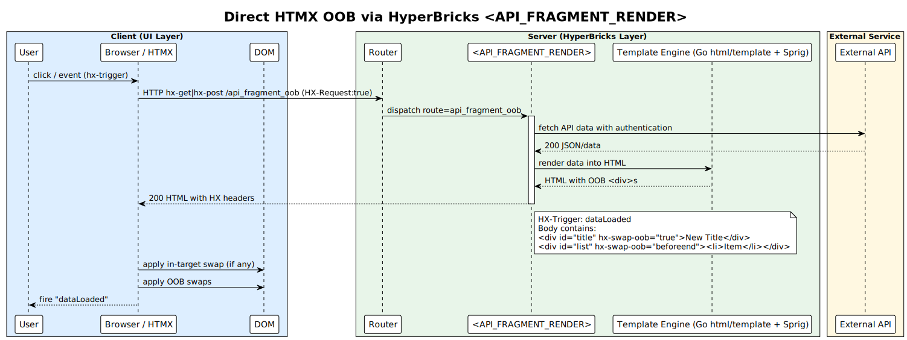

# HyperBricks API-RENDER 

HyperBricks renders HTML directly from APIs. Use `<API_RENDER>` for cacheable/public data. Use `<API_FRAGMENT_RENDER>` for live, interactive, or authenticated fragments (HTMX-style partials). Fragments are always dynamic.

---

## Components at a glance

| Component               | Primary use                          | Cache       | Client auth | Typical cases                   |
| ----------------------- | ------------------------------------ | ----------- | ----------- | ------------------------------- |
| `<API_RENDER>`          | Public, cacheable API → HTML         | Optional    | No          | Public widgets, feeds           |
| `<API_FRAGMENT_RENDER>` | Interactive/auth API → HTML fragment | No (forced) | Yes         | Login, dashboards, HTMX islands |

**IMPORTANT:** `<API_FRAGMENT_RENDER>` forces `nocache = true` at runtime.

---

## Features

### `<API_RENDER>`

* Nested and optionally cached; lives inside a composite like `<FRAGMENT>` or `<HYPERMEDIA>` so, <API_RENDER> is unlike <API_FRAGMENT_RENDER> not a route by itself; it must be included inside a root component (<HYPERMEDIA>/<FRAGMENT>).
* Fetches API data, transforms via `inline`/`template`
* Forwards only allow-listed query params (`querykeys`)
* Can set upstream request headers and modify request body
* Can apply upstream auth (JWT, Basic, cookies)

### `<API_FRAGMENT_RENDER>`

* Custom route; renders to an HTML fragment for HTMX/partial updates
* Bi-directional proxy: filters queries, forwards form/body
* Can apply upstream auth (JWT, Basic, cookies)
* HTMX response headers via `response { ... }`
* `setcookie` sets client cookie based on response data when `.Status == 200`

---

###  **Relevant Documentation**
* See the [TaskManager repository](https://github.com/hyperbricks/taskmanager/blob/main/modules/taskmanager/hyperbricks/lib/tasklist.hyperbricks#:~:text=tasklist.-,hyperbricks,-taskmanager.hyperbricks) for an example with with [PostgREST](https://postgrest.org/) and [HTMX](https://htmx.org/).
* For latest hyperbricks configuration examples see [test/dedicated/api-tests](https://github.com/hyperbricks/hyperbricks/tree/main/test/dedicated/api-tests#:~:text=api%2D-,tests,-api%2Dfragment%2Drender)
* [HTMX Out-of-Band Swaps](https://htmx.org/attributes/hx-swap-oob/)
* [HTMX Response Headers](https://htmx.org/reference/#response_headers)
* [Hypermedia Systems](https://hypermedia.systems/book/contents/)
* [Go html/template](https://pkg.go.dev/html/template)
* [Sprig Template Functions](https://masterminds.github.io/sprig/)





## Key differences

| Feature                             | `<API_RENDER>`              | `<API_FRAGMENT_RENDER>`                |
| ----------------------------------- | --------------------------- | -------------------------------------- |
| Cache                               | Optional                    | None (runtime-forced `nocache = true`) |
| Client auth handling                | No                          | Yes (forms/tokens)                     |
| Upstream auth (Server→API)          | Yes (JWT/Basic/Cookies)     | Yes (JWT/Basic/Cookies)                |
| Query param filtering (`querykeys`) | Yes                         | Yes                                    |
| Request body mapping                | Yes                         | Yes                                    |
| Transform via `inline`/`template`   | Yes                         | Yes                                    |
| HTMX response headers               | No                          | Yes via `response { ... }`             |
| `setcookie` back to client          | No (unused in current code) | Yes (200 only)                         |

---

## Key fields (reference tables)

### `<API_RENDER>`

| Property            | Description                                                                                                                   |                       |
| ------------------- | ----------------------------------------------------------------------------------------------------------------------------- | --------------------- |
| endpoint            | API URL.                                                                                                                      |                       |
| method              | HTTP method (default GET).                                                                                                    |                       |
| cache               | Enable caching for a duration (e.g., `60s`, `5m`, `1h`). *(If caching is controlled at a parent level, document that there.)* |                       |
| nocache             | Force dynamic rendering, overriding cache. *(If controlled at a parent level, document precedence there.)*                    |                       |
| querykeys           | Allowlist of client query params to forward (default: `id`, `name`, `order`).                                                 |                       |
| queryparams         | Extra query params to append to the outgoing request.                                                                         |                       |
| headers             | Upstream request headers to send to the API.                                                                                  |                       |
| body                | String with `$key` placeholders replaced from query/form/json.                                                                |                       |
| inline / template   | Template source (inline block or file path).                                                                                  |                       |
| values              | Key-value pairs merged into the template context **root** (use `{{ .key }}`).                                                 |                       |
| username / password | Basic Auth credentials for upstream.                                                                                          |                       |
| jwtsecret           | Secret for generating a JWT for `Authorization`.                                                                              |                       |
| jwtclaims           | Claims map; `exp` is seconds offset from now.                                                                                 |                       |
| debug               | Adds debug comments.                                                                                                          |                       |
| debugpanel          | Enables the front-end error panel (non-LIVE mode and global flag on).                                                         |                       |
| enclose             | Wrap final HTML with `before                                                                                                  | after` (see Enclose). |

### `<API_FRAGMENT_RENDER>`

| Property            | Description                                                                                                       |                       |
| ------------------- | ----------------------------------------------------------------------------------------------------------------- | --------------------- |
| route               | Fragment route (URL segment).                                                                                     |                       |
| title               | Optional fragment title.                                                                                          |                       |
| section             | Logical grouping section.                                                                                         |                       |
| index               | Sort key for menus.                                                                                               |                       |
| endpoint            | API URL.                                                                                                          |                       |
| method              | HTTP method (default GET).                                                                                        |                       |
| nocache             | Always dynamic. **Runtime-forced true.**                                                                          |                       |
| querykeys           | Allowlist of client query params to forward (default: `id`, `name`, `order`).                                     |                       |
| queryparams         | Extra query params for the outgoing request.                                                                      |                       |
| request.headers     | Headers to send to the upstream API. *(If you also need non-HTMX response headers, add a separate config block.)* |                       |
| response { ... }    | HTMX response header block (see table below).                                                                     |                       |
| inline / template   | Template source (inline block or file path).                                                                      |                       |
| values              | Key-value pairs merged into the template context **root** (use `{{ .key }}`).                                     |                       |
| username / password | Basic Auth credentials for upstream.                                                                              |                       |
| jwtsecret           | Secret for generating a JWT (overrides cookie token).                                                             |                       |
| jwtclaims           | Claims map; `exp` is seconds offset.                                                                              |                       |
| setcookie           | Template that becomes `Set-Cookie` when `.Status == 200`.                                                         |                       |
| debug               | Adds debug comments.                                                                                              |                       |
| debugpanel          | Enables front-end error panel (non-LIVE mode and global flag on).                                                 |                       |
| enclose             | Wrap final HTML with `before                                                                                      | after` (see Enclose). |

### Enclose helper

| Property  | Description                                                                                                     |                            |         |
| --------- | --------------------------------------------------------------------------------------------------------------- | -------------------------- | ------- |
| enclose   | Enclosing HTML split by `                                                                                       | `, e.g. `<div class="box"> | </div>` |
| trimspace | *(Not currently documented as supported.)* If you add it later, define exact behavior.                          |                            |         |
| value     | *(Not currently documented as supported.)* If you add it later, define how it interacts with `inline/template`. |                            |         |

---

## Template context

| Property         | Description                                                                                 |
| ---------------- | ------------------------------------------------------------------------------------------- |
| `Data`           | Parsed API response (JSON object/array → map/list; XML may fall back; plain text → string). |
| `Status`         | Upstream HTTP status code.                                                                  |
| `values { ... }` | Merged into the template context **root** (use `{{ .key }}`).                               |


---

## Config variables

You can set variables and reuse them.

| Property        | Description                       |
| --------------- | --------------------------------- |
| `$NAME = value` | Defines a variable at file scope. |
| `{{VAR:NAME}}`  | Expands to the variable's value.  |

Example:

```properties
$API_URL = http://localhost:3000
endpoint = {{VAR:API_URL}}/rpc/login_user
```

Or you can use environment variables like this:

| Property        | Description                       |
| --------------- | --------------------------------- |
| `{{ENV:NAME}}`  | Expands to the environment variable's value.  |

Example:

```properties
endpoint = {{ENV:API_URL}}/rpc/login_user
```

**Note:** If variables are shared across imports/files, document precedence (nearest scope wins vs global) in one place.

---

## Mapping the request (query, form, body)

| Source       | Included in fragments        | Included in API_RENDER       | Notes                                                                 |
| ------------ | ---------------------------- | ---------------------------- | --------------------------------------------------------------------- |
| Query params | Yes, filtered by `querykeys` | Yes, filtered by `querykeys` | Default allowlist: `id`, `name`, `order`; empty list → forward none.  |
| Form data    | Yes                          | Yes                          | Flattened: single → string; multi → list.                             |
| JSON body    | Yes                          | Yes                          | Merged; on key collision, JSON key is also available as `body_<key>`. |

**Placeholders in `body`:** `$key` tokens are replaced from the merged data.

* Uses a word-boundary regex around key names. Stick to `[A-Za-z0-9_]+` in placeholder keys.
* Multi-value form fields are stringified. *(If you add joiners later, document the syntax.)*

---

## Authentication behavior

Observed precedence for the upstream `Authorization` header:

1. If `jwtsecret` is set, a new JWT is generated from `jwtclaims` and used.
2. Else, if the incoming client request has a `token` cookie, use `Bearer <token>`.
3. Else, if `username`/`password` are set, use Basic Auth.
4. Else, no auth header.

`jwtclaims.exp` is treated as **seconds offset from now**. If missing or invalid, defaults to now + 1h.

---

## Caching & static

* `cache = <duration>` enables caching for `<API_RENDER>`.
* `nocache = true` forces dynamic rendering.
* `<API_FRAGMENT_RENDER>` forces `nocache = true` at runtime.
* `static = <path>` writes static files during `hyperbricks static`.

**TO-DO:** Define precedence between parent composite cache settings and child settings.

---

## HTMX response headers

Configure inside `response { ... }` on fragments.

| Key                     | HTMX Header             | Description                              |
| ----------------------- | ----------------------- | ---------------------------------------- |
| hx_location             | HX-Location             | Client-side redirect without full reload |
| hx_push_url             | HX-Push-Url             | Push a new URL into history              |
| hx_redirect             | HX-Redirect             | Redirect to new location                 |
| hx_refresh              | HX-Refresh              | Full page refresh                        |
| hx_replace_url          | HX-Replace-Url          | Replace current URL in the location bar  |
| hx_reswap               | HX-Reswap               | Swap behavior                            |
| hx_retarget             | HX-Retarget             | Selector for update target               |
| hx_reselect             | HX-Reselect             | Selector to pick part of the response    |
| hx_trigger              | HX-Trigger              | Trigger client events                    |
| hx_trigger_after_settle | HX-Trigger-After-Settle | Trigger events after settle              |
| hx_trigger_after_swap   | HX-Trigger-After-Swap   | Trigger events after swap                |

---

## Security notes

* New cookie jar per outgoing request; shared transport for pooling. Prevents cookie leakage between users.
* If a `token` cookie exists on the client request, it becomes `Authorization: Bearer <token>` to the upstream unless `jwtsecret` overrides.
* `setcookie` runs only when `.Status == 200` on fragments. Prefer `HttpOnly; Secure; SameSite=Lax; Path=/` and set expiry/Max-Age.
* `querykeys` allowlist prevents accidental forwarding of sensitive client params.
* Sanitize any dynamic values you reflect into headers or cookies.

---

## Debug & errors

* `debug = true` adds a HTML comment with the upstream payload (in non-LIVE mode).
* `debugpanel = true` injects a front-end error panel when global `Development.FrontendErrors` is enabled (and not LIVE).
* Errors are surfaced as HTML comments and collected for logs.
* **TO-DO:** Fragment debug string says `Debug in <API_RENDER>...` — adjust label.


---

## Known limitations & open items

* XML decoding often needs struct bindings; generic map decoding may fail and fall back to plain text. *(Document what “fallback” looks like for templates.)*
* Placeholder matching uses word boundaries; avoid dashes in `$key` names. 
* Fragment rendering assumes `Request` and `ResponseWriter` are present in context.
* `<API_RENDER>` exposes `setcookie` in the struct but does not send it.
