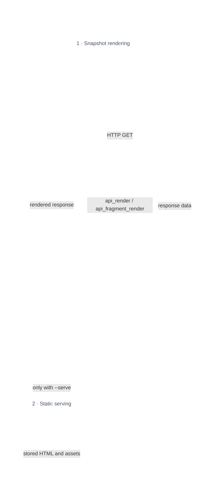

# HyperBricks CLI

The `hyperbricks` command initializes modules, starts the runtime, renders static output, builds deploy archives, and manages plugins.

Run commands from the repository or project root: the directory that contains `modules/`.

## Install

```bash
go install github.com/hyperbricks/hyperbricks/cmd/hyperbricks@latest
```

Check the installed version:

```bash
hyperbricks version
```

## Commands

| Command | Purpose |
| --- | --- |
| `init` | Create `package.hyperbricks.yaml` and module directories |
| `init-starter` | Install an official starter module |
| `start` | Start the runtime server |
| `static` | Render static output |
| `build` | Build a deploy archive |
| `plugin` | List, install, build, update, and remove plugins |
| `select` | Select the active module |
| `version` | Show version information |

Use command help for the current flag list:

```bash
hyperbricks <command> --help
```

## Init

Create a named module, or omit `--module` to use `default`:

```bash
hyperbricks init -m demo
hyperbricks init
```

This creates:

```text
modules/demo/
  hyperbricks/
  rendered/
  resources/
  static/
  templates/
  package.hyperbricks.yaml
```

The embedded **HyperBricks Starter** generates three complete pages: Overview (`/`), Templates (`/templates`), and Fragments (`/fragments`). A section-based `menu` provides HTMX 4 navigation, and `/hello-status` demonstrates a targeted fragment response. The starter includes responsive CSS, templates, file/environment values, and locally bundled HTMX 4.0.0 with attribution. Native esbuild generates the browser bundles at runtime; no npm install or starter download is required.

The generated configuration and README use the selected module name. The README includes run commands and static ZIP export/serving instructions. Generated bundles and rendered exports are excluded by the module's `.gitignore`.

`init` creates missing scaffold directories and files and preserves existing files, including `package.hyperbricks.yaml`. `--module` accepts a bare name below `./modules`; use direct `start` when selecting a module by directory path.

## Start

Start a module by its name below `./modules`:

```bash
hyperbricks start -m demo
```

For direct startup, `--module` also accepts relative and absolute directory paths:

```bash
hyperbricks start -m ./modules/demo
hyperbricks start -m ../other-site/modules/demo
hyperbricks start -m /srv/sites/demo
```

### Module selection

For these examples, assume the command is invoked from `/work/site`:

| `--module` value | Selection | Resolved directory |
| --- | --- | --- |
| `demo` | Bare module name | `/work/site/modules/demo` |
| `modules/demo` | Relative directory path | `/work/site/modules/demo` |
| `./modules/demo` | Explicit relative directory path | `/work/site/modules/demo` |
| `../other/modules/demo` | Parent-relative directory path | `/work/other/modules/demo` |
| `/srv/sites/demo` | Absolute directory path | `/srv/sites/demo` |
| `.` | Current directory is the module | `/work/site` |
| Flag omitted | Default module name | `/work/site/modules/default` |

A value is treated as a path when it is absolute, contains a platform directory separator, or is exactly `.` or `..`. Classification happens before the value is cleaned, so `./demo` selects `/work/site/demo`, while the bare name `demo` selects `/work/site/modules/demo`.

Bare names always retain the `modules/<name>` meaning. HyperBricks does not change the meaning by checking whether a same-named directory exists elsewhere. Quote paths containing spaces:

```bash
hyperbricks start -m "./modules/my module"
```

Relative paths are resolved once from the directory where the command is invoked. Selecting a module does not change the process working directory. In runtime path values, `root` remains the invocation directory, `module` is the selected module directory, and `module_root` is its parent.

The selected directory must contain `package.hyperbricks.yaml`, unless `--config` selects another package configuration inside it. When the file is missing, HyperBricks reports the resolved path and exits with a non-zero status; it does not fall back to another module.

Path selection applies only to direct `start`. Deploy startup, build, static, init, and plugin commands retain their existing module-selection contracts. Shell completion suggests bare names from `./modules` while retaining normal filesystem completion for paths.

Because the working directory does not change, bare package directory settings such as `plugins: ./bin/plugins` remain relative to the invocation directory. For module-owned directories, prefer an explicit module base:

```yaml
hyperbricks:
  directories:
    resources:
      path: {base: module, path: resources}
    templates:
      path: {base: module, path: templates}
    static:
      path: {base: module, path: static}
    hyperbricks:
      path: {base: module, path: hyperbricks}
    render:
      path: {base: module, path: rendered}
```

> Note: `/static/somefile.ext` serves `somefile.ext` from the configured
> `hyperbricks.directories.static` directory, regardless of its name or `base`.
> A custom path does not require an additional directory named `static`.

Choose a port:

```bash
hyperbricks start -m demo --port 8080
```

Start in production mode:

```bash
hyperbricks start -m demo --production
```

Start the same module with an alternate package configuration stored inside that module:

```bash
hyperbricks start -m demo --config package.raw.hyperbricks.yaml
hyperbricks start -m ./modules/demo --config profiles/development.hyperbricks.yaml
```

`--config` is relative to the selected module directory, must stay inside that directory, and cannot be combined with `--deploy`. Absolute paths and paths that escape through `..` are rejected.

Enable debug logging:

```bash
hyperbricks start -m demo --debug
```

Runtime gateway flags are available on `start`, but the full contract lives in [Runtime Gateway](RUNTIME_GATEWAY.md).

```bash
hyperbricks start -m demo \
  --runtime-gateway \
  --runtime-domain runtime.local \
  --runtime-resolver http://127.0.0.1:8080/resolve-runtime
```

### Render diagnostics

In development and debug mode, the `Render diagnostics recorded` log message includes a URL for that error. Open it in your browser to see the JSON details:

```text
http://localhost:8080/__hyperbricks/render-diagnostics?request_id=hb-12
```

The details include the source file, component path, key, type, and error message where available. The link uses the host and port of the request. Errors found while loading configuration use `localhost` and your configured server port; open those links after the server has started. Fix the reported source and reload the page to check again.

You can also open `/__hyperbricks/render-diagnostics` on your running server to see the ten most recent diagnostic records. HyperBricks keeps the latest 200 records in memory, so older links expire and records are cleared when the process restarts.

The endpoint is disabled in live mode. Static exports omit the link because their temporary server stops after rendering.

Server setup failures, such as unusable directories, listener, watcher, or gateway configuration, can still prevent startup. If the server cannot start, read the error in the terminal; the diagnostics endpoint is not available yet.

## Static Rendering

Render static output:

```bash
hyperbricks static -m demo
```

`hyperbricks static` renders a new snapshot through a temporary localhost
runtime and writes it to the module's render directory. If a rendered target
contains `api_render`, the API is called during rendering.

Render and then serve the static output:

```bash
hyperbricks static -m demo --serve
```

With `--serve`, HyperBricks performs that render first and then serves the new
snapshot. It does not skip the rendering phase. To serve existing files without
rebuilding them, use a standalone static file server as described under
[Serving the export](#serving-the-export).

### Rendering runtime and static file server

`static --serve` uses two consecutive HTTP servers for different jobs. The
first is a temporary HyperBricks runtime used only to create the snapshot. The
second uses a separate file-only handler to expose the completed render
directory:



Entries under `hyperbricks.static.routes` and `variants` add or customize
snapshot targets; they are not an allowlist. Automatic discovery includes every
loaded route-owning `hypermedia`, `fragment`, and `api_fragment_render`
component. A route can therefore be rendered even when it is not listed under
`hyperbricks.static`.

The snapshot client requests targets with HTTP GET. Components can still call
upstream APIs, and runtime-gateway routing can handle matching snapshot
requests. Use a separate export package or source directory when actions,
guards, or other request-time routes should not run during export.

After rendering, the static server serves stored files only. HTMX can load an
exported file, but forms, authorization, per-user output, plugins, and fresh
server-side API reads require a running HyperBricks application.

Overwrite existing output:

```bash
hyperbricks static -m demo --force
```

`--force` deletes the existing render directory before rebuilding it.

Export rendered output as a zip:

```bash
hyperbricks static -m demo --zip --out exports/demo
```

Exclude paths relative to the render root:

```bash
hyperbricks static -m demo --zip --exclude cache,tmp
```

### Package configuration

Configure export requests under `hyperbricks.static` in `package.hyperbricks.yaml`. This is separate from `hyperbricks.directories.static`, which identifies the assets served at `/static/`. The render directory receives the generated HTML and a copy of those assets.

The following complete package example assumes the module contains `index` and
`products` routes. Keep any other application settings, plugins, and directory
overrides that your module needs:

```yaml
hyperbricks:
  mode: development
  development:
    watch: false
    reload: false
  directories:
    hyperbricks:
      path: {base: module, path: hyperbricks}
    templates:
      path: {base: module, path: templates}
    resources:
      path: {base: module, path: resources}
    static:
      path: {base: module, path: static}
    render:
      path: {base: module, path: rendered}
  static:
    routes:
      - path: /index
        output: index.html
      - path: /products
        output: products.html
        host: catalog.example.test
        headers:
          Accept-Language: en
    variants:
      - path: /products
        query:
          category: shoes
          tag: [sale, summer]
        output: products/shoes.html
        host: catalog.example.test
        headers:
          Accept-Language: en
      - path: /products
        query:
          category: hats
        output: products/hats.html
        host: catalog.example.test
        headers:
          Accept-Language: nl
```

| Field | Meaning |
| --- | --- |
| `routes`, `variants` | Lists of requests to export. Both lists accept the same fields; `variants` groups alternate versions of a route. |
| `path` | Request path, optionally including a query string. The request always goes to the temporary local HyperBricks runtime. An absolute URL supplies its path, query, and Host; it does not fetch that remote website. |
| `query` | Query parameters added to the request. A list creates repeated values, such as `tag=sale&tag=summer`. The route must use those parameters for the exported content to differ. |
| `headers` | Request headers, such as `Accept-Language`. They affect rendering only when the route reads or forwards them. |
| `host` | The request Host value. Use this field for host-dependent rendering, rather than a `Host` entry in `headers`. It overrides the host from an absolute `path` URL. |
| `output` | File path relative to the render directory. A trailing slash appends `index.html`. Traversal outside that directory is rejected. An explicit output is required when query parameters are present. |

**These lists supplement automatic route discovery; they are not an allowlist.** Every loaded route is still considered for export. Without an explicit output, `/` becomes the first configured index file (normally `index.html`), an extensionless route appends the first configured `server.routing.extensions` value (normally `.html`, making `/products` become `products.html`), and a route with an extension keeps it. A route owner's `static` field can override its output path. With the default routing configuration, the `index` route also exports to `index.html`.

A package entry overrides a discovered target only when both have the same request path/query and output file. In the example, `/products` keeps the configured Host and language, while `index` is still discovered automatically. A different explicit output adds a second snapshot; it does not remove the discovered output. Different requests cannot write to the same file: the export reports the conflicting entries instead of overwriting one. For an `index` route override, use `path: /index` so it matches that discovered request.

For a selected set of pages, use a separate export module with its own `package.hyperbricks.yaml` and a source directory that loads only those routes. Reuse shared components/templates through the normal imports and directory settings. Run `hyperbricks static -m demo-export --force --zip`; the static command does not accept the startup-only `--config` flag. `--exclude` removes files from the ZIP after rendering, so it does not prevent a route from executing during export.

`hyperbricks.static` must be a YAML mapping, and `routes`/`variants` must be lists of mappings. Existing `static.crawl.routes` and `static.crawl.variants` aliases remain supported; `crawl` must also be a mapping. Use the direct lists for new configurations. Each request must return a successful 2xx response without render errors; redirects and failures stop the export. Cookies and `Cache-Control: no-store` produce warnings, but the response body is still written. Only export content intended to be published as static files.

### Serving the export

Extract the ZIP into an empty directory and serve that directory as the site root. For example:

```bash
npx serve ./site -l 8080
```

`serve` supports [clean URLs](https://github.com/vercel/serve-handler#cleanurls-booleanarray) such as `/products` for `products.html`. Use its regular file-serving mode; a single-page-app fallback would hide missing exported pages.

Python also serves the files:

```bash
python3 -m http.server 8080 --directory ./site
```

With Python, use explicit file links such as `/products.html`, or export directory indexes and link to `/products/`. Python's [basic file server](https://docs.python.org/3/library/http.server.html#http.server.SimpleHTTPRequestHandler) does not rewrite `/products` to `products.html`. Query variants are separate files: visiting `/products.html?category=shoes` does not select `products/shoes.html`. Link to each variant's output URL in the generated site.

The `modules/sampleapis-coffee-static` module demonstrates a static snapshot that renders `api_render` data from `https://api.sampleapis.com/coffee/hot`. If a nested `api_render` receives a non-2xx upstream response, static rendering fails through the route render-error diagnostics.

## Build Archives

Build a deploy archive:

```bash
hyperbricks build --hra -m demo
```

Build a zip archive:

```bash
hyperbricks build --zip -m demo
```

Common build flags:

| Flag | Purpose |
| --- | --- |
| `--out <dir>` | Output directory, default `deploy` |
| `--force` | Build even when no source changes are detected |
| `--replace` | Replace the current build |
| `--replace <build_id>` | Replace a specific build |
| `--push` | Build and push to a deploy target |
| `--target <name>` | Select a deploy target for `--push` |

## Deploy Runtime Commands

Start a module from the deploy folder:

```bash
hyperbricks start --deploy -m demo
```

Start a specific build:

```bash
hyperbricks start --deploy -m demo --build build-id
```

Use a custom deploy directory:

```bash
hyperbricks start --deploy -m demo --deploy-dir deploy
```

Start deploy services:

```bash
hyperbricks deploy-daemon
hyperbricks start --deploy-remote
hyperbricks start --deploy-local
```

`deploy-daemon` starts the remote deploy daemon. If `deploy.hyperbricks.yaml` does not exist, it writes a minimal remote config and prints the Composer deploy secret/env-var setup instructions.

Create a deploy config:

```bash
hyperbricks start --deploy-init-config local
hyperbricks start --deploy-init-config remote
```

## Starters

`init` creates a module from the scaffold embedded in the installed HyperBricks binary. `init-starter` downloads a starter from the official [starters repository](https://github.com/hyperbricks/hyperbricks-starters).

List compatible starters:

```bash
hyperbricks init-starter list
```

Install a starter:

```bash
hyperbricks init-starter get hello-world -m demo
```

Install a specific starter version:

```bash
hyperbricks init-starter get hello-world@1.0.0 -m demo
```

Without `@version`, HyperBricks selects the highest starter version compatible with the running HyperBricks version. Compatibility is declared in the starter index through `compatible_hyperbricks`. An explicitly requested starter version must also pass this check; installation fails if it is incompatible. An omitted or empty compatibility list allows any HyperBricks version.

The index and archive are downloaded from the starters repository's `main` branch. `@version` selects a versioned starter directory within that archive, not a Git tag or commit. Published starter version directories therefore need to remain unchanged for repeatable installations.

## Plugins

Plugin management is available under `hyperbricks plugin`.

```bash
hyperbricks plugin list
hyperbricks plugin install example@1.0.0
hyperbricks plugin build example@1.0.0
hyperbricks plugin build markdown-wasm@1.0.0
hyperbricks plugin remove example@1.0.0
```

Use `--module <module>` with `plugin build` or `plugin remove` for custom module plugins.

`plugin update` is reserved for a future atomic update workflow. It currently
returns a nonzero `not implemented` error and does not modify installed plugins.
Install the required version explicitly with `plugin install <name>@<version>`.

See [Plugins](PLUGINS.md) for naming, manifests, and YAML usage.

## Non-Interactive Mode

Use `--non-interactive` when commands run in scripts or CI:

```bash
hyperbricks --non-interactive static -m demo --force
```

This disables keyboard-driven prompts where supported.
