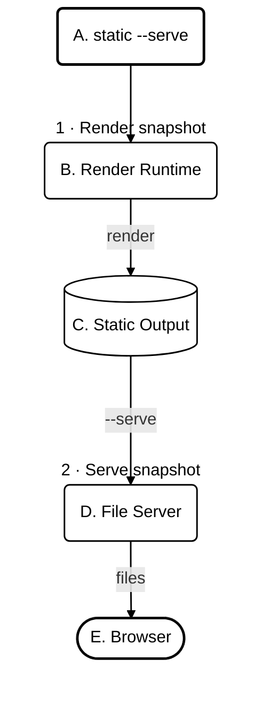

# HyperBricks CLI

Use the `hyperbricks` command to create modules, start the runtime, export static output, build deploy archives, and manage plugins.

Run commands from the project or repository root, which normally contains `modules/`.

## Install

```bash
go install github.com/hyperbricks/hyperbricks/cmd/hyperbricks@latest
```

Check the installed version:

```bash
hyperbricks version
```

## Commands

| Command        | Purpose                                                                    | Link                                           |
| -------------- | -------------------------------------------------------------------------- | ---------------------------------------------- |
| `init`         | Create the embedded module or maintain existing package metadata           | [↗](#init-and-init-starter)                     |
| `init-starter` | Install an official starter module                                         | [↗](#init-starter-install-an-official-starter) |
| `scaffold`     | Bubble Tea wizard for root composites and components                       | [↗](#scaffold)                                 |
| `author`       | Create and extend configuration through JSON specs for agents and automation | [↗](#author)                                   |
| `space`        | Create an inheriting hypermedia Space from an existing source              | [↗](#space)                                    |
| `doctor`       | Diagnose a source module's static readiness before running or building      | [↗](#doctor)                                   |
| `language-server` | Provide editor diagnostics, completion, hover, and formatting over LSP   | [↗](#language-server)                          |
| `start`        | Start the runtime server                                                   | [↗](#start)                                    |
| `static`       | Render static output                                                       | [↗](#static-rendering)                         |
| `build`        | Build a deploy archive                                                     | [↗](#build-archives)                           |
| `plugin`       | List, install, build, and remove plugins                                   | [↗](#plugins)                                  |
| `select`       | Interactively choose and start a module                                    | [↗](#select)                                   |
| `version`      | Show version information                                                   | [↗](#install)                                  |

Use command help for the current flag list:

```bash
hyperbricks <command> --help
```

## `init` and `init-starter`

Both commands create a runnable module under `./modules/<module>`. `hyperbricks init -m demo` creates the more verbose, embedded three-page example. `hyperbricks init-starter get hello-world -m demo` downloads the minimal Hello World example. Choose one command for the module you want to create.

Both creation paths write current source-owned package metadata automatically:

```yaml
hyperbricks:
  metadata:
    module: demo
    moduleversion: "1.0.0"
    hyperbricks: v1.2.5-beta
```

`module` is the new module directory's base name. New modules start at
`moduleversion: "1.0.0"`, independently of an official starter's own release
version. `hyperbricks` is read from the running binary, so it may differ from
the example above. Build-specific provenance is added only to an archive; a
source package does not own `format`, `format_version`, `commit`, or `built_at`.
It also does not own `source_hash`, which belongs to the build index.

### Init: create the three-page example

Create a named module, or omit `--module` to use `default`:

```bash
hyperbricks init -m demo
hyperbricks init
```

Running `hyperbricks init -m demo` creates the following files and directories (verified with `v1.2.5-beta`):

```text
modules/demo/
├── hyperbricks/
│   ├── partials/
│   │   ├── assets.hyperbricks.yaml
│   │   ├── init-components.hyperbricks.yaml
│   │   └── site.hyperbricks.yaml
│   └── hello-world.hyperbricks.yaml
├── logs/
├── rendered/
├── resources/
│   ├── css/
│   │   └── app.css
│   ├── js/
│   │   └── app.js
│   ├── vendor/
│   │   └── htmx-4.0.0.js
│   └── init-copy.txt
├── static/
├── templates/
│   ├── hello-card.html
│   ├── hello-status.html
│   ├── overview.html
│   └── shell.html
├── .gitignore
├── README.md
├── VENDOR.md
└── package.hyperbricks.yaml
```

After logging each created file, the command prints:

```text
Module ready: modules/demo
Start: hyperbricks start -m demo
```

The embedded **HyperBricks Starter** generates three complete pages: Overview (`/`), Templates (`/templates`), and Fragments (`/fragments`). A section-based `menu` provides HTMX 4 navigation, and `/hello-status` demonstrates a targeted fragment response. The starter includes responsive CSS, templates, file/environment values, and locally bundled HTMX 4.0.0 with attribution. Native esbuild generates the browser bundles at runtime; no npm install or starter download is required.

The generated configuration and README use the selected module name. The README includes run commands and static ZIP export/serving instructions. Generated bundles and rendered exports are excluded by the module's `.gitignore`.

`init` creates missing scaffold directories and files and preserves existing files, including `package.hyperbricks.yaml`. `--module` accepts a bare name below `./modules` for normal scaffold creation. The metadata-only modes described below additionally accept the same module names and directory paths as `start -m` and `build -m`.

### Init-starter: install an official starter

`init-starter` downloads a starter from the official [starters repository](https://github.com/hyperbricks/hyperbricks-starters). Browse the [module starter index](../modules/README.md#starter-modules) for examples and their setup requirements. Use `init-starter` for the minimal Hello World example.

List compatible starters:

```bash
hyperbricks init-starter list
```

Install the Hello World starter and start it:

```bash
hyperbricks init-starter get hello-world -m demo
hyperbricks start -m demo
```

Running `hyperbricks init-starter get hello-world -m demo` installs `hello-world@1.0.0` with the following files and directories (verified with `v1.2.5-beta`):

```text
modules/demo/
├── hyperbricks/
│   └── hello-world.hyperbricks.yaml
├── logs/
│   └── .gitkeep
├── rendered/
│   └── .gitkeep
├── resources/
│   └── .gitkeep
├── static/
│   └── .gitkeep
├── templates/
│   └── .gitkeep
└── package.hyperbricks.yaml
```

The command prints:

```text
Starter "hello-world@1.0.0" installed to modules/demo
Next: hyperbricks start -m demo
```

The generated `hyperbricks/hello-world.hyperbricks.yaml` defines a single page titled **Hello World** at the `index` route, with a text component that renders `<p>HELLO WORLD!</p>`.

Starters are installed into `./modules/<module>`. If `--module` (`-m`) is omitted, the module name defaults to the starter name. Installation requires an empty or absent destination directory.

Install a specific starter version:

```bash
hyperbricks init-starter get hello-world@1.0.0 -m demo
```

Without `@version`, HyperBricks selects the highest starter version compatible with the running HyperBricks version. Compatibility is declared in the starter index through `compatible_hyperbricks`. An explicitly requested starter version must also pass this check; installation fails if it is incompatible. An omitted or empty compatibility list allows any HyperBricks version.

The index and archive are downloaded from the starters repository's `main` branch. `@version` selects a versioned starter directory within that archive, not a Git tag or commit. Published starter version directories therefore need to remain unchanged for repeatable installations.

Before an official starter is copied into its destination, HyperBricks
normalizes the staged `package.hyperbricks.yaml`. It sets `module` to the
destination directory's base name, starts `moduleversion` at `1.0.0`, records
the running HyperBricks version, and removes stale artifact-only metadata. A
normalization failure leaves the destination uninstalled.

### Refresh or bump package metadata

Refresh an existing module's source-owned metadata without creating or
repairing scaffold files:

```bash
hyperbricks init -m demo --update-metadata
hyperbricks init -m ./modules/demo --update-metadata
```

Metadata-only `init` uses the same module selection contract as `start -m` and
`build -m`: a bare name selects `./modules/<name>`, while a value containing a
path separator selects that relative or absolute directory. It:

- sets `module` from the selected directory's base name
- refreshes `hyperbricks` from the running binary
- validates and canonicalizes `moduleversion`, including `1.0` to `1.0.0`
- removes legacy source values for `format`, `format_version`, `commit`,
  `built_at`, and `source_hash`
- preserves unrelated package configuration
- leaves an already-current file unchanged

The selected module and `package.hyperbricks.yaml` must already exist. This
mode never falls back to creating the embedded starter.

Bump the module's semantic version while performing the same metadata refresh:

```bash
# Patch is the default bump.
hyperbricks init -m demo --bump-version

# Explicit bump levels.
hyperbricks init -m demo --bump-version=patch
hyperbricks init -m demo --bump-version=minor
hyperbricks init -m demo --bump-version=major
```

`--bump-version` implies `--update-metadata`. Patch, minor, and major bumps
change `1.2.3` to `1.2.4`, `1.3.0`, and `2.0.0`, respectively. Legacy `1.0`
is interpreted as `1.0.0` before bumping. An invalid or empty module version
fails without modifying the package file.

## Scaffold

`hyperbricks scaffold` is the fast interactive starter path. Its flow is deliberately
short:

1. Select a module.
2. Select `Composite` or `Component`.
3. Select a type starter.
4. Select a top-level `*.hyperbricks.yaml` destination.
5. Accept or edit the generated root name.
6. Enter a route and title when the selected starter supports them.
7. Review the planned YAML and any bundled source files.

The wizard does not ask for every schema field. It creates a useful native example
from the core template library, then leaves project-specific fields and composition
to [Authoring](AUTHOR.md). Press `Enter` on the review screen to write the plan,
`Esc` to return to editing, or `Ctrl+C` to cancel without writing.

Each starter is native ordered HyperBricks YAML and is aligned with the commented
[HyperBricks type examples](HYPERBRICKS_TYPE_EXAMPLES.md). `template` and `markdown`
each offer explicit **inline** and **file** starters. File starters add a uniquely
named generic source file to the same review. Other file-backed starters similarly
stage their generic resource, such as an image, JSON document, stylesheet, or
esbuild entry file. Existing files at those paths are preserved; replace the generic
assets with project content after creation.

The wizard writes only top-level configuration files. Use `hyperbricks author` for
custom fields, external assets, inheritance, nested files, imports, route-aware
changes, or additions that must adapt to existing project ownership. `author`
discovers the loaded configuration and plans changes against its current revision;
`scaffold` is optimized for quickly starting a standard root from a known template.

### Non-interactive scaffold

Supply the required choices as flags when a prompt is not appropriate. This mode
still uses the same library, validation, asset staging, and source-write safeguards
as the wizard:

```bash
hyperbricks scaffold \
  --module demo \
  --type hypermedia \
  --file about.hyperbricks.yaml \
  --name about_page \
  --route about \
  --title About \
  --non-interactive
```

`--module`, `--type`, and `--file` are required. `--name` is optional and defaults
to a unique starter name. `--route` is used by route-owning starters, and `--title`
is used by `hypermedia`; a hypermedia title defaults to the generated root name.
Use `--category composite` or `--category component` to constrain the selected type.

Template and Markdown source variants use `--source`:

```bash
hyperbricks scaffold \
  --module demo \
  --type markdown \
  --source file \
  --file content.hyperbricks.yaml \
  --name guide \
  --non-interactive
```

Valid values are `inline` and `file`; the option applies only to `template` and
`markdown`. A file source stages the corresponding generic asset if it does not
already exist. Add `--dry-run` to inspect the planned YAML and files without
writing. Add `--json` when another program needs structured output; this is a
serialization of the same human-oriented scaffold plan, not the full `author`
specification format.

The scaffold library is source-oriented: preview validates the emitted YAML,
inheritance, routes, and referenced staged files, but does not execute components.
Runtime rendering, API calls, browser behavior, and HTMX behavior require a separate
runtime check with `hyperbricks start` or an equivalent test.

Read [Changing Existing Projects](AUTHOR.md) to decide when a change needs
`author`. Its [command reference](AUTHOR_REFERENCE.md) documents the exact paths,
output, and source-write safeguards. These commands require this development
build; the published v1.2.4-beta binary does not include them.

## Author

`hyperbricks author` is for developers, agents, and automation that need to
change an existing HyperBricks project non-interactively. It reads the loaded
project, accepts structured JSON specs, and generates native ordered YAML.

Read the project context, preview a spec, then apply it:

```bash
hyperbricks author context -m demo --json
hyperbricks author apply -m demo --spec spec.json --dry-run --json
hyperbricks author apply -m demo --spec spec.json --json
```

See [Changing Existing Projects](AUTHOR.md) for the task-oriented workflow and
examples. See the [author command reference](AUTHOR_REFERENCE.md) for exact spec,
output, validation, and write contracts.

## Space

`hyperbricks space` creates a page that inherits an existing Hypermedia source. Run it from the project root. The command writes the new Space configuration and adds the imports needed to load it; it does not start the server.

Open the interactive wizard to choose a source, enter the Space name, route, and title, and review the changes before writing:

```bash
hyperbricks space -m demo
```

List available Hypermedia sources:

```bash
hyperbricks space -m demo --list
```

Preview a new Space using `scaffold_page`, a source included in the embedded three-page starter:

```bash
hyperbricks space -m demo \
  --source scaffold_page \
  --name about_space \
  --title About \
  --route about \
  --dry-run
```

The preview shows the new Space YAML and the import changes. Remove `--dry-run` to create it:

```bash
hyperbricks space -m demo \
  --source scaffold_page \
  --name about_space \
  --title About \
  --route about
```

Use an actual source name from `--list` when working with another module. Add `--json` for structured output, or `--config <file>` to select a package configuration inside the module.

See [Spaces](SPACES.md) for inheritance, editable content, and the development editor.

## Doctor

`hyperbricks doctor` performs a deterministic, read-only, offline health check
of one source module. Use it before `start` or `build` to find package, source,
resource, route, Space, plugin, and metadata problems without starting a server
or creating an archive.

Diagnose the default module, a named module, or a module directory:

```bash
hyperbricks doctor
hyperbricks doctor -m demo
hyperbricks doctor -m ./modules/demo
```

`doctor -m` uses the same module selection contract as `start -m` and
`build -m`: an omitted value selects `./modules/default`, a bare name selects
`./modules/<name>`, and a value containing a path separator selects that
relative or absolute directory. Select an alternate package configuration
inside the module with `--config`:

```bash
hyperbricks doctor -m demo --config profiles/live.hyperbricks.yaml
```

The configuration path is relative to the selected module and must stay inside
it. Absolute paths and paths that escape through `..` are rejected.

### Default checks

The doctor uses the runtime's normal defaults and CLI override semantics, but
returns YAML, materialization, typed-configuration, and unsupported-mode errors
instead of converting them into runtime recovery behavior. Its checks cover:

- module selection and package configuration parsing, materialization, and
  typed validation
- source metadata, including module identity, semantic version, recorded
  HyperBricks version, and artifact-only fields left in a source package
- configured module-owned source and asset directories and their containment
- HyperBricks source loading, imports, inheritance, components, and duplicate
  roots
- route validity and uniqueness
- referenced templates, Markdown, JSON, scripts, styles, images, and esbuild
  entry points
- Space-source and editable-field contracts for every effective Hypermedia
  root, including routed sources
- enabled plugin declarations and matching native or WASM artifacts
- dashboard and frontend-editing configuration, including Space/plugin
  conflicts, without exposing credential values
- an in-memory deployment-metadata overlay as a final build-readiness check

Each check has one of four statuses: `pass`, `warn`, `fail`, or `skip`. Invalid
configuration, unresolved imports, missing required files, invalid semantic
versions, duplicate routes, and missing enabled plugins fail the diagnosis.
Advisory conditions, such as metadata that records a different HyperBricks
version than the running CLI, produce a warning and a concrete prescription.
Unknown component types are failures when no plugin is enabled. With an enabled
plugin they are warnings: they may be plugin-owned, but the offline checker
cannot prove ownership without loading plugin code. `--strict` rejects that
unverified state in CI.
A configured mode other than `live`, `development`, or `debug` is a failure,
even though normal startup can warn and fall back to `live`.
A dashboard without configured credentials remains valid but locked. The
doctor warns when a locked developer interface is enabled and never invents
default credentials.

Passing checks collapse to one line per group. Warnings, failures, and skipped
checks expand with their source location and a suggested repair when one is
available:

```text
$ hyperbricks doctor -m demo

HyperBricks Doctor · demo
modules/demo/package.hyperbricks.yaml

✓ Module       selected modules/demo
✓ Package      configuration loaded
! Metadata     records v1.2.4-beta; running v1.2.5-beta
✓ Directories  4 configured source directories resolved safely
✓ Sources      8 files · 21 roots · imports resolved
✓ Components   47 native components validated · no unverified unknown types
✓ Routes       6 unique routes
✓ Resources    18 local references resolved
✓ Spaces       3 eligible editable Space sources validated
✓ Plugins      no external plugins enabled
✓ Security     developer-interface credentials are configured
✓ Build        archive provenance can be applied in memory

DIAGNOSIS · HEALTHY WITH WARNINGS
15 passed · 1 warning(s) · 0 failed · 0 skipped · 34 ms

PRESCRIPTION
hyperbricks init -m demo --update-metadata
```

### Structured output and exit status

Use `--json` for CI or other automation:

```bash
hyperbricks doctor -m demo --json
```

The command writes one versioned JSON object to standard output. Diagnostics
and other logs remain on standard error so stdout can be decoded directly. The
abridged example below shows one check; actual output always contains all 16
stable checks:

```json
{
  "schema_version": 1,
  "status": "warning",
  "strict": false,
  "module": {
    "input": "demo",
    "name": "demo",
    "root": "modules/demo",
    "config": "package.hyperbricks.yaml"
  },
  "summary": {
    "passed": 15,
    "warnings": 1,
    "failed": 0,
    "skipped": 0,
    "duration_ms": 34
  },
  "checks": [
    {
      "id": "metadata.runtime_version",
      "group": "metadata",
      "status": "warn",
      "message": "Package records HyperBricks v1.2.4-beta; the running CLI is v1.2.5-beta",
      "file": "package.hyperbricks.yaml",
      "path": "hyperbricks.metadata.hyperbricks",
      "hint": "Run hyperbricks init -m demo --update-metadata"
    }
  ]
}
```

The overall `status` is `healthy`, `warning`, or `unhealthy`. Individual check
statuses are `pass`, `warn`, `fail`, or `skip`. The stable check IDs are:

| Check ID | Scope |
| --- | --- |
| `module.selection` | Selected module and package path |
| `package.configuration` | Package parsing, materialization, and typed configuration |
| `metadata.identity` | Module metadata matches the selected directory |
| `metadata.module_version` | Module version is valid SemVer |
| `metadata.runtime_version` | Recorded and running HyperBricks versions |
| `metadata.source_fields` | Artifact-only fields are absent from source metadata |
| `directories.paths` | Configured directory resolution and containment |
| `sources.graph` | HyperBricks sources, imports, inheritance, and roots |
| `components.native_schema` | Native component types and required fields |
| `components.plugin_owned` | Unknown types that may be owned by enabled plugins |
| `routes.unique` | Route validity and uniqueness |
| `resources.local` | Referenced local files |
| `spaces.contract` | Eligible Space sources and editable fields |
| `plugins.artifacts` | Enabled plugin artifacts |
| `security.developer_credentials` | Developer-interface access configuration |
| `build.provenance` | In-memory archive provenance overlay |

Check IDs and `schema_version` are the machine-facing contract; wording may
become more specific without changing those identifiers.

By default, warnings do not fail the command. Exit status is `0` when no check
failed and `1` when one or more checks failed. Add `--strict` to make warnings
produce exit status `1` as well:

```bash
hyperbricks doctor -m demo --strict --json
```

`--strict` changes the acceptance policy only. It does not enable extra checks
or change the evidence reported by those checks.

### Safety and scope

The default diagnosis never modifies package or source files, performs a build,
starts a listener, renders or requests routes, loads plugin code, executes
server-side JavaScript, or contacts configured APIs. It checks external API
configuration syntactically and verifies plugin artifacts without running
them. Output never includes dashboard usernames or passwords, values reached
through source `env` or `config` resolvers, complete source bodies, or
unnecessary absolute filesystem paths. Human output also escapes terminal
control characters from user-authored names and diagnostics.

`author` inspects or changes source ownership, `doctor` diagnoses source-module
readiness, `start` runs the application, and `build` creates a deployment
archive. A running local or remote deployment has different health concerns;
use the deployment interface and API for those checks rather than `doctor`.

## Language server

`hyperbricks language-server --stdio` exposes HyperBricks source intelligence
to editor clients using Language Server Protocol 3.17 framing. It is intended
to be started and supervised by the matching Visual Studio Code extension, not
run as an interactive terminal command.

```bash
hyperbricks language-server --stdio
```

The server uses the runtime parser and schema registry for unsaved-buffer
diagnostics, completion, hover, and whole-document formatting. The editor sends
the selected module and package profile during initialization, so module-local
imports, inheritance targets, templates, and resources resolve against the same
project contract as the CLI. Runtime render feedback is optional and remains
separate from static source diagnostics.

The HyperBricks editor protocol is versioned independently from LSP. A client
and executable with incompatible editor-protocol versions reject the session
with a clear initialization error instead of silently degrading. Standard
output is reserved for JSON-RPC; process diagnostics must use standard error.

See [Visual Studio Code](VSCODE.md) for extension build, settings, commands,
runtime authentication, and troubleshooting details.

## Start

Always run `hyperbricks start` from the project root, which contains the `modules/` directory.

Start a module in `./modules` by its name:

```bash
hyperbricks start -m demo
```

See [Runtime request flow](INTRODUCTION.md#runtime-request-flow) for the request path through a running server.

### Start module argument

`{pwd}` means the current working directory, which must be the project root.

| `--module` value | Selection | Resolved directory |
| --- | --- | --- |
| `demo` | Bare module name | `{pwd}/modules/demo` |
| `modules/demo` | Relative directory path | `{pwd}/modules/demo` |
| Flag omitted | Default module name | `{pwd}/modules/default` |

The selected module must contain `package.hyperbricks.yaml`, unless `--config` selects another package configuration inside it.

Because the working directory does not change, bare package directory settings such as `plugins: ./bin/plugins` remain relative to the invocation directory. For module-owned directories, prefer an explicit module base:

```yaml
hyperbricks:
  directories:
    resources:
      path: {base: module, path: resources}
    templates:
      path: {base: module, path: templates}
    static:
      path: {base: module, path: static}
    hyperbricks:
      path: {base: module, path: hyperbricks}
    render:
      path: {base: module, path: rendered}
```

> Note: `/static/somefile.ext` serves `somefile.ext` from the configured
> `hyperbricks.directories.static` directory, regardless of its name or `base`.
> A custom path does not require an additional directory named `static`.

Choose a port:

```bash
hyperbricks start -m demo --port 8080
```

Start in production mode:

```bash
hyperbricks start -m demo --production
```

Start the same module with an alternate package configuration stored inside that module:

```bash
hyperbricks start -m demo --config package.raw.hyperbricks.yaml
hyperbricks start -m ./modules/demo --config profiles/development.hyperbricks.yaml
```

`--config` is relative to the selected module directory and must stay inside that directory. Absolute paths and paths that escape through `..` are rejected.

Enable debug logging:

```bash
hyperbricks start -m demo --debug
```

Runtime gateway flags are available on `start`, but the full contract lives in [Runtime Gateway](RUNTIME_GATEWAY.md).

```bash
hyperbricks start -m demo \
  --runtime-gateway \
  --runtime-domain runtime.local \
  --runtime-resolver http://127.0.0.1:8080/resolve-runtime
```

### Render diagnostics

In development and debug mode, a `Render failed`, `Render warning`, or `Render notice` log entry can include a `diagnostics_url`. Open that path on your running server to see the JSON details. For example:

```text
http://localhost:8080/__hyperbricks/render-diagnostics?request_id=hb-12
```

The details include the source file, component path, key, type, and error message
where available. The endpoint requires the module's
`hyperbricks.development.dashboard.credentials`; complete the browser's Basic
Auth challenge with that account. Use your server's host and port, and open
configuration-load links after startup. Fix the reported source and request the
route again. With `hyperbricks.development.dashboard.enabled: true`, the
developer interface's **Errors** section shows these diagnostics; on
`http://localhost:<port>/__hyperbricks/errors` see
[Troubleshooting](TROUBLESHOOTING.md#find-the-reported-error).

Without a request ID, `/__hyperbricks/render-diagnostics` lists up to ten current records containing diagnostics. The store retains the latest outcome for each request context, including healthy outcomes, up to 200 contexts. A successful retry clears that context's earlier error. Repeated requests replace earlier request IDs, and eviction, configuration reload, or restart can also expire links.

Use `/__hyperbricks/render-diagnostics?view=current` to see all retained diagnostics and checked/unchecked route information. An empty error list does not prove that every route or input has been tested.

The endpoint is disabled in live mode. Static exports omit the link because their temporary server stops after rendering.

Server setup failures, such as unusable directories, listener, watcher, or gateway configuration, can still prevent startup. If the server cannot start, read the error in the terminal; the diagnostics endpoint is not available yet.

## Select

Run `hyperbricks select` from the project root to open the Bubble Tea module picker:

```bash
hyperbricks select
```

Choose a module from `./modules`. Confirming the choice starts that module with `start`. To choose the module directly, use `hyperbricks start -m demo`.

## Static Rendering

Render static output:

```bash
hyperbricks static -m demo
```

`hyperbricks static` renders a new snapshot through a temporary localhost
runtime and writes it to the module's render directory. If a rendered target
contains `api_render`, the API is called during rendering.

Render and then serve the static output:

```bash
hyperbricks static -m demo --serve
```

With `--serve`, HyperBricks performs that render first and then serves the new
snapshot. It does not skip the rendering phase. To serve existing files without
rebuilding them, use a standalone static file server as described under
[Serving the export](#serving-the-export).

### Rendering runtime and static file server

`static --serve` uses two consecutive HTTP servers for different jobs. The
first is a temporary HyperBricks runtime used only to create the snapshot. The
second uses a separate file-only handler to expose the completed render directory.


```mermaid
flowchart TB
    CLI("A. static --serve")

    subgraph SNAPSHOT["1 · Render snapshot"]
        direction TB
        RUNTIME("B. Render Runtime")
        OUTPUT[("C. Static Output")]

        RUNTIME -->|"render"| OUTPUT
    end

    subgraph SERVING["2 · Serve snapshot"]
        direction TB
        FILESERVER("D. File Server")
        BROWSER(["E. Browser"])

        FILESERVER -->|"files"| BROWSER
    end

    CLI --> RUNTIME
    OUTPUT -->|"--serve"| FILESERVER

    classDef node fill:transparent,stroke:currentColor,color:currentColor,stroke-width:2.5px;
    classDef emphasis fill:transparent,stroke:currentColor,color:currentColor,stroke-width:1.5px;
    classDef output fill:transparent,stroke:currentColor,color:currentColor,stroke-width:1.5px;

    class CLI,BROWSER node;
    class RUNTIME,FILESERVER emphasis;
    class OUTPUT output;

    linkStyle default stroke:currentColor,stroke-width:1.5px;
    style SNAPSHOT fill:transparent,stroke:transparent,color:currentColor,stroke-width:1px;
    style SERVING fill:transparent,stroke:transparent,color:currentColor,stroke-width:1px;
```

| Letter | Caption |
| --- | --- |
| A | Run `hyperbricks static -m demo --serve`. The command renders a new snapshot before starting the file server. |
| B | A temporary HyperBricks runtime discovers and renders the snapshot targets. Configured components, templates, guards, plugins, and API calls run during this phase. |
| C | The rendered HTML and copied module assets are written to the completed render directory. |
| D | After rendering finishes, `--serve` starts a separate file-only server for that directory. It does not run HyperBricks routes or components. |
| E | The browser receives HTML and assets from the completed render directory. |

Entries under `hyperbricks.static.routes` and `variants` add or customize
snapshot targets; they are not an allowlist. Automatic discovery includes every
loaded route-owning `hypermedia`, `fragment`, and `api_fragment_render`
component. A route can therefore be rendered even when it is not listed under
`hyperbricks.static`.

The snapshot client requests targets with HTTP GET. Components can still call
upstream APIs, and runtime-gateway routing can handle matching snapshot
requests. Use a separate export package or source directory when actions,
guards, or other request-time routes should not run during export.

After rendering, the static server serves stored files only. HTMX can load an
exported file, but forms, authorization, per-user output, plugins, and fresh
server-side API reads require a running HyperBricks application.

Overwrite existing output:

```bash
hyperbricks static -m demo --force
```

`--force` deletes the existing render directory before rebuilding it.

Export rendered output as a zip:

```bash
hyperbricks static -m demo --zip --out exports/demo
```

Exclude paths relative to the render root:

```bash
hyperbricks static -m demo --zip --exclude cache,tmp
```

### Package configuration

Configure export requests under `hyperbricks.static` in `package.hyperbricks.yaml`. This is separate from `hyperbricks.directories.static`, which identifies the assets served at `/static/`. The render directory receives the generated HTML and a copy of those assets.

The following complete package example assumes the module contains `index` and
`products` routes. Keep any other application settings, plugins, and directory
overrides that your module needs:

```yaml
hyperbricks:
  mode: development
  development:
    watch: false
    reload: false
  directories:
    hyperbricks:
      path: {base: module, path: hyperbricks}
    templates:
      path: {base: module, path: templates}
    resources:
      path: {base: module, path: resources}
    static:
      path: {base: module, path: static}
    render:
      path: {base: module, path: rendered}
  static:
    routes:
      - path: /index
        output: index.html
      - path: /products
        output: products.html
        host: catalog.example.test
        headers:
          Accept-Language: en
    variants:
      - path: /products
        query:
          category: shoes
          tag: [sale, summer]
        output: products/shoes.html
        host: catalog.example.test
        headers:
          Accept-Language: en
      - path: /products
        query:
          category: hats
        output: products/hats.html
        host: catalog.example.test
        headers:
          Accept-Language: nl
```

| Field | Meaning |
| --- | --- |
| `routes`, `variants` | Lists of requests to export. Both lists accept the same fields; `variants` groups alternate versions of a route. |
| `path` | Request path, optionally including a query string. The request always goes to the temporary local HyperBricks runtime. An absolute URL supplies its path, query, and Host; it does not fetch that remote website. |
| `query` | Query parameters added to the request. A list creates repeated values, such as `tag=sale&tag=summer`. The route must use those parameters for the exported content to differ. |
| `headers` | Request headers, such as `Accept-Language`. They affect rendering only when the route reads or forwards them. |
| `host` | The request Host value. Use this field for host-dependent rendering, rather than a `Host` entry in `headers`. It overrides the host from an absolute `path` URL. |
| `output` | File path relative to the render directory. A trailing slash appends `index.html`. Traversal outside that directory is rejected. An explicit output is required when query parameters are present. |

**These lists supplement automatic route discovery; they are not an allowlist.** Every loaded route is still considered for export. Without an explicit output, `/` becomes the first configured index file (normally `index.html`), an extensionless route appends the first configured `server.routing.extensions` value (normally `.html`, making `/products` become `products.html`), and a route with an extension keeps it. A route owner's `static` field can override its output path. With the default routing configuration, the `index` route also exports to `index.html`.

A package entry overrides a discovered target only when both have the same request path/query and output file. In the example, `/products` keeps the configured Host and language, while `index` is still discovered automatically. A different explicit output adds a second snapshot; it does not remove the discovered output. Different requests cannot write to the same file: the export reports the conflicting entries instead of overwriting one. For an `index` route override, use `path: /index` so it matches that discovered request.

For a selected set of pages, use a separate export module with its own `package.hyperbricks.yaml` and a source directory that loads only those routes. Reuse shared components/templates through the normal imports and directory settings. Run `hyperbricks static -m demo-export --force --zip`; the static command does not accept the startup-only `--config` flag. `--exclude` removes files from the ZIP after rendering, so it does not prevent a route from executing during export.

`hyperbricks.static` must be a YAML mapping, and `routes`/`variants` must be lists of mappings. Existing `static.crawl.routes` and `static.crawl.variants` aliases remain supported; `crawl` must also be a mapping. Use the direct lists for new configurations. Each request must return a successful 2xx response without render errors; redirects and failures stop the export. Cookies and `Cache-Control: no-store` produce warnings, but the response body is still written. Only export content intended to be published as static files.

### Serving the export

Extract the ZIP into an empty directory and serve that directory as the site root. For example:

```bash
npx serve ./site -l 8080
```

`serve` supports [clean URLs](https://github.com/vercel/serve-handler#cleanurls-booleanarray) such as `/products` for `products.html`. Use its regular file-serving mode; a single-page-app fallback would hide missing exported pages.

Python also serves the files:

```bash
python3 -m http.server 8080 --directory ./site
```

With Python, use explicit file links such as `/products.html`, or export directory indexes and link to `/products/`. Python's [basic file server](https://docs.python.org/3/library/http.server.html#http.server.SimpleHTTPRequestHandler) does not rewrite `/products` to `products.html`. Query variants are separate files: visiting `/products.html?category=shoes` does not select `products/shoes.html`. Link to each variant's output URL in the generated site.

The `modules/sampleapis-coffee-static` module demonstrates a static snapshot that renders `api_render` data from `https://api.sampleapis.com/coffee/hot`. If a nested `api_render` receives a non-2xx upstream response, static rendering fails through the route render-error diagnostics.

## Build Archives

`hyperbricks build` packages the module's configuration, templates, resources, and other included files into a runtime deployment archive. It does not render pages into a static website. The deployed application requires the HyperBricks runtime.

Build a runtime deployment archive in HRA format:

```bash
hyperbricks build --hra -m demo
hyperbricks build --hra -m ./modules/demo
```

`build -m` uses the same module selection contract as `start -m`: a bare name
selects `./modules/<name>`, while a value containing a path separator selects
that relative or absolute directory. The directory's base name remains the
deployment module name, so both examples above write
`deploy/demo/demo-<moduleversion>-<build_id>.hra` and store `demo` in the
archive metadata.

Build a runtime deployment archive in ZIP format:

```bash
hyperbricks build --zip -m demo
```

Both formats package the module for the HyperBricks runtime. HRA uses the `.hra` extension; ZIP uses `.zip`.

The source `package.hyperbricks.yaml` contains stable module identity:

| Source field | Meaning |
| --- | --- |
| `module` | Module identity, reconciled from the selected module directory |
| `moduleversion` | Developer-controlled semantic release version |
| `hyperbricks` | HyperBricks version last recorded by initialization or a metadata update |

`build` requires a valid source `moduleversion`, derives the artifact module
from the selected directory, and does not rewrite the source package. It
creates an in-memory archive copy and overlays the truthful build provenance:

| Archive field | Build-time value |
| --- | --- |
| `format` | The selected archive format, `hra` or `zip` |
| `format_version` | The archive metadata schema version |
| `commit` | The selected module worktree's Git commit, or `unknown` when unavailable |
| `built_at` | The build time in UTC RFC 3339 form |
| `hyperbricks` | The exact version of the binary performing the build |

The resulting archive therefore records a particular build without making a
normal build dirty the source tree. The build's `source_hash` is kept in the
build index rather than the source or archived package metadata. Use
`init --update-metadata` or
`init --bump-version` when you intentionally want to change source metadata.

To export rendered HTML and assets for a regular web server, use [Static Rendering](#static-rendering):


Common build flags:

| Flag | Purpose |
| --- | --- |
| `-m, --module <name-or-path>` | Module name below `./modules`, or a relative/absolute module directory |
| `--out <dir>` | Output directory, default `deploy` |
| `--force` | Build even when no source changes are detected |
| `--replace` | Replace the current build |
| `--replace <build_id>` | Replace a specific build |
| `--push` | Build and push to a deploy target |
| `--target <name>` | Select a deploy target for `--push` |

## Deploy Runtime Commands

All deployment commands live below `hyperbricks deploy`. Running `deploy`
without a subcommand prints its help and does not select a mode.

Run the current archived build:

```bash
hyperbricks deploy run -m demo
```

Start a specific build:

```bash
hyperbricks deploy run -m demo --build build-id
```

Use a custom deploy directory:

```bash
hyperbricks deploy run -m demo --deploy-dir deploy
```

Create one neutral configuration containing `local`, `client`, and `remote`
roles:

```bash
hyperbricks deploy init
hyperbricks deploy init --config configs/deploy.hyperbricks.yaml
```

Initialization refuses to overwrite an existing file and does not invent
credential or HMAC values. Start the local or remote deployment service with:

```bash
hyperbricks deploy local
hyperbricks deploy remote
```

Select a service configuration explicitly:

```bash
hyperbricks deploy local --config deploy.hyperbricks.yaml
hyperbricks deploy remote --config /etc/hyperbricks/deploy.hyperbricks.yaml
```

`--config` takes precedence over `HB_DEPLOY_CONFIG`; when neither is set,
HyperBricks reads `deploy.hyperbricks.yaml` from the invocation directory. A
missing or invalid selected file fails without fallback or implicit creation.

The former `deploy-daemon` command and all `start --deploy*` flags are removed.
See [Deploy](DEPLOY.md) for role ownership, Basic Auth, HMAC signing, uploads,
and service configuration.

## Plugins

Plugin management is available under `hyperbricks plugin`.

```bash
hyperbricks plugin list
hyperbricks plugin install example@1.0.0
hyperbricks plugin build example@1.0.0
hyperbricks plugin build markdown-wasm@1.0.0
hyperbricks plugin remove example@1.0.0
```

Use `--module <module>` with `plugin build` or `plugin remove` for custom module plugins.

See [Plugins](PLUGINS.md) for naming, manifests, and YAML usage.

## Non-Interactive Mode

Use `--non-interactive` when commands run in scripts or CI:

```bash
hyperbricks --non-interactive static -m demo --force
```

This disables keyboard-driven prompts where supported.
