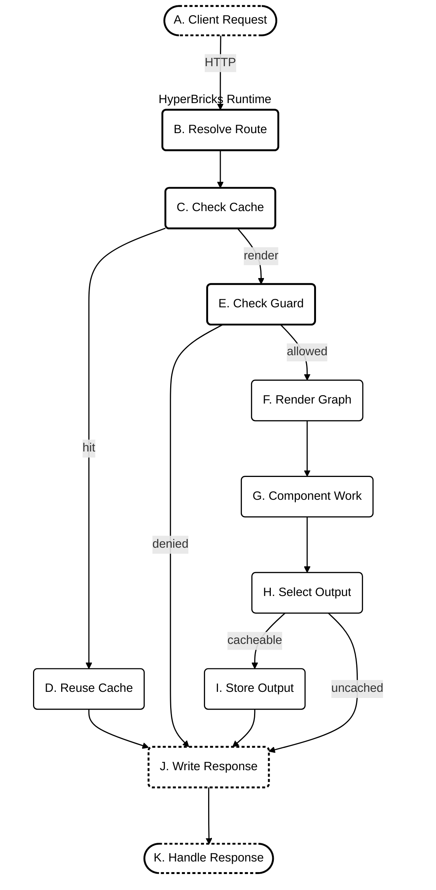

# Introduction

## What is HyperBricks

HyperBricks is a native full-stack build system with an integrated rendering engine for hypermedia web applications.

Applications are assembled from nested component maps described and connected through declarative, YAML-based configuration files. At startup, HyperBricks preloads these configurations. It compiles the output they define at runtime.

HyperBricks processes configuration in three steps:

1. Routes and reusable components are declared in YAML source files.
2. The parser converts the source into configuration maps that preserve component order.
3. The runtime reads those maps, selects the registered components, and renders them.

These declaratively configured components are the building blocks of HyperBricks.

**Leaf** components render their own output. Common examples are:
- `html`,
- `text`,
- `image`,
- `css`,
- `javascript`,
- `json_render`,
- `menu`
- `plugin`

**Composite** components contain or transform other components. Common examples are:

- `tree`
- `template`
- `head`
- `api_render`
- `fragment`
- `hypermedia`.


HyperBricks replaces recurring application orchestration code with declarative component configuration, while the runtime handles component selection, execution, and composition.

The rendering engine runs these components on the server and combines their output into HTML. Their configuration declaratively defines what they render and how they are composed.

The following example defines `page` as a `hypermedia` component with the route `/first`. Its `main` field contains a `tree` component that recursively renders two child components, `html` and `text`, in their configured order.

```yaml
page:
  - type: hypermedia
  - route: first
  - main:
      - type: tree
      - heading:
          - type: html
          - value: <h1>First</h1>
      - copy:
          - type: text
          - value: Second
```

Application-specific backend logic can use native Go plugins through the `plugin` component or JavaScript through the `goja_render` component. Like the built-in components, they are configured and composed declaratively.

The integrated `esbuild` component bundles JavaScript, TypeScript, and CSS and adds `script` or `style` tags for the generated files to the HTML.

## Authoring Format

The components and their children are rendered in order of the sequence in the YAML configuration file. Then the runtime uses that order when rendering tree-like structures. Each entry starts with `-`. This preserves the configured order of component children.

Data fields such as `values` and `headers`, and the module's package settings, use ordinary mappings. See [YAML Usage: Ordered objects and ordinary mappings](YAML_USAGE.md#ordered-objects-and-ordinary-mappings).

## When to use HyperBricks

HyperBricks suits websites and web applications that iterate quickly. Think of projects where the interface needs to evolve independently of business logic, and where new pages, languages, and interactions build on existing structures.

When AI agents contribute to development by using HyperBricks plugins or skills, they work with configuration that describes the application’s structure and composition, keeping architectural decisions explicit rather than buried in generated glue code.

With HyperBricks, server-side domain logic can remain in local or remote APIs, Go plugins, or trusted JavaScript components. A browser library such as HTMX can provide partial page updates, while static HTML can be exported for content rendered in advance.

## Route Owners

Route owners are top-level components that handle requests for a defined URL.

- `hypermedia` renders full HTML documents.
- `fragment` renders partial HTML responses.
- `api_fragment_render` proxies an API request and renders the response as a fragment.

Example full page:

```yaml
page:
  - type: hypermedia
  - route: index
  - title: Welcome
  - main:
      - type: tree
      - hero:
          - type: html
          - value: |
              <main>
                <h1>Hello HyperBricks</h1>
                <p>This page is rendered from YAML.</p>
              </main>
```

Example fragment for optional hypermedia library [HTMX 4](https://four.htmx.org/):

```yaml
status:
  - type: fragment
  - route: fragments/status
  - response:
      headers:
        HX-Retarget: "#status"
        HX-Reswap: outerHTML
  - body:
      - type: html
      - value: |
          <div id="status">Ready</div>
```

This example assumes HTMX is loaded on the page and requests this route. `HX-Retarget` tells HTMX which element to update; `HX-Reswap: outerHTML` tells it to replace that element, including its wrapper.

HyperBricks renders the fragment and sends the configured headers. HTMX interprets those headers in the browser. The `fragment` component itself does not depend on HTMX, and HyperBricks does not add HTMX headers automatically. See [HTTP responses](HTTP_RESPONSES.md) for the shared status and header contract.

## Runtime Request Flow

For an application route, HyperBricks resolves a browser or HTMX request to a route owner. Development mode renders the route fresh. Live mode can return an eligible cached response; all other requests continue through the optional route guard and renderer. The letters connect each step in the diagram to its caption below.



| Node | Caption |
| --- | --- |
| A | A browser, HTMX, or another HTTP client requests an application route. |
| B | HyperBricks matches the request to a route-owning `hypermedia`, `fragment`, or `api_fragment_render` component. |
| C | Development mode always renders the route. In live mode, HyperBricks checks whether it can return cached output. |
| D | On a live-cache hit, HyperBricks returns the stored response without rendering the component graph. |
| E | If configured, the route guard checks access before rendering child components. A denied request goes straight to the response. |
| F | HyperBricks builds the render context and traverses the configured component graph. |
| G | Components perform their configured work, such as rendering templates, calling APIs, running trusted Goja logic, or invoking plugins. |
| H | HyperBricks selects the rendered output or a response captured by a native plugin. |
| I | If the output is eligible for live caching, HyperBricks stores it with its ETag and expiry metadata. |
| J | HyperBricks writes the response status, headers, and body, or flushes the headers before a native plugin streams its response. |
| K | The client handles the response as a document, fragment, other body type, or stream. |

HyperBricks renders tree children concurrently and combines their output in the configured YAML sequence order. This keeps the rendered result in the expected order, while allowing independent child work—such as API calls, scripts, and plugins—to run concurrently.

Nested template values and plugin components can re-enter the same graph. An eligible live-cache hit skips that graph. A native plugin may capture a `HandledResponse`, which the runtime selects after the render call; a `Stream` callback starts only after the response headers are written. See [Routing](ROUTING.md), [Live Mode HTTP Settings](LIVE_MODE_HTTP.md), [Route Guard](ROUTE_GUARD.md), [API Render](API_RENDER.md), and [Plugins](PLUGINS.md) for the detailed rules.


## Templates

Hyperbricks SSR component templates use Go `html/template` with [Sprig functions](https://masterminds.github.io/sprig/). See [Using Sprig functions](YAML_USAGE.md#using-sprig-functions) for examples. Template files can be loaded explicitly through YAML resolvers, or inline content can live directly in the config.

```yaml
card:
  - type: template
  - template:
      file: cards/product.html
  - values:
      title: YAML templates
      body: Template values stay ordinary data.
```

Template syntax is separate from YAML resolver syntax. `{{ .title }}` belongs to Go templates. YAML resolvers are structured YAML nodes such as `file`, `var`, `env`, `format`, and `template.file`.

## Reuse

Reusable objects can live in the same file or be brought in through imports. Inheritance copies the referenced component and then applies local overrides.

```yaml
base_card:
  - type: template
  - template:
      file: cards/simple.html
  - values:
      title: Default title
      body: Default body

page:
  - type: hypermedia
  - route: reuse
  - main:
      - type: tree
      - welcome:
          - inherit: base_card
          - values:
              title: Welcome
              body: This card overrides inherited values.
```

## Runtime Behavior

When an edit introduces an invalid component, HyperBricks aims to render the valid parts and report errors for the broken ones. This supports local development and hosted editing.

The render diagnostics pipeline reports configuration problems so that an invalid component does not need to stop the process.

## Project Layout

A typical module contains:

- `hyperbricks/` for `*.hyperbricks.yaml` source files.
- `templates/` for Go HTML templates.
- `resources/` for source content and images.
- `static/` for files served directly.
- `rendered/` for static output.

HyperBricks automatically loads `*.hyperbricks.yaml` files directly inside the configured `hyperbricks/` directory. It does not scan subdirectories for source files. Load those files through file-level `imports` in a loaded source file; paths are relative to the importing file. See [YAML Usage: Imports](YAML_USAGE.md#imports).

Directory locations and module settings are configured in `package.hyperbricks.yaml`. See [Package Configuration](PACKAGE_CONFIGURATION.md) for the file structure, settings, and defaults, [YAML Usage](YAML_USAGE.md) for the YAML source contract, and [Reference](REFERENCE.md) for generated component fields.

## Glossary

| Term | Meaning |
| --- | --- |
| Module | A folder containing an application. It contains all configuration, plugins, settings, component definitions, templates, and other resources. |
| Component | A configured building block with a task, such as `html`, `template`, or `api_render`. |
| Composite component | A component that contains and renders other components, such as `tree`, `hypermedia`, or `fragment`. |
| Component graph | The connected structure of components that the runtime traverses and renders. |
| Declarative component configuration | YAML that describes which components form an application, their values, and how they are composed, without implementing their orchestration in application code. |
| Runtime | The part of HyperBricks that resolves routes and executes configured components to produce responses. |
| Rendering engine | The runtime subsystem that executes the component graph and combines component output. |
| Application orchestration | The selection, execution, and composition of components required to handle a request and produce output. |
| Route owner | A top-level `hypermedia`, `fragment`, or `api_fragment_render` component with a route that answers an HTTP request. |
| Space source | A named `hypermedia` definition, including one resolved through inheritance, that supplies a page structure and declares editable fields. |
| Space | A YAML instance that inherits a page source and has its own route, title, and values. The development editor edits the fields allowed by that source. |

See [Spaces](SPACES.md) for source-owned editing and [Routing](ROUTING.md) for route owners.

## Next Steps

- [Quickstart](QUICKSTART.md) creates a working YAML module.
- [Package Configuration](PACKAGE_CONFIGURATION.md) explains module settings, defaults, and directory layout.
- [Routing](ROUTING.md) explains route owners and URL matching.
- [YAML Usage](YAML_USAGE.md) documents the YAML syntax and resolvers.
- [Reference](REFERENCE.md) lists runtime component fields.
- [Route Guard](ROUTE_GUARD.md) documents request-time authorization.
- [Troubleshooting](TROUBLESHOOTING.md): find and resolve configuration and render errors.
- [Migration Guide](MIGRATION.md): update older response and API authentication settings.
