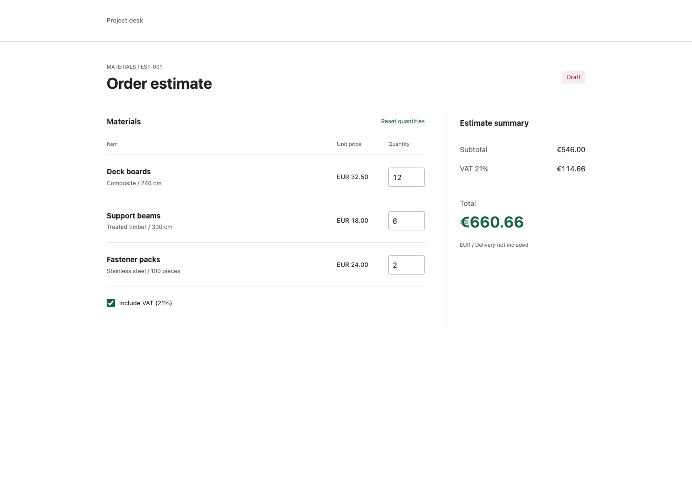
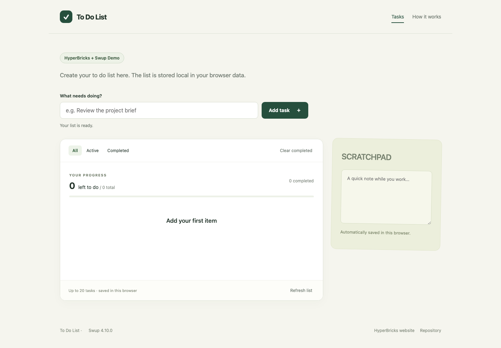
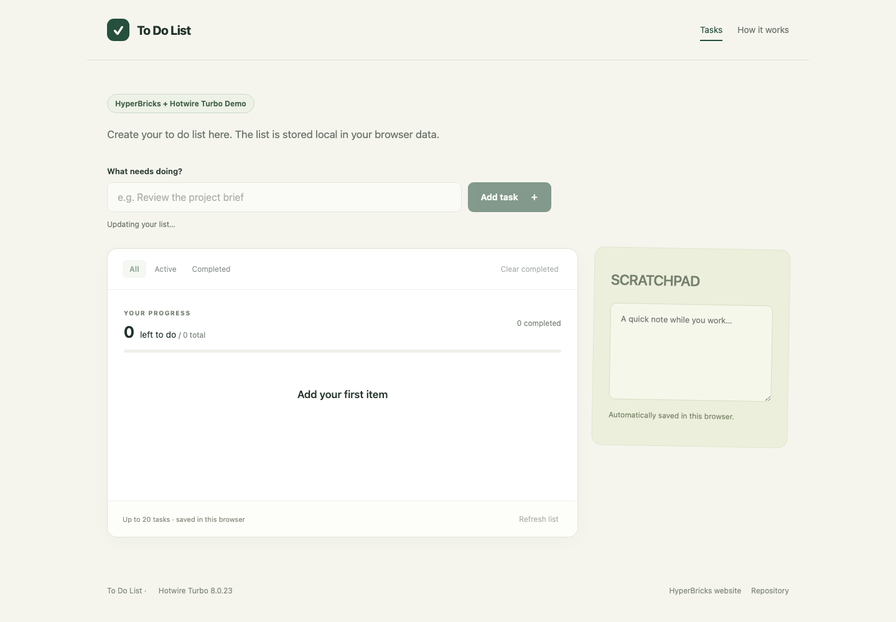
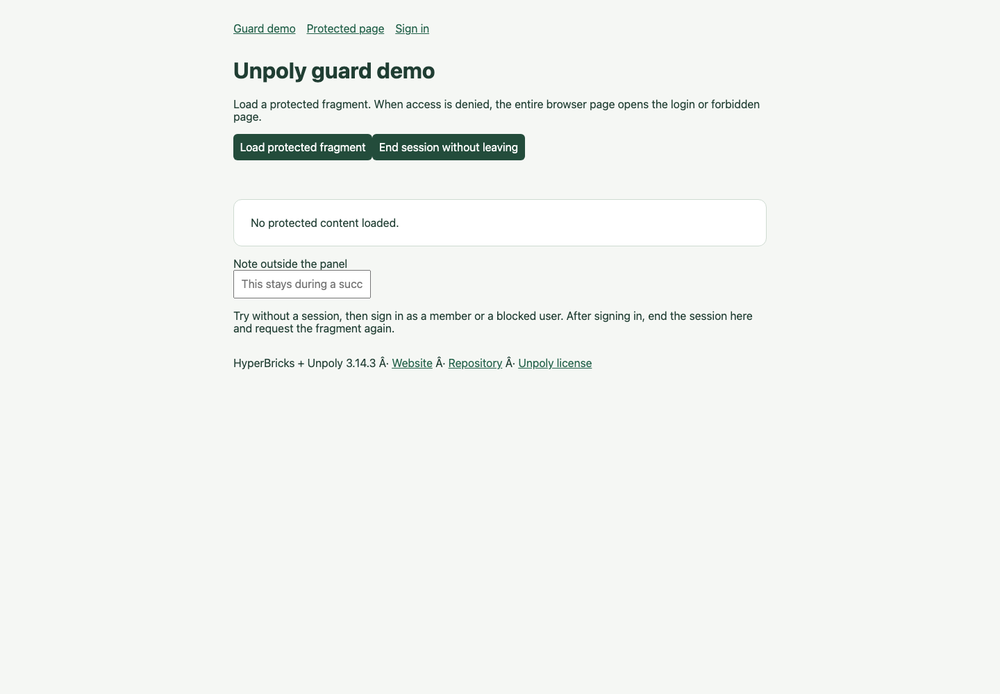

# HyperBricks modules

This directory contains runnable examples, learning applications, frontend
integrations, and fixtures used to verify HyperBricks itself. Start a module from
the repository root with:

```sh
hyperbricks start -m <module-name>
```

Some modules need a plugin build, an external service, or another preparation
step. Follow the module's own README when it has one. The optional
[`start --with-processes` workflow](../docs/DEVELOPMENT_HOOKS.md) can manage
local services for modules that declare them.

Repository maintainers can use the centralized [plugin build and smoke
scripts](../scripts/plugins/README.md) to rebuild the source-matched plugin set
against the current checkout.


## Module index

### Starter modules

These modules are listed in the repository's
[`starters.index.json`](../starters.index.json) and can be installed with
`hyperbricks init-starter get <name>`. Follow each module's README for plugin
builds, external services, and startup instructions. Modules with native plugin
names tied to their directory must be installed under their listed names.
The patterns module can install its pinned npm dependencies through the optional
`start --with-processes` hook; its native plugins still need a separate build.

| Module | Category | Description |
| --- | --- | --- |
| [`catalog-store`](catalog-store/) | Learning application | Searchable store with generated product images, HTMX fragments, an in-memory cart, mock checkout, and an API that `start --with-processes` can start and stop with the site. |
| [`neon-pong`](neon-pong/) | Learning application | Self-contained arcade Pong game with solo and two-player modes, drone bonuses, synthesized sound, and native esbuild assets. |
| [`development-hooks-demo`](development-hooks-demo/) | Feature demo | One command prepares data, starts a Python API, waits for readiness, serves a page, verifies its API data, and stops the API on exit. |
| [`esbuild-demo`](esbuild-demo/) | Feature demo | Native esbuild example with TypeScript and CSS imports, copied assets, source maps, fingerprinted output, caching, and development watching. |
| [`goja-render-demo`](goja-render-demo/) | Feature demo | Server-side calculations with `goja_render`, including query validation, resource scripts, request isolation, and development reload behavior. |
| [`hello-world`](hello-world/) | Feature demo | Minimal YAML starter with one Hello World route and no external dependencies. |
| [`sampleapis-coffee-static`](sampleapis-coffee-static/) | Feature demo | Static snapshot example that fetches the public SampleAPIs coffee endpoint through nested `api_render` and exports the rendered result. |
| [`streaming-demo`](streaming-demo/) | Feature demo | Native Go plugin example that streams several HTML progress updates over one response while HTMX swaps the target as chunks arrive. |
| [`navigation-demo-swup`](navigation-demo-swup/) | Frontend integration | Text-only neighbourhood guide whose complete server-rendered pages use Swup for animated navigation and browser-history transitions. |
| [`todo-demo-htmx`](todo-demo-htmx/) | Frontend integration | The Little List todo application using HTMX 4 fragment updates and browser `localStorage`. |
| [`todo-demo-swup`](todo-demo-swup/) | Frontend integration | The same Little List application adapted to Swup, making its navigation and update model directly comparable with the other todo demos. |
| [`todo-demo-turbo`](todo-demo-turbo/) | Frontend integration | The same Little List application adapted to Hotwire Turbo. |
| [`todo-demo-unpoly`](todo-demo-unpoly/) | Frontend integration | The same Little List application adapted to Unpoly. |
| [`unpoly-guard-demo`](unpoly-guard-demo/) | Frontend integration | Protected full-page and fragment routes with an application-owned authentication plugin and Unpoly-enhanced navigation. |
| [`hyperbricks-patterns-yaml`](hyperbricks-patterns-yaml/) | Pattern reference | Runnable patterns for page and fragment composition, menus, section rails, guards, API actions, plugins, HTMX, Unpoly, and rendered Markdown documentation. |

## Screenshots

<p>
  <a href="catalog-store/docs/screenshots/catalog.png"></a>
  <a href="esbuild-demo/docs/screenshots/home.png"></a>
  <a href="navigation-demo-swup/docs/screenshots/home.png"></a>
  <a href="todo-demo-htmx/docs/screenshots/home.png"></a>
  <a href="todo-demo-swup/docs/screenshots/home.png"></a>
  <a href="todo-demo-turbo/docs/screenshots/home.png"></a>
  <a href="todo-demo-unpoly/docs/screenshots/home.png"></a>
  <a href="unpoly-guard-demo/docs/screenshots/home.png"></a>
  <a href="hyperbricks-patterns-yaml/docs/screenshots/docs.png"></a>
</p>


### Fixture modules 

| Module | Category | Description |
| --- | --- | --- |
| [`ssr-proof-hyperbricks`](ssr-proof-hyperbricks/) | Benchmark fixture | Minimal nested SSR workload with request-specific data, health endpoints, cached and raw server profiles, and stable output for throughput and allocation measurements. |
| [`response-cache-test`](response-cache-test/) | Test and benchmark fixture | Memory/disk route policies, expiry, mode bypass, purge, cleanup and packaging checks, plus identical response workloads for the [cache baseline](../benchmarks/response-cache/README.md). |
| [`api-security-test`](api-security-test/) | Test fixture | Explicit upstream credential selection, composed private/public APIs, redirect boundaries, and validated browser-cookie issuance, with a controlled mock API and the security research article. |
| [`development-hooks-plugin-demo`](development-hooks-plugin-demo/) | Test fixture | A before-start hook compiles a native plugin; an after-start check proves the freshly embedded build ID is the one loaded by the runtime. |
| [`headers-test`](headers-test/) | Test fixture | Development-mode half of the header regression fixture, covering configured response headers, cookies, routes, and generated output. |
| [`headers-test-live`](headers-test-live/) | Test fixture | Live-mode counterpart to `headers-test`, used to verify the same response metadata through the production rendering and cache path. |
| [`markers-test`](markers-test/) | Test fixture | Resolver and directory-marker fixture for module, repository, resource, template, static, and HyperBricks paths. |
| [`project-lifecycle-test`](project-lifecycle-test/) | Test fixture | End-to-end project lifecycle fixture covering development and production rendering, fragments, assets, Goja, APIs, guards, native plugins, static export, and runtime archives. |
| [`static-paths-demo`](static-paths-demo/) | Test fixture | Demonstrates module-relative and repository-root static directories while proving that public asset URLs remain rooted at `/static/`. |
| [`yaml-nested-inheritance-test`](yaml-nested-inheritance-test/) | Test fixture | Runnable YAML inheritance regression covering same-named child replacement, recursive value-map overrides, ordinary deep merges, multi-hop and deep dotted references, and preservation of unrelated inherited siblings. |
| [`yaml-invalid-source`](yaml-invalid-source/) | Test fixture | Deliberately malformed YAML beside valid routes, used to verify source diagnostics, partial initialization, and development error reporting. |
| [`self-closing-tag`](self-closing-tag/) | Verification fixture | Small image-rendering fixture used for manually checking generated image markup and the `self_closing_tags` server option. |
| [`wasm-plugin-test`](wasm-plugin-test/) | Verification fixture | Manual WebAssembly plugin compatibility fixture that renders Markdown and a card through two WASM components. |


## Categories

| Category | Purpose |
| --- | --- |
| Learning application | A guided application intended for learning HyperBricks. |
| Pattern reference | Small, reusable examples of recommended application structures. |
| Feature demo | A focused demonstration of a HyperBricks runtime or build feature. |
| Frontend integration | A HyperBricks application integrated with a browser-side navigation or hypermedia library. |
| Test fixture | Input owned by an automated repository test or test script. |
| Verification fixture | A module kept for targeted or manual compatibility checks. |
| Benchmark fixture | A stable workload used by performance tests. |
