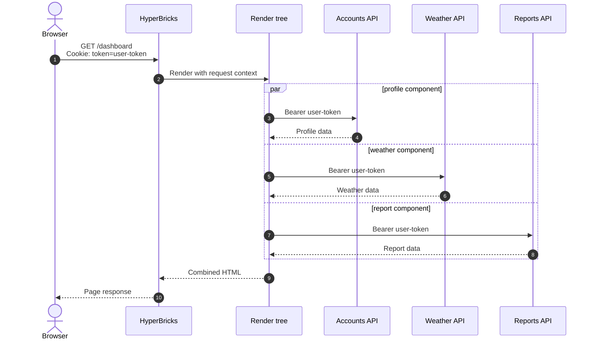

# When One Browser Cookie Becomes Many Upstream Credentials

## Cookie boundaries, API composition, and explicit trust in HyperBricks

**Security research and implementation record — 11 September 2026**

> **Reading guide:** Sections 1–22 preserve the investigation of the implementation **before this refactor**. In those sections, “current”, “currently”, and “proposed” refer to that research baseline, not the updated runtime. Section 23 records the implemented contract. Use [API Render](../../../docs/API_RENDER.md) and the [fixture README](../README.md) for current configuration and runnable verification. The historical insecure snippets are included to explain the cause, not as recommended configuration.

The runtime now requires explicit per-component cookie selection, rejects ambiguous authentication, confines redirects to the configured origin, uses no upstream cookie jar, and validates response cookies before issuance. The fixture contains the complete research record so the reasons for these boundaries remain beside their executable tests.

HyperBricks can render one page from several API-backed components. That is one of the strengths of a compositional server-side renderer: a page can ask an account service for a profile, a catalog service for products, and a public service for supplementary data, then combine those responses into one HTML document.

That composition also creates a security boundary that must be visible in the configuration. At present, both `API_RENDER` and `API_FRAGMENT_RENDER` look for a browser cookie named exactly `token`. When the cookie has a non-empty value in the inspected worktree, the renderer copies that value into an outgoing `Authorization: Bearer ...` header. One page request containing several nested `API_RENDER` components can therefore cause the same bearer credential to be sent to several API endpoints. `API_FRAGMENT_RENDER` contains the same bridge but normally owns a top-level route, so several fragments are ordinarily several browser requests rather than one page-render fan-out.

The browser is not sending its cookie to those API domains. It sends the cookie only to HyperBricks according to the browser's cookie rules. HyperBricks then performs a separate, server-side credential translation:

```text
incoming Cookie: token=SECRET
                ↓
HyperBricks reads SECRET
                ↓
outgoing Authorization: Bearer SECRET
```

Once the value has crossed that bridge, the cookie's `Domain`, `Path`, `Secure`, `HttpOnly`, and `SameSite` attributes no longer travel with it. The new server-to-server requests are governed by HyperBricks and Go's HTTP client, not by the browser's cookie policy.

This makes the central conclusion straightforward:

> Every upstream API that receives a browser-derived bearer token is a credential recipient and must be an explicitly approved recipient for that token.

The current implementation makes that approval implicit. The configuration names an endpoint, but does not state whether the endpoint may receive the user's token. A per-component `forwardtoken` string can make both the decision and the credential source reviewable: `forwardtoken: account_session` means that this component may use the incoming cookie named `account_session` as its Bearer token. Omitting the field leaves its string value empty and disables browser-token forwarding.

This article describes the complete flow, distinguishes the several cookie mechanisms involved, shows where multiple API components matter, assesses realistic threats, and proposes a migration that fits HyperBricks' declarative model.

---

## 1. The short answer

Suppose the browser requests an authenticated dashboard:

```http
GET /dashboard HTTP/1.1
Host: app.example.test
Cookie: token=user-token; preferences=dark; csrf=abc123
```

The page contains three API-backed components:

```text
profile component   → https://accounts.internal.test/me
weather component   → https://weather.example.net/today
analytics component → https://reports.vendor.test/summary
```

Under the current implementation, if all three components execute, their initial upstream requests can be:

```http
GET /me HTTP/1.1
Host: accounts.internal.test
Authorization: Bearer user-token
```

```http
GET /today HTTP/1.1
Host: weather.example.net
Authorization: Bearer user-token
```

```http
GET /summary HTTP/1.1
Host: reports.vendor.test
Authorization: Bearer user-token
```

Only the cookie named `token` participates in this automatic behavior. The `preferences` and `csrf` cookies are ignored by the API renderers. It is therefore more accurate to describe the problem as **one selected credential being copied to multiple recipients**, rather than multiple browser cookies being spread across multiple APIs.

If the browser has several credentials with different names, such as `crm_token` and `billing_token`, the current automatic bridge does not map them to separate API components. That kind of mapping would require explicit configuration and should never be inferred from the presence of arbitrary cookies.

---

## 2. Three flows that must not be confused

There are three independent cookie and credential flows in this system.

### Flow A: the browser sends cookies to HyperBricks

The browser owns its cookie store. It decides which cookies to attach to the request for `app.example.test` by evaluating their host or domain, path, secure-channel requirement, SameSite rules, expiration, and other browser policy.

```text
Browser cookie store
        │ browser applies cookie rules
        ▼
HyperBricks request
Cookie: token=...
```

### Flow B: HyperBricks creates an upstream authorization header

HyperBricks receives the browser request, extracts the value of the cookie named `token`, and writes that value into a newly created API request:

```text
HyperBricks request context
Cookie("token")
        │ application copies value
        ▼
API request
Authorization: Bearer ...
```

This is an application-level credential delegation. Browser cookie attributes do not govern it.

### Flow C: an upstream API sets cookies in a temporary Go cookie jar

Each API call currently creates a new Go `http.Client` with a new in-memory cookie jar. If an upstream response contains `Set-Cookie`, that jar can store the cookie and apply it to a matching request later in the same redirect chain.

```text
API response
Set-Cookie: upstream_session=...
        │ stored in this component's temporary jar
        ▼
matching redirect request from the same HTTP client
Cookie: upstream_session=...
```

That jar is not the browser's jar. It is not shared with sibling API components, and its contents are not automatically returned to the browser. When the API call finishes, the client and jar become unreachable and can later be reclaimed by Go's garbage collector; there is no persistent application-level jar carrying that state into a sibling component.

Keeping these flows separate prevents several wrong conclusions:

- Browser cookie scoping does not constrain Flow B after HyperBricks has extracted the value.
- A fresh jar in Flow C does not stop Flow B; it manages a different set of cookies.
- `setcookie` and `setcookies` on `API_FRAGMENT_RENDER` explicitly create browser response headers. They are not the automatic reverse of Flow C.
- `HttpOnly` stops browser-side JavaScript from reading a cookie. It does not stop the receiving HyperBricks server from reading it.
- HTTPS protects a credential in transit. It does not decide whether the destination should receive the credential.

---

## 3. What a cookie is actually bound to

It is common to say that cookies are bound to a domain. That is directionally useful, but incomplete. Cookie scope differs from the web's origin model.

A web origin is based on **scheme, host, and port**. Cookie selection is primarily based on **host or Domain, Path, and Secure state**. Cookies do not provide isolation by port. Two services on `app.example.test:8080` and `app.example.test:9090` can receive the same matching cookie. [RFC 6265 explicitly warns that cookies do not isolate services by port](https://www.rfc-editor.org/rfc/rfc6265.html#section-8.5).

The practical browser attributes are:

| Attribute or property | What the browser enforces | Does it constrain the copied bearer token? |
|---|---|---|
| Host-only cookie | Without `Domain`, the browser returns the cookie only to the host that set it. | No. HyperBricks can copy the value to any configured endpoint. |
| `Domain` | Allows the named domain and matching subdomains to receive the cookie. | No. It is not present in the incoming `Cookie` header. |
| `Path` | Filters browser requests by URL path. | No. It is not a reliable security boundary and is not attached to the copied value. |
| `Secure` | Limits browser transmission to secure channels. | No. HyperBricks must independently require HTTPS for upstream credentials. |
| `HttpOnly` | Prevents non-HTTP browser APIs such as `document.cookie` from reading it. | No. The HyperBricks HTTP server receives it normally. |
| `SameSite` | Controls whether the browser attaches the cookie in cross-site request contexts. | No. It does not govern later server-to-server calls. |
| Port | Cookies have no port-isolation property. | No. Port must be checked separately when authorizing an upstream destination. |

The browser returns a compact header containing name/value pairs:

```http
Cookie: token=user-token; preferences=dark; csrf=abc123
```

It does not send this metadata back:

```text
token was HostOnly
token had Path=/
token was Secure
token was HttpOnly
token was SameSite=Lax
```

The cookie standard defines that asymmetry deliberately: attributes are instructions stored by the user agent, while the request's `Cookie` header carries only the selected names and values. See [RFC 6265, sections 4.1.2 and 4.2.2](https://www.rfc-editor.org/rfc/rfc6265.html#section-4.2.2) and the current [6265bis request-cookie definition](https://httpwg.org/http-extensions/draft-ietf-httpbis-rfc6265bis.html#section-4.2.2).

Consequently, after HyperBricks receives `token=user-token`, it cannot inspect that header and reconstruct the cookie's original security attributes. It has the credential value, the incoming request URL, and the configured API endpoint. The decision to send the value elsewhere must therefore be explicit application policy.

### `Secure`, `HttpOnly`, and `SameSite` still matter

This finding does not make those attributes unimportant. They defend the browser-to-HyperBricks leg:

- `Secure` protects against cleartext browser transmission.
- `HttpOnly` reduces credential theft through browser script execution.
- `SameSite` helps control cross-site request contexts and is useful as a CSRF defense.
- A narrow host and path scope reduces where the browser sends the cookie.

OWASP recommends narrow cookie scope and warns against mixing applications with different trust levels on the same domain. See the [OWASP Session Management Cheat Sheet](https://cheatsheetseries.owasp.org/cheatsheets/Session_Management_Cheat_Sheet.html#domain-and-path-attributes).

These properties protect Flow A. HyperBricks still needs a policy for Flow B.

---

## 4. What HyperBricks currently does

The current request path is concrete and short.

### 4.1 The incoming request enters the render context

The HTTP server stores the original `*http.Request` in the render context before invoking the route's render plan. See [`server_serve_content.go`](../../../cmd/hyperbricks/server_serve_content.go).

Every nested renderer invoked with that context can therefore inspect the same incoming request, including its cookies.

### 4.2 Each API renderer creates its own outgoing request

`API_RENDER` parses its configured endpoint, adds approved incoming query parameters and configured query parameters, creates a new `http.Request`, and applies configured headers. It then performs this automatic bridge:

```go
if tokenCookie, err := clientReq.Cookie("token"); err == nil && tokenCookie.Value != "" {
    req.Header.Set("Authorization", "Bearer "+tokenCookie.Value)
}
```

See [`pkg/component/api_render.go`](../../../pkg/component/api_render.go).

`API_FRAGMENT_RENDER` contains the same behavior. See [`pkg/composite/api_fragment_render.go`](../../../pkg/composite/api_fragment_render.go).

No comparison is made between:

- the incoming request host and the configured endpoint host;
- the cookie's intended audience and the API's identity;
- an internal service and a third-party service;
- HTTPS and HTTP endpoints;
- one API component and another API component on the same page.

The endpoint is configuration-controlled, which prevents this from being a general claim that any remote caller can choose the destination. The concern is that credential delegation is implicit whenever a configured API component happens to execute during a request containing `token`.

### 4.3 Current authorization precedence

The effective upstream `Authorization` source is currently:

1. A generated JWT when `jwtsecret` is non-empty.
2. Basic Auth when both `username` and `password` are non-empty.
3. The non-empty incoming cookie named exactly `token`, formatted as `Bearer <value>`.
4. A configured `headers.Authorization` value.
5. Basic Auth derived by Go from user information embedded in the endpoint URL, but only when no preceding source produced a non-empty `Authorization` value.
6. No `Authorization` header.

The implementation first applies configured headers, then the incoming token, then JWT or complete Basic credentials. Later writes replace earlier ones.

The URL-user-information case is supplied later by Go's HTTP client rather than by the renderer's assignment block. Embedding credentials in endpoint URLs should be rejected by validation; it is easy to overlook, can expose credentials in configuration and diagnostics, and makes the apparent precedence incomplete.

An incoming browser `Authorization` header is not copied automatically. Only the cookie named `token` receives this special treatment.

This precedence has two implications:

- Setting `headers.Authorization` does not stop the browser token from replacing it when a `token` cookie is present.
- Setting complete Basic credentials or `jwtsecret` prevents the browser token from being the final upstream credential because those sources overwrite it.

The inspected worktree documents that behavior and adds a full precedence test matrix. Those changes were not committed at the time of this article's snapshot, and documentation alone does not make the implicit bridge safe.

### 4.4 “Every component” means every component that executes

`API_RENDER` has no separate upstream-response cache. It makes its API request whenever its renderer executes. Its parent route may own rendered-output caching; a parent cache hit can therefore skip the nested renderer and its API request entirely.

`API_FRAGMENT_RENDER` owns a route and forces rendered-output caching off. Invoking that fragment route produces a fresh upstream request.

Both renderers currently create the outgoing request with `http.NewRequest` rather than `http.NewRequestWithContext`. The API call does not inherit cancellation from the incoming browser request and can continue after the browser disconnects, up to the HTTP client's ten-second timeout. This is primarily an availability and lifecycle concern, but it matters when determining how long a credential-bearing request can remain active.

The precise statement is:

> Every executing API renderer that reaches its upstream request construction can copy the same incoming `token` value, unless a higher-priority authentication source replaces it.

It would be inaccurate to say that every API is called on every browser request without considering parent caching.

### 4.5 Route-guard authorization is another upstream recipient

A guarded route can call a configured authorization endpoint before the render graph starts. The guard may resolve its token from a specifically named cookie or an incoming header, and it sends that value as Bearer unless the guard's authorize request already has an explicit `Authorization` header. See [`server_serve_content.go`](../../../cmd/hyperbricks/server_serve_content.go) and the authorize request at [`server_serve_content.go`](../../../cmd/hyperbricks/server_serve_content.go).

One browser request can therefore contact:

```text
1. the route guard's explicit authorization endpoint
2. each nested API_RENDER endpoint executed after guard success
```

These are separate policies. The proposed `forwardtoken` field should govern only the named incoming cookie on that nested API component. It must not silently reuse a guard token that came from another cookie or an incoming header. Endpoint inventories and redirect hardening should include guard authorization calls as credential-bearing upstream requests in their own right.

---

## 5. How one page can send the token to several endpoints

A simplified HyperBricks page can compose several API renderers in a tree:

```yaml
dashboard:
  - type: hypermedia
  - route: dashboard
  - title: Account dashboard
  - body:
      - type: tree

      - profile:
          - type: api_render
          - endpoint: https://accounts.internal.test/me
          - method: GET
          - inline: '<section>{{.Data.name}}</section>'

      - weather:
          - type: api_render
          - endpoint: https://weather.example.net/today
          - method: GET
          - inline: '<section>{{.Data.summary}}</section>'

      - report:
          - type: api_render
          - endpoint: https://reports.vendor.test/summary
          - method: GET
          - inline: '<section>{{.Data.total}}</section>'
```

The exact page fields can vary with the surrounding composition, but the security property does not: all three nested renderers receive the same render context.

`<TREE>` renders sibling components in goroutines and waits for all results before concatenating their output. See [`pkg/composite/tree.go`](../../../pkg/composite/tree.go). In this example, the three API requests can run concurrently. Components embedded as template values are rendered in a deterministic loop and can run sequentially instead. Every component-valued template entry is rendered before the final template executes, even when that template never references the corresponding value. An apparently unused API value can therefore still make its request and receive the token.

Tree siblings are all launched before their results are collected. One sibling failing does not prevent the others from making their upstream calls. Concurrency changes timing, not authorization: each renderer reads the same incoming request and independently copies the same `token` value.



This is a server-side request fan-out. The browser made one request to one host. HyperBricks made three new requests to three recipients.

The incoming cookie header is immutable request metadata and can be read by all siblings. The copied request body has a different implementation: the current render context holds one shared `io.ReadCloser`, while each API renderer reads and closes it. Multiple API components executing concurrently for one POST, PUT, or DELETE request can therefore race to consume the body. Token fan-out remains reliable, but body fan-out does not. This is a separate correctness and security-review item; a future fix should store immutable body bytes or provide each renderer with a fresh reader.

Composition makes the issue more important, not because composition is unsafe, but because reuse can hide information flow. A developer can add a harmless public-data component to an authenticated page without realizing that the component inherits access to the incoming `token`. The endpoint appears in configuration, while the credential transfer does not.

The declarative model should expose both parts:

```text
where does this component call?
which credential, if any, may it send there?
```

---

## 6. What happens when the browser sends multiple cookies

Most authenticated requests contain several cookies. A browser could send:

```http
Cookie: token=user-token; csrf=abc123; preferences=dark; experiment=B
```

Current API renderer behavior is:

| Incoming cookie | Automatic upstream result |
|---|---|
| `token=user-token` | `Authorization: Bearer user-token` |
| `csrf=abc123` | Ignored |
| `preferences=dark` | Ignored |
| `experiment=B` | Ignored |

If a page invokes four API renderers, the result is not one cookie per API. It is the same selected token for up to four APIs.

### Separate credentials for separate APIs

Some applications genuinely use several credentials:

```http
Cookie: crm_token=crm-value; billing_token=billing-value
```

A secure system must know which credential belongs to which resource server:

```text
CRM component     → crm_token     → crm.example.test
Billing component → billing_token → billing.example.test
```

HyperBricks does not currently implement this mapping. Generalizing the present behavior to forward every cookie would be dangerous: preferences, CSRF tokens, session identifiers, feature assignments, and unrelated application state would all become candidates for disclosure.

If per-resource browser credentials are ever supported, they should be named explicitly in a mutually exclusive authentication configuration, for example:

```yaml
- auth:
    source: request_cookie
    cookie: crm_token
    scheme: Bearer
```

The endpoint itself must still be an approved recipient. Naming a cookie is not enough.

### Duplicate cookies with the same name

Browsers can hold cookies with the same name under different path or domain scopes. A request can consequently contain more than one `token` pair:

```http
Cookie: token=path-specific; token=host-wide
```

The request header does not say which value came from which stored scope. Go's `http.Request.Cookie("token")` returns the first matching parsed cookie. See the official [`Request.Cookie` documentation](https://pkg.go.dev/net/http@go1.26.1#Request.Cookie) and implementation. That means the current bridge cannot reliably express component ownership or intended audience when duplicate cookie names exist.

Applications should avoid using the same security-sensitive cookie name for different logical credentials on one host. A future explicit auth configuration should also reject or clearly diagnose ambiguous duplicate credential cookies rather than silently choosing one.

---

## 7. `setcookies` is a separate, explicit response mechanism

`API_FRAGMENT_RENDER` can deliberately create one or more `Set-Cookie` headers for the browser by rendering configured templates against successful upstream response data:

```yaml
login_action:
  - type: api_fragment_render
  - route: actions/login
  - endpoint: https://identity.internal.test/login
  - method: POST
  - setcookies:
      - 'account_session={{.Data.token}}; Path=/; HttpOnly; Secure; SameSite=Lax'
  - template:
      file: login-result.html
```

In this expression, three names have separate meanings:

```text
account_session = {{.Data.token}}
│                   │     └─ key in the decoded upstream JSON object
│                   └────── entire decoded upstream response
└────────────────────────── browser cookie name
```

For an upstream JSON response such as:

```json
{
  "token": "eyJhbGciOi..."
}
```

`.Data` is the decoded object and `.Data.token` resolves its `token` field. The left side, `account_session=`, determines the cookie name stored by the browser. A later API component that is allowed to use that credential names the browser cookie, not the JSON field:

```yaml
profile:
  - type: api_render
  - endpoint: https://accounts.internal.test/me
  - method: GET
  - forwardtoken: account_session
```

The names can also be identical:

```yaml
- setcookies:
    - 'token={{.Data.token}}; Path=/; HttpOnly; Secure; SameSite=Lax'

# On a later component:
- forwardtoken: token
```

The identical spelling is a convention, not an automatic relationship. HyperBricks should not infer `forwardtoken` from a `setcookies` template. The new response cookie also cannot feed a sibling API component during the same render: the browser must first receive the response, store the cookie, and send it on a later matching request.

### Current response-cookie behavior

On any 2xx upstream status, the current renderer independently renders every configured cookie template and immediately adds each successful result as a `Set-Cookie` header. See [`pkg/composite/api_fragment_render.go`](../../../pkg/composite/api_fragment_render.go). Cookie templates use the generic `html/template` renderer without `missingkey=error`, even though the output is an HTTP header rather than HTML. The rendered header is not parsed or validated first.

This creates several edge cases:

- A missing map key in `token={{.Data.token}}` silently renders as `token=` without a template error.
- An existing but empty token produces the same output, so absence, empty value, and an intended deletion are not distinguished.
- HTML escaping changes opaque credential values: for example, `abc+def` becomes `abc&#43;def` and `abc&def` becomes `abc&amp;def`.
- A malformed cookie header can be added without structural validation.
- One cookie can be added before a later cookie template fails, producing a partial multi-cookie update.
- The fallback response decoder can discard a decode error and return a nil result with a 2xx status, which still reaches cookie rendering.
- Configured `values` are merged after `Data` and `Status`, so those reserved context names can currently be overwritten.

Those behaviors should not be part of the final security contract.

### Proposed issuance contract

Credential-cookie emission should be a validate-then-commit operation:

```text
1. Receive the final upstream response.
2. Require a 2xx status.
3. Require successful response processing and preserve any decode error; an intentionally bodyless `204` is a valid success.
4. Render the page/fragment and every cookie template before mutating response headers.
5. Render cookie templates through a header-specific `text/template` path with missing map keys treated as errors; reserve `Data` and `Status`.
6. Trim each rendered cookie line.
7. Skip an intentionally blank template result.
8. Reject CR, LF, NUL, malformed syntax, and unparsed attributes.
9. Validate cookie names, values, attributes, and credential policy.
10. Add all validated Set-Cookie headers together.
```

No cookie header should be added if a required response field is missing, template execution fails, cookie syntax is invalid, or another cookie in the same atomic group fails validation. This avoids a browser receiving half of a login or token-rotation update.

Go provides `http.ParseSetCookie` and `Cookie.Valid`, but they are not the complete policy. The implementation must also reject raw control characters and unexpected `Cookie.Unparsed` attributes before serializing the accepted cookie with `Cookie.String()`. It must validate `SameSite=None` with `Secure`, `__Host-` and `__Secure-` prefix rules, and any Domain policy HyperBricks chooses to support. A parser can accept unknown attributes for compatibility; a security-sensitive renderer should not silently preserve ambiguous input. Strictly rejecting `Unparsed` means that a newer attribute such as `Priority` needs explicit runtime support before configuration can use it.

Validation of the final raw string still cannot prove which attributes came from configuration and which were injected through a dynamic value. If an upstream value contains a semicolon, for example, it can turn the remainder into cookie attributes before a structurally valid parse. The stronger final representation is therefore structured configuration in which response data can fill only the value:

```yaml
- setcookies:
    - name: account_session
      value: '{{.Data.token}}'
      path: /
      http_only: true
      secure: true
      same_site: lax
```

HyperBricks can validate the dynamic value as a cookie value, validate every attribute independently, construct `http.Cookie`, call `Valid`, and serialize it with `String`. Existing raw-string syntax can remain as a compatibility form, but it should use the strict validate-then-commit path and be documented as less strongly typed.

For a credential that is being issued, the resolved value must be a non-empty string. Missing, null, empty, and non-string token fields should be errors and must not be interpreted as logout. Deletion must be explicit:

```yaml
logout_action:
  - type: api_fragment_render
  - route: actions/logout
  - endpoint: https://identity.internal.test/logout
  - method: POST
  - setcookies:
      - 'account_session=; Path=/; HttpOnly; Secure; SameSite=Lax; Max-Age=0'
```

The deletion cookie must use the same name, Path, and Domain scope as the cookie that was issued. A host-only credential cookie should normally be deleted without adding a Domain attribute.

For cookies later named by `forwardtoken`, the recommended production attributes are:

- host-only scope by omitting `Domain`;
- `Secure`;
- `HttpOnly`;
- `SameSite=Lax` or `SameSite=Strict`, according to the application flow;
- the narrowest practical `Path`;
- a deliberate lifetime and rotation policy.

Those requirements apply to credential cookies. HyperBricks may also set non-sensitive preference cookies, so the generic `setcookies` feature cannot assume that every emitted cookie must be `HttpOnly` or site-wide. A future typed credential-cookie configuration could enforce stronger rules than the current raw header template.

This is explicit and route-specific. It does not mean that only the login fragment can later see or forward the cookie. Once stored with `Path=/`, the browser sends it on matching requests to the HyperBricks host. A later page render can contain unrelated `API_RENDER` components, and the current automatic bridge will copy the token to each of those executing components.

The lifecycle can therefore be:

```text
1. POST /actions/login
2. API_FRAGMENT_RENDER calls identity service
3. Explicit setcookies stores account_session in browser
4. Browser later requests /dashboard with account_session
5. Dashboard executes multiple API_RENDER components
6. Proposed forwardtoken allows selected components to copy account_session
```

The component that created a cookie does not own it. Browser cookie scope governs which HyperBricks requests carry it; HyperBricks configuration must govern which upstreams may receive its value.

---

## 8. Why the fresh cookie jar does not prevent this

HyperBricks creates an HTTP client for each API call through `apiutil.NewHTTPClient()`:

```go
func NewHTTPClient() *http.Client {
    jar, _ := cookiejar.New(nil)
    return &http.Client{
        Timeout:   10 * time.Second,
        Transport: sharedTransport,
        Jar:       jar,
    }
}
```

See [`pkg/shared/apiutil/apiutil.go`](../../../pkg/shared/apiutil/apiutil.go).

The new jar provides isolation between component calls:

- API A's response cookies are not stored in API B's jar.
- API A's response cookies are not stored in a global HyperBricks jar.
- API A's response cookies are not automatically copied to the browser.
- The shared HTTP transport pools network connections; it does not share cookie state.

This is useful isolation. It does not affect the incoming-token bridge because HyperBricks sets `Authorization` directly on the initial request before `client.Do(req)`.

### Cookies within a redirect chain

The temporary jar is still active during redirects followed by that one client. Go updates the jar from each response and consults it for each subsequent redirect request. An upstream can therefore set a cookie that participates in later requests within the same component call.

That may be necessary for an API whose redirect flow uses cookies. If HyperBricks does not support or need that behavior, omitting the jar is a smaller and safer surface. Go's `http.Client` sends no automatically managed cookies when `Jar` is nil.

### The current public-suffix issue

The jar is currently created with `cookiejar.New(nil)`. Go documents a nil `PublicSuffixList` as valid for testing but **not secure** for production. Without a public-suffix list, a service such as `foo.co.uk` can set a cookie with scope that reaches `bar.co.uk`. See the official [`cookiejar.Options` documentation](https://pkg.go.dev/net/http/cookiejar@go1.26.1#Options).

If upstream cookie continuity is required, the production jar should use the public suffix list:

```go
jar, err := cookiejar.New(&cookiejar.Options{
    PublicSuffixList: publicsuffix.List,
})
```

If it is not required, `Jar: nil` avoids accepting upstream cookies at all.

This is a separate finding from browser-token forwarding. Both affect an API call's credential boundary, so both should be addressed in the same security pass.

---

## 9. Redirects expand the meaning of “recipient”

An API component authorizes an initial endpoint in configuration. The HTTP client may then follow a redirect to another URL.

Go treats `Authorization`, `Cookie`, and related headers as sensitive when copying initial headers to redirects. Its default rule strips them when the redirect target's hostname is unrelated, but retains them for the same hostname and its subdomains. See the [`http.Client` documentation](https://pkg.go.dev/net/http@go1.26.1#Client) and the [Go client implementation](https://cs.opensource.google/go/go/+/refs/tags/go1.26.1:src/net/http/client.go).

The decision is based on hostname relationships. Scheme and port are not part of the sensitive-header comparison. Consequently, these transitions can retain the initial bearer header under Go's default behavior:

```text
https://api.example.test
    → https://child.api.example.test     retained
    → https://api.example.test:8443      retained
    → http://api.example.test            can be retained
```

This unrelated-host transition drops it:

```text
https://api.example.test
    → https://different.example.net      stripped
```

That protection covers only the header names Go classifies as sensitive: `Authorization`, `Cookie`, `Cookie2`, `WWW-Authenticate`, `Proxy-Authorization`, and `Proxy-Authenticate`. Other configured secrets such as `X-API-Key`, `X-Auth-Token`, or vendor-specific credential headers are copied to redirected requests even when the hostname is unrelated. HyperBricks therefore cannot base its complete redirect policy only on Go's special handling for `Authorization`.

The default is useful defense in depth, but it is not a complete policy for HyperBricks. If `forwardtoken: account_session` means “this exact upstream may receive the value of the `account_session` cookie,” a redirect should not silently broaden that permission to:

- a subdomain with a different operator;
- another port hosting a different service;
- an HTTP endpoint after an HTTPS downgrade;
- any destination outside an explicit allowlist.

A credential-aware client should compare each redirect target with the approved destination using at least:

```text
scheme + canonical hostname + effective port
```

The safest default is to reject a credential-bearing redirect when any of those values changes. “Credential-bearing” must cover every known authentication source and configured secret header, not only the incoming browser token. Applications that require a known redirect can explicitly allow the final origin or disable automatic redirects and model the final endpoint directly.

[RFC 9110 section 15.4](https://www.rfc-editor.org/rfc/rfc9110.html#section-15.4) advises clients to remove sensitive fields such as `Authorization` and `Cookie` when automatically following redirects where retaining them has security implications.

---

## 10. Why HTTPS is necessary but insufficient

HTTPS answers this question:

> Can an intermediary read or alter this credential while it travels to the endpoint?

It does not answer:

> Is this endpoint entitled to receive this credential?

If HyperBricks sends a token over HTTPS to a third-party public API, the network path is protected but the third party receives the plaintext bearer value at its TLS endpoint. It may reject the header, ignore it, store it in access logs, include it in traces, or expose it through a compromised system.

TLS is mandatory for bearer tokens. [RFC 6750 requires transport security](https://www.rfc-editor.org/rfc/rfc6750.html#section-5.3). Explicit recipient authorization is an additional control.

### CORS and CSP do not constrain this leg

Cross-Origin Resource Sharing and browser Content Security Policy govern browser behavior. In Flow B, HyperBricks is the HTTP client. It does not need browser CORS permission to contact another origin, and a page's CSP does not prevent the Go process from sending the request. The controls for this leg are server-side configuration validation, explicit credential policy, network policy, TLS, redirect rules, and recipient-side token validation.

---

## 11. Why bearer tokens demand a recipient decision

A bearer token grants authority through possession. The receiver generally does not need to prove that it is the party to which the user originally gave the token; it only needs a token accepted by the resource server. [RFC 6750 defines this property](https://www.rfc-editor.org/rfc/rfc6750.html#section-1.2) and lists token disclosure and token redirect among its threats.

The impact of sending a token to the wrong endpoint depends on the token design.

### Audience-restricted access token

A JWT with an `aud` claim restricted to `accounts.internal.test`, and an accounts service that validates that claim, should be rejected by another resource server. That limits direct replay.

The disclosure still occurred. The recipient can retain the token, inspect unencrypted claims, correlate the user, exploit another service that fails to validate the audience, or benefit from future configuration mistakes.

[RFC 8707](https://www.rfc-editor.org/rfc/rfc8707.html) describes resource indicators and audience-restricted tokens. It recommends a specific resource and warns that a bearer token valid for multiple audiences requires a high degree of trust among all recipients.

### Broad opaque session token

An opaque application token may be accepted by several internal APIs or by a shared session validation service. Sending it to an unintended recipient can enable direct replay and account impersonation. This is the higher-impact case.

### Sender-constrained token

A token bound cryptographically to a client or key is harder for a passive recipient to replay. HyperBricks' current bridge simply creates a bearer header; it does not add sender-constraining proof. Resource-specific, audience-restricted credentials remain important defense in depth.

The current OAuth security best practice recommends minimum privilege and audience restriction to a single resource server, or at most a small set. See [RFC 9700 section 2.3](https://www.rfc-editor.org/rfc/rfc9700.html#section-2.3).

---

## 12. Realistic failure scenarios

The present behavior does not mean that every HyperBricks application is actively leaking useful credentials. Exploitation requires a token-bearing browser request and an executing API component whose recipient should not have that token. Several ordinary development situations can satisfy those conditions without malicious intent.

### Scenario 1: public data on an authenticated page

A developer adds a weather, map, catalog, or demo-data component to a dashboard. The endpoint is a legitimate public service and the component needs no user authentication. Because the dashboard request contains `token`, the service receives it anyway.

Calling the service “trusted” is imprecise. It may be trustworthy as a public-data provider while still being unauthorized to receive the application's session credential.

The repository contains a concrete boundary example. [`modules/sampleapis-coffee-static/hyperbricks/coffee-static.hyperbricks.yaml`](../../../modules/sampleapis-coffee-static/hyperbricks/coffee-static.hyperbricks.yaml) uses `API_RENDER` with a configured SampleAPIs coffee endpoint. Its intended static snapshot normally has no authenticated browser request, so no browser token is present during that build. If the same route is served dynamically and requested with a non-empty `token` cookie, the current renderer sends that value to the public endpoint. This is evidence of the mechanism, not evidence that a real credential has already leaked.

### Scenario 2: composition changes over time

A reusable page shell or tree begins with only internal APIs. Automatic forwarding appears convenient. Months later, another developer adds a third-party component. Nothing in that component's YAML signals that it inherits a browser credential.

This is especially relevant to HyperBricks because reusable composition is central to its design. Hidden information flow undermines the ability to audit a declarative component in isolation.

### Scenario 3: environment or configuration drift

Development, staging, and production may use different endpoint variables. A copied configuration, DNS change, deployment override, or typographical error can send a component to a different host. If token forwarding is implicit, the credential follows the component.

### Scenario 4: a legitimate service logs the header

Many proxies, API gateways, debug tools, and application logs record request metadata. Well-run systems should redact `Authorization`, but a recipient that never expected authentication may not have configured redaction. Accidental disclosure can persist in logs and backups.

### Scenario 5: a configured endpoint is compromised

An endpoint that was appropriate yesterday can be compromised tomorrow. Least privilege limits the credential material available to that service. Sending tokens only where required reduces the impact.

### Scenario 6: redirect boundary changes

The configured endpoint responds with a redirect. Go retains the bearer header for the same hostname and subdomains, including changes of port and potentially scheme. A CDN, login gateway, storage subdomain, or takeover of an unused subdomain can become a second recipient.

### Scenario 7: debug output records credentials

Both API implementations currently call `httputil.DumpRequestOut` when component `debug` is enabled and print the result. Request headers include `Authorization`. They also dump upstream response headers, which can contain `Set-Cookie`. See [`api_render.go`](../../../pkg/component/api_render.go) and [`api_fragment_render.go`](../../../pkg/composite/api_fragment_render.go).

Those request and response dumps are controlled by the component's `debug` field and currently have no live-mode guard. A production deployment with `debug: true` can therefore log real authorization and upstream cookie headers. Debugging should redact `Authorization`, `Cookie`, `Proxy-Authorization`, `Set-Cookie`, API-key headers, and other configured secret headers before output. A live-mode guard is also prudent. This exposure path is independent from endpoint forwarding: even an intended recipient's token should not be written to logs.

### Scenario 8: duplicate `token` cookies

Two applications on one hostname use the same cookie name with different paths. The browser can send both. HyperBricks chooses the first parsed `token`, but the incoming header no longer carries the path metadata needed to determine ownership. The wrong credential can be forwarded even when the endpoint itself is correct.

---

## 13. What the current protections do and do not cover

| Existing behavior | Protection it provides | What remains |
|---|---|---|
| Browser cookie attributes | Protect browser-to-HyperBricks delivery according to each attribute. | Do not constrain a value copied by server code. |
| Only `token` is selected | Avoids forwarding the complete incoming `Cookie` header. | Still implicitly discloses one credential to every executing API renderer. |
| Empty `token` is ignored | Preserves explicit header fallback and avoids `Bearer ` with an empty value. | Non-empty values still fan out. |
| JWT or complete Basic Auth wins | Uses component-specific credentials when configured. | Components without those settings inherit the browser token. |
| Incoming browser `Authorization` is ignored | Avoids a second automatic credential source. | The cookie bridge remains automatic. |
| Fresh jar per API call | Prevents upstream response cookies from persisting across sibling calls. | Does not affect the manually created bearer header. |
| Go strips enumerated sensitive headers on unrelated-host redirects | Reduces some redirect disclosure for headers such as `Authorization`. | Same host/subdomain, scheme changes, and port changes remain; custom secret headers are copied even to unrelated hosts. |
| Parent rendered-output caching | A cache hit may avoid executing nested `API_RENDER`. | A cache miss executes it; `API_FRAGMENT_RENDER` is always uncached. |
| Audience validation at an API | Can stop a disclosed token from being replayed at the wrong API. | Requires correct token issuance and validation; disclosure and logging still occur. |
| HTTPS | Protects confidentiality and integrity in transit. | The TLS endpoint itself receives the token. |

No single row solves the recipient-selection problem.

---

## 14. A minimal `forwardtoken` design

The smallest change that makes the boundary visible is a string field on both API component configurations:

> The following `forwardtoken` examples describe the proposed contract, not syntax that works in the current runtime.

```yaml
- forwardtoken: account_session
```

It should have one precise meaning:

> Read the non-empty incoming cookie whose name is the configured string and use its value as the upstream Bearer authorization source for this component.

With an internal account endpoint:

```yaml
- profile:
    - type: api_render
    - endpoint: https://accounts.internal.test/me
    - method: GET
    - forwardtoken: account_session
    - template:
        file: profile.html
```

With a public weather endpoint:

```yaml
- weather:
    - type: api_render
    - endpoint: https://weather.example.net/today
    - method: GET
    - template:
        file: weather.html
```

The second component can still use explicit API authentication:

```yaml
- report:
    - type: api_render
    - endpoint: https://reports.vendor.test/summary
    - method: GET
    - headers:
        Authorization:
          format: 'Bearer %s'
          args:
            - env:
                name: REPORTS_API_TOKEN
                required: true
```

Or it can use the existing configured JWT or Basic Auth facilities. Omitting `forwardtoken` disables only the incoming-browser-cookie source. It does not disable explicitly configured authentication.

It should also leave browser-side and route-level behavior alone. In particular, an omitted `forwardtoken` must not:

- clear or modify the browser cookie;
- disable a route guard that authenticates the incoming request with that cookie;
- disable explicit `setcookie` or `setcookies` response templates;
- change query, body, template, or rendered-output caching behavior.

The field controls one operation only: translating one explicitly named incoming cookie into upstream Bearer authorization for this API component.

### Omission is the disabled state

The final field can use a normal Go string:

```go
ForwardToken string `mapstructure:"forwardtoken"`
```

Its contract is:

| Configuration | Behavior |
|---|---|
| omitted | The zero value is `""`; do not forward a browser credential. |
| non-empty string | Read the incoming cookie with exactly that name and forward its non-empty value as Bearer. |
| boolean | Invalid configuration; do not coerce it to a string or retain a `bool | string` union. |

An explicit empty string has the same runtime meaning as omission, although the schema can reject it when the field is present so that configuration stays clear. Cookie names should be validated using the HTTP cookie-name grammar. If the incoming request contains more than one cookie with the configured name, the renderer should reject the ambiguous credential instead of selecting the first one.

This makes the secure behavior the zero value of a Go `string`. It also gives reviewers a useful search: every non-empty `forwardtoken` value identifies both an intended browser-credential recipient and the selected credential source.

The field being absent is semantically false, but `false` is not valid YAML for this string field. The supported way to disable forwarding is to omit the field. This avoids a permanent `bool | string` union and prevents the word `false` from ever being mistaken for a cookie name.

The existing component decoders use `mapstructure` with `WeaklyTypedInput: true`. With that setting, a Go string field alone is not enough to enforce this contract: Boolean `false` is coerced to `"0"` and `true` to `"1"`. HyperBricks must reject non-string raw YAML values before weak decoding, use a field-specific strict decode hook, or otherwise retain source-type information through validation. The generated JSON schema should also declare a non-empty string, but schema generation by itself does not enforce runtime parsing.

### Migration from current implicit forwarding

Omission currently does not disable the existing bridge: both API renderers automatically look for a cookie named `token`. Changing omission to the empty, disabled state is therefore a deliberate behavior change. Every existing API component must be reviewed:

- add `forwardtoken: token` when forwarding the existing `token` cookie is intended;
- add another cookie name when the application uses a more specific credential;
- leave the field omitted when no browser credential should cross the upstream boundary.

Because the desired final contract is already clear and HyperBricks is approaching a new beta line, a clean migration is preferable to preserving legacy behavior through a temporary boolean or union type. A migration diagnostic can identify a request carrying `token` and an API component with no explicit browser credential source, but it must never forward during that diagnostic path.

### What `forwardtoken` does not solve alone

The named-cookie field addresses the initial automatic bridge and allows different components to select different credentials. A complete fix still needs:

- strict redirect policy for credential-bearing calls;
- HTTPS validation or a narrowly scoped development exception;
- debug-header redaction;
- a secure public-suffix configuration if the temporary jar remains;
- diagnostics for conflicting authentication sources;
- tests proving the negative path.

Redirect protection should apply to every credentialed upstream request, including JWT, Basic Auth, and an explicit `headers.Authorization`, even though the browser-token bridge is the immediate concern. None of those credentials should silently cross to another origin.

---

## 15. Should the configuration eventually use an `auth` block?

`forwardtoken` is easy to understand and directly addresses the current behavior. HyperBricks already has several mutually competing authentication sources, however:

```text
jwtsecret + jwtclaims
username + password
incoming token cookie
headers.Authorization
```

Their precedence is determined by code order. A future declarative model could make one selected source explicit:

```yaml
- auth:
    source: request_cookie
    cookie: token
    scheme: Bearer
```

```yaml
- auth:
    source: basic
    username: service-user
    password: ${SERVICE_PASSWORD}
```

```yaml
- auth:
    source: signed_jwt
    secret: ${SERVICE_JWT_SECRET}
    claims:
      aud: accounts.internal.test
```

```yaml
- auth:
    source: header
    value: Bearer ${REPORTS_API_TOKEN}
```

That design can reject ambiguous combinations instead of resolving them silently. It can also name the credential source, scheme, recipient constraints, and redirect policy in one place.

It is a larger configuration refactor. The practical sequence is:

1. Add and enforce `forwardtoken` now.
2. Centralize authorization resolution in one shared implementation used by both API components.
3. Consider an `auth` block only after the actual source and recipient requirements are enumerated.

This keeps the immediate security fix small while leaving a coherent path to a stronger model.

---

## 16. Destination policy for a configured `forwardtoken`

Explicit opt-in answers whether the component may use the browser token. The endpoint value answers where the initial request goes. The runtime should combine those facts into an enforceable policy.

### Initial request

For a credential-bearing endpoint, production validation should normally require:

- an absolute URL;
- `https`;
- a non-empty hostname;
- no embedded user information;
- a recognized or explicitly approved effective port;
- no destination derived from untrusted request input.

HyperBricks currently uses a configuration-defined endpoint and only adds filtered query values, which is a useful starting boundary. Any future templating of hostnames must receive separate SSRF and credential-recipient review.

### Redirects

The approval should carry an exact origin policy:

```text
approved scheme: https
approved host: accounts.internal.test
approved port: 443
```

On redirect, the runtime can choose one of these policies:

1. Reject any origin change. This is the safest default.
2. Strip the credential and follow the redirect. This is safe for public redirect targets but may produce confusing authentication failures.
3. Follow only destinations in an explicit allowlist and retain the credential there.

For an API renderer, rejecting an unapproved credential-bearing redirect with a clear render error is easier to audit than silently changing authentication behavior.

### Host trust is credential-specific

An endpoint should not be classified simply as trusted or untrusted. The useful question is:

> Is this exact service an approved recipient for this exact credential and its authority?

A weather provider can be a reputable and contractually trusted vendor without being an approved recipient for an application session. An internal metrics service can be operated by the same organization without being in the session token's intended audience.

---

## 17. Caching and static rendering

Credential forwarding interacts with execution, and execution interacts with caching.

### Nested `API_RENDER`

`API_RENDER` fetches upstream data whenever the renderer runs. The parent route owns rendered-output caching. If an authenticated representation has already been cached for the relevant request variant, a cache hit can return that output without calling the nested API again.

This reduces call frequency but is not an authorization control. Cache expiration, invalidation, a new request variant, development mode, or a cold process can execute the renderer again.

Any route whose output depends on a session credential must also keep user representations separated. HyperBricks' internal live cache includes the complete incoming `Cookie` and `Authorization` values in its request-variant key; that prevents two different values from sharing the same internal entry. That protection should remain part of the forwarding regression suite.

The internal render cache and external HTTP caches are separate boundaries. HyperBricks does not automatically emit `Vary: Cookie` or `Cache-Control: private`/`no-store` merely because a nested API renderer used a cookie. Likewise, component `nocache` governs HyperBricks rendered-output reuse; it does not by itself tell a browser, reverse proxy, or CDN not to store the response. Personalized routes and fragments must configure suitable response headers explicitly. See [Internal Caching and HTTP Caching](../../../docs/LIVE_MODE_HTTP.md#internal-caching-and-http-caching).

An internal cache entry can also reuse the same rendered API result for repeated requests with the same cookie value until the entry expires or is invalidated. Caching changes when an upstream call happens; it does not change which recipients are authorized when the call does happen.

The current internal cache also has no size limit or periodic removal of unused expired entries. Routes with many distinct session-cookie variants can therefore retain many entries until the cache is cleared or the process stops. That is an adjacent memory-management concern rather than a reason to forward or withhold a token, but it reinforces the recommendation to use `nocache: true` for highly personalized or rapidly changing routes and to set external cache policy separately.

### Route-owning `API_FRAGMENT_RENDER`

`API_FRAGMENT_RENDER` forces `nocache` internally. Each invocation calls its upstream. That is appropriate for actions and live fragments, but it means an implicit token bridge occurs on every invocation that reaches the API call.

### Static export

A normal static export has no authenticated browser request carrying a session token. An `API_RENDER` used to build a snapshot can call its configured API with configured service authentication, but there is normally no browser `token` to forward.

Package static snapshot targets can configure arbitrary request headers. A target containing `headers.Cookie: token=...` deliberately creates a token-bearing render request and can activate the current bridge. Static configuration must therefore avoid browser or user credentials and use narrowly scoped service authentication for build-time APIs.

`hyperbricks static --serve` has two phases:

```text
1. render or rebuild the static snapshot once
2. serve the generated files
```

The startup render can execute API components and can forward any deliberately supplied request cookie. Subsequent browser requests handled by the static file server do not execute the render graph or call the APIs again. Tests should cover both the ordinary no-cookie snapshot and an explicit-cookie snapshot so this boundary remains visible.

---

## 18. A concrete test plan

The security contract should be proved at several levels.

### Unit tests for both API components

Run the same table against `API_RENDER` and `API_FRAGMENT_RENDER`:

| Case | Incoming cookies | Component auth | Expected upstream Authorization |
|---|---|---|---|
| forwarding omitted, safe default | `token=t1` | none | absent |
| `forwardtoken: account_session` | `account_session=t1` | named cookie | `Bearer t1` |
| configured name, empty value | `account_session=` | named cookie | absent |
| configured name missing | `token=t1` | `account_session` cookie | absent |
| forwarding omitted, explicit header | `account_session=t1` | header | configured header |
| forwarding omitted, complete Basic | `account_session=t1` | Basic | Basic credential |
| forwarding omitted, JWT | `account_session=t1` | JWT | generated JWT |
| named cookie plus conflicting source | `account_session=t1` | JWT, Basic, or header | validation error or one documented source |
| browser Authorization only | none | none | absent |

Tests must distinguish a missing header from a header present with an empty value.

### Multi-component integration test

Create one page containing three nested API renderers connected to three `httptest.Server` recipients:

- A has `forwardtoken: account_session` and must receive `Bearer t1`.
- B omits `forwardtoken` and must receive no Authorization header.
- C uses explicit service authentication and must receive only that credential.

Use synchronization so the test proves the concurrent tree path, not only isolated renderer calls.

### Redirect tests

For a credential-bearing component, cover:

- same exact origin;
- same hostname with a different port;
- HTTPS to HTTP on the same hostname;
- subdomain;
- unrelated hostname;
- an unrelated hostname with a configured `X-API-Key` or vendor credential header;
- allowlisted redirect;
- redirect loop and maximum depth.

Assert both whether the redirect is followed and whether any credential reaches the redirected request.

### Cookie-jar tests

Prove that:

- an upstream `Set-Cookie` can affect a permitted same-call redirect when this is intended;
- the cookie cannot cross a public-suffix boundary;
- one component's jar is not visible to another component;
- upstream cookies are not automatically returned to the browser;
- a disabled jar accepts and forwards no upstream cookie.

### Duplicate-name tests

Send a raw `Cookie` header with two pairs matching the configured `forwardtoken` name. Verify that HyperBricks rejects the ambiguous credential instead of following Go's first-match behavior.

### Response-cookie tests

Exercise `API_FRAGMENT_RENDER.setcookie` and `setcookies` with controlled upstream responses:

- a 2xx JSON object containing a non-empty string token emits the expected cookie;
- a missing `.Data.token` is a template error and never emits an unintended empty cookie;
- values containing `+`, `&`, `<`, quotes, or apostrophes are not HTML-escaped into different credentials;
- an empty credential value is rejected unless the template explicitly describes deletion;
- an upstream decode error emits no cookie even when the HTTP status is 2xx;
- a non-2xx response emits no cookie;
- CR, LF, NUL, malformed syntax, and unknown attributes are rejected;
- one invalid entry prevents every cookie in the configured group from being added;
- an explicit deletion uses the same name, Path, and Domain scope as issuance;
- validated cookies are serialized through `http.Cookie.String()`.

### Debug-output tests

Capture debug output and verify that it never contains:

- bearer token values;
- Basic credentials;
- `Cookie` values;
- `Set-Cookie` values;
- secret JWT signing material.

### Cache and static tests

Retain coverage for:

- cookie-varying runtime output;
- cache hits that skip nested API execution;
- cache misses that execute it with the configured forwarding policy;
- uncached API fragments;
- static export without browser credentials;
- static export with an explicitly configured `Cookie` header;
- `static --serve` executing APIs during its startup render;
- subsequent `--serve` file requests producing no API execution;
- explicit `Cache-Control` and `Vary` behavior for credential-dependent output.

### Related request-lifecycle tests

Add separate coverage proving that multiple API components on one state-changing request each receive an independent body reader. Also verify that cancelling the incoming browser context cancels every in-flight upstream request once the renderers use request-aware contexts. Guard tests should enumerate the authorize endpoint as a credential recipient without allowing `forwardtoken` to reuse the guard's configured cookie or header source.

---

## 19. Migration and release strategy

A safe migration needs to reveal existing reliance before changing behavior.

### Step 1: inventory

Search every module and project for both API component types. For each endpoint, record:

```text
component path
endpoint origin
runtime or static-only
requires user credential: yes/no
expected token audience
redirect behavior
configured alternative auth
```

Public APIs and static-only sources should normally leave `forwardtoken` omitted.

### Step 2: introduce the field and diagnostics

Add `forwardtoken` to both configuration structs, both request-building paths, the YAML parser's per-component field allowlists, the generated component schema, reference documentation, examples, and skills. Updating only the Go structs would be incomplete because the parser can reject or omit fields that are not registered for these component types.

Before changing behavior, a repository migration check can identify all places where the current implicit bridge might be relied upon. It should report a component when all of these are true in a representative request or fixture:

- an incoming non-empty `token` exists;
- an API component has no explicit `forwardtoken` value;
- no higher-priority component credential replaces it.

The diagnostic should include the component path and endpoint origin, never the token value. Developers then choose a named cookie deliberately; existing intended behavior becomes `forwardtoken: token`.

There is no need to preserve a permanent compatibility union. The migration tool or release notes handle the old behavior; the final runtime accepts only an omitted field or a valid cookie-name string.

### Step 3: make omission safe

Change omission to the disabled empty-string state, preferably before declaring a stable compatibility contract. Authentication-dependent components then add the intended cookie name explicitly.

At the same time:

- enforce strict redirects for credential-bearing calls;
- require HTTPS in production;
- replace or remove the insecure temporary jar;
- redact sensitive debug headers;
- centralize the duplicated authorization code.

### Step 4: consider stronger authentication configuration

After the immediate bridge is explicit, evaluate whether the existing fields should converge on one `auth` block. Do this from concrete use cases rather than introducing a new abstraction only for aesthetic consistency.

---

## 20. Operational review checklist

Until the runtime behavior changes, application maintainers can reduce exposure through configuration and deployment review.

- Enumerate every `api_render` and `api_fragment_render` endpoint.
- Enumerate every route-guard authorization endpoint separately.
- Treat every executing endpoint on a token-bearing request as a present-day credential recipient unless JWT or complete Basic Auth replaces the token.
- Remove public or third-party API components from authenticated render paths where practical.
- Give public APIs explicit component credentials only when they require them.
- Use HTTPS for all credential-bearing upstreams.
- Verify JWT `aud`, scope, expiration, and resource-server validation.
- Avoid broad opaque session tokens shared across unrelated services.
- Inspect endpoint redirects and final origins.
- Treat custom API-key and vendor-token headers as redirect-sensitive secrets even when Go does not classify their names specially.
- Disable API component debug output around real credentials until headers are redacted.
- Redact `Authorization`, `Cookie`, and `Set-Cookie` at proxies, gateways, application logs, and tracing systems.
- Avoid duplicate security-cookie names across applications or paths on one hostname.
- Use host-only, `Secure`, `HttpOnly`, and appropriate `SameSite` browser cookies.
- Remember that cookie ports are not isolated.
- Re-run the inventory whenever a reusable component or endpoint variable changes.

---

## 21. Security assessment

This is a real security design issue because the current runtime can disclose a bearer credential to a recipient that was configured only as a data source. It violates least privilege and makes credential flow difficult to review from the component definition.

As a repository finding, a reasonable default classification is **medium priority**, with potentially high confidentiality and account-integrity impact in deployments that use broad or privileged tokens. It is usually a configuration and platform-contract risk rather than a remote arbitrary-endpoint exploit, because an endpoint must already be present in project configuration. Application-specific severity must be based on actual endpoints, token authority, audience validation, logging, and redirect behavior.

It is not evidence that a credential has already been stolen, and it is not automatically remotely exploitable in every deployment. Important preconditions include:

- a browser request carrying a non-empty cookie named `token`;
- an API renderer that actually executes;
- no higher-priority JWT or complete Basic Auth replacing the copied token;
- an endpoint or redirect recipient that should not possess the token;
- meaningful impact from disclosure, logging, claim exposure, or replay.

Severity varies by application:

| Environment | Likely concern |
|---|---|
| Static build with no browser request | No incoming browser token to copy. |
| Runtime page using only one intended internal resource | Behavior may be intended, but should still be explicit. |
| Authenticated page mixing internal and public APIs | Clear accidental-disclosure risk. |
| Broad session token accepted by several services | Higher replay and impersonation risk. |
| Audience-restricted short-lived token with strict validation | Replay impact is reduced, but disclosure remains. |
| Configurable endpoint influenced by untrusted input | Would require a separate, high-priority SSRF and credential-exfiltration review. |

The appropriate description is **implicit server-side credential forwarding across configured API boundaries**. It resembles a confused-deputy problem when HyperBricks uses the user's authority on behalf of a component that did not explicitly request or deserve it. It should be fixed as a platform contract rather than left entirely to application convention.

---

## 22. The design principle for HyperBricks

HyperBricks uses a declarative DSL to hide and reuse the complexity of routing, composition, templates, assets, server behavior, and delivery. That abstraction is valuable when it makes important choices visible at the right level.

Authentication is one of those choices. The configuration should allow a reviewer to answer these questions without tracing Go code:

```text
What endpoint will this component call?
Will it receive a browser credential?
Which credential source wins?
What redirects are permitted?
Can it set browser cookies?
Can its result be cached?
```

`forwardtoken` is valuable because it places one of those answers beside the endpoint. A safe default makes a newly composed component inert with respect to user credentials. A non-empty value records both a deliberate trust decision and the exact browser cookie selected as its source.

That is not merely a defensive patch. It improves the integrity of the HyperBricks configuration model: the DSL describes both the render structure and the authority used to obtain its data.

---

## 23. Implemented decision and proof

The goal is to make authority visible beside each API endpoint and prevent implicit credential disclosure during component composition. The implementation keeps the existing `api_render` and `api_fragment_render` architecture and gives them one shared authentication and transport policy.

1. **Select the credential in the component.** `forwardtoken` is a string. Omission or `""` disables browser-token forwarding. A nonempty value selects exactly one incoming cookie name. Missing or empty cookies add no Authorization header. Duplicate names or malformed cookie headers fail before the upstream call. The incoming browser Authorization header is never a fallback.
2. **Keep one authentication owner.** Named-cookie forwarding, configured `headers.Authorization`, generated JWT, and complete Basic credentials are mutually exclusive. Partial Basic credentials, JWT claims without a signing secret, and endpoint URL userinfo are rejected. Explicit service authentication works independently of browser cookies.
3. **Validate raw types at the component boundary.** YAML preserves native scalar types only for the API security fields. The API component validates those values before weak decoding; structured cookie entries retain their validated types. `false`, `true`, `null`, numbers, lists, and maps are not silently converted to cookie names. General YAML scalar conversion is unchanged.
4. **Constrain transport.** Credential sources, nonempty custom headers other than Accept/Content-Type, and nonempty configured bodies require HTTPS. Literal loopback IP HTTP is permitted only in development/debug mode for fixtures. Every API redirect must retain the initial scheme, hostname, and effective port. Cross-origin redirects fail before another recipient is contacted. API clients have no cookie jar and use incoming-request cancellation. Failed body reads or form parsing stop API request preparation; the HTTP runtime returns a generic 400, including when live-cache probing encounters the read failure first.
5. **Limit diagnostics to metadata.** API debug output includes method, origin, header names, status, and lengths. It omits header values, payloads, path/query data, and original transport error text that may contain sensitive URLs.
6. **Separate response values from cookie syntax.** Structured `setcookies` entries define name and attributes as configuration. Only the value can contain a constrained direct template expression. Legacy raw strings follow the same rule: templated names/attributes and unsupported syntax are rejected. Dynamic values must be nonempty strings and valid cookie values; missing/null/numeric values fail. Text-template rendering preserves characters such as `+` and `&` without HTML escaping. `Data` and `Status` are reserved.
7. **Issue cookies atomically per API fragment.** The upstream response must be 2xx, response decoding and the fragment template must succeed, and every configured cookie must validate. Otherwise no configured API response cookie is added. The HTTP server commits staged API cookies only after the complete render succeeds, so late route-source errors and plugin-owned responses cannot inherit them. Explicit deletion uses a literal empty value with `max_age: 0` and works after bodyless 204 responses. Browser response status configuration does not turn an upstream failure into successful cookie issuance.
8. **Prove both allowed and blocked behavior.** `modules/api-security-test` loads actual YAML/templates through the runtime and uses controlled HTTP upstreams. It covers private/public/service composition, named user/admin carriers, disabled forwarding, duplicate cookies, invalid raw types, auth conflicts, redirect isolation, issuance failures, invalid upstream decoding, main-template errors, logout, concurrent fan-out, incoming-request cancellation for both API renderers, and real renderer debug redaction. Unit tests cover the transport matrix, auth combinations, cookie syntax and template restrictions, JSON decoding, and diagnostics. The repository regression command is `./tests.sh --with-docs`.

The migration is deliberate: add `forwardtoken: token` only to components that previously relied on the implicit carrier and are approved recipients. Leave public APIs omitted. Remove conflicting auth settings, switch credential-bearing production endpoints to HTTPS, and replace conditional/raw cookie-header templates with structured entries. Review all application deployments; a repository fixture cannot inventory external projects.

The invariant is:

> A browser cookie value is translated into an upstream Bearer credential only when that executing API component explicitly names the carrier and its configured endpoint; automatic redirects cannot expand the recipient origin.

This applies to the built-in API renderers. Route-guard authorization and custom plugins remain separate credential recipients with their own configuration. This refactor does not replace API-side JWT signature/audience/expiry/revocation checks, cookie scope decisions, application authorization, SSRF policy, or external-cache configuration. Do not place secrets in endpoint paths or query strings: their contents are not classified as credentials by the HTTPS configuration check. Use HTTPS explicitly and headers or request bodies for such integrations.

The broader research checklist in section 18 also records adjacent lifecycle and cache concerns. An item appearing there is not a claim that this refactor changes cache ownership, adds cache size limits, or redesigns request-body fan-out.

---

## References

- [RFC 6265 — HTTP State Management Mechanism](https://www.rfc-editor.org/rfc/rfc6265.html)
- [Draft RFC 6265bis — Cookies: HTTP State Management Mechanism](https://httpwg.org/http-extensions/draft-ietf-httpbis-rfc6265bis.html)
- [RFC 6454 — The Web Origin Concept](https://www.rfc-editor.org/rfc/rfc6454.html)
- [RFC 6750 — OAuth 2.0 Bearer Token Usage](https://www.rfc-editor.org/rfc/rfc6750.html)
- [RFC 8707 — Resource Indicators for OAuth 2.0](https://www.rfc-editor.org/rfc/rfc8707.html)
- [RFC 9700 — Best Current Practice for OAuth 2.0 Security](https://www.rfc-editor.org/rfc/rfc9700.html)
- [RFC 9110 — HTTP Semantics, Redirects](https://www.rfc-editor.org/rfc/rfc9110.html#section-15.4)
- [Go `net/http.Client`](https://pkg.go.dev/net/http@go1.26.1#Client)
- [Go `net/http/cookiejar`](https://pkg.go.dev/net/http/cookiejar@go1.26.1)
- [OWASP Session Management Cheat Sheet](https://cheatsheetseries.owasp.org/cheatsheets/Session_Management_Cheat_Sheet.html)

## Code locations reviewed

- [`pkg/component/api_render.go`](../../../pkg/component/api_render.go)
- [`pkg/composite/api_fragment_render.go`](../../../pkg/composite/api_fragment_render.go)
- [`pkg/composite/tree.go`](../../../pkg/composite/tree.go)
- [`pkg/composite/template.go`](../../../pkg/composite/template.go)
- [`pkg/shared/apiutil/apiutil.go`](../../../pkg/shared/apiutil/apiutil.go)
- [`cmd/hyperbricks/server_serve_content.go`](../../../cmd/hyperbricks/server_serve_content.go)
