# hyperbricks-patterns-yaml

This module contains HyperBricks patterns. Its job is to give agents and developers small, working examples of common HyperBricks composition patterns so they can copy an existing shape instead of inventing a new one.

## Frontend behavior with HTMX

HyperBricks renders the HTML on the server. Most examples in this module use
**HTMX 4.0.0** in the browser to request that HTML and update part of the page
without a full reload. The Unpoly example uses its own frontend integration.

### Install the browser dependencies

After building the native plugins described below, start this module with
HyperBricks v1.2.9-beta from the project root:

```sh
hyperbricks start -m hyperbricks-patterns-yaml --with-processes
```

Its `before_start` hook runs `npm ci --include=dev --ignore-scripts --no-audit --no-fund`
in the module directory before HyperBricks loads the application.
It installs the versions pinned in `package-lock.json` and runs on **every**
start that opts in with `--with-processes`. The `--include=dev` option includes
the Tailwind CLI even when npm would otherwise omit development dependencies.
The Tailwind plugin points to the module-local `node_modules/.bin/tailwindcss`
through a HyperBricks module path, so no `PATH` export is needed. The hook
requires npm and access to the packages in the lockfile.

Ordinary `start`, `build`, and static workflows do not run development hooks.
For those workflows, install the pinned browser dependencies yourself before
starting or building:

```sh
cd modules/hyperbricks-patterns-yaml
npm ci --include=dev --ignore-scripts --no-audit --no-fund
cd ../..
```

The entry file, `resources/js/main.js`, imports HTMX and the module’s browser
helpers. HyperBricks uses the configured `esbuild` component to bundle these files
into `static/js/bundle.min.main.js`. Edit the source files in `resources/js/`;
the generated bundle is ignored by Git and can be rebuilt.

### How page updates work

Request elements in the templates define which URL to request, which panel to
update, and how to insert the returned HTML. For example, `hx-target` selects the
panel and `hx-swap="innerHTML"` replaces its contents while keeping the panel itself.
Each element declares the attributes it needs rather than relying on a parent
element to supply them.

The menu and documentation examples also update the sidebar with `hx-select-oob`.
Documentation links update the article header as well. Login and API forms display
feedback in their configured targets; `HX-Redirect` tells HTMX when to navigate to
another page, and configured `HX-Trigger` events can request a panel refresh.

The helpers in `resources/js/patterns-ui.js` handle request diagnostics, navigation
status, and section scrolling. They listen for HTMX 4 events such as
`htmx:after:swap` on `document`, so they continue to work after content is replaced
or restored with Back and Forward.

### Check after changing the frontend

- On `/status-demo`, check navigation, request diagnostics, and Back and Forward.
- On `/menu-demo` and `/docs`, check that content and sidebars update together,
  documentation headers change, and section links scroll to the intended heading.
- In the login and API write examples, check feedback, redirects, and panel refreshes.
  Workflow restart buttons should work without submitting the enclosing form’s values.

## What This Module Contains

- `hyperbricks/` Pattern demo configs and routes.
- `templates/` Demo templates used by the pattern pages and fragments.
- `plugins/` Small demo plugins that show recommended plugin contracts.
- `docs/pages/` Markdown articles rendered by the demo at `/docs`.
- `docs/SOURCE_GUIDE.md` Developer-facing map of examples and source files.
- `resources/` Shared CSS and JS used by the demo module.
- `hyperbricks/spaces/` Managed English and German instances for the localization pattern.

## How Agents Should Use This

Before proposing a new HyperBricks shape, check whether this module already has a working pattern for it.

Use this module when you need a concrete example for:

- canonical page routes plus HTMX fragment routes
- a full page and fragment updated with Unpoly
- menu navigation enhanced with HTMX
- config-driven section rails
- guarded pages and login/forbidden flows
- `API_FRAGMENT_RENDER` write actions
- source-owned Spaces for localized pages
- one plugin handling multiple route actions
- deciding between `<PLUGIN>` and `API_FRAGMENT_RENDER`
- plugin-to-template handoff with `<TEMPLATE>`

The rule is simple:

- prefer copying an existing pattern from this module
- only invent a new pattern when none of these fits
- if you add a new pattern, add both a working demo and a short doc

## Developer access

Dashboard, Spaces, and contextual editing open without login when both developer
credentials are absent, with a startup warning. To require login, configure both
values in the same terminal before starting either the installed or local runtime:

```sh
export HB_DEVELOPER_USER=developer
export HB_DEVELOPER_PASSWORD='choose-a-long-password'
```

Replace the password placeholder with your own password. The package configuration
reads these variables; there is no built-in developer account. Restart the server
after changing them. Log in with these values at `/__hyperbricks/dashboard` or
`/__hyperbricks/spaces`; the same login protects Overview, Errors and contextual
editing. The module already enables the Dashboard and local Spaces writes.

Developer credentials can also be set directly in `package.hyperbricks.yaml`.
Replace only `credentials` under `hyperbricks.development.dashboard`, leaving
`enabled` and the other settings unchanged:

```yaml
credentials:
  user: developer
  password: choose-a-long-password
```

With direct values, the environment exports above are not needed. Choose your
own password, restart the server, and use these values to log in. The password
is stored as plain text; do not commit real credentials to a shared repository.

A partial account blocks developer access with `503`; a complete account requires
login. With both credentials absent, enabled developer views open without login.
The **Manage Spaces** links appear when the editor API confirms write access. If
login is configured, open the Spaces URL directly to log in, then reload the
pattern page. Spaces also supports debug mode; automatic file watching operates
only in development mode. In debug, reload or restart the runtime after saving,
then refresh the public page. Set
`hyperbricks.development.frontend_editing.spaces.write: false` for read-only access.
See [Spaces configuration](../../docs/SPACES.md#development-configuration) for
enablement and network access. This developer login is separate from the guarded
application demo's `demo` / `open-sesame` credentials.

## Install Or Build The Plugins

Choose the workflow that matches the HyperBricks runtime you use to run this module. Run these commands from the project root. Native Go plugins must match their host's source, Go toolchain, platform, and shared dependencies.

### 1. Install Remote Plugins For An Installed HyperBricks Release

Use this workflow when running a compatible published HyperBricks release installed on your machine. Leave `HYPERBRICKS_LOCAL_PATH` unset so plugin builds use that release's HyperBricks dependency:

```sh
unset HYPERBRICKS_LOCAL_PATH
hyperbricks plugin list
hyperbricks plugin install markdown@2.0.0
hyperbricks plugin install tailwindcss@2.0.0
```

The shared Markdown and Tailwind CSS plugin sources are not bundled with this module or the HyperBricks source checkout. `plugin install` downloads them from the plugin registry's repository into `plugins/<name>/<version>/` and compiles them locally for the installed runtime. It requires Git, Go, and network access. These versions match the module configuration. Use `plugin build` for later rebuilds of downloaded source, including after local edits:

```sh
hyperbricks plugin build markdown@2.0.0
hyperbricks plugin build tailwindcss@2.0.0
```

This module also includes four custom plugins under `modules/hyperbricks-patterns-yaml/plugins/`. They are local sources rather than registry installs. Build them for the same installed release:

```sh
hyperbricks plugin build template-config-demo@2.0.0 --module hyperbricks-patterns-yaml
hyperbricks plugin build guarded-demo-auth@1.0.0 --module hyperbricks-patterns-yaml
hyperbricks plugin build workflow-actions-demo@1.0.0 --module hyperbricks-patterns-yaml
hyperbricks plugin build route-split-demo@1.0.0 --module hyperbricks-patterns-yaml
```

Both shared and module plugin builds write compiled plugins to `bin/plugins/`. Module plugin names include `__hyperbricks-patterns-yaml`; the matching names are already enabled in `package.hyperbricks.yaml`. Check that each build reports `Build successful`, then start the module with the installed runtime:

```sh
hyperbricks start -m hyperbricks-patterns-yaml --port 8080
```

Stop and restart the server after rebuilding plugins. Reloading a page does not replace a native plugin that is already loaded.

If you choose other published plugin versions, update both `hyperbricks.plugins.enabled` in `package.hyperbricks.yaml` and the corresponding `plugin:` references in the module YAML. Use the exact **Config name** printed by the installer. Installation does not update those references automatically. See the [plugin CLI documentation](../../docs/PLUGINS.md#cli) for version selection.

### 2. Build From The Local Repository During Development

Use this workflow when developing in a HyperBricks source checkout. First install the pinned shared Markdown and Tailwind CSS plugins through the local CLI. The override makes both installs compile against this checkout instead of a published HyperBricks release:

```sh
GOWORK=off HYPERBRICKS_LOCAL_PATH="$PWD" go run ./cmd/hyperbricks plugin install markdown@2.0.0
GOWORK=off HYPERBRICKS_LOCAL_PATH="$PWD" go run ./cmd/hyperbricks plugin install tailwindcss@2.0.0
```

This initial installation needs Git, Go, and network access and creates the shared source directories under `plugins/`. The four custom module plugins are already included under `modules/hyperbricks-patterns-yaml/plugins/`; they do not need registry installation. Now build the complete plugin set against the checkout:

```sh
scripts/plugins/build_hyperbricks_plugins.sh --module hyperbricks-patterns-yaml
```

The script uses the local CLI through `go run ./cmd/hyperbricks` and sets `HYPERBRICKS_LOCAL_PATH` to this checkout. It rebuilds the installed shared plugins and builds this module's custom plugins; it does not download missing plugin sources. Use it again after runtime or plugin changes rather than reinstalling source you have edited. See the [plugin build and smoke scripts](../../scripts/plugins/README.md) for the available options.

Start the module with the same local runtime:

```sh
go run ./cmd/hyperbricks start -m hyperbricks-patterns-yaml --port 8080
```

To rebuild one plugin while developing, use the local CLI directly:

```sh
HYPERBRICKS_LOCAL_PATH="$PWD" go run ./cmd/hyperbricks plugin build template-config-demo@2.0.0 --module hyperbricks-patterns-yaml
```

`HYPERBRICKS_LOCAL_PATH` points to the **HyperBricks checkout**, not the plugin directory. After changing runtime or plugin source, rebuild the plugins and restart the server. See [Local runtime development](../../docs/PLUGINS.md#local-runtime-development) for using a locally installed CLI instead of `go run`.

The API write and route-split examples call mock endpoints on this same server. Their default base URL is `http://127.0.0.1:8080`. For a different port, set `PATTERNS_API_BASE_URL` to the matching address when starting your chosen runtime. For example, with an installed release:

```sh
PATTERNS_API_BASE_URL=http://127.0.0.1:8129 hyperbricks start -m hyperbricks-patterns-yaml --port 8129
```

Open `/guarded-demo/login` and use `demo` / `open-sesame` to check the login flow.

## Start Here

Read these files first:

- `docs/pages/module-overview.md` Short pattern list.
- `docs/pages/patterns-index.md` Learning order, live demo routes, and plain-language notes.

## Pattern Map

- `docs/pages/template-config-plugin.md` Use when a plugin should compute values and hand rendering to a template.
- `docs/pages/htmx-canonical-fragment-demo.md` Use when full page routes and fragment routes must stay separate.
- `docs/pages/menu-htmx-demo.md` Use when a real page menu should be progressively enhanced with HTMX.
- `docs/pages/sidebar-section-navigation.md` Use when section navigation should be described in config and rendered by a shared shell.
- `docs/pages/api-fragment-write-demo.md` Use when a POST-style action should call a backend and render feedback.
- `docs/pages/single-plugin-many-actions.md` Use when several explicit routes belong to one workflow plugin.
- `docs/pages/plugin-vs-api-route-split.md` Use when choosing between a thin backend-forwarding route and a richer plugin-owned flow.
- `docs/pages/guarded-page-demo.md` Use when public login, protected pages, and forbidden redirects must work together.
- `docs/pages/unpoly-fragment-demo.md` Use when a browser client should replace a fragment through ordinary HTML routes and explicit HTTP response configuration.
- `docs/pages/localized-spaces.md` Use when page sources need English and German Space instances with shared templates.

## Live Demo Routes

The visual smoke suite captures the documented sections so changes to the
patterns remain reviewable:

<p>
  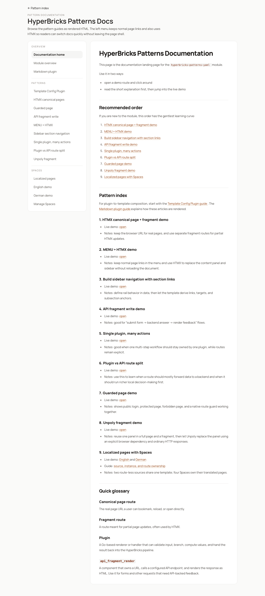
  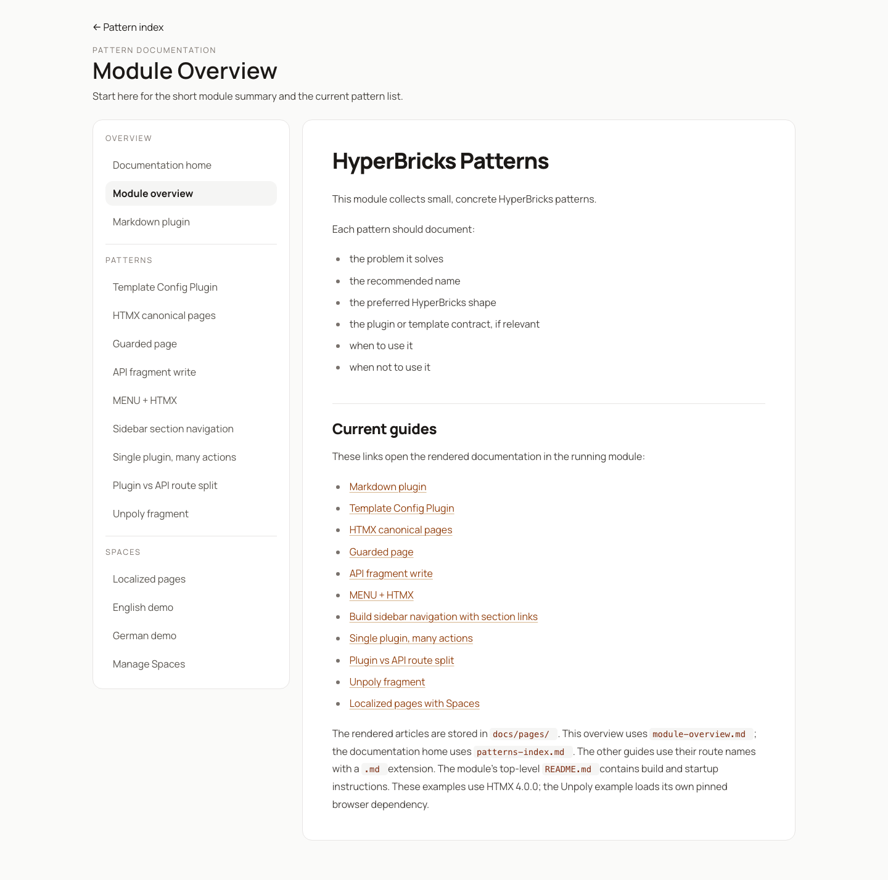
  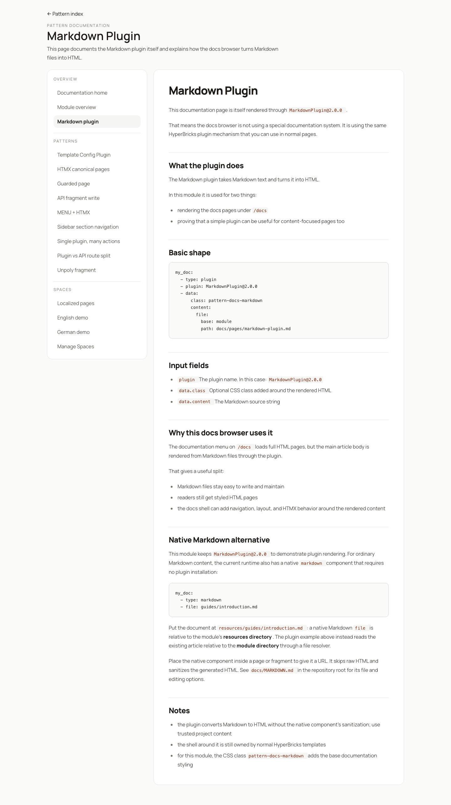
  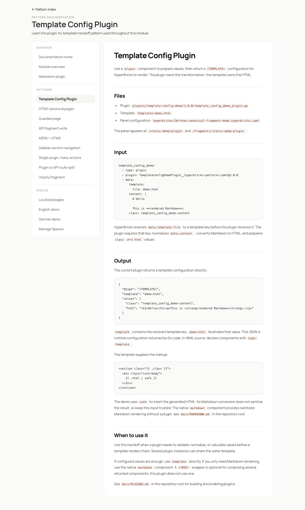
  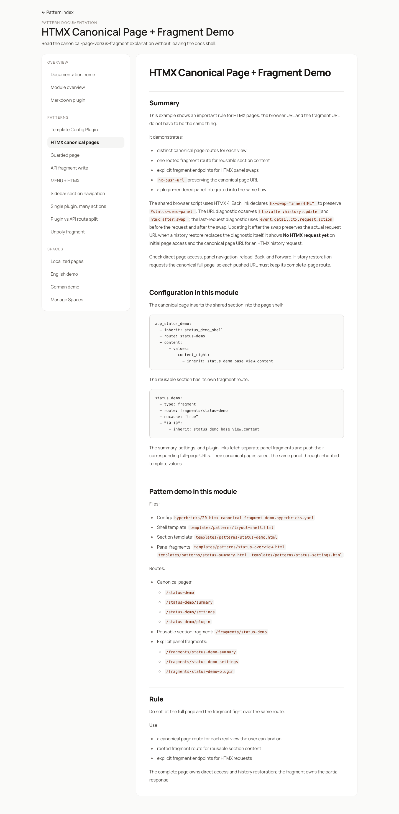
  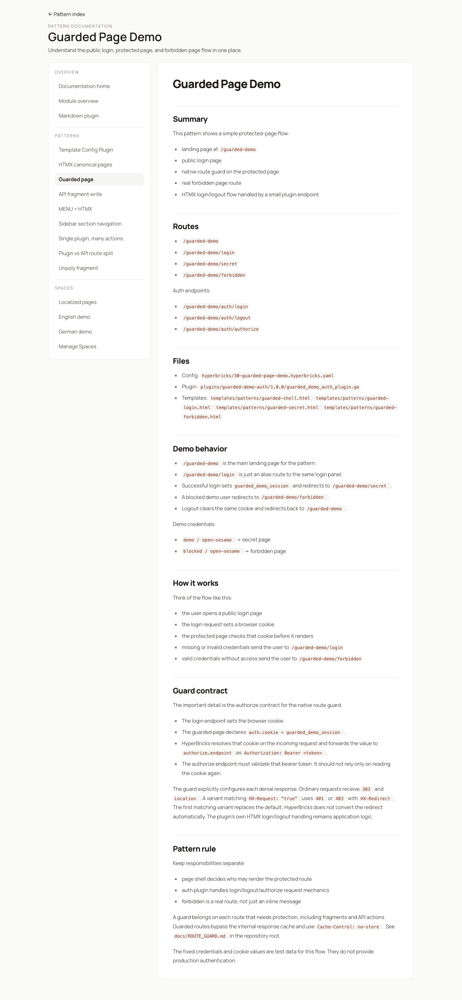
  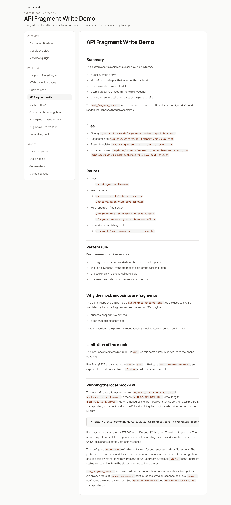
  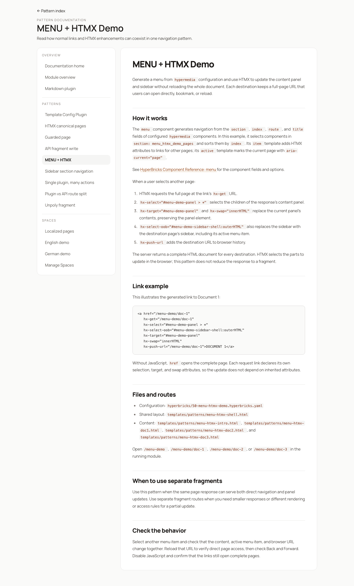
  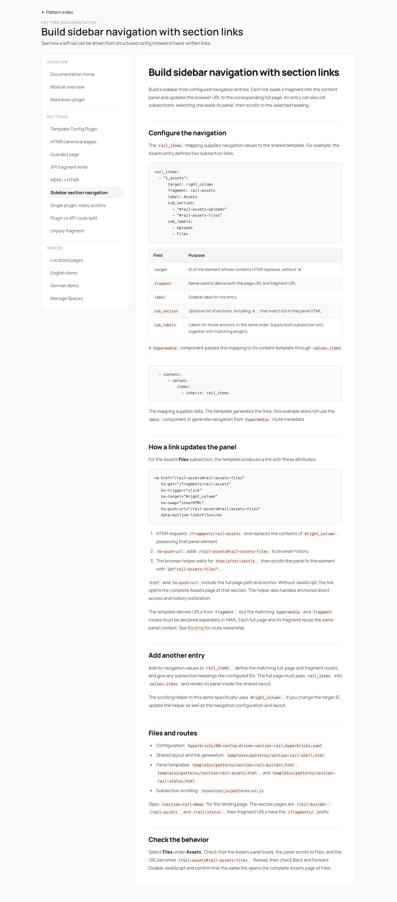
  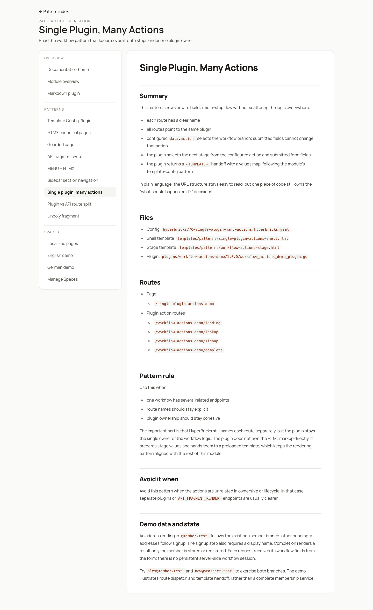
  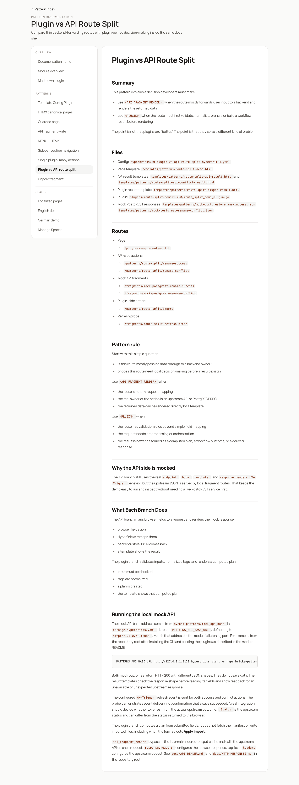
  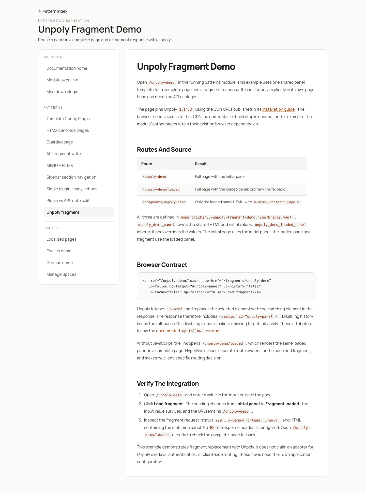
  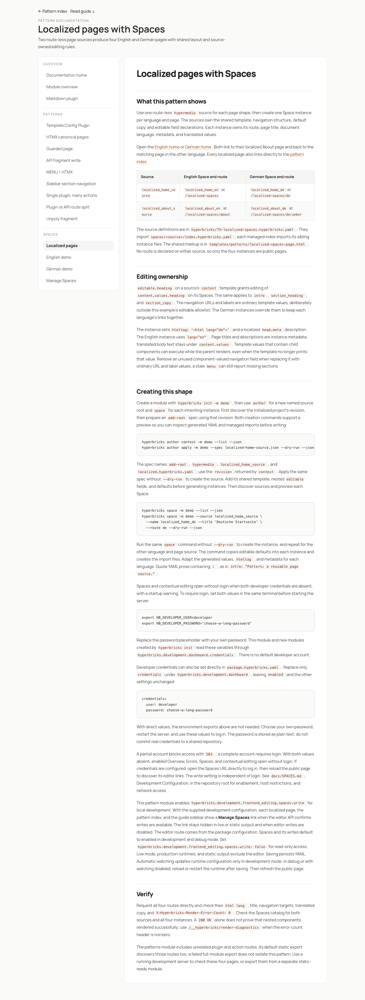
</p>

These are the current demo entry points:

- `/index`
- `/docs`
- `/status-demo`
- `/menu-demo`
- `/section-rail-demo`
- `/api-fragment-write-demo`
- `/single-plugin-actions-demo`
- `/plugin-vs-api-route-split`
- `/guarded-demo`
- `/unpoly-demo`
- `/localized-spaces` and `/localized-spaces/de`

## When Adding A New Pattern

Add all of these:

- one self-contained `.hyperbricks.yaml` demo in `hyperbricks/`
- templates in `templates/` if the pattern needs them
- a plugin in `plugins/` if the pattern is plugin-based
- a short explainer in `docs/pages/`
- an entry in `docs/pages/module-overview.md`
- an entry in `docs/pages/patterns-index.md`
- a docs route in `hyperbricks/90-docs.hyperbricks.yaml` and a matching link in `templates/patterns/docs-shell.html`

Keep the pattern small. It should teach one decision clearly.

## Project patterns guides

- [Module source guide](docs/SOURCE_GUIDE.md): find this module’s examples and source files by topic.
- [How-to guides](../../docs/HOWTOS.md): short explanations and examples for module setup, templates, routes, server logic, and static export.
